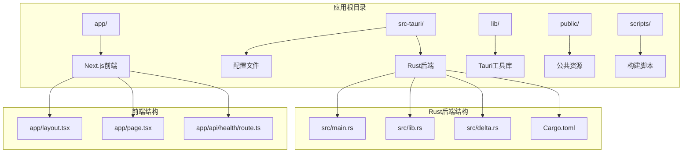
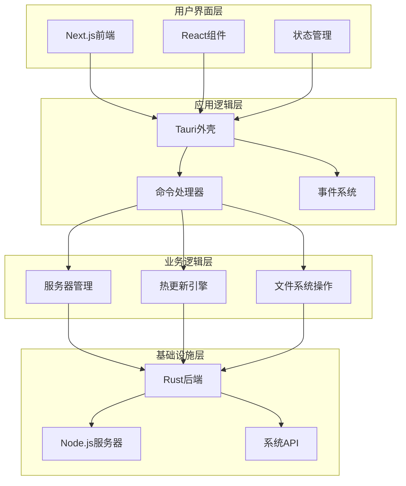
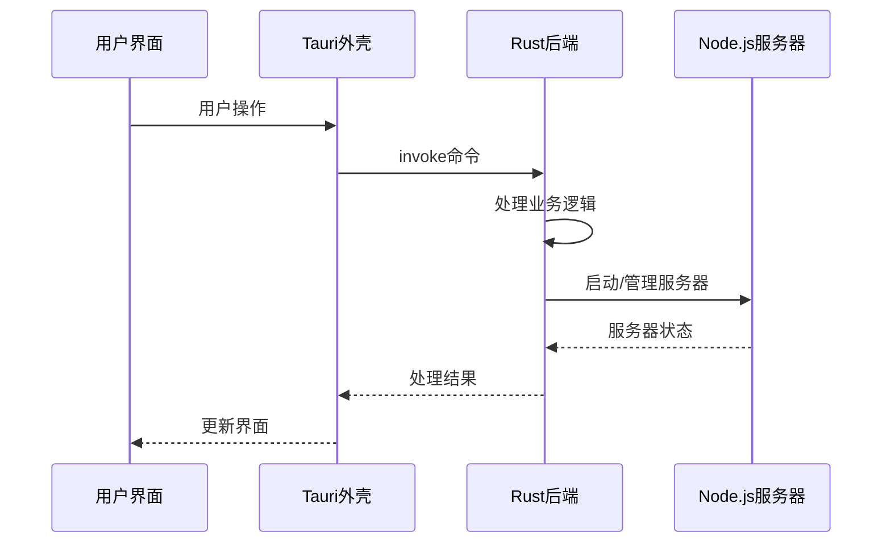
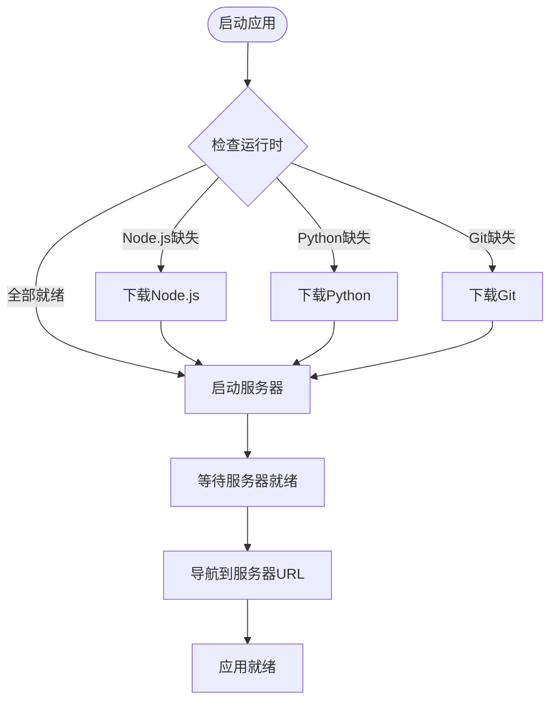
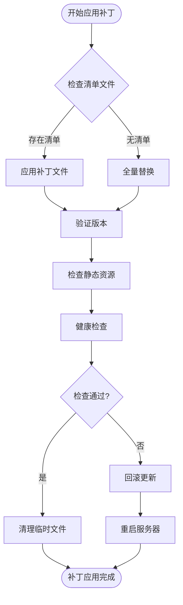
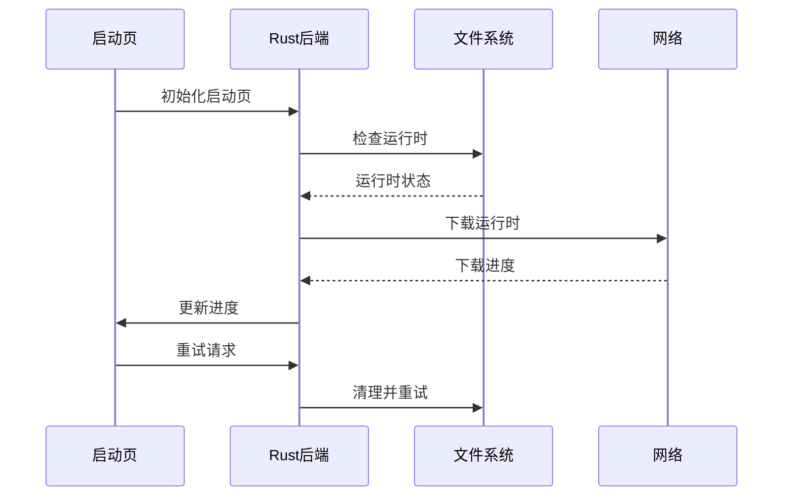
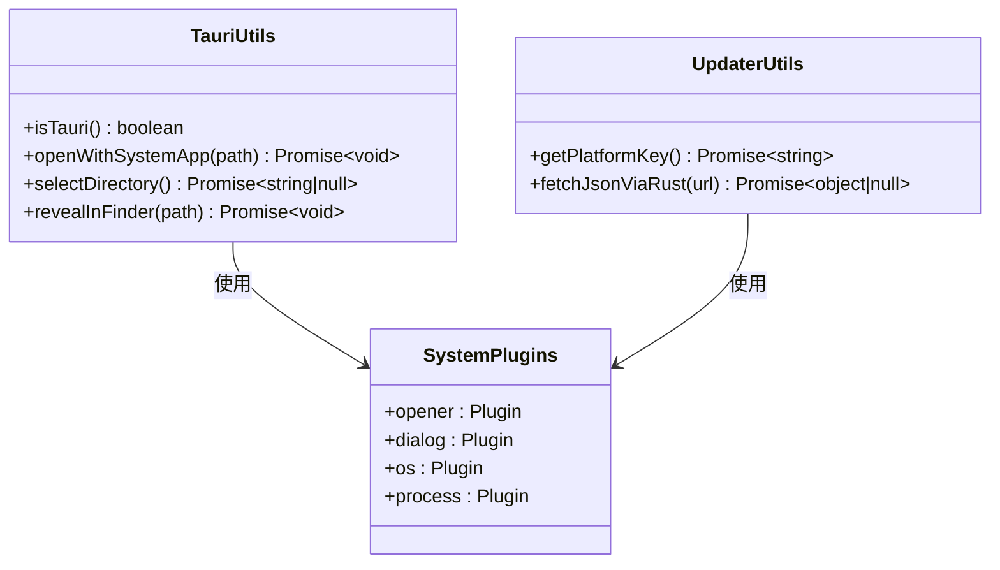

# API参考文档

<cite>
**本文档引用的文件**
- [src-tauri/src/main.rs](file://src-tauri/src/main.rs)
- [src-tauri/src/lib.rs](file://src-tauri/src/lib.rs)
- [src-tauri/src/delta.rs](file://src-tauri/src/delta.rs)
- [src-tauri/Cargo.toml](file://src-tauri/Cargo.toml)
- [src-tauri/splash.html](file://src-tauri/splash.html)
- [lib/tauri.ts](file://lib/tauri.ts)
- [lib/updater.ts](file://lib/updater.ts)
- [app/api/health/route.ts](file://app/api/health/route.ts)
- [package.json](file://package.json)
- [src-tauri/tauri.conf.json](file://src-tauri/tauri.conf.json)
</cite>

## 目录
1. [简介](#简介)
2. [项目结构](#项目结构)
3. [核心组件](#核心组件)
4. [架构概览](#架构概览)
5. [详细组件分析](#详细组件分析)
6. [依赖关系分析](#依赖关系分析)
7. [性能考虑](#性能考虑)
8. [故障排除指南](#故障排除指南)
9. [结论](#结论)

## 简介

SSTS（侧滑测试系统）是一个基于Tauri框架开发的桌面应用程序，集成了Rust后端和Next.js前端。该项目提供了完整的API参考文档，涵盖Rust命令接口、前端调用接口和IPC通信协议。

该系统的主要特点包括：
- 使用Tauri作为桌面应用框架
- Rust后端提供高性能的系统操作能力
- Next.js前端提供现代化的用户界面
- 内置增量更新机制
- 跨平台支持（Windows、macOS、Linux）

## 项目结构

SSTS项目采用模块化的组织结构，主要分为以下几个部分：



**图表来源**
- [src-tauri/src/main.rs:1-7](file://src-tauri/src/main.rs#L1-L7)
- [src-tauri/src/lib.rs:1-50](file://src-tauri/src/lib.rs#L1-L50)
- [app/layout.tsx:1-25](file://app/layout.tsx#L1-L25)

**章节来源**
- [src-tauri/src/main.rs:1-7](file://src-tauri/src/main.rs#L1-L7)
- [src-tauri/src/lib.rs:1-50](file://src-tauri/src/lib.rs#L1-L50)
- [package.json:1-42](file://package.json#L1-L42)

## 核心组件

### Rust命令接口

SSTS项目提供了丰富的Rust命令接口，这些接口通过Tauri的invoke机制暴露给前端调用。主要的命令接口包括：

#### 服务器管理命令
- `get_server_url`: 获取当前服务器URL
- `navigate_to`: 导航到指定路径
- `app_ready`: 前端就绪通知
- `retry_startup`: 重试启动流程

#### 文件操作命令
- `save_file_content`: 保存文件内容
- `update_splash`: 更新启动页状态

#### 热更新命令
- `apply_server_patch`: 应用服务器补丁
- `restart_server`: 重启服务器
- `get_current_server_version`: 获取当前服务器版本
- `verify_file_hash`: 验证文件哈希
- `fetch_url`: 通过curl获取URL内容
- `download_file`: 下载文件

#### 系统托盘命令
- `flash_tray_icon`: 开始托盘图标闪烁

**章节来源**
- [src-tauri/src/lib.rs:1109-1161](file://src-tauri/src/lib.rs#L1109-L1161)
- [src-tauri/src/delta.rs:32-128](file://src-tauri/src/delta.rs#L32-L128)

### 前端调用接口

前端通过Tauri的JavaScript API与Rust后端进行通信，主要的前端工具函数包括：

#### 系统操作封装
- `isTauri()`: 检测是否在Tauri环境中运行
- `openWithSystemApp(absolutePath)`: 使用系统应用打开文件
- `selectDirectory()`: 打开系统目录选择对话框
- `revealInFinder(absolutePath)`: 在文件管理器中显示文件

#### 更新器工具
- `getPlatformKey()`: 获取当前平台标识
- `fetchJsonViaRust(url)`: 通过Rust端获取远程JSON

**章节来源**
- [lib/tauri.ts:1-49](file://lib/tauri.ts#L1-L49)
- [lib/updater.ts:85-116](file://lib/updater.ts#L85-L116)

### IPC通信协议

系统使用Tauri的IPC机制实现前后端通信，主要包括：

#### URI协议
- `splashpage://`: 自定义协议用于启动页加载
- 支持图标文件的动态加载

#### 事件系统
- `patch-progress`: 热更新进度事件
- `app-ready`: 应用就绪事件

#### 窗口管理
- 主窗口 (`main`)
- 启动页窗口 (`splash`)

**章节来源**
- [src-tauri/src/lib.rs:1327-1344](file://src-tauri/src/lib.rs#L1327-L1344)
- [src-tauri/src/delta.rs:20-29](file://src-tauri/src/delta.rs#L20-L29)

## 架构概览

SSTS采用了分层架构设计，确保了良好的模块化和可维护性：



**图表来源**
- [src-tauri/src/lib.rs:1298-1482](file://src-tauri/src/lib.rs#L1298-L1482)
- [src-tauri/src/delta.rs:1-50](file://src-tauri/src/delta.rs#L1-L50)

### 数据流架构



**图表来源**
- [src-tauri/src/lib.rs:1164-1275](file://src-tauri/src/lib.rs#L1164-L1275)
- [src-tauri/src/delta.rs:32-70](file://src-tauri/src/delta.rs#L32-L70)

## 详细组件分析

### 服务器管理组件

服务器管理组件负责启动、监控和管理Node.js服务器进程：

#### 核心功能
- 自动检测和下载运行时环境（Node.js、Python、Git）
- 启动服务器进程并注入必要的环境变量
- 监控服务器状态并处理异常情况
- 提供热更新支持

#### 服务器启动流程



**图表来源**
- [src-tauri/src/lib.rs:1164-1275](file://src-tauri/src/lib.rs#L1164-L1275)

**章节来源**
- [src-tauri/src/lib.rs:926-1107](file://src-tauri/src/lib.rs#L926-L1107)

### 热更新组件

热更新组件实现了增量更新功能，支持在不重启整个应用的情况下更新服务器代码：

#### 更新流程
1. 应用备份当前服务器目录
2. 解压并应用补丁文件
3. 验证更新结果
4. 执行健康检查
5. 回滚机制（如有必要）

#### 补丁应用算法



**图表来源**
- [src-tauri/src/delta.rs:180-228](file://src-tauri/src/delta.rs#L180-L228)

**章节来源**
- [src-tauri/src/delta.rs:180-523](file://src-tauri/src/delta.rs#L180-L523)

### 启动页组件

启动页组件提供了用户友好的启动体验，包含进度显示和错误处理：

#### 启动页功能
- 显示应用启动进度
- 支持重试机制
- 错误状态显示
- 主题适配

#### 启动流程



**图表来源**
- [src-tauri/src/lib.rs:210-245](file://src-tauri/src/lib.rs#L210-L245)
- [src-tauri/splash.html:305-334](file://src-tauri/splash.html#L305-L334)

**章节来源**
- [src-tauri/splash.html:1-338](file://src-tauri/splash.html#L1-L338)

### 前端工具组件

前端工具组件提供了系统集成功能：

#### 系统操作封装



**图表来源**
- [lib/tauri.ts:1-49](file://lib/tauri.ts#L1-L49)
- [lib/updater.ts:85-116](file://lib/updater.ts#L85-L116)

**章节来源**
- [lib/tauri.ts:1-49](file://lib/tauri.ts#L1-L49)
- [lib/updater.ts:85-116](file://lib/updater.ts#L85-L116)

## 依赖关系分析

### 外部依赖

SSTS项目使用了以下主要外部依赖：

```mermaid
graph LR
subgraph "核心依赖"
A[Tauri 2.x] --> B[桌面应用框架]
C[Next.js 15.x] --> D[React应用框架]
E[TypeScript] --> F[类型安全]
end
subgraph "系统集成"
G[@tauri-apps/plugin-opener] --> H[文件系统访问]
I[@tauri-apps/plugin-dialog] --> J[对话框]
K[@tauri-apps/plugin-updater] --> L[应用更新]
M[@tauri-apps/plugin-process] --> N[进程管理]
end
subgraph "加密和压缩"
O[sha2] --> P[SHA-256哈希]
Q[flate2] --> R[GZIP压缩]
S[tar] --> T[TAR归档]
end
```

**图表来源**
- [src-tauri/Cargo.toml:14-28](file://src-tauri/Cargo.toml#L14-L28)
- [package.json:16-27](file://package.json#L16-L27)

### 内部模块依赖

```mermaid
graph TD
Main[src/main.rs] --> Lib[src/lib.rs]
Lib --> Delta[src/delta.rs]
Lib --> Splash[splash.html]
subgraph "前端模块"
Frontend[Next.js应用]
Utils[工具函数]
API[API路由]
end
Frontend --> Utils
Frontend --> API
Utils --> TauriAPI[@tauri-apps/api]
```

**图表来源**
- [src-tauri/src/main.rs:1-7](file://src-tauri/src/main.rs#L1-L7)
- [src-tauri/src/lib.rs:1-20](file://src-tauri/src/lib.rs#L1-L20)

**章节来源**
- [src-tauri/Cargo.toml:1-28](file://src-tauri/Cargo.toml#L1-L28)
- [package.json:1-42](file://package.json#L1-L42)

## 性能考虑

### 启动性能优化

1. **异步启动流程**: 使用线程池处理长时间运行的任务
2. **进度反馈**: 实时更新启动进度，避免用户困惑
3. **资源预加载**: 在启动过程中预加载必要的资源

### 内存管理

1. **进程生命周期**: 严格管理子进程的创建和销毁
2. **文件句柄清理**: 确保文件句柄正确释放
3. **内存泄漏防护**: 使用RAII原则管理资源

### 网络性能

1. **超时控制**: 为网络请求设置合理的超时时间
2. **重试机制**: 实现智能重试策略
3. **代理支持**: 支持系统代理配置

## 故障排除指南

### 常见问题及解决方案

#### 启动失败
- **症状**: 应用无法启动或启动后立即退出
- **原因**: 运行时环境缺失或损坏
- **解决**: 使用重试功能或手动安装缺失的运行时

#### 热更新失败
- **症状**: 更新后应用崩溃或功能异常
- **原因**: 补丁文件损坏或版本不匹配
- **解决**: 系统自动回滚到备份版本

#### 网络连接问题
- **症状**: 无法下载运行时或更新包
- **原因**: 网络代理配置错误
- **解决**: 检查系统代理设置或使用直连

**章节来源**
- [src-tauri/src/lib.rs:1164-1275](file://src-tauri/src/lib.rs#L1164-L1275)
- [src-tauri/src/delta.rs:416-443](file://src-tauri/src/delta.rs#L416-L443)

### 调试技巧

1. **查看启动日志**: 检查`gclaw-startup.log`文件
2. **启用开发者工具**: 在开发模式下使用调试功能
3. **监控进程状态**: 使用系统工具监控相关进程

## 结论

SSTS项目提供了一个完整、健壮且高效的桌面应用解决方案。通过精心设计的API架构和完善的错误处理机制，该系统能够为用户提供流畅的使用体验。

主要优势包括：
- **模块化设计**: 清晰的组件分离便于维护和扩展
- **跨平台支持**: 统一的代码库支持多个操作系统
- **热更新能力**: 无需重启即可更新应用功能
- **性能优化**: 高效的资源管理和内存使用

未来可以考虑的功能增强：
- 更详细的错误报告机制
- 更灵活的配置选项
- 更丰富的系统集成能力