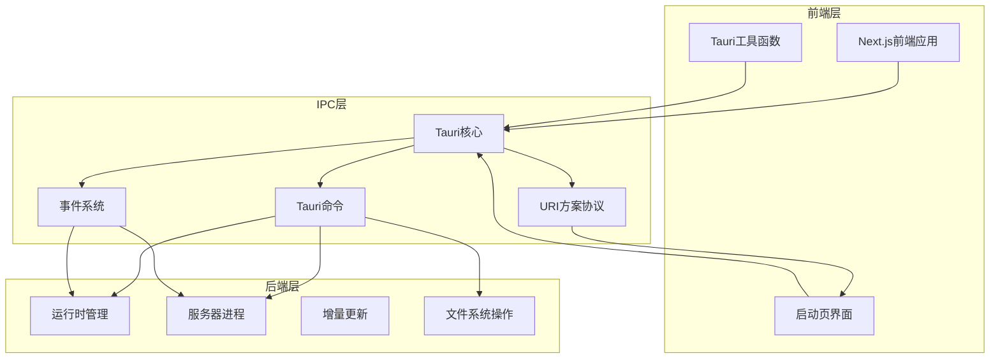
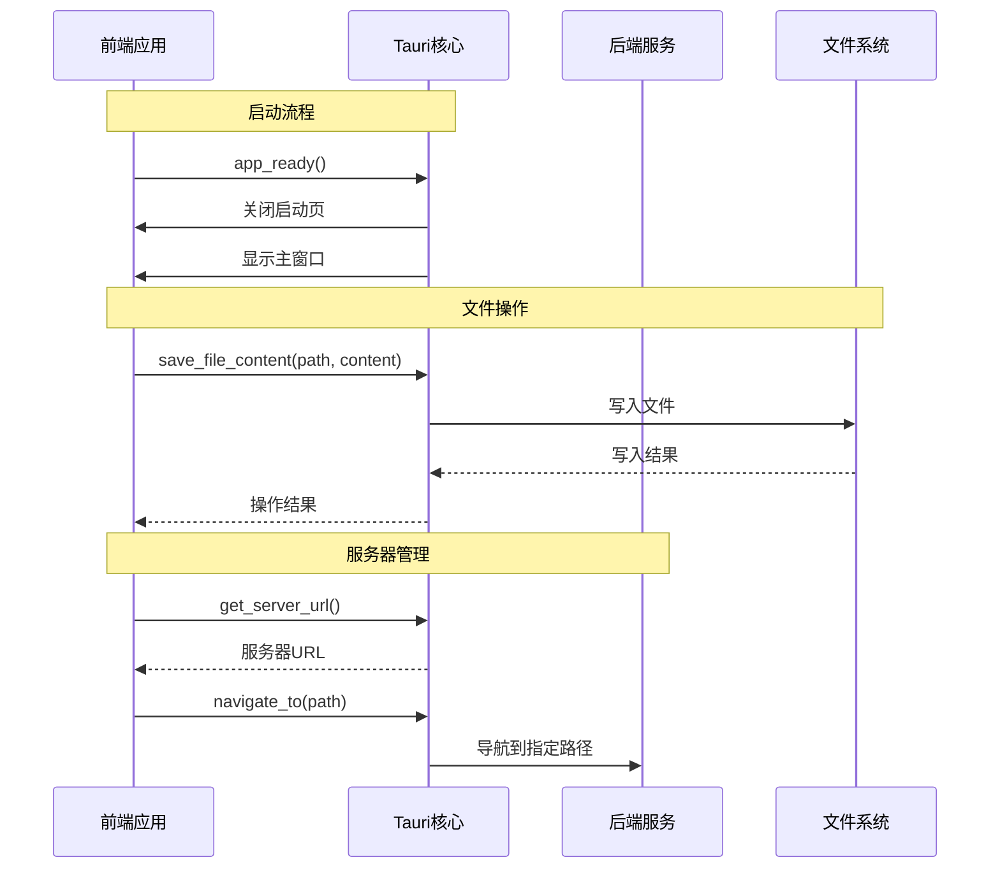
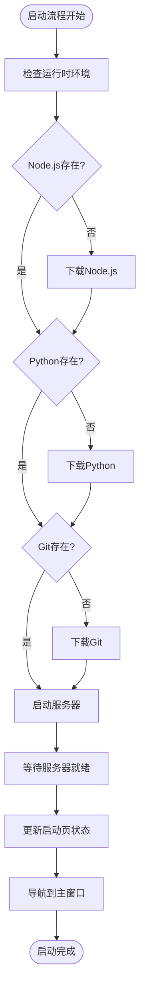
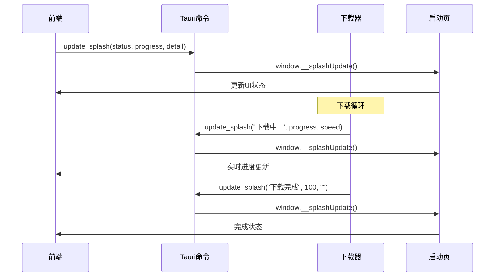
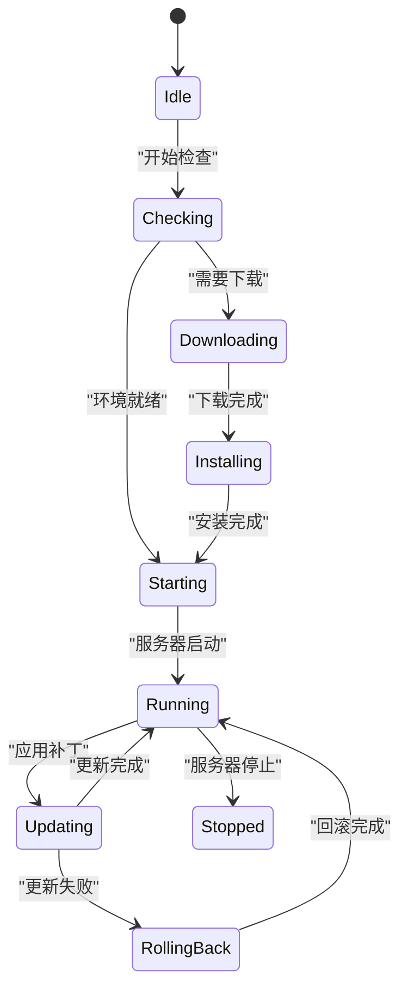
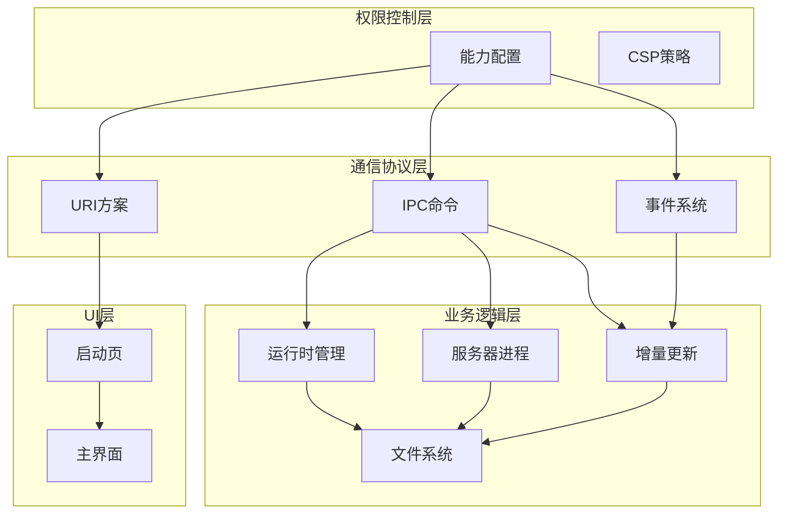
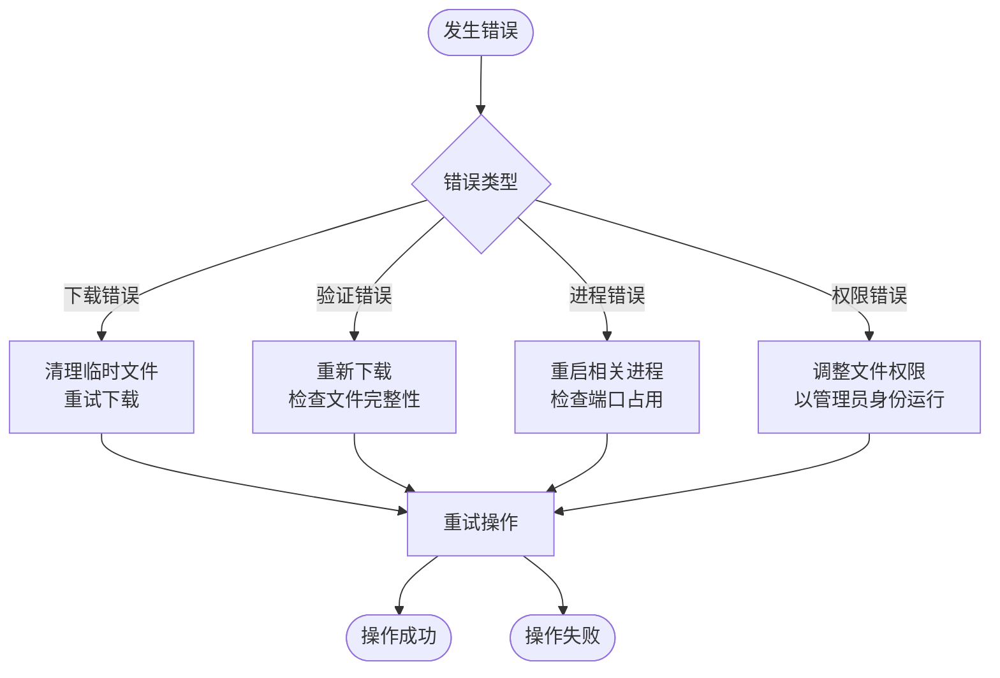

# IPC通信协议

<cite>
**本文档引用的文件**
- [src-tauri/src/lib.rs](file://src-tauri/src/lib.rs)
- [src-tauri/src/delta.rs](file://src-tauri/src/delta.rs)
- [src-tauri/splash.html](file://src-tauri/splash.html)
- [src-tauri/tauri.conf.json](file://src-tauri/tauri.conf.json)
- [src-tauri/capabilities/default.json](file://src-tauri/capabilities/default.json)
- [lib/tauri.ts](file://lib/tauri.ts)
- [app/page.tsx](file://app/page.tsx)
</cite>

## 目录
1. [简介](#简介)
2. [项目结构](#项目结构)
3. [核心组件](#核心组件)
4. [架构概览](#架构概览)
5. [详细组件分析](#详细组件分析)
6. [依赖关系分析](#依赖关系分析)
7. [性能考虑](#性能考虑)
8. [故障排除指南](#故障排除指南)
9. [结论](#结论)

## 简介

SSTS项目采用Tauri框架构建桌面应用程序，实现了前后端分离的IPC（进程间通信）通信协议。该协议通过自定义URI方案、Tauri命令和事件系统，实现了启动页状态更新、运行时下载进度通知、服务器状态变更等实时交互功能。

本文档详细说明了IPC通信协议的消息格式、事件类型和实时交互模式，提供了消息序列图和数据流示例，并包含了通信安全考虑、错误处理策略和调试方法。

## 项目结构

SSTS项目采用典型的Tauri桌面应用架构，主要分为以下层次：

**图表来源**
- [src-tauri/src/lib.rs:1314-1482](file://src-tauri/src/lib.rs#L1314-L1482)
- [src-tauri/src/delta.rs:180-228](file://src-tauri/src/delta.rs#L180-L228)

**章节来源**
- [src-tauri/src/lib.rs:1-1585](file://src-tauri/src/lib.rs#L1-L1585)
- [src-tauri/tauri.conf.json:1-60](file://src-tauri/tauri.conf.json#L1-L60)

## 核心组件

### Tauri命令系统

SSTS项目实现了多个Tauri命令，作为前后端通信的主要接口：

| 命令名称 | 参数 | 返回值 | 功能描述 |
|---------|------|--------|----------|
| get_server_url | 无 | String | 获取服务器URL地址 |
| navigate_to | path: String, state: ServerState, app: AppHandle | Result<(), String> | 导航到指定路径 |
| app_ready | app: AppHandle | 无 | 前端页面渲染完成后调用 |
| update_splash | app: AppHandle, status: String, progress: i32, detail: String | 无 | 更新启动页进度 |
| retry_startup | app: AppHandle | 无 | 重试启动流程 |
| save_file_content | path: String, content: Vec<u8> | Result<(), String> | 保存文件内容 |
| apply_server_patch | app: AppHandle, patch_path: String, expected_version: String, will_relaunch: Option<bool> | Result<String, String> | 应用服务器补丁 |
| restart_server | app: AppHandle | Result<String, String> | 重启服务器进程 |
| verify_file_hash | path: String, expected_hash: String | Result<bool, String> | 验证文件哈希 |

**章节来源**
- [src-tauri/src/lib.rs:1134-1161](file://src-tauri/src/lib.rs#L1134-L1161)
- [src-tauri/src/delta.rs:32-70](file://src-tauri/src/delta.rs#L32-L70)

### 事件系统

项目使用Tauri的事件系统实现异步通信：

| 事件名称 | 数据格式 | 触发时机 | 功能描述 |
|---------|----------|----------|----------|
| patch-progress | {step: u8, total: u8, message: String} | 热更新进度 | 热更新进度通知 |
| health-check | {status: String, timestamp: u64} | 健康检查 | 服务器状态变更通知 |

**章节来源**
- [src-tauri/src/delta.rs:20-29](file://src-tauri/src/delta.rs#L20-L29)

### 自定义URI协议

项目注册了自定义URI方案用于启动页：

| 协议名称 | 平台支持 | 功能描述 |
|---------|----------|----------|
| splashpage | macOS/Linux: splashpage://localhost Windows: http://splashpage.localhost | 提供内嵌的启动页HTML内容 |

**章节来源**
- [src-tauri/src/lib.rs:1327-1344](file://src-tauri/src/lib.rs#L1327-L1344)

## 架构概览

SSTS项目的IPC通信架构采用分层设计，确保了安全性、可维护性和扩展性：

**图表来源**
- [src-tauri/src/lib.rs:1150-1161](file://src-tauri/src/lib.rs#L1150-L1161)
- [src-tauri/src/lib.rs:1134-1148](file://src-tauri/src/lib.rs#L1134-L1148)

**章节来源**
- [src-tauri/src/lib.rs:1298-1482](file://src-tauri/src/lib.rs#L1298-L1482)

## 详细组件分析

### 启动页状态更新机制

启动页状态更新是IPC通信的核心功能之一，实现了从后端到前端的实时状态同步：

**图表来源**
- [src-tauri/src/lib.rs:1164-1275](file://src-tauri/src/lib.rs#L1164-L1275)

启动页状态更新的数据格式：

| 字段 | 类型 | 描述 | 示例值 |
|------|------|------|--------|
| status | String | 状态文本 | "正在下载 Node.js..." |
| progress | Integer | 进度百分比 | 0-100 |
| detail | String | 详细信息 | "150.5 MB" |
| error | Boolean | 错误标志 | false |

**章节来源**
- [src-tauri/src/lib.rs:210-243](file://src-tauri/src/lib.rs#L210-L243)
- [src-tauri/splash.html:305-317](file://src-tauri/splash.html#L305-L317)

### 运行时下载进度通知

运行时下载过程实现了完整的进度跟踪和状态通知：

**图表来源**
- [src-tauri/src/lib.rs:1120-1124](file://src-tauri/src/lib.rs#L1120-L1124)
- [src-tauri/src/lib.rs:745-791](file://src-tauri/src/lib.rs#L745-L791)

下载进度通知的关键参数：

| 参数名称 | 类型 | 描述 | 有效范围 |
|---------|------|------|----------|
| status | String | 当前状态描述 | 任意字符串 |
| progress | Integer | 下载进度百分比 | 0-100 |
| detail | String | 详细信息（大小/速度） | "150.5 / 200.0 MB (2.3 MB/s)" |

**章节来源**
- [src-tauri/src/lib.rs:652-850](file://src-tauri/src/lib.rs#L652-L850)

### 服务器状态变更处理

服务器状态变更通过增量更新机制实现，支持热更新和回滚：

**图表来源**
- [src-tauri/src/delta.rs:180-228](file://src-tauri/src/delta.rs#L180-L228)
- [src-tauri/src/delta.rs:304-443](file://src-tauri/src/delta.rs#L304-L443)

增量更新的关键流程：

1. **补丁验证**：检查补丁文件大小和完整性
2. **备份创建**：备份当前服务器目录
3. **文件应用**：应用修改和新增文件
4. **版本验证**：验证新版本正确性
5. **健康检查**：验证服务器可访问性
6. **回滚机制**：失败时自动回滚

**章节来源**
- [src-tauri/src/delta.rs:180-523](file://src-tauri/src/delta.rs#L180-L523)

### 热更新事件系统

热更新通过事件系统实现进度通知和状态同步：

| 事件阶段 | 步骤编号 | 事件名称 | 事件内容 |
|---------|----------|----------|----------|
| 准备阶段 | 0/7 | patch-progress | "准备开始热更新..." |
| 解压阶段 | 1/7 | patch-progress | "停止服务器..." |
| 应用阶段 | 2/7 | patch-progress | "解压并应用补丁文件..." |
| 验证阶段 | 3/7 | patch-progress | "备份当前服务器文件..." |
| 完成阶段 | 4/7 | patch-progress | "替换服务器文件..." |
| 结束阶段 | 5/7 | patch-progress | "重启服务器..." |
| 最终阶段 | 6/7 | patch-progress | "验证服务器状态..." |
| 完成 | 7/7 | patch-progress | "热更新完成！" |

**章节来源**
- [src-tauri/src/delta.rs:20-29](file://src-tauri/src/delta.rs#L20-L29)

## 依赖关系分析

SSTS项目的IPC通信依赖关系体现了清晰的分层架构：

**图表来源**
- [src-tauri/capabilities/default.json:1-29](file://src-tauri/capabilities/default.json#L1-L29)
- [src-tauri/tauri.conf.json:25-27](file://src-tauri/tauri.conf.json#L25-L27)

**章节来源**
- [src-tauri/capabilities/default.json:1-29](file://src-tauri/capabilities/default.json#L1-L29)
- [src-tauri/tauri.conf.json:1-60](file://src-tauri/tauri.conf.json#L1-L60)

## 性能考虑

### IPC通信优化

1. **异步处理**：所有长时间运行的操作都在后台线程执行
2. **进度分片**：将大任务分解为多个小步骤，提供细粒度进度反馈
3. **超时控制**：为网络操作设置合理的超时时间
4. **内存管理**：及时清理临时文件和目录

### 启动性能优化

- **并行下载**：运行时组件可以并行下载
- **智能缓存**：已存在的运行时组件跳过下载
- **预加载机制**：提前检查和准备必要的运行时组件

### 网络性能优化

- **代理支持**：透传系统代理设置
- **SSL优化**：针对Windows平台的SSL配置
- **断点续传**：支持大文件的断点续传

## 故障排除指南

### 常见错误类型

| 错误类型 | 触发条件 | 解决方案 |
|---------|----------|----------|
| 下载超时 | 网络连接不稳定 | 检查网络设置，重试下载 |
| 验证失败 | 文件损坏或不完整 | 清理缓存，重新下载 |
| 进程冲突 | 服务器进程占用端口 | 杀死僵尸进程，重启应用 |
| 权限不足 | 文件系统访问受限 | 检查文件权限，以管理员身份运行 |

### 调试方法

1. **日志分析**：查看启动日志文件了解详细错误信息
2. **网络诊断**：使用curl命令测试下载链接
3. **端口监控**：检查服务器进程的端口占用情况
4. **权限检查**：验证文件系统的读写权限

### 错误处理策略

**章节来源**
- [src-tauri/src/lib.rs:745-791](file://src-tauri/src/lib.rs#L745-L791)
- [src-tauri/src/delta.rs:416-443](file://src-tauri/src/delta.rs#L416-L443)

## 结论

SSTS项目的IPC通信协议设计体现了现代桌面应用的最佳实践：

### 设计优势

1. **安全性**：通过能力配置和CSP策略限制权限范围
2. **可靠性**：完善的错误处理和回滚机制
3. **可维护性**：清晰的分层架构和模块化设计
4. **用户体验**：实时进度反馈和优雅的错误处理

### 技术特点

- **异步通信**：非阻塞的IPC操作提升响应性
- **事件驱动**：基于事件的实时状态同步
- **热更新**：支持服务器的增量更新和回滚
- **跨平台**：统一的API在不同平台上保持一致行为

### 扩展建议

1. **监控集成**：添加更详细的性能指标收集
2. **日志聚合**：集中管理前后端日志
3. **自动化测试**：增加IPC通信的自动化测试用例
4. **文档完善**：补充更详细的API文档和使用示例

该IPC通信协议为SSTS项目提供了稳定、高效、安全的前后端通信基础，支持复杂的桌面应用场景需求。