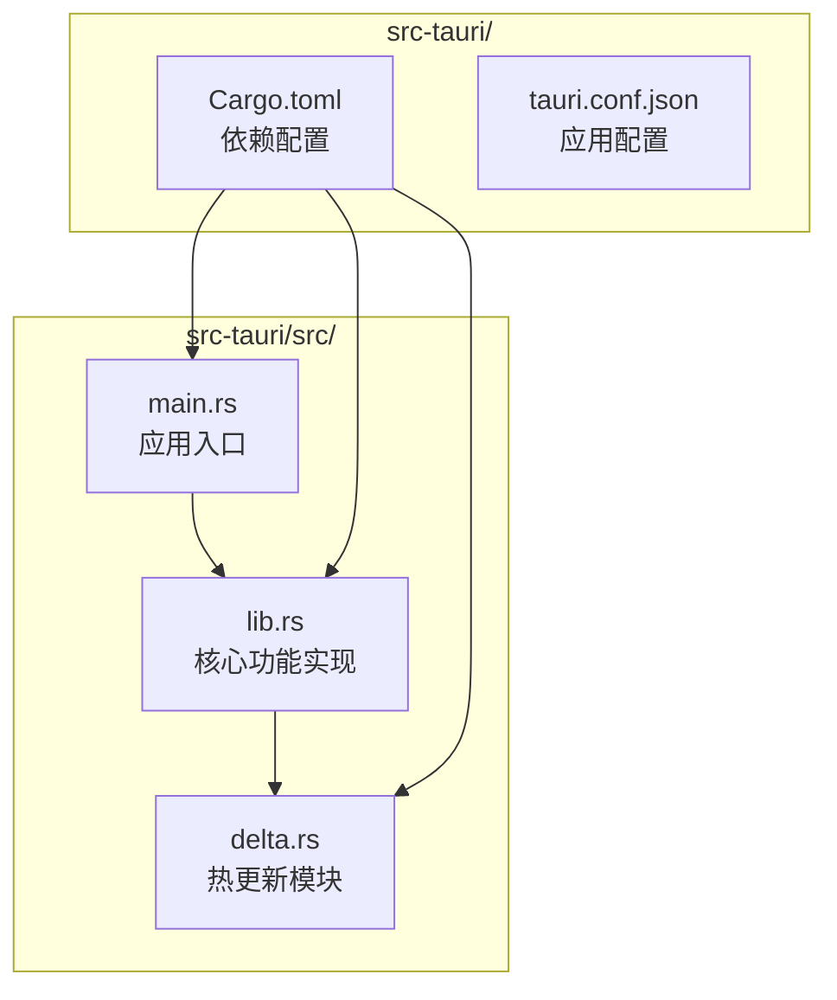
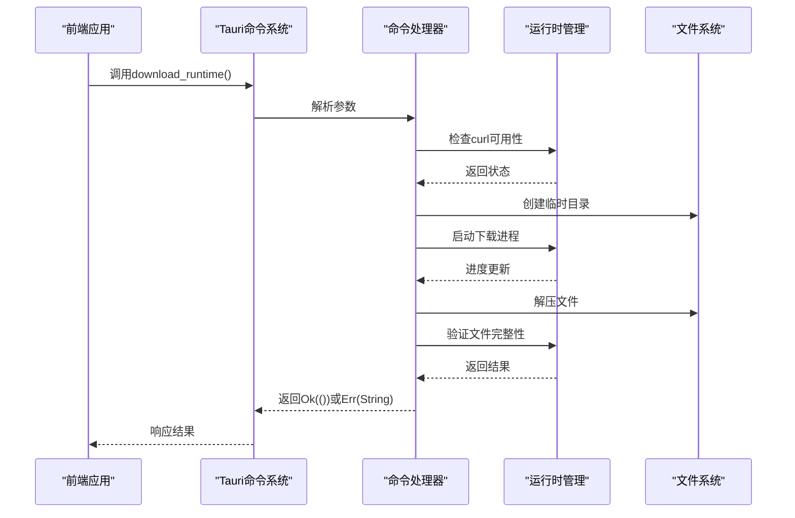
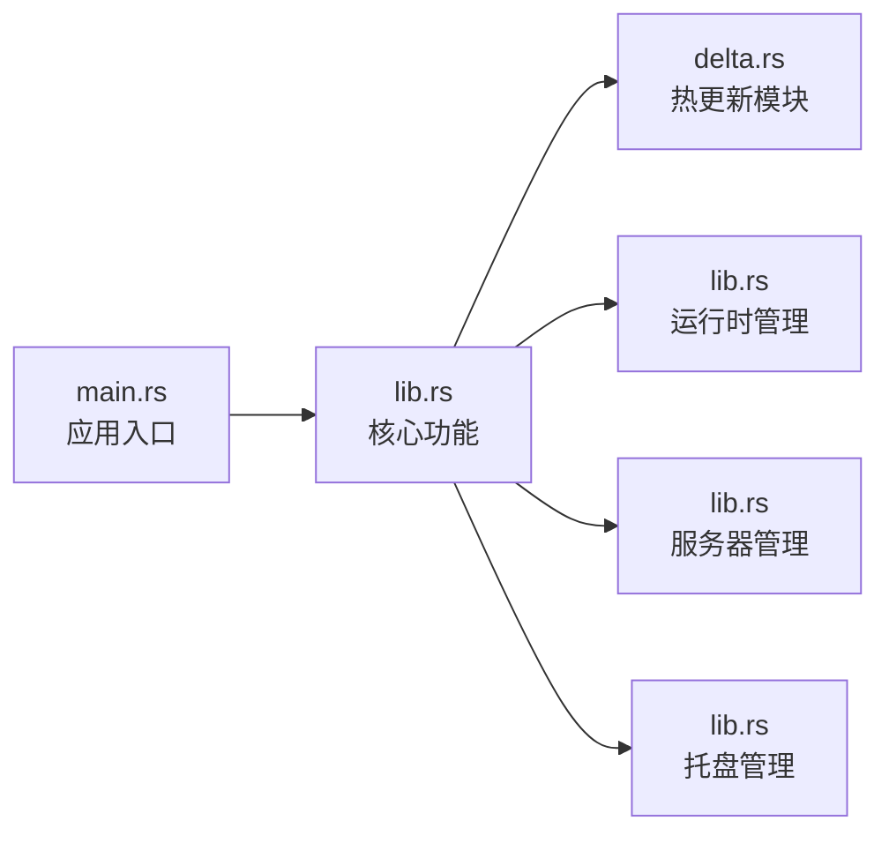

# Rust命令接口

<cite>
**本文档引用的文件**
- [main.rs](file://src-tauri/src/main.rs)
- [lib.rs](file://src-tauri/src/lib.rs)
- [delta.rs](file://src-tauri/src/delta.rs)
- [Cargo.toml](file://src-tauri/Cargo.toml)
</cite>

## 目录
1. [简介](#简介)
2. [项目结构](#项目结构)
3. [核心组件](#核心组件)
4. [架构概览](#架构概览)
5. [详细组件分析](#详细组件分析)
6. [依赖分析](#依赖分析)
7. [性能考虑](#性能考虑)
8. [故障排除指南](#故障排除指南)
9. [结论](#结论)

## 简介

SSTS项目是一个基于Tauri框架的桌面应用程序，提供了丰富的Rust命令接口API。这些命令通过`#[tauri::command]`注解暴露给前端JavaScript/TypeScript代码，实现了运行时管理、服务器管理、系统托盘控制和热更新等功能。

本文档详细记录了所有通过`#[tauri::command]`注解暴露的公共函数，包括函数签名、参数类型、返回值和错误处理机制。涵盖了运行时管理命令（如download_runtime、find_node、find_python3等）、服务器管理命令、系统托盘命令和热更新命令。

## 项目结构

SSTS项目的Rust代码主要位于`src-tauri/src/`目录下，采用模块化设计：



**图表来源**
- [main.rs:1-7](file://src-tauri/src/main.rs#L1-L7)
- [lib.rs:1-50](file://src-tauri/src/lib.rs#L1-L50)
- [delta.rs:1-20](file://src-tauri/src/delta.rs#L1-L20)

**章节来源**
- [main.rs:1-7](file://src-tauri/src/main.rs#L1-L7)
- [lib.rs:1-50](file://src-tauri/src/lib.rs#L1-L50)
- [delta.rs:1-20](file://src-tauri/src/delta.rs#L1-L20)

## 核心组件

SSTS项目的核心组件包括：

### 服务器状态管理
- `ServerState`: 管理Node.js服务器进程和端口状态
- `FlashState`: 管理系统托盘闪烁状态

### 运行时管理组件
- Node.js运行时检测和下载
- Python运行时检测和下载
- Git运行时检测和下载
- 运行时验证和版本管理

### 热更新组件
- 文件级补丁应用
- 全量替换更新
- 健康检查和回滚机制
- 版本验证和完整性检查

**章节来源**
- [lib.rs:10-15](file://src-tauri/src/lib.rs#L10-L15)
- [lib.rs:1488-1490](file://src-tauri/src/lib.rs#L1488-L1490)
- [delta.rs:147-156](file://src-tauri/src/delta.rs#L147-L156)

## 架构概览

SSTS采用分层架构设计，通过Tauri的命令系统实现前后端通信：

```mermaid
graph TB
subgraph "前端层"
A[JavaScript/TypeScript<br/>UI界面]
B[Tauri API<br/>命令调用]
end
subgraph "桥接层"
C[#[tauri::command]<br/>注解函数]
D[generate_handler<br/>命令注册]
end
subgraph "业务逻辑层"
E[运行时管理<br/>Node.js/Python/Git]
F[服务器管理<br/>进程控制]
G[热更新模块<br/>增量更新]
H[系统托盘<br/>状态管理]
end
subgraph "基础设施层"
I[文件系统<br/>路径管理]
J[网络通信<br/>下载/验证]
K[进程管理<br/>子进程控制]
end
A --> B
B --> C
C --> D
D --> E
D --> F
D --> G
D --> H
E --> I
E --> J
F --> K
G --> I
G --> J
H --> I
```

**图表来源**
- [lib.rs:1448-1453](file://src-tauri/src/lib.rs#L1448-L1453)
- [delta.rs:32-70](file://src-tauri/src/delta.rs#L32-L70)

## 详细组件分析

### 运行时管理命令

#### download_runtime 命令
**功能**: 下载和安装指定的运行时组件

**函数签名**: 
```rust
fn download_runtime(
    app: &tauri::AppHandle,
    name: &str,
    label: &str,
    url: &str,
) -> Result<(), String>
```

**参数说明**:
- `app`: Tauri应用句柄，用于UI更新和日志记录
- `name`: 运行时名称 ("node" | "python" | "git")
- `label`: 显示标签 ("Node.js" | "Python" | "Git")
- `url`: 下载URL地址

**返回值**: 
- `Ok(())`: 下载成功
- `Err(String)`: 下载失败，包含错误详情

**错误处理**:
- 检查curl可用性
- 超时保护（5分钟）
- 进度跟踪和状态更新
- 失败时清理临时文件

**章节来源**
- [lib.rs:653-850](file://src-tauri/src/lib.rs#L653-L850)

#### find_node 命令
**功能**: 查找Node.js可执行文件路径

**函数签名**:
```rust
fn find_node(app: &tauri::AppHandle) -> Option<String>
```

**查找顺序**:
1. 检查内置运行时 (`runtimes/node/`)
2. 系统PATH扫描
3. Windows特殊路径检测
4. 备份方案

**返回值**: 
- `Some(String)`: 找到有效Node.js路径
- `None`: 未找到可用Node.js

**章节来源**
- [lib.rs:257-275](file://src-tauri/src/lib.rs#L257-L275)

#### find_python3 命令
**功能**: 查找Python3可执行文件路径

**函数签名**:
```rust
fn find_python3(app: &tauri::AppHandle) -> Option<String>
```

**查找策略**:
- Windows: 优先检查`python.exe`，排除Microsoft Store跳板
- 非Windows: 检查`python3`命令
- 多种路径扫描策略

**章节来源**
- [lib.rs:278-295](file://src-tauri/src/lib.rs#L278-L295)

#### find_git 命令
**功能**: 查找Git可执行文件路径

**函数签名**:
```rust
fn find_git(_app: &tauri::AppHandle) -> Option<String>
```

**平台差异**:
- Windows: 优先使用内置PortableGit
- macOS/Linux: 使用系统Git

**章节来源**
- [lib.rs:298-310](file://src-tauri/src/lib.rs#L298-L310)

### 服务器管理命令

#### get_server_url 命令
**功能**: 获取当前服务器URL

**函数签名**:
```rust
fn get_server_url(state: tauri::State<ServerState>) -> String
```

**返回值**: `"http://127.0.0.1:{port}"`

**章节来源**
- [lib.rs:1135-1137](file://src-tauri/src/lib.rs#L1135-L1137)

#### navigate_to 命令
**功能**: 在主窗口中导航到指定路径

**函数签名**:
```rust
fn navigate_to(path: String, state: tauri::State<ServerState>, app: tauri::AppHandle) -> Result<(), String>
```

**参数验证**:
- 检查主窗口是否存在
- 验证URL格式有效性

**章节来源**
- [lib.rs:1140-1148](file://src-tauri/src/lib.rs#L1140-L1148)

#### app_ready 命令
**功能**: 前端页面准备就绪通知

**函数签名**:
```rust
fn app_ready(app: tauri::AppHandle)
```

**操作流程**:
1. 关闭启动页
2. 显示主窗口
3. 设置焦点

**章节来源**
- [lib.rs:1152-1161](file://src-tauri/src/lib.rs#L1152-L1161)

### 系统托盘命令

#### flash_tray_icon 命令
**功能**: 开始托盘图标闪烁

**函数签名**:
```rust
fn flash_tray_icon(app: tauri::AppHandle, state: tauri::State<'_, FlashState>)
```

**闪烁机制**:
- 状态同步（AtomicBool）
- 主线程安全更新
- 自动停止机制

**章节来源**
- [lib.rs:1543-1584](file://src-tauri/src/lib.rs#L1543-L1584)

### 热更新命令

#### apply_server_patch 命令
**功能**: 应用服务器补丁更新

**函数签名**:
```rust
async fn apply_server_patch(
    app: tauri::AppHandle,
    patch_path: String,
    expected_version: String,
    will_relaunch: Option<bool>,
) -> Result<String, String>
```

**处理流程**:
1. 解压补丁文件
2. 检测全量包或增量包
3. 应用补丁文件
4. 版本验证
5. 健康检查

**平台差异**:
- Windows: 需要停止服务器进程
- macOS/Linux: 直接应用补丁

**章节来源**
- [delta.rs:182-228](file://src-tauri/src/delta.rs#L182-L228)

#### restart_server 命令
**功能**: 重启服务器进程

**函数签名**:
```rust
async fn restart_server(app: tauri::AppHandle) -> Result<String, String>
```

**安全机制**:
- 端口释放等待
- 进程清理
- 健康检查
- 失败回滚

**章节来源**
- [delta.rs:32-70](file://src-tauri/src/delta.rs#L32-L70)

#### verify_file_hash 命令
**功能**: 验证文件SHA-256哈希

**函数签名**:
```rust
async fn verify_file_hash(path: String, expected_hash: String) -> Result<bool, String>
```

**支持格式**:
- `"sha256:xxx"` 带前缀格式
- 裸哈希格式

**章节来源**
- [delta.rs:73-79](file://src-tauri/src/delta.rs#L73-L79)

#### fetch_url 命令
**功能**: 通过curl获取远程URL内容

**函数签名**:
```rust
async fn fetch_url(url: String) -> Result<String, String>
```

**超时设置**:
- 连接超时: 15秒
- 最大执行时间: 30秒

**章节来源**
- [delta.rs:82-102](file://src-tauri/src/delta.rs#L82-L102)

#### download_file 命令
**功能**: 下载文件到指定路径

**函数签名**:
```rust
async fn download_file(url: String, path: String) -> Result<(), String>
```

**下载特性**:
- 断点续传支持
- 进度跟踪
- 失败清理

**章节来源**
- [delta.rs:105-128](file://src-tauri/src/delta.rs#L105-L128)

#### get_current_server_version 命令
**功能**: 获取当前服务器版本

**函数签名**:
```rust
fn get_current_server_version(app: tauri::AppHandle) -> String
```

**版本来源**: `server/package.json`中的version字段

**章节来源**
- [delta.rs:728-739](file://src-tauri/src/delta.rs#L728-L739)

### 命令调用序列图



**图表来源**
- [lib.rs:653-850](file://src-tauri/src/lib.rs#L653-L850)
- [delta.rs:105-128](file://src-tauri/src/delta.rs#L105-L128)

## 依赖分析

### 外部依赖关系

```mermaid
graph TB
subgraph "核心依赖"
A[tauri = "2"<br/>框架基础]
B[serde = "1"<br/>序列化]
C[serde_json = "1"<br/>JSON处理]
end
subgraph "插件依赖"
D[tauri-plugin-opener<br/>文件打开]
E[tauri-plugin-dialog<br/>对话框]
F[tauri-plugin-updater<br/>应用更新]
G[tauri-plugin-process<br/>进程管理]
H[tauri-plugin-notification<br/>通知]
I[tauri-plugin-os<br/>系统信息]
end
subgraph "工具库"
J[sha2 = "0.10"<br/>哈希计算]
K[flate2 = "1"<br/>压缩处理]
L[tar = "0.4"<br/>tar解压]
end
A --> D
A --> E
A --> F
A --> G
A --> H
A --> I
A --> B
B --> C
F --> J
F --> K
F --> L
```

**图表来源**
- [Cargo.toml:14-28](file://src-tauri/Cargo.toml#L14-L28)

### 内部模块依赖



**图表来源**
- [main.rs:1-7](file://src-tauri/src/main.rs#L1-L7)
- [lib.rs:1-10](file://src-tauri/src/lib.rs#L1-L10)

**章节来源**
- [Cargo.toml:14-28](file://src-tauri/Cargo.toml#L14-L28)

## 性能考虑

### 并发处理
- 使用异步命令处理I/O密集型操作
- 线程池管理长时间运行的任务
- 原子操作确保状态同步

### 内存管理
- 流式文件处理避免内存溢出
- 及时清理临时文件和目录
- 进程资源及时释放

### 网络优化
- 连接超时和最大执行时间限制
- 代理环境变量透传
- 断点续传支持

### 最佳实践建议
1. **参数验证**: 在命令处理前进行参数验证
2. **错误处理**: 提供详细的错误信息和回退策略
3. **进度反馈**: 对长时间操作提供进度更新
4. **资源清理**: 确保异常情况下资源正确清理
5. **并发安全**: 使用适当的同步机制

## 故障排除指南

### 常见问题及解决方案

#### 运行时下载失败
**症状**: `download_runtime`返回错误
**可能原因**:
- 网络连接问题
- curl不可用
- 磁盘空间不足
- 权限问题

**解决方法**:
1. 检查网络连接
2. 手动安装curl
3. 清理磁盘空间
4. 以管理员权限运行

#### 服务器启动失败
**症状**: `start_server_process`启动失败
**可能原因**:
- Node.js路径错误
- 端口被占用
- 依赖包缺失

**解决方法**:
1. 验证Node.js安装
2. 更换端口号
3. 重新安装依赖

#### 热更新失败
**症状**: `apply_server_patch`应用失败
**可能原因**:
- 补丁文件损坏
- 权限不足
- 版本不匹配

**解决方法**:
1. 重新下载补丁文件
2. 检查文件权限
3. 验证版本兼容性

**章节来源**
- [lib.rs:653-850](file://src-tauri/src/lib.rs#L653-L850)
- [delta.rs:182-228](file://src-tauri/src/delta.rs#L182-L228)

## 结论

SSTS项目的Rust命令接口API设计合理，功能完整，涵盖了现代桌面应用所需的核心功能。通过模块化的架构设计和完善的错误处理机制，为前端提供了稳定可靠的后端服务。

主要特点包括：
- **全面的功能覆盖**: 从运行时管理到热更新的完整生命周期
- **健壮的错误处理**: 详细的错误信息和自动回滚机制
- **平台兼容性**: 跨平台支持和平台特定优化
- **性能优化**: 异步处理和资源管理最佳实践

建议在实际使用中遵循本文档的参数验证规则和异常处理策略，以确保系统的稳定性和可靠性。