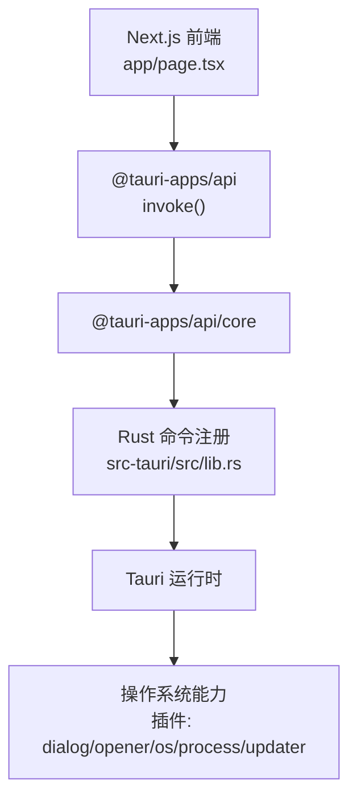
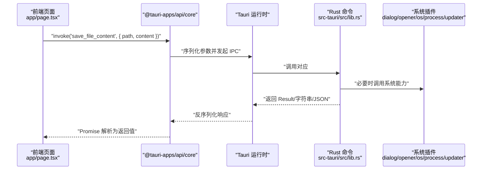
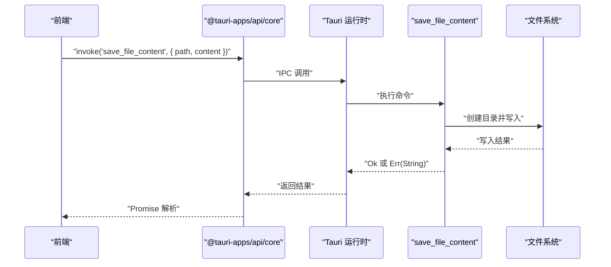
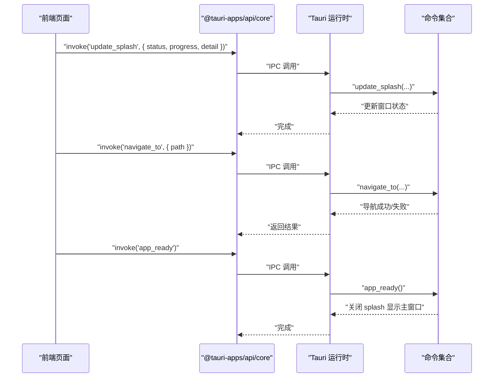
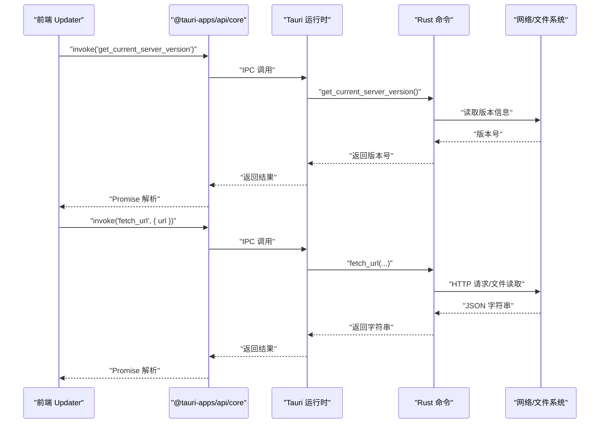
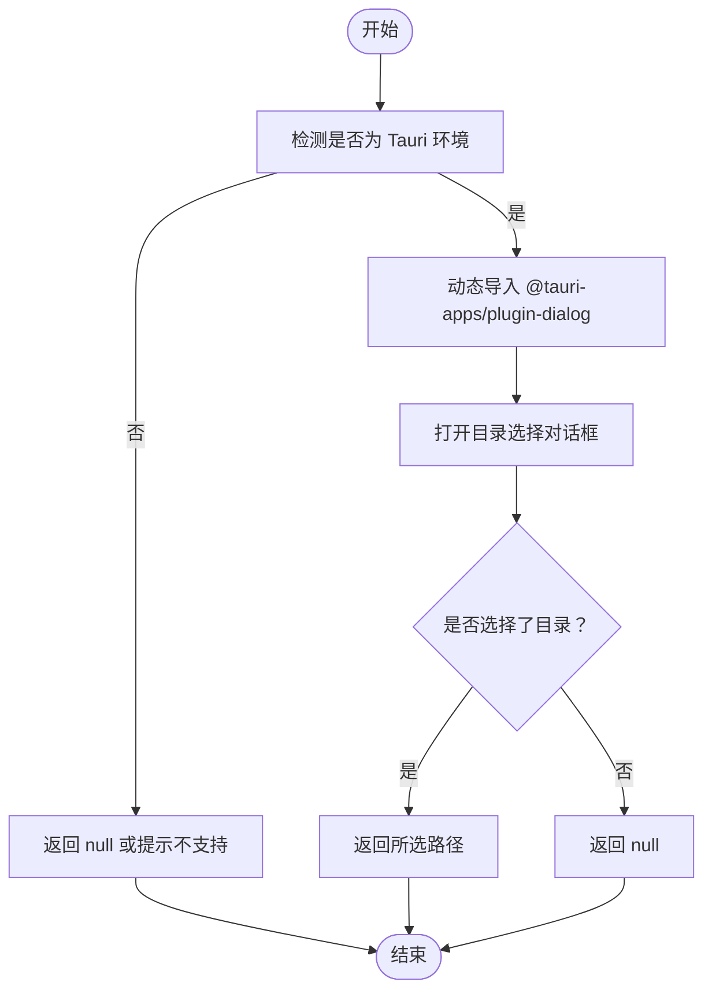
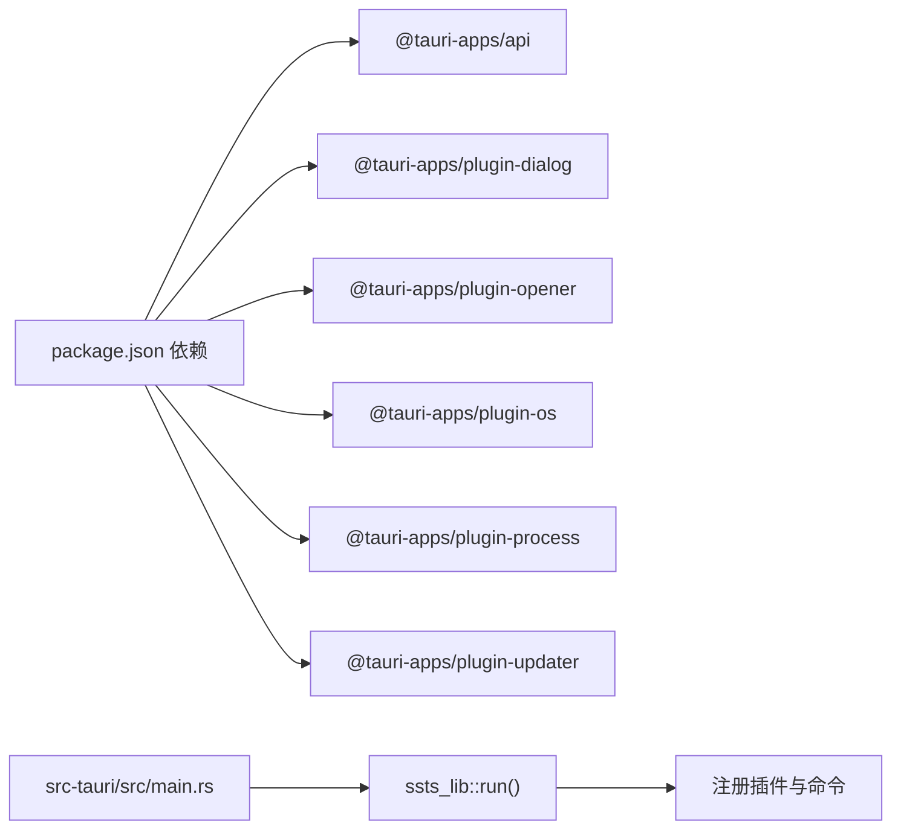

# 前端调用接口

<cite>
**本文引用的文件**
- [lib/tauri.ts](file://lib/tauri.ts)
- [lib/updater.ts](file://lib/updater.ts)
- [src-tauri/src/lib.rs](file://src-tauri/src/lib.rs)
- [src-tauri/src/main.rs](file://src-tauri/src/main.rs)
- [src-tauri/Cargo.toml](file://src-tauri/Cargo.toml)
- [package.json](file://package.json)
- [app/page.tsx](file://app/page.tsx)
</cite>

## 目录
1. [简介](#简介)
2. [项目结构](#项目结构)
3. [核心组件](#核心组件)
4. [架构总览](#架构总览)
5. [详细组件分析](#详细组件分析)
6. [依赖关系分析](#依赖关系分析)
7. [性能考量](#性能考量)
8. [故障排查指南](#故障排查指南)
9. [结论](#结论)
10. [附录](#附录)

## 简介
本文件面向前端开发者，系统性地梳理 SSTS 项目中前端通过 @tauri-apps/api 调用 Rust 命令的接口规范与最佳实践。内容涵盖：
- invoke 调用模式、参数传递与响应处理
- IPC 通信机制、异步处理与错误捕获策略
- 前端状态管理与事件监听建议
- 结合实际代码路径给出可复用的 TypeScript 示例与图示

## 项目结构
SSTS 采用 Next.js 前端 + Tauri 桌面壳 + Rust 后端的混合架构。前端通过 @tauri-apps/api 的 invoke 与 Rust 注册的命令进行 IPC 通信；Rust 侧通过 tauri::command 定义命令，并在应用启动时注册到 Tauri 运行时。

图表来源
- [app/page.tsx:1-17](file://app/page.tsx#L1-L17)
- [lib/tauri.ts:1-49](file://lib/tauri.ts#L1-L49)
- [lib/updater.ts:108-116](file://lib/updater.ts#L108-L116)
- [src-tauri/src/lib.rs:1109-1161](file://src-tauri/src/lib.rs#L1109-L1161)
- [src-tauri/src/main.rs:4-7](file://src-tauri/src/main.rs#L4-L7)
- [src-tauri/Cargo.toml:14-28](file://src-tauri/Cargo.toml#L14-L28)
- [package.json:16-40](file://package.json#L16-L40)

章节来源
- [app/page.tsx:1-17](file://app/page.tsx#L1-L17)
- [package.json:16-40](file://package.json#L16-L40)

## 核心组件
- 前端调用封装
  - 环境检测与系统操作封装：[lib/tauri.ts:5-48](file://lib/tauri.ts#L5-L48)
  - 自动更新封装（含 invoke 调用）：[lib/updater.ts:108-116](file://lib/updater.ts#L108-L116)
- Rust 命令注册
  - 文件写入、进度更新、导航、就绪通知等命令：[src-tauri/src/lib.rs:1111-1161](file://src-tauri/src/lib.rs#L1111-L1161)
- 应用入口与插件
  - 应用入口与插件注册：[src-tauri/src/main.rs:4-7](file://src-tauri/src/main.rs#L4-L7)，[src-tauri/Cargo.toml:14-28](file://src-tauri/Cargo.toml#L14-L28)
- 依赖声明
  - 前端依赖 @tauri-apps/api 与各插件：[package.json:16-40](file://package.json#L16-L40)

章节来源
- [lib/tauri.ts:5-48](file://lib/tauri.ts#L5-L48)
- [lib/updater.ts:108-116](file://lib/updater.ts#L108-L116)
- [src-tauri/src/lib.rs:1111-1161](file://src-tauri/src/lib.rs#L1111-L1161)
- [src-tauri/src/main.rs:4-7](file://src-tauri/src/main.rs#L4-L7)
- [src-tauri/Cargo.toml:14-28](file://src-tauri/Cargo.toml#L14-L28)
- [package.json:16-40](file://package.json#L16-L40)

## 架构总览
前端通过 @tauri-apps/api 的 invoke 发起 IPC 调用，Rust 侧通过 tauri::command 注册命令，Tauri 运行时负责桥接与参数序列化/反序列化，最终由 Rust 插件或业务逻辑处理请求并返回结果。

图表来源
- [lib/updater.ts:108-116](file://lib/updater.ts#L108-L116)
- [src-tauri/src/lib.rs:1111-1118](file://src-tauri/src/lib.rs#L1111-L1118)
- [package.json:16-40](file://package.json#L16-L40)

## 详细组件分析

### 组件一：文件写入命令（save_file_content）
- 命令定义与行为
  - 参数：路径与二进制内容
  - 行为：确保父目录存在并写入文件
  - 返回：成功或错误字符串
- 前端调用要点
  - 使用 invoke 传入对象参数
  - 捕获异常并提示用户
- 最佳实践
  - 在调用前校验路径合法性
  - 对大文件分块写入以降低内存压力
  - 错误时提供重试或回退方案

图表来源
- [src-tauri/src/lib.rs:1111-1118](file://src-tauri/src/lib.rs#L1111-L1118)

章节来源
- [src-tauri/src/lib.rs:1111-1118](file://src-tauri/src/lib.rs#L1111-L1118)

### 组件二：进度更新与导航（update_splash、navigate_to、app_ready）
- update_splash
  - 作用：前端接管 splash 进度（80%-100%），由 Rust 控制窗口状态
  - 参数：状态文本、进度百分比、详情
- navigate_to
  - 作用：将主窗口导航到本地服务的某个路径
  - 参数：相对路径；内部拼接本地服务地址
- app_ready
  - 作用：前端页面渲染完成后通知 Rust 关闭 splash 并显示主窗口
- 调用建议
  - 前端在页面挂载后调用 app_ready
  - 导航前确保本地服务已就绪

图表来源
- [src-tauri/src/lib.rs:1120-1161](file://src-tauri/src/lib.rs#L1120-L1161)

章节来源
- [src-tauri/src/lib.rs:1120-1161](file://src-tauri/src/lib.rs#L1120-L1161)

### 组件三：自动更新流程（含 invoke 调用）
- 关键点
  - 通过 Rust 命令获取当前 server 版本号
  - 通过 Rust 命令拉取远端 JSON（绕过浏览器 CORS）
  - 前端基于返回信息决定是否进入 Tauri 全量更新或 Server 热更新
- 调用模式
  - 动态 import @tauri-apps/api/core
  - 使用 invoke('get_current_server_version')、invoke('fetch_url', { url })

图表来源
- [lib/updater.ts:108-116](file://lib/updater.ts#L108-L116)
- [lib/updater.ts:250-254](file://lib/updater.ts#L250-L254)
- [src-tauri/src/lib.rs:1134-1137](file://src-tauri/src/lib.rs#L1134-L1137)
- [src-tauri/src/lib.rs:1109-1118](file://src-tauri/src/lib.rs#L1109-L1118)

章节来源
- [lib/updater.ts:108-116](file://lib/updater.ts#L108-L116)
- [lib/updater.ts:250-254](file://lib/updater.ts#L250-L254)
- [src-tauri/src/lib.rs:1134-1137](file://src-tauri/src/lib.rs#L1134-L1137)
- [src-tauri/src/lib.rs:1109-1118](file://src-tauri/src/lib.rs#L1109-L1118)

### 组件四：系统操作与对话框（环境检测与目录选择）
- isTauri：判断是否在 Tauri 桌面环境中
- selectDirectory：打开系统目录选择对话框，返回用户选择的目录路径
- openWithSystemApp / revealInFinder：通过 opener 插件打开文件或定位文件所在目录
- 调用建议
  - 在非 Tauri 环境下优雅降级（如返回 null 或抛出明确错误）
  - 对异常进行统一捕获并提示用户

图表来源
- [lib/tauri.ts:26-35](file://lib/tauri.ts#L26-L35)

章节来源
- [lib/tauri.ts:5-48](file://lib/tauri.ts#L5-L48)
- [lib/tauri.ts:26-35](file://lib/tauri.ts#L26-L35)

## 依赖关系分析
- 前端对 @tauri-apps/api 的依赖
  - @tauri-apps/api：提供 invoke、资源路径转换等核心能力
  - 各插件：@tauri-apps/plugin-dialog、@tauri-apps/plugin-opener、@tauri-apps/plugin-os、@tauri-apps/plugin-process、@tauri-apps/plugin-updater
- Rust 侧对插件的依赖
  - tauri、tauri-plugin-*：提供系统能力与命令注册
- 应用入口
  - main.rs 调用 ssts_lib::run，注册插件与命令

图表来源
- [package.json:16-40](file://package.json#L16-L40)
- [src-tauri/src/main.rs:4-7](file://src-tauri/src/main.rs#L4-L7)
- [src-tauri/Cargo.toml:14-28](file://src-tauri/Cargo.toml#L14-L28)

章节来源
- [package.json:16-40](file://package.json#L16-L40)
- [src-tauri/src/main.rs:4-7](file://src-tauri/src/main.rs#L4-L7)
- [src-tauri/Cargo.toml:14-28](file://src-tauri/Cargo.toml#L14-L28)

## 性能考量
- invoke 调用为同步阻塞的 IPC，建议：
  - 大数据传输（如大文件写入）采用分块策略或临时文件 + 通知方式
  - 频繁调用时合并请求或引入节流/去抖
  - 对网络相关命令（如 fetch_url）设置合理超时与重试
- 前端状态管理：
  - 使用轻量状态库（如 zustand）集中管理调用状态与错误
  - 对 UI 更新采用批量提交，避免频繁重绘

## 故障排查指南
- 常见错误与处理
  - 非 Tauri 环境调用系统能力：抛出明确错误，前端应降级处理
  - invoke 返回错误字符串：解析并提示用户；必要时提供重试
  - 网络请求失败：结合自动更新模块的重试策略与错误回调
- 排查步骤
  - 确认命令已在 Rust 侧注册且名称一致
  - 检查参数类型与必填字段
  - 查看 Tauri 日志与前端控制台错误
  - 验证插件权限与 capabilities 配置

章节来源
- [lib/tauri.ts:9-20](file://lib/tauri.ts#L9-L20)
- [lib/tauri.ts:37-48](file://lib/tauri.ts#L37-L48)
- [lib/updater.ts:196-199](file://lib/updater.ts#L196-L199)

## 结论
SSTS 的前端调用接口以 @tauri-apps/api 为核心，通过 invoke 与 Rust 命令建立稳定的 IPC 通道。结合系统插件与状态管理，可实现安全、可控且易维护的桌面端功能。建议在生产中遵循参数校验、错误捕获与状态管理的最佳实践，持续优化用户体验与稳定性。

## 附录
- 快速上手清单
  - 在前端使用动态 import 获取 @tauri-apps/api/core
  - 通过 invoke 调用已注册命令，注意参数命名与类型
  - 对所有外部能力调用进行环境检测与异常捕获
  - 使用状态库集中管理调用状态与错误信息
  - 对高频或大数据量操作引入节流/批处理策略