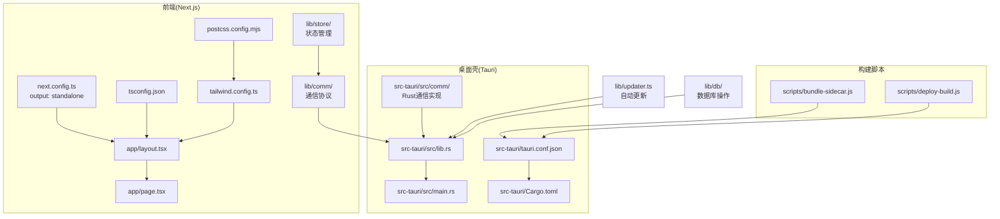
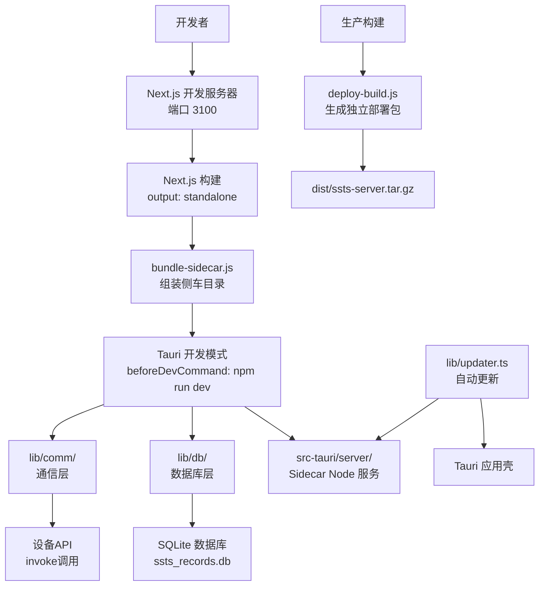
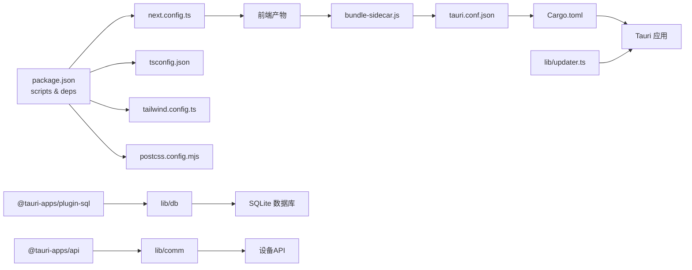

# 开发指南

<cite>
**本文引用的文件**
- [package.json](file://package.json)
- [next.config.ts](file://next.config.ts)
- [tsconfig.json](file://tsconfig.json)
- [tailwind.config.ts](file://tailwind.config.ts)
- [postcss.config.mjs](file://postcss.config.mjs)
- [instrumentation.ts](file://instrumentation.ts)
- [app/layout.tsx](file://app/layout.tsx)
- [app/page.tsx](file://app/page.tsx)
- [lib/updater.ts](file://lib/updater.ts)
- [src-tauri/Cargo.toml](file://src-tauri/Cargo.toml)
- [src-tauri/tauri.conf.json](file://src-tauri/tauri.conf.json)
- [src-tauri/src/main.rs](file://src-tauri/src/main.rs)
- [src-tauri/src/lib.rs](file://src-tauri/src/lib.rs)
- [scripts/bundle-sidecar.js](file://scripts/bundle-sidecar.js)
- [scripts/deploy-build.js](file://scripts/deploy-build.js)
- [lib/db/brake-records.ts](file://lib/db/brake-records.ts)
- [lib/db/control-force-records.ts](file://lib/db/control-force-records.ts)
- [lib/db/steering-records.ts](file://lib/db/steering-records.ts)
- [lib/db/torque-records.ts](file://lib/db/torque-records.ts)
- [lib/comm/types.ts](file://lib/comm/types.ts)
- [lib/comm/device-service.ts](file://lib/comm/device-service.ts)
- [lib/comm/use-device.ts](file://lib/comm/use-device.ts)
- [lib/comm/index.ts](file://lib/comm/index.ts)
- [lib/store/index.ts](file://lib/store/index.ts)
- [src-tauri/src/comm/mod.rs](file://src-tauri/src/comm/mod.rs)
</cite>

## 更新摘要
**所做更改**
- 新增数据库操作实践指导，包含SQLite数据库初始化、表结构设计和CRUD操作
- 新增通信协议实现指导，涵盖设备状态管理、命令封装和事件监听机制
- 新增新组件开发最佳实践，包括状态管理模式、数据持久化和错误处理
- 更新调试与故障排除章节，增加数据库连接和通信协议调试方法
- 完善版本控制与发布流程，新增数据库迁移和通信协议版本管理

## 目录
1. [简介](#简介)
2. [项目结构](#项目结构)
3. [核心组件](#核心组件)
4. [架构总览](#架构总览)
5. [详细组件分析](#详细组件分析)
6. [新组件开发实践](#新组件开发实践)
7. [通信协议实现](#通信协议实现)
8. [数据库操作实践](#数据库操作实践)
9. [依赖关系分析](#依赖关系分析)
10. [性能考虑](#性能考虑)
11. [调试与故障排除](#调试与故障排除)
12. [版本控制与发布](#版本控制与发布)
13. [结论](#结论)
14. [附录](#附录)

## 简介
本开发指南面向SSTS项目团队，提供从开发环境搭建、代码规范、调试与测试、到构建打包与部署的全流程技术指导。SSTS采用Next.js前端与Tauri桌面壳结合的架构，前端以Next.js Standalone模式输出，通过脚本打包为Tauri侧车服务端；同时提供自动更新能力，支持应用壳与服务端两层更新。

**更新** 新增了新组件开发、通信协议实现和数据库操作的详细实践指导，为团队提供完整的开发参考。

## 项目结构
项目采用前后端分离与桌面壳集成的组织方式：
- 前端：Next.js应用位于根目录，使用Standalone输出，便于容器化或独立部署。
- 桌面壳：Tauri应用位于src-tauri，负责窗口管理、系统集成、自动更新与侧车服务启动。
- 构建脚本：scripts目录包含打包侧车服务与独立部署包的工具脚本。
- 样式与工具链：TailwindCSS、PostCSS、TypeScript配置统一管理。
- 数据库层：lib/db目录提供SQLite数据库操作封装，支持多种测试记录类型。
- 通信层：lib/comm目录实现设备通信协议，包含状态管理和服务封装。

**图表来源**
- [app/layout.tsx:1-25](file://app/layout.tsx#L1-L25)
- [app/page.tsx:1-17](file://app/page.tsx#L1-L17)
- [next.config.ts:1-8](file://next.config.ts#L1-L8)
- [tsconfig.json:1-24](file://tsconfig.json#L1-L24)
- [tailwind.config.ts:1-52](file://tailwind.config.ts#L1-L52)
- [postcss.config.mjs:1-10](file://postcss.config.mjs#L1-L10)
- [src-tauri/src/lib.rs:1-800](file://src-tauri/src/lib.rs#L1-L800)
- [src-tauri/src/main.rs:1-7](file://src-tauri/src/main.rs#L1-L7)
- [src-tauri/tauri.conf.json:1-64](file://src-tauri/tauri.conf.json#L1-L64)
- [src-tauri/Cargo.toml:1-28](file://src-tauri/Cargo.toml#L1-L28)
- [scripts/bundle-sidecar.js:1-19](file://scripts/bundle-sidecar.js#L1-L19)
- [scripts/deploy-build.js:1-80](file://scripts/deploy-build.js#L1-L80)
- [lib/updater.ts:1-385](file://lib/updater.ts#L1-L385)
- [lib/db/brake-records.ts:1-87](file://lib/db/brake-records.ts#L1-L87)
- [lib/comm/types.ts:1-142](file://lib/comm/types.ts#L1-L142)

**章节来源**
- [package.json:1-42](file://package.json#L1-L42)
- [next.config.ts:1-8](file://next.config.ts#L1-L8)
- [tsconfig.json:1-24](file://tsconfig.json#L1-L24)
- [tailwind.config.ts:1-52](file://tailwind.config.ts#L1-L52)
- [postcss.config.mjs:1-10](file://postcss.config.mjs#L1-L10)
- [instrumentation.ts:1-11](file://instrumentation.ts#L1-L11)
- [app/layout.tsx:1-25](file://app/layout.tsx#L1-L25)
- [app/page.tsx:1-17](file://app/page.tsx#L1-L17)
- [src-tauri/tauri.conf.json:1-64](file://src-tauri/tauri.conf.json#L1-L64)
- [src-tauri/Cargo.toml:1-28](file://src-tauri/Cargo.toml#L1-L28)
- [scripts/bundle-sidecar.js:1-19](file://scripts/bundle-sidecar.js#L1-L19)
- [scripts/deploy-build.js:1-80](file://scripts/deploy-build.js#L1-L80)
- [lib/updater.ts:1-385](file://lib/updater.ts#L1-L385)

## 核心组件
- 前端Next.js应用：提供页面布局与基础路由，使用Standalone模式输出，便于后续打包为桌面壳侧车或独立部署。
- Tauri桌面壳：负责窗口生命周期、系统托盘、自动更新、侧车服务启动与运行时环境准备。
- 自动更新模块：封装Tauri全量更新与服务端热更新，支持版本比较、下载进度回调与错误处理。
- 构建脚本：将Next.js Standalone产物打包为Tauri侧车目录，并生成可独立部署的服务端包。
- 数据库层：提供SQLite数据库操作封装，支持刹车、转向、扭矩、控制力等多种测试记录的持久化。
- 通信层：实现设备通信协议，包含状态管理、命令封装和事件监听机制。

**更新** 新增数据库层和通信层的核心组件说明，为新组件开发提供基础设施支持。

**章节来源**
- [app/layout.tsx:1-25](file://app/layout.tsx#L1-L25)
- [app/page.tsx:1-17](file://app/page.tsx#L1-L17)
- [src-tauri/src/lib.rs:1-800](file://src-tauri/src/lib.rs#L1-L800)
- [lib/updater.ts:1-385](file://lib/updater.ts#L1-L385)
- [scripts/bundle-sidecar.js:1-19](file://scripts/bundle-sidecar.js#L1-L19)
- [scripts/deploy-build.js:1-80](file://scripts/deploy-build.js#L1-L80)
- [lib/db/brake-records.ts:1-87](file://lib/db/brake-records.ts#L1-L87)
- [lib/comm/types.ts:1-142](file://lib/comm/types.ts#L1-L142)

## 架构总览
SSTS采用"前端Next.js + Tauri桌面壳 + 侧车服务"的混合架构。前端在开发时由Next.js提供热更新，构建后以Standalone形式打包；Tauri在启动时根据配置先构建前端产物，再将Standalone产物复制到src-tauri/server/目录，作为侧车服务运行。同时，Tauri通过插件实现自动更新，支持应用壳与服务端两层更新。

**更新** 架构图增加了数据库层和通信层的集成关系，体现完整的数据流和控制流。

**图表来源**
- [package.json:5-14](file://package.json#L5-L14)
- [next.config.ts:3-5](file://next.config.ts#L3-L5)
- [scripts/bundle-sidecar.js:1-19](file://scripts/bundle-sidecar.js#L1-L19)
- [scripts/deploy-build.js:1-80](file://scripts/deploy-build.js#L1-L80)
- [src-tauri/tauri.conf.json:6-11](file://src-tauri/tauri.conf.json#L6-L11)
- [lib/updater.ts:1-385](file://lib/updater.ts#L1-L385)
- [lib/db/brake-records.ts:1-87](file://lib/db/brake-records.ts#L1-L87)
- [lib/comm/device-service.ts:1-85](file://lib/comm/device-service.ts#L1-L85)

## 详细组件分析

### 前端Next.js应用
- 页面与元数据：根布局与页面组件提供基础UI骨架，页面展示系统就绪状态。
- 构建输出：Standalone模式输出，便于独立运行或作为侧车服务。
- 样式与工具链：TailwindCSS与PostCSS配置，TypeScript严格模式与路径别名。

**章节来源**
- [app/layout.tsx:1-25](file://app/layout.tsx#L1-L25)
- [app/page.tsx:1-17](file://app/page.tsx#L1-L17)
- [next.config.ts:3-5](file://next.config.ts#L3-L5)
- [tailwind.config.ts:1-52](file://tailwind.config.ts#L1-L52)
- [postcss.config.mjs:1-10](file://postcss.config.mjs#L1-L10)
- [tsconfig.json:1-24](file://tsconfig.json#L1-L24)

### Tauri桌面壳与侧车服务
- 启动流程：主入口调用库函数运行，库中负责创建启动页窗口、准备运行时环境、启动侧车服务并等待就绪。
- 运行时管理：自动检测并下载Node.js、Python、Git运行时，支持国内镜像加速与代理透传。
- 窗口与资源：配置窗口尺寸、最小尺寸、标题栏样式与可见性；打包时包含侧车资源与图标。
- 插件与更新：启用多个Tauri插件，配置自动更新端点与公钥。

**章节来源**
- [src-tauri/src/main.rs:1-7](file://src-tauri/src/main.rs#L1-L7)
- [src-tauri/src/lib.rs:1-800](file://src-tauri/src/lib.rs#L1-L800)
- [src-tauri/tauri.conf.json:1-64](file://src-tauri/tauri.conf.json#L1-L64)
- [src-tauri/Cargo.toml:1-28](file://src-tauri/Cargo.toml#L1-L28)

### 自动更新模块
- 功能分层：封装Tauri全量更新与服务端热更新两类更新路径，支持版本比较、下载进度回调与错误处理。
- 更新调度：提供定时检查与即时检查接口，避免重复检查。
- 平台适配：通过平台键选择对应更新包，支持CDN与GitHub Releases回退。

**章节来源**
- [lib/updater.ts:1-385](file://lib/updater.ts#L1-L385)

### 构建与打包脚本
- 侧车打包：将Next.js Standalone产物复制到src-tauri/server/目录，供Tauri生产模式运行。
- 独立部署包：生成可独立部署的tar.gz包，包含启动脚本与环境变量说明。

**章节来源**
- [scripts/bundle-sidecar.js:1-19](file://scripts/bundle-sidecar.js#L1-L19)
- [scripts/deploy-build.js:1-80](file://scripts/deploy-build.js#L1-L80)

### 服务端启动与初始化
- 启动钩子：注册Next.js服务端启动时的初始化逻辑（如定时任务调度器）占位。

**章节来源**
- [instrumentation.ts:1-11](file://instrumentation.ts#L1-L11)

## 新组件开发实践

### 状态管理模式
新组件应遵循以下状态管理最佳实践：

- **状态隔离**：每个组件维护独立的状态，避免全局状态污染
- **状态持久化**：使用Zustand或Redux Toolkit进行状态持久化
- **异步状态处理**：合理处理加载、成功、失败三种状态
- **状态订阅**：使用React hooks进行状态订阅和更新

**章节来源**
- [lib/store/index.ts:1-15](file://lib/store/index.ts#L1-L15)

### 组件生命周期管理
- **初始化**：在组件挂载时进行必要的初始化操作
- **清理**：在组件卸载时清理定时器、事件监听器等资源
- **错误边界**：实现错误边界捕获组件渲染异常
- **性能优化**：使用useMemo、useCallback优化重渲染

### 事件处理机制
- **事件监听**：使用Tauri的listen API监听后端事件
- **事件转发**：将后端事件转换为前端可消费的数据格式
- **错误处理**：统一处理事件监听和处理过程中的异常

**章节来源**
- [lib/comm/use-device.ts:1-117](file://lib/comm/use-device.ts#L1-L117)

## 通信协议实现

### 设备状态管理
通信协议实现基于以下核心概念：

- **设备状态模型**：定义完整的设备状态接口，包含连接状态、运动状态、传感器数据等
- **状态同步**：通过事件机制实现实时状态同步
- **状态转换**：处理设备状态的各种转换场景

**章节来源**
- [lib/comm/types.ts:1-142](file://lib/comm/types.ts#L1-L142)

### 命令封装模式
- **命令抽象**：将设备操作封装为统一的命令接口
- **参数验证**：对命令参数进行类型检查和范围验证
- **错误处理**：统一处理命令执行过程中的各种错误
- **回调机制**：支持命令执行结果的异步回调

**章节来源**
- [lib/comm/device-service.ts:1-85](file://lib/comm/device-service.ts#L1-L85)

### 事件监听机制
- **事件注册**：使用Tauri的listen API注册事件监听器
- **事件去重**：避免重复注册相同的事件监听器
- **内存泄漏防护**：确保组件卸载时正确清理事件监听器
- **日志记录**：记录关键事件便于调试和监控

**章节来源**
- [lib/comm/use-device.ts:1-117](file://lib/comm/use-device.ts#L1-L117)

### Rust通信实现
后端使用Rust实现高性能的通信协议：

- **模块化设计**：通信功能按功能模块划分，便于维护和扩展
- **线程安全**：使用Arc和Mutex确保多线程环境下的数据安全
- **错误处理**：统一的错误处理机制，提供详细的错误信息
- **性能优化**：使用零拷贝和异步IO提高通信效率

**章节来源**
- [src-tauri/src/comm/mod.rs:1-12](file://src-tauri/src/comm/mod.rs#L1-L12)

## 数据库操作实践

### SQLite数据库集成
SSTS使用SQLite作为本地数据库，提供以下核心功能：

- **数据库初始化**：自动创建数据库连接和表结构
- **CRUD操作**：提供完整的增删改查操作接口
- **数据序列化**：JSON序列化复杂数据结构
- **事务管理**：支持事务操作确保数据一致性

**章节来源**
- [lib/db/brake-records.ts:1-87](file://lib/db/brake-records.ts#L1-L87)
- [lib/db/control-force-records.ts:1-93](file://lib/db/control-force-records.ts#L1-L93)
- [lib/db/steering-records.ts:1-75](file://lib/db/steering-records.ts#L1-L75)
- [lib/db/torque-records.ts:1-87](file://lib/db/torque-records.ts#L1-L87)

### 表结构设计原则
- **主键设计**：使用自增主键确保唯一性
- **索引优化**：为常用查询字段建立索引
- **数据类型选择**：根据业务需求选择合适的数据类型
- **约束定义**：使用NOT NULL和DEFAULT约束保证数据完整性

### 数据持久化策略
- **批量操作**：支持批量插入和更新操作
- **数据备份**：定期备份重要测试数据
- **空间管理**：实现数据清理和空间回收机制
- **并发控制**：使用事务确保并发操作的数据一致性

### 错误处理机制
- **连接管理**：自动处理数据库连接断开和重连
- **异常捕获**：统一捕获和处理数据库操作异常
- **回滚机制**：在事务失败时自动回滚
- **日志记录**：记录数据库操作日志便于问题排查

**章节来源**
- [lib/db/brake-records.ts:1-87](file://lib/db/brake-records.ts#L1-L87)
- [lib/db/control-force-records.ts:1-93](file://lib/db/control-force-records.ts#L1-L93)
- [lib/db/steering-records.ts:1-75](file://lib/db/steering-records.ts#L1-L75)
- [lib/db/torque-records.ts:1-87](file://lib/db/torque-records.ts#L1-L87)

## 依赖关系分析
- 前端依赖：Next.js、React、TailwindCSS、Zustand等。
- 桌面壳依赖：Tauri核心与多款插件，以及序列化、压缩、哈希等工具库。
- 构建与脚本：Node.js原生模块与外部工具（如tar、curl）。
- 数据库依赖：@tauri-apps/plugin-sql提供SQLite数据库支持。
- 通信依赖：@tauri-apps/api提供跨平台API调用能力。

**更新** 新增数据库和通信相关的依赖关系分析。

**图表来源**
- [package.json:1-42](file://package.json#L1-L42)
- [next.config.ts:1-8](file://next.config.ts#L1-L8)
- [tsconfig.json:1-24](file://tsconfig.json#L1-L24)
- [tailwind.config.ts:1-52](file://tailwind.config.ts#L1-L52)
- [postcss.config.mjs:1-10](file://postcss.config.mjs#L1-L10)
- [scripts/bundle-sidecar.js:1-19](file://scripts/bundle-sidecar.js#L1-L19)
- [src-tauri/tauri.conf.json:1-64](file://src-tauri/tauri.conf.json#L1-L64)
- [src-tauri/Cargo.toml:1-28](file://src-tauri/Cargo.toml#L1-L28)
- [lib/updater.ts:1-385](file://lib/updater.ts#L1-L385)
- [lib/db/brake-records.ts:1-87](file://lib/db/brake-records.ts#L1-L87)
- [lib/comm/device-service.ts:1-85](file://lib/comm/device-service.ts#L1-L85)

**章节来源**
- [package.json:1-42](file://package.json#L1-L42)
- [src-tauri/Cargo.toml:1-28](file://src-tauri/Cargo.toml#L1-L28)

## 性能考虑
- 构建输出：使用Next.js Standalone模式，减少运行时依赖，提升冷启动性能。
- 侧车服务：将Standalone产物直接作为Node服务运行，避免额外中间层开销。
- 运行时准备：在启动阶段预下载并校验运行时（Node、Python、Git），避免首次请求延迟。
- 更新策略：优先增量热更新（delta），降低更新体积与时间成本。
- 样式与打包：Tailwind按需扫描内容，减少CSS体积；打包时剔除不必要的资源。
- 数据库优化：使用连接池和索引优化查询性能；实现数据缓存减少重复查询。
- 通信优化：使用异步IO和事件驱动模式，避免阻塞主线程。

**更新** 新增数据库和通信方面的性能优化建议。

**章节来源**
- [next.config.ts:3-5](file://next.config.ts#L3-L5)
- [src-tauri/src/lib.rs:652-800](file://src-tauri/src/lib.rs#L652-L800)
- [lib/updater.ts:247-315](file://lib/updater.ts#L247-L315)
- [lib/db/brake-records.ts:1-87](file://lib/db/brake-records.ts#L1-L87)
- [lib/comm/use-device.ts:1-117](file://lib/comm/use-device.ts#L1-L117)

## 调试与故障排除

### 开发调试
- 前端开发：使用Next.js开发服务器端口3100，配合热更新快速迭代。
- 桌面壳开发：通过Tauri CLI启动，自动构建前端并注入开发URL。
- 日志与启动页：启动页通过JavaScript更新状态与进度，便于观察运行时准备过程。
- 数据库调试：使用SQLite Browser查看数据库状态和数据完整性。
- 通信调试：通过设备调试日志查看命令发送和响应情况。

**更新** 新增数据库和通信调试方法。

**章节来源**
- [package.json:5-14](file://package.json#L5-L14)
- [src-tauri/tauri.conf.json:6-11](file://src-tauri/tauri.conf.json#L6-L11)
- [src-tauri/src/lib.rs:210-243](file://src-tauri/src/lib.rs#L210-L243)

### 常见问题排查
- 运行时缺失：若Node/Python/Git未找到，检查运行时目录与PATH，必要时重新下载。
- 下载超时/失败：检查网络代理与证书设置，确保curl可用且可访问镜像源。
- 服务未就绪：等待启动页提示或查看启动日志，确认端口监听与健康检查。
- 更新失败：检查更新端点可达性与签名公钥配置，必要时切换回手动下载。
- 数据库连接失败：检查数据库文件权限和磁盘空间，确认SQLite插件正常加载。
- 通信协议异常：检查设备连接状态和命令格式，查看调试日志定位问题。

**更新** 新增数据库和通信相关的常见问题排查方法。

**章节来源**
- [src-tauri/src/lib.rs:652-800](file://src-tauri/src/lib.rs#L652-L800)
- [lib/updater.ts:122-139](file://lib/updater.ts#L122-L139)
- [lib/db/brake-records.ts:1-87](file://lib/db/brake-records.ts#L1-L87)
- [lib/comm/use-device.ts:1-117](file://lib/comm/use-device.ts#L1-L117)

### 单元测试与质量门禁
- 代码规范：使用ESLint与TypeScript严格模式，保持一致的代码风格与类型安全。
- 测试建议：针对自动更新逻辑与侧车服务启动流程编写单元测试，覆盖版本比较、下载进度与错误分支。
- 代码审查：关注跨平台兼容性（Windows/macOS/Linux）、代理与证书处理、资源打包完整性。
- 数据库测试：编写数据库操作的单元测试，覆盖CRUD操作和事务处理。
- 通信测试：测试设备连接、命令发送和状态同步的正确性。

**更新** 新增数据库和通信相关的测试建议。

**章节来源**
- [package.json:28-40](file://package.json#L28-L40)
- [tsconfig.json:2-22](file://tsconfig.json#L2-L22)
- [lib/updater.ts:326-384](file://lib/updater.ts#L326-L384)

## 版本控制与发布

### 分支管理
- 主分支：稳定版本，合并前需通过CI与代码审查。
- 开发分支：日常功能开发，采用短生命周期分支，定期与主分支同步。
- 热修复分支：紧急修复发布小版本，完成后合并回主分支与开发分支。
- 数据库分支：涉及数据库结构变更时创建专门分支进行评审。

**更新** 新增数据库相关的分支管理策略。

### 提交规范
- 类型前缀：feat、fix、docs、style、refactor、test、chore等，配合简要描述。
- 标题长度：控制在50字符以内，正文说明变更动机与影响范围。
- 数据库变更：包含数据库迁移脚本和影响说明。
- 通信协议：说明协议版本变更和兼容性影响。

**更新** 新增数据库和通信协议相关的提交规范要求。

### 发布流程
- CI触发：提交至主分支触发构建与测试；通过后进入发布阶段。
- 桌面壳发布：使用Tauri CLI生成多平台安装包，包含更新签名与资源。
- 独立部署包：通过部署脚本生成tar.gz包，提供环境变量与启动说明。
- 更新策略：优先增量热更新，失败时提供全量更新回退方案。
- 数据库迁移：发布新版本时包含数据库结构变更脚本。

**更新** 新增数据库迁移和通信协议版本管理的发布流程。

**章节来源**
- [.github/workflows/ci.yml](file://.github/workflows/ci.yml)
- [.github/workflows/release.yml](file://.github/workflows/release.yml)
- [.github/workflows/server-release.yml](file://.github/workflows/server-release.yml)
- [scripts/deploy-build.js:1-80](file://scripts/deploy-build.js#L1-L80)
- [src-tauri/tauri.conf.json:54-62](file://src-tauri/tauri.conf.json#L54-L62)

## 结论
本指南提供了SSTS项目从开发到发布的完整技术路线图。通过明确的组件职责、清晰的构建与更新策略、完善的调试与发布流程，以及新增的数据库操作和通信协议实现指导，团队可以高效协作并持续交付高质量版本。建议在实际落地中结合团队习惯补充具体CI/CD细节与测试用例，特别关注数据库迁移和通信协议版本管理的最佳实践。

## 附录

### 关键配置速览
- Next.js：Standalone输出、严格TS、Tailwind与PostCSS。
- Tauri：窗口配置、资源打包、插件启用、自动更新端点与公钥。
- 构建脚本：侧车打包与独立部署包生成。
- 数据库：SQLite集成、表结构设计、CRUD操作封装。
- 通信：设备状态管理、命令封装、事件监听机制。

**更新** 新增数据库和通信相关的配置速览。

**章节来源**
- [next.config.ts:3-5](file://next.config.ts#L3-L5)
- [tsconfig.json:2-22](file://tsconfig.json#L2-L22)
- [tailwind.config.ts:1-52](file://tailwind.config.ts#L1-L52)
- [postcss.config.mjs:1-10](file://postcss.config.mjs#L1-L10)
- [src-tauri/tauri.conf.json:1-64](file://src-tauri/tauri.conf.json#L1-L64)
- [src-tauri/Cargo.toml:1-28](file://src-tauri/Cargo.toml#L1-L28)
- [scripts/bundle-sidecar.js:1-19](file://scripts/bundle-sidecar.js#L1-L19)
- [scripts/deploy-build.js:1-80](file://scripts/deploy-build.js#L1-L80)
- [lib/db/brake-records.ts:1-87](file://lib/db/brake-records.ts#L1-L87)
- [lib/comm/types.ts:1-142](file://lib/comm/types.ts#L1-L142)