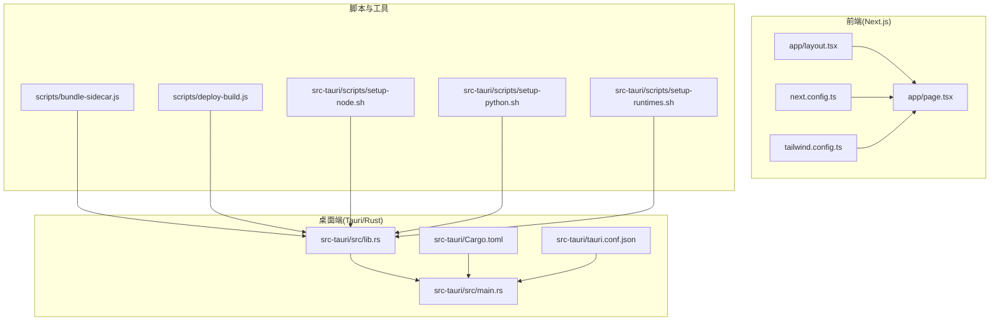
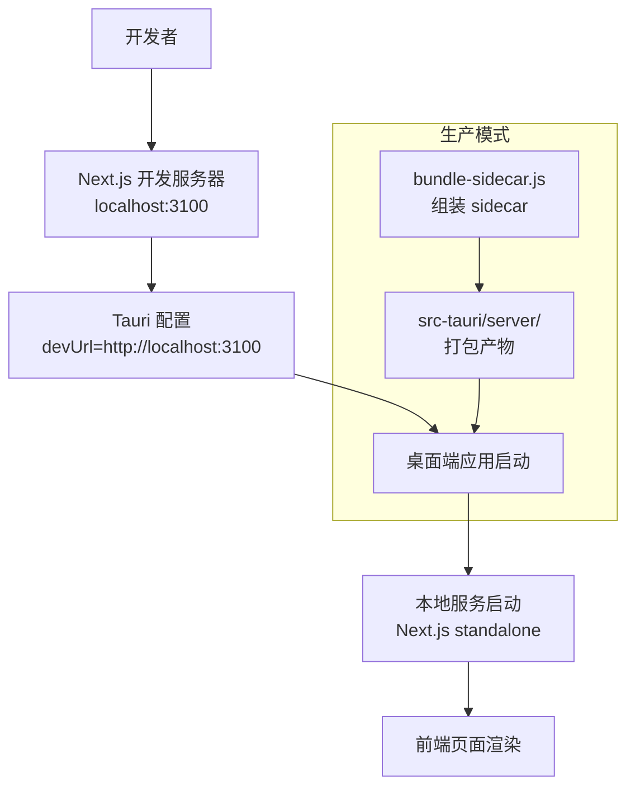
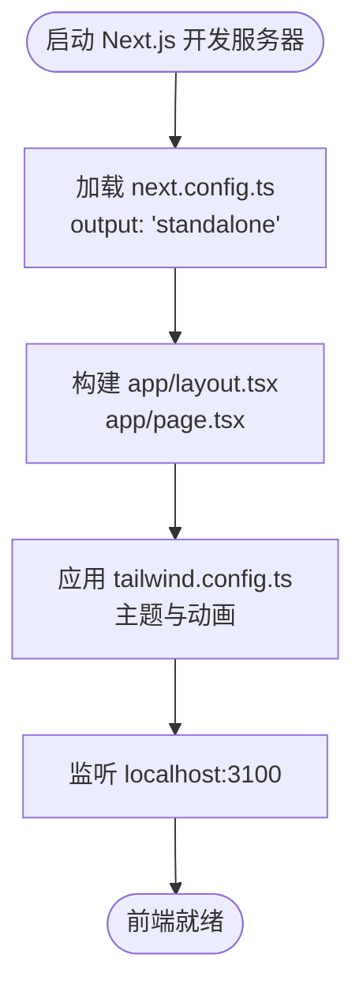
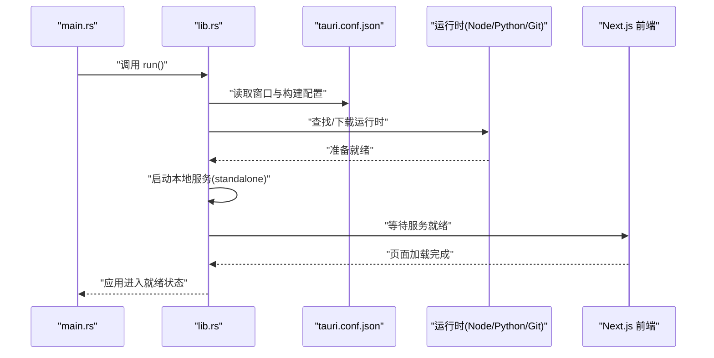
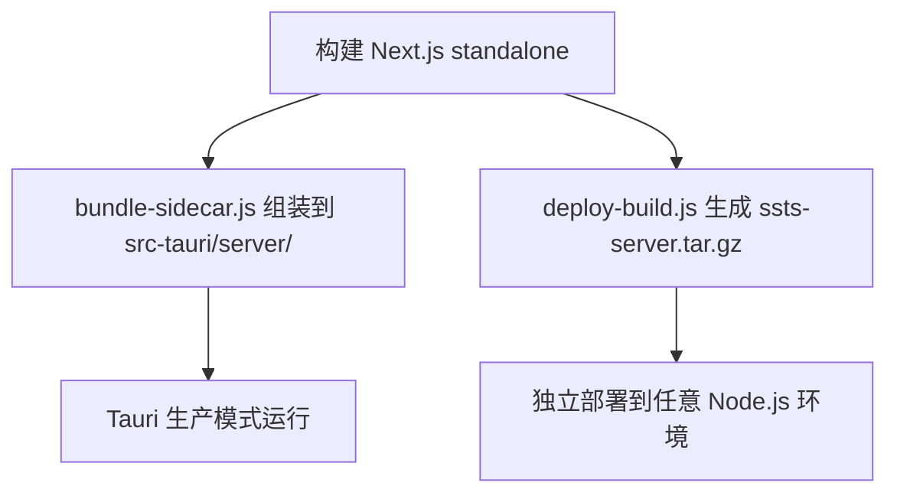
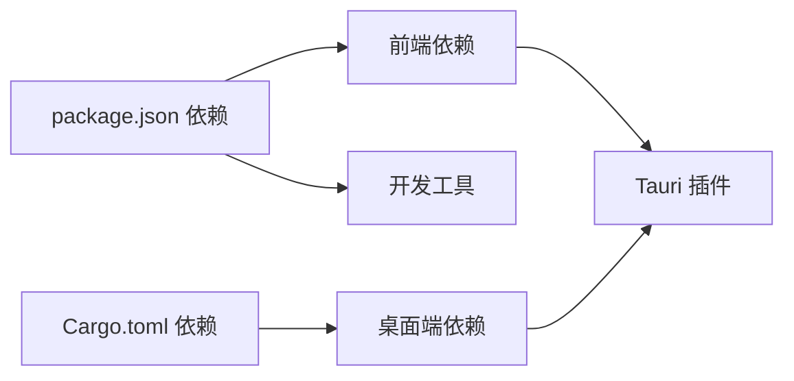

# 快速开始

<cite>
**本文引用的文件**
- [package.json](file://package.json)
- [next.config.ts](file://next.config.ts)
- [tailwind.config.ts](file://tailwind.config.ts)
- [app/layout.tsx](file://app/layout.tsx)
- [app/page.tsx](file://app/page.tsx)
- [src-tauri/tauri.conf.json](file://src-tauri/tauri.conf.json)
- [src-tauri/Cargo.toml](file://src-tauri/Cargo.toml)
- [src-tauri/src/main.rs](file://src-tauri/src/main.rs)
- [src-tauri/src/lib.rs](file://src-tauri/src/lib.rs)
- [lib/tauri.ts](file://lib/tauri.ts)
- [scripts/bundle-sidecar.js](file://scripts/bundle-sidecar.js)
- [scripts/deploy-build.js](file://scripts/deploy-build.js)
- [src-tauri/scripts/setup-node.sh](file://src-tauri/scripts/setup-node.sh)
- [src-tauri/scripts/setup-python.sh](file://src-tauri/scripts/setup-python.sh)
- [src-tauri/scripts/setup-runtimes.sh](file://src-tauri/scripts/setup-runtimes.sh)
</cite>

## 目录
1. [简介](#简介)
2. [项目结构](#项目结构)
3. [核心组件](#核心组件)
4. [架构概览](#架构概览)
5. [详细组件分析](#详细组件分析)
6. [依赖分析](#依赖分析)
7. [性能考虑](#性能考虑)
8. [故障排除指南](#故障排除指南)
9. [结论](#结论)
10. [附录](#附录)

## 简介
本指南面向新开发者，帮助你在最短时间内搭建并运行 SSTS 项目。SSTS 是一个基于 Next.js 的前端应用与 Tauri 桌面端集成的“侧滑测试系统”。项目采用前后端一体化架构：前端使用 Next.js，桌面端使用 Rust + Tauri，通过 Tauri 的 sidecar 模式将 Next.js 的 standalone 产物打包为桌面应用的一部分，并在运行时启动本地服务。

你将学会：
- 系统要求与前置条件
- 克隆与安装依赖
- 开发环境配置与启动
- 本地开发服务器与桌面端联调
- 常见问题排查与优化建议

## 项目结构
SSTS 采用“前端 + 桌面端”双栈结构：
- 前端：Next.js 应用位于根目录，使用 Tailwind CSS 样式框架
- 桌面端：Tauri 应用位于 src-tauri，Rust 代码负责启动本地服务、管理运行时、与前端通信
- 构建脚本：scripts 目录提供打包 sidecar 与独立部署包的工具

**图表来源**
- [app/layout.tsx:1-25](file://app/layout.tsx#L1-L25)
- [app/page.tsx:1-17](file://app/page.tsx#L1-L17)
- [next.config.ts:1-8](file://next.config.ts#L1-L8)
- [tailwind.config.ts:1-52](file://tailwind.config.ts#L1-L52)
- [src-tauri/src/lib.rs:1-800](file://src-tauri/src/lib.rs#L1-L800)
- [src-tauri/src/main.rs:1-7](file://src-tauri/src/main.rs#L1-L7)
- [src-tauri/Cargo.toml:1-28](file://src-tauri/Cargo.toml#L1-L28)
- [src-tauri/tauri.conf.json:1-64](file://src-tauri/tauri.conf.json#L1-L64)
- [scripts/bundle-sidecar.js:1-19](file://scripts/bundle-sidecar.js#L1-L19)
- [scripts/deploy-build.js:1-80](file://scripts/deploy-build.js#L1-L80)
- [src-tauri/scripts/setup-node.sh:1-173](file://src-tauri/scripts/setup-node.sh#L1-L173)
- [src-tauri/scripts/setup-python.sh:1-181](file://src-tauri/scripts/setup-python.sh#L1-L181)
- [src-tauri/scripts/setup-runtimes.sh:1-38](file://src-tauri/scripts/setup-runtimes.sh#L1-L38)

**章节来源**
- [package.json:1-42](file://package.json#L1-L42)
- [next.config.ts:1-8](file://next.config.ts#L1-L8)
- [tailwind.config.ts:1-52](file://tailwind.config.ts#L1-L52)
- [src-tauri/tauri.conf.json:1-64](file://src-tauri/tauri.conf.json#L1-L64)

## 核心组件
- 前端 Next.js 应用：提供页面布局与基础展示，使用 Tailwind CSS 实现主题与动画
- Tauri 桌面端：负责启动本地服务、管理运行时（Node.js、Python、Git）、与前端通信
- 构建与打包：将 Next.js standalone 产物打包为桌面端 sidecar，或生成独立部署包

关键职责与入口：
- 前端入口：app/layout.tsx、app/page.tsx
- 桌面端入口：src-tauri/src/main.rs（Rust 入口）
- 桌面端逻辑：src-tauri/src/lib.rs（运行时管理、启动页、网络与文件处理等）
- 构建脚本：scripts/bundle-sidecar.js、scripts/deploy-build.js
- 配置文件：next.config.ts、tailwind.config.ts、src-tauri/tauri.conf.json、src-tauri/Cargo.toml

**章节来源**
- [app/layout.tsx:1-25](file://app/layout.tsx#L1-L25)
- [app/page.tsx:1-17](file://app/page.tsx#L1-L17)
- [src-tauri/src/main.rs:1-7](file://src-tauri/src/main.rs#L1-L7)
- [src-tauri/src/lib.rs:1-800](file://src-tauri/src/lib.rs#L1-L800)
- [scripts/bundle-sidecar.js:1-19](file://scripts/bundle-sidecar.js#L1-L19)
- [scripts/deploy-build.js:1-80](file://scripts/deploy-build.js#L1-L80)
- [next.config.ts:1-8](file://next.config.ts#L1-L8)
- [tailwind.config.ts:1-52](file://tailwind.config.ts#L1-L52)
- [src-tauri/tauri.conf.json:1-64](file://src-tauri/tauri.conf.json#L1-L64)
- [src-tauri/Cargo.toml:1-28](file://src-tauri/Cargo.toml#L1-L28)

## 架构概览
SSTS 采用“前端 + 桌面端”的混合架构：
- 前端 Next.js 在开发模式下通过 Tauri 配置的 devUrl 启动本地服务
- 生产模式下，Next.js 的 standalone 产物被打包为 sidecar，随桌面端一起发布
- Tauri 在运行时根据平台查找或下载 Node.js、Python、Git 等运行时，并启动本地服务

**图表来源**
- [src-tauri/tauri.conf.json:6-11](file://src-tauri/tauri.conf.json#L6-L11)
- [scripts/bundle-sidecar.js:1-19](file://scripts/bundle-sidecar.js#L1-L19)
- [src-tauri/src/lib.rs:188-208](file://src-tauri/src/lib.rs#L188-L208)

**章节来源**
- [src-tauri/tauri.conf.json:6-11](file://src-tauri/tauri.conf.json#L6-L11)
- [scripts/bundle-sidecar.js:1-19](file://scripts/bundle-sidecar.js#L1-L19)
- [src-tauri/src/lib.rs:188-208](file://src-tauri/src/lib.rs#L188-L208)

## 详细组件分析

### 前端组件（Next.js）
- 页面与布局：app/layout.tsx 提供全局元数据与视口配置；app/page.tsx 展示首页内容
- 样式与主题：tailwind.config.ts 定义深色模式、动画与主题色
- 构建输出：next.config.ts 配置 standalone 输出，便于打包为 sidecar

**图表来源**
- [next.config.ts:1-8](file://next.config.ts#L1-L8)
- [app/layout.tsx:1-25](file://app/layout.tsx#L1-L25)
- [app/page.tsx:1-17](file://app/page.tsx#L1-L17)
- [tailwind.config.ts:1-52](file://tailwind.config.ts#L1-L52)

**章节来源**
- [app/layout.tsx:1-25](file://app/layout.tsx#L1-L25)
- [app/page.tsx:1-17](file://app/page.tsx#L1-L17)
- [next.config.ts:1-8](file://next.config.ts#L1-L8)
- [tailwind.config.ts:1-52](file://tailwind.config.ts#L1-L52)

### 桌面端组件（Tauri/Rust）
- 入口与配置：src-tauri/src/main.rs 调用 lib.rs 的 run 函数；src-tauri/Cargo.toml 定义依赖与插件；src-tauri/tauri.conf.json 配置窗口、安全策略与打包资源
- 运行时管理：src-tauri/src/lib.rs 实现运行时查找/下载（Node.js、Python、Git）、启动页、等待本地服务就绪、日志记录等
- 插件与系统交互：lib/tauri.ts 提供 Tauri 环境检测与系统打开、目录选择、文件定位等能力

**图表来源**
- [src-tauri/src/main.rs:1-7](file://src-tauri/src/main.rs#L1-L7)
- [src-tauri/src/lib.rs:188-208](file://src-tauri/src/lib.rs#L188-L208)
- [src-tauri/tauri.conf.json:6-11](file://src-tauri/tauri.conf.json#L6-L11)

**章节来源**
- [src-tauri/src/main.rs:1-7](file://src-tauri/src/main.rs#L1-L7)
- [src-tauri/src/lib.rs:1-800](file://src-tauri/src/lib.rs#L1-L800)
- [src-tauri/tauri.conf.json:1-64](file://src-tauri/tauri.conf.json#L1-L64)
- [src-tauri/Cargo.toml:1-28](file://src-tauri/Cargo.toml#L1-L28)
- [lib/tauri.ts:1-49](file://lib/tauri.ts#L1-L49)

### 构建与打包组件
- Sidecar 打包：scripts/bundle-sidecar.js 调用 standalone-utils 将 Next.js 产物组装到 src-tauri/server/，供 Tauri 生产模式运行
- 独立部署包：scripts/deploy-build.js 生成可独立部署的 tar.gz 包，包含 standalone 产物与启动脚本
- 运行时构建脚本：src-tauri/scripts/setup-node.sh、setup-python.sh、setup-runtimes.sh 用于在本地构建嵌入式运行时

**图表来源**
- [scripts/bundle-sidecar.js:1-19](file://scripts/bundle-sidecar.js#L1-L19)
- [scripts/deploy-build.js:1-80](file://scripts/deploy-build.js#L1-L80)

**章节来源**
- [scripts/bundle-sidecar.js:1-19](file://scripts/bundle-sidecar.js#L1-L19)
- [scripts/deploy-build.js:1-80](file://scripts/deploy-build.js#L1-L80)
- [src-tauri/scripts/setup-node.sh:1-173](file://src-tauri/scripts/setup-node.sh#L1-L173)
- [src-tauri/scripts/setup-python.sh:1-181](file://src-tauri/scripts/setup-python.sh#L1-L181)
- [src-tauri/scripts/setup-runtimes.sh:1-38](file://src-tauri/scripts/setup-runtimes.sh#L1-L38)

## 依赖分析
- 前端依赖：Next.js、React、Tailwind CSS、Zustand 状态管理等
- 桌面端依赖：Tauri 2 及其插件（dialog、opener、os、process、updater 等）
- 构建与工具：TypeScript、ESLint、PostCSS、Autoprefixer、Tauri CLI

**图表来源**
- [package.json:16-40](file://package.json#L16-L40)
- [src-tauri/Cargo.toml:14-28](file://src-tauri/Cargo.toml#L14-L28)

**章节来源**
- [package.json:16-40](file://package.json#L16-L40)
- [src-tauri/Cargo.toml:14-28](file://src-tauri/Cargo.toml#L14-L28)

## 性能考虑
- Standalone 构建：next.config.ts 启用 standalone 输出，减少运行时依赖，提升打包效率
- 运行时精简：桌面端通过脚本构建最小化运行时，减少体积与启动时间
- 启动页与进度：lib.rs 提供启动页状态更新与进度反馈，改善用户体验
- 网络与超时：下载运行时与网络请求设置超时与重试策略，避免长时间阻塞

[本节为通用指导，无需具体文件分析]

## 故障排除指南
- 开发服务器无法启动
  - 检查端口占用：开发端口为 3100，确认未被占用
  - 重新安装依赖：清理 node_modules 并重新安装
  - 参考脚本：package.json 中的 dev 脚本
- Tauri 开发模式无法连接前端
  - 确认 tauri.conf.json 中 devUrl 指向正确端口
  - 确保前端先于桌面端启动
- 运行时缺失或版本不符
  - 使用 src-tauri/scripts/setup-runtimes.sh 构建嵌入式运行时
  - 检查 lib.rs 中对 Node.js、Python、Git 的查找与验证逻辑
- 下载超时或失败
  - 检查网络与代理设置，lib.rs 中对 curl 的超时与进度处理
- 打包产物过大
  - 使用 scripts/bundle-sidecar.js 与 scripts/deploy-build.js 生成精简的 sidecar 或独立部署包

**章节来源**
- [package.json:5-14](file://package.json#L5-L14)
- [src-tauri/tauri.conf.json:6-11](file://src-tauri/tauri.conf.json#L6-L11)
- [src-tauri/src/lib.rs:652-800](file://src-tauri/src/lib.rs#L652-L800)
- [scripts/bundle-sidecar.js:1-19](file://scripts/bundle-sidecar.js#L1-L19)
- [scripts/deploy-build.js:1-80](file://scripts/deploy-build.js#L1-L80)
- [src-tauri/scripts/setup-runtimes.sh:1-38](file://src-tauri/scripts/setup-runtimes.sh#L1-L38)

## 结论
通过本指南，你可以完成 SSTS 项目的环境搭建、开发与打包流程。建议优先使用 Tauri 开发模式进行联调，确保前端与桌面端协同工作；在生产阶段使用 sidecar 或独立部署包进行发布。遇到问题时，结合启动页日志与脚本输出进行定位。

[本节为总结性内容，无需具体文件分析]

## 附录

### 系统要求与前置条件
- Node.js 与 npm（用于前端开发）
- Rust 工具链（用于 Tauri 桌面端）
- Tauri CLI（用于桌面端开发与构建）
- 可选：curl（用于下载运行时）

[本节为通用信息，无需具体文件分析]

### 开发环境搭建步骤
- 克隆仓库
- 安装前端依赖：使用包管理器安装依赖
- 安装桌面端依赖：安装 Rust 工具链与 Tauri CLI
- 启动开发服务器：先启动前端开发服务器，再启动 Tauri 开发模式
- 打包与发布：使用 bundle-sidecar.js 生成 sidecar，或使用 deploy-build.js 生成独立部署包

**章节来源**
- [package.json:5-14](file://package.json#L5-L14)
- [src-tauri/tauri.conf.json:6-11](file://src-tauri/tauri.conf.json#L6-L11)
- [scripts/bundle-sidecar.js:1-19](file://scripts/bundle-sidecar.js#L1-L19)
- [scripts/deploy-build.js:1-80](file://scripts/deploy-build.js#L1-L80)

### 本地开发服务器启动
- 前端开发：执行前端 dev 脚本，监听 3100 端口
- 桌面端开发：执行 Tauri dev 脚本，自动打开窗口并加载前端
- 调试配置：在浏览器中打开前端页面，使用 Tauri 的窗口与插件进行系统交互

**章节来源**
- [package.json:5-14](file://package.json#L5-L14)
- [src-tauri/tauri.conf.json:6-11](file://src-tauri/tauri.conf.json#L6-L11)

### 基本使用示例
- 在桌面端打开系统文件：使用 lib/tauri.ts 中的系统打开能力
- 选择目录：使用目录选择对话框，返回用户选择的路径
- 在 Finder/资源管理器中定位文件：使用 revealInFinder

**章节来源**
- [lib/tauri.ts:1-49](file://lib/tauri.ts#L1-L49)