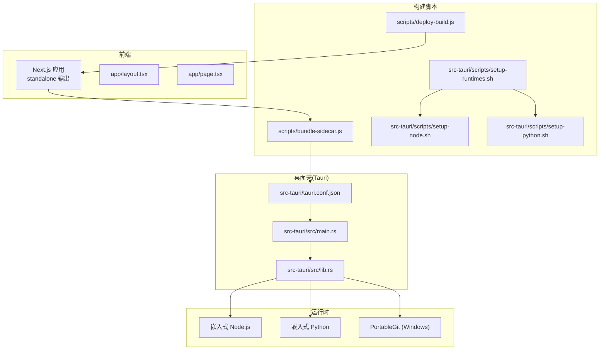
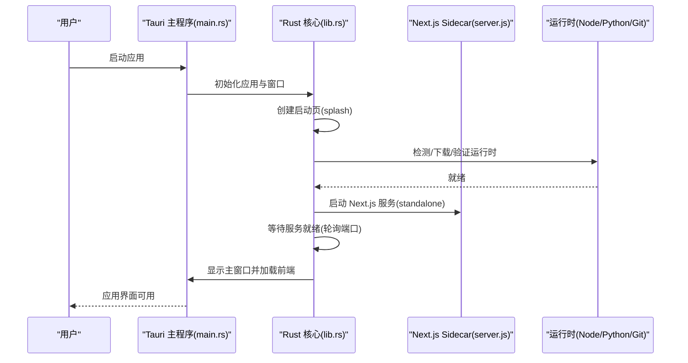
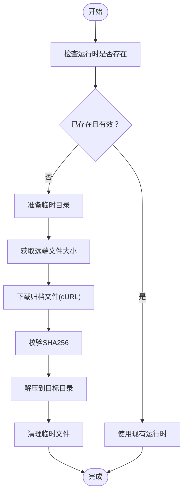
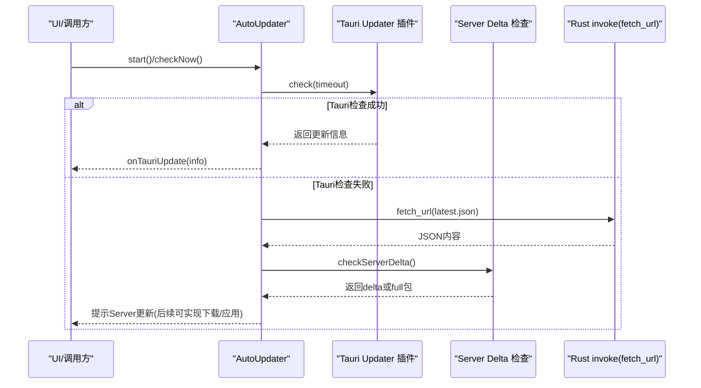
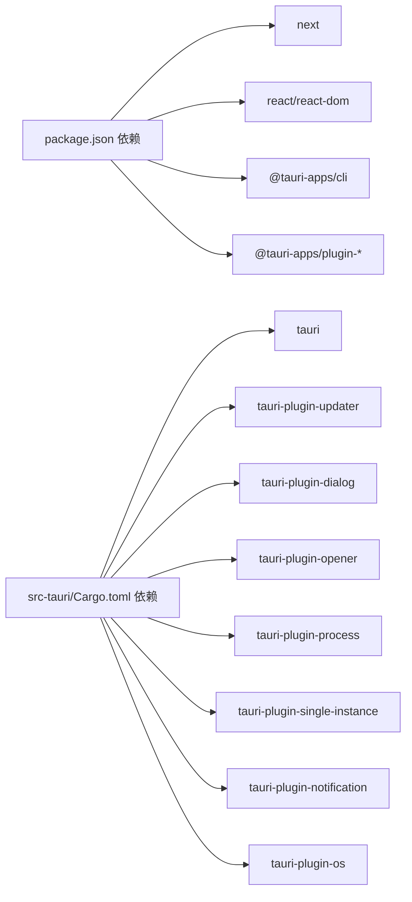

# 故障排除与常见问题

<cite>
**本文引用的文件**
- [package.json](file://package.json)
- [next.config.ts](file://next.config.ts)
- [tauri.conf.json](file://src-tauri/tauri.conf.json)
- [Cargo.toml](file://src-tauri/Cargo.toml)
- [bundle-sidecar.js](file://scripts/bundle-sidecar.js)
- [deploy-build.js](file://scripts/deploy-build.js)
- [setup-node.sh](file://src-tauri/scripts/setup-node.sh)
- [setup-python.sh](file://src-tauri/scripts/setup-python.sh)
- [setup-runtimes.sh](file://src-tauri/scripts/setup-runtimes.sh)
- [lib/updater.ts](file://lib/updater.ts)
- [lib/tauri.ts](file://lib/tauri.ts)
- [src-tauri/src/main.rs](file://src-tauri/src/main.rs)
- [src-tauri/src/lib.rs](file://src-tauri/src/lib.rs)
- [app/layout.tsx](file://app/layout.tsx)
- [app/page.tsx](file://app/page.tsx)
</cite>

## 目录
1. [简介](#简介)
2. [项目结构](#项目结构)
3. [核心组件](#核心组件)
4. [架构总览](#架构总览)
5. [详细组件分析](#详细组件分析)
6. [依赖关系分析](#依赖关系分析)
7. [性能考虑](#性能考虑)
8. [故障排除指南](#故障排除指南)
9. [结论](#结论)
10. [附录](#附录)

## 简介
本指南面向SSTS项目的开发者与运维人员，聚焦于开发、构建与运行阶段的常见问题与解决方案，涵盖环境配置、编译错误、运行时异常、性能问题、日志分析、调试工具使用、问题定位技巧、安全注意事项、兼容性与已知限制。文档以“自助排查”为核心，配合可视化图示帮助快速定位与修复问题。

## 项目结构
SSTS采用“Next.js前端 + Tauri桌面壳 + Node/Python嵌入式运行时”的混合架构：
- 前端：Next.js（输出为standalone模式），通过Tauri注入的sidecar运行。
- 桌面壳：Tauri负责窗口、托盘、系统集成与运行时管理。
- 运行时：Node.js、Python、Git（Windows含PortableGit）由脚本自动下载并精简至应用数据目录。
- 构建链路：Next.js构建产物经脚本打包到src-tauri/server/，随Tauri一起发布；同时提供独立部署包脚本。

图表来源
- [next.config.ts:1-8](file://next.config.ts#L1-L8)
- [tauri.conf.json:1-64](file://src-tauri/tauri.conf.json#L1-L64)
- [src-tauri/src/main.rs:1-7](file://src-tauri/src/main.rs#L1-L7)
- [src-tauri/src/lib.rs:1-800](file://src-tauri/src/lib.rs#L1-L800)
- [scripts/bundle-sidecar.js:1-19](file://scripts/bundle-sidecar.js#L1-L19)
- [scripts/deploy-build.js:1-80](file://scripts/deploy-build.js#L1-L80)
- [src-tauri/scripts/setup-node.sh:1-173](file://src-tauri/scripts/setup-node.sh#L1-L173)
- [src-tauri/scripts/setup-python.sh:1-181](file://src-tauri/scripts/setup-python.sh#L1-L181)
- [src-tauri/scripts/setup-runtimes.sh:1-38](file://src-tauri/scripts/setup-runtimes.sh#L1-L38)

章节来源
- [package.json:1-42](file://package.json#L1-L42)
- [next.config.ts:1-8](file://next.config.ts#L1-L8)
- [tauri.conf.json:1-64](file://src-tauri/tauri.conf.json#L1-L64)
- [src-tauri/Cargo.toml:1-28](file://src-tauri/Cargo.toml#L1-L28)

## 核心组件
- 构建与打包
  - Next.js standalone输出与sidecar组装：通过脚本将构建产物复制到Tauri资源目录，随桌面壳发布。
  - 独立部署包：生成可直接部署到任意Node.js服务器的tar.gz包，包含启动脚本与环境变量说明。
- 运行时管理
  - Node.js/Python/Git自动发现与下载：根据平台与架构选择镜像，校验SHA256，精简体积，并在启动页反馈进度。
  - 启动日志：统一写入应用数据目录下的启动日志文件，便于排障。
- 自动更新
  - Tauri全量更新：通过插件检查版本并下载安装。
  - Server热更新：基于增量补丁或全量包进行服务端更新，支持多平台键匹配与重试策略。
- 系统集成
  - 文件打开/目录选择/资源定位：通过Tauri插件与系统原生能力交互。

章节来源
- [scripts/bundle-sidecar.js:1-19](file://scripts/bundle-sidecar.js#L1-L19)
- [scripts/deploy-build.js:1-80](file://scripts/deploy-build.js#L1-L80)
- [src-tauri/src/lib.rs:188-208](file://src-tauri/src/lib.rs#L188-L208)
- [src-tauri/src/lib.rs:652-800](file://src-tauri/src/lib.rs#L652-L800)
- [lib/updater.ts:143-200](file://lib/updater.ts#L143-L200)
- [lib/updater.ts:259-315](file://lib/updater.ts#L259-L315)
- [lib/tauri.ts:1-49](file://lib/tauri.ts#L1-L49)

## 架构总览
SSTS的运行时架构分为三层：前端层（Next.js）、桌面壳层（Tauri）与运行时层（Node/Python/Git）。启动流程由Tauri主程序触发，先创建启动页窗口，随后检测并准备运行时，最后启动Next.js sidecar服务并在主窗口显示。

图表来源
- [src-tauri/src/main.rs:1-7](file://src-tauri/src/main.rs#L1-L7)
- [src-tauri/src/lib.rs:37-77](file://src-tauri/src/lib.rs#L37-L77)
- [src-tauri/src/lib.rs:196-208](file://src-tauri/src/lib.rs#L196-L208)
- [tauri.conf.json:6-11](file://src-tauri/tauri.conf.json#L6-L11)
- [next.config.ts:3-5](file://next.config.ts#L3-L5)

## 详细组件分析

### 组件A：运行时管理与下载流程
运行时管理负责Node.js、Python与Git的发现、下载、校验与解压。流程包括：检测现有运行时、校验有效性、下载与解压、进度反馈、错误处理与清理。

图表来源
- [src-tauri/src/lib.rs:652-800](file://src-tauri/src/lib.rs#L652-L800)
- [src-tauri/scripts/setup-node.sh:75-109](file://src-tauri/scripts/setup-node.sh#L75-L109)
- [src-tauri/scripts/setup-python.sh:89-111](file://src-tauri/scripts/setup-python.sh#L89-L111)

章节来源
- [src-tauri/src/lib.rs:247-295](file://src-tauri/src/lib.rs#L247-L295)
- [src-tauri/src/lib.rs:652-800](file://src-tauri/src/lib.rs#L652-L800)
- [src-tauri/scripts/setup-node.sh:1-173](file://src-tauri/scripts/setup-node.sh#L1-L173)
- [src-tauri/scripts/setup-python.sh:1-181](file://src-tauri/scripts/setup-python.sh#L1-L181)

### 组件B：自动更新流程（Tauri全量 + Server热更新）
自动更新包含两部分：Tauri全量更新与Server热更新。前者通过插件检查版本并下载安装；后者通过远程JSON匹配平台键，选择增量补丁或全量包。

图表来源
- [lib/updater.ts:326-384](file://lib/updater.ts#L326-L384)
- [lib/updater.ts:143-200](file://lib/updater.ts#L143-L200)
- [lib/updater.ts:259-315](file://lib/updater.ts#L259-L315)
- [src-tauri/src/lib.rs:108-116](file://src-tauri/src/lib.rs#L108-L116)

章节来源
- [lib/updater.ts:1-385](file://lib/updater.ts#L1-L385)
- [src-tauri/src/lib.rs:108-116](file://src-tauri/src/lib.rs#L108-L116)

### 组件C：构建与部署脚本
- bundle-sidecar.js：构建Next.js standalone并组装到src-tauri/server/，供Tauri生产模式作为sidecar运行。
- deploy-build.js：构建standalone并打包为独立部署包，生成start.sh与环境变量说明，支持tar.gz分发。

章节来源
- [scripts/bundle-sidecar.js:1-19](file://scripts/bundle-sidecar.js#L1-L19)
- [scripts/deploy-build.js:1-80](file://scripts/deploy-build.js#L1-L80)

## 依赖关系分析
- 前端依赖：Next.js、React、TailwindCSS、TypeScript等。
- 桌面壳依赖：Tauri核心与多个插件（opener、dialog、os、process、updater等）。
- 构建与脚本：Node生态工具链、cURL、压缩/解压工具。
- 运行时：Node.js、Python、Git（Windows PortableGit）。

图表来源
- [package.json:16-40](file://package.json#L16-L40)
- [src-tauri/Cargo.toml:14-28](file://src-tauri/Cargo.toml#L14-L28)

章节来源
- [package.json:1-42](file://package.json#L1-42)
- [src-tauri/Cargo.toml:1-28](file://src-tauri/Cargo.toml#L1-L28)

## 性能考虑
- 启动性能
  - 运行时下载与解压：建议在离线或内网环境下预先下载并缓存，减少启动等待。
  - 端口探测：启动页会轮询端口，若网络延迟高可适当放宽等待阈值。
- 构建性能
  - standalone输出：确保Node版本与依赖稳定，避免重复安装与重建。
  - 独立部署包：合理设置环境变量（如SSTS_DATA_DIR）以减少IO争用。
- 运行时体积
  - Node/Python精简：移除docs、man、test等冗余目录，仅保留必要模块与pip包。

章节来源
- [src-tauri/src/lib.rs:196-208](file://src-tauri/src/lib.rs#L196-L208)
- [src-tauri/scripts/setup-node.sh:127-144](file://src-tauri/scripts/setup-node.sh#L127-L144)
- [src-tauri/scripts/setup-python.sh:118-141](file://src-tauri/scripts/setup-python.sh#L118-L141)

## 故障排除指南

### 一、环境配置问题
- Node.js版本不匹配
  - 现象：启动页提示Node版本不符或验证失败。
  - 排查：确认应用期望的Node版本与系统/嵌入式版本一致；检查PATH顺序与Windows Store跳板。
  - 处理：使用脚本重新下载嵌入式Node，或调整系统PATH优先使用期望版本。
- Python不可用或版本不符
  - 现象：Python验证失败或导入第三方包异常。
  - 排查：确认非Windows Store跳板路径；检查嵌入式Python的site-packages是否被正确安装。
  - 处理：重新执行嵌入式Python构建脚本，确保pip包安装成功。
- Git缺失（Windows）
  - 现象：缺少bash.exe或PortableGit不完整。
  - 排查：确认PortableGit包含cmd/git.exe与bin/bash.exe。
  - 处理：删除旧布局后重新下载PortableGit。

章节来源
- [src-tauri/src/lib.rs:415-440](file://src-tauri/src/lib.rs#L415-L440)
- [src-tauri/src/lib.rs:510-523](file://src-tauri/src/lib.rs#L510-L523)
- [src-tauri/src/lib.rs:674-690](file://src-tauri/src/lib.rs#L674-L690)
- [src-tauri/scripts/setup-node.sh:146-159](file://src-tauri/scripts/setup-node.sh#L146-L159)
- [src-tauri/scripts/setup-python.sh:143-173](file://src-tauri/scripts/setup-python.sh#L143-L173)

### 二、编译与构建错误
- Next.js构建失败
  - 现象：构建报错或产物缺失。
  - 排查：检查TypeScript配置、Tailwind配置与依赖版本；确认standalone输出路径。
  - 处理：清理缓存后重试；核对脚本是否正确复制到server目录。
- Tauri构建失败
  - 现象：CLI或Rust编译报错。
  - 排查：确认Tauri CLI版本与配置；检查capabilities与插件启用情况。
  - 处理：升级CLI与依赖；核对tauri.conf.json中的beforeBuildCommand与devUrl。
- 独立部署包生成失败
  - 现象：打包tar.gz失败或缺少启动脚本。
  - 排查：确认standalone已生成；检查DEPLOY_DIR与start.sh生成逻辑。
  - 处理：手动执行脚本并查看错误输出；修正环境变量与权限。

章节来源
- [next.config.ts:3-5](file://next.config.ts#L3-L5)
- [tauri.conf.json:6-11](file://src-tauri/tauri.conf.json#L6-L11)
- [scripts/deploy-build.js:31-56](file://scripts/deploy-build.js#L31-L56)

### 三、运行时异常
- 启动页卡住或长时间等待
  - 现象：启动页进度停滞或超时。
  - 排查：检查网络代理、防火墙与cURL可用性；查看启动日志。
  - 处理：配置代理环境变量；更换国内镜像源；延长等待阈值。
- 服务端未就绪
  - 现象：主窗口无法加载或404。
  - 排查：确认server.js存在且可执行；检查端口占用与绑定地址。
  - 处理：手动启动server.js验证；修改端口或绑定地址。

章节来源
- [src-tauri/src/lib.rs:196-208](file://src-tauri/src/lib.rs#L196-L208)
- [src-tauri/src/lib.rs:603-622](file://src-tauri/src/lib.rs#L603-L622)
- [package.json:14](file://package.json#L14)

### 四、性能问题
- 启动缓慢
  - 现象：下载运行时耗时长。
  - 排查：网络质量与代理；磁盘IO；并发下载。
  - 处理：离线缓存运行时；优化代理；降低并发。
- 内存占用高
  - 现象：Node/Python进程内存持续增长。
  - 排查：检查业务逻辑与第三方包；监控GC行为。
  - 处理：优化算法；升级依赖；限制并发任务。

章节来源
- [src-tauri/scripts/setup-node.sh:75-109](file://src-tauri/scripts/setup-node.sh#L75-L109)
- [src-tauri/scripts/setup-python.sh:89-111](file://src-tauri/scripts/setup-python.sh#L89-L111)

### 五、日志分析与调试
- 启动日志
  - 路径：应用数据目录下的启动日志文件，包含时间戳与关键事件。
  - 分析：关注运行时下载/解压、端口探测、错误提示等。
- 控制台与浏览器
  - 前端：打开开发者工具查看Network与Console。
  - 桌面壳：通过Tauri Devtools或日志输出定位Rust侧问题。
- 环境变量
  - 独立部署：PORT、HOSTNAME、SSTS_DATA_DIR；确保权限与路径正确。

章节来源
- [src-tauri/src/lib.rs:121-154](file://src-tauri/src/lib.rs#L121-L154)
- [scripts/deploy-build.js:16-20](file://scripts/deploy-build.js#L16-L20)
- [package.json:14](file://package.json#L14)

### 六、安全注意事项
- 运行时校验
  - Node/Python下载后进行SHA256校验，避免篡改风险。
- 代理与证书
  - cURL支持代理透传；Windows下跳过证书吊销检查以规避CRL不可达问题。
- 权限与隔离
  - 仅在Tauri环境中启用系统集成能力；避免在浏览器中误用。

章节来源
- [src-tauri/src/lib.rs:624-650](file://src-tauri/src/lib.rs#L624-L650)
- [src-tauri/src/lib.rs:603-622](file://src-tauri/src/lib.rs#L603-L622)

### 七、兼容性与已知限制
- 平台差异
  - Windows：需要PortableGit含bash.exe；Node/Python路径扫描包含nvm与Store跳板过滤。
  - macOS/Linux：系统路径优先，Homebrew与系统包管理器安装更常见。
- 插件与能力
  - 需启用相应Tauri插件与capabilities；确保签名与权限配置正确。
- 更新通道
  - Tauri全量更新与Server热更新并行存在时，需协调版本与依赖。

章节来源
- [src-tauri/src/lib.rs:332-394](file://src-tauri/src/lib.rs#L332-L394)
- [src-tauri/src/lib.rs:442-508](file://src-tauri/src/lib.rs#L442-L508)
- [src-tauri/tauri.conf.json:54-62](file://src-tauri/tauri.conf.json#L54-L62)

## 结论
通过梳理SSTS的构建链路、运行时管理与自动更新机制，结合日志与脚本工具，可以系统化地定位与解决开发、构建与运行过程中的问题。建议在团队内建立标准化的环境准备、构建与发布流程，并定期维护运行时镜像与依赖版本，以提升稳定性与可维护性。

## 附录

### A. 常用命令速查
- 开发模式：启动Next.js与Tauri
  - [package.json:5-14](file://package.json#L5-L14)
- 构建与打包
  - [package.json:7](file://package.json#L7)
  - [scripts/bundle-sidecar.js:14-15](file://scripts/bundle-sidecar.js#L14-L15)
  - [scripts/deploy-build.js:32-35](file://scripts/deploy-build.js#L32-L35)
- 运行时准备
  - [src-tauri/scripts/setup-runtimes.sh:22-29](file://src-tauri/scripts/setup-runtimes.sh#L22-L29)
  - [src-tauri/scripts/setup-node.sh:54-61](file://src-tauri/scripts/setup-node.sh#L54-L61)
  - [src-tauri/scripts/setup-python.sh:55-62](file://src-tauri/scripts/setup-python.sh#L55-L62)

### B. 关键配置参考
- Next.js standalone输出
  - [next.config.ts:3-5](file://next.config.ts#L3-L5)
- Tauri构建与窗口配置
  - [tauri.conf.json:6-28](file://src-tauri/tauri.conf.json#L6-L28)
- Rust依赖与插件
  - [src-tauri/Cargo.toml:14-28](file://src-tauri/Cargo.toml#L14-L28)