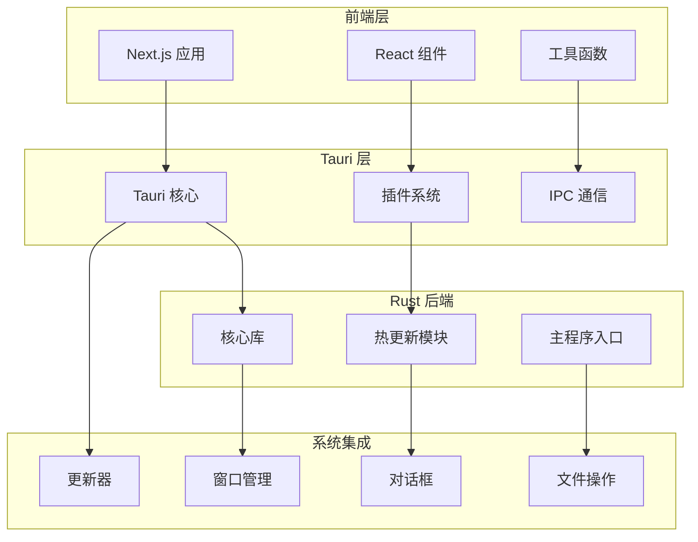
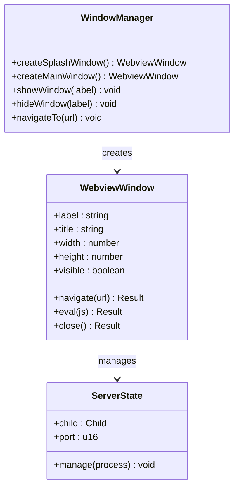
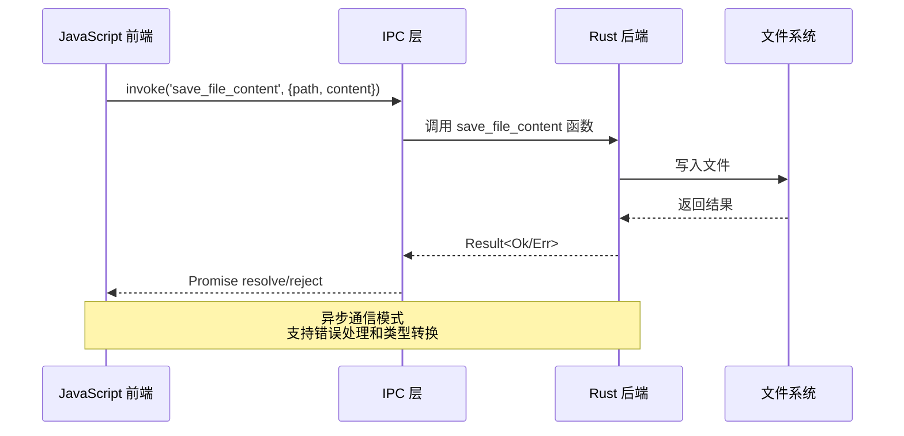
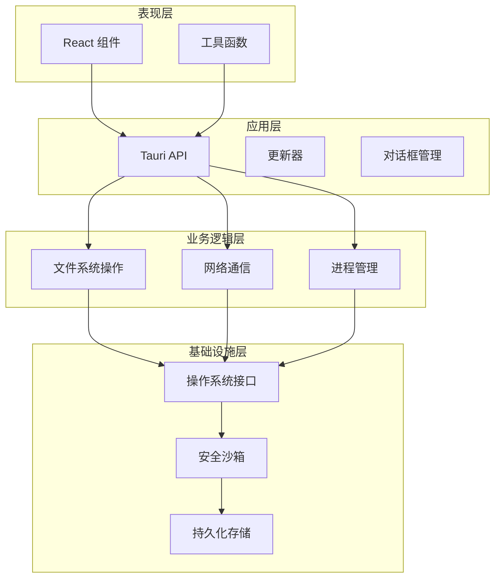
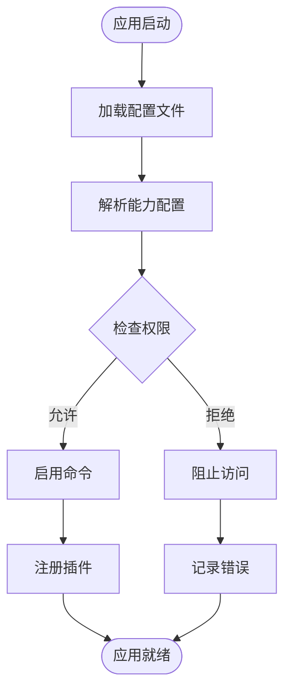
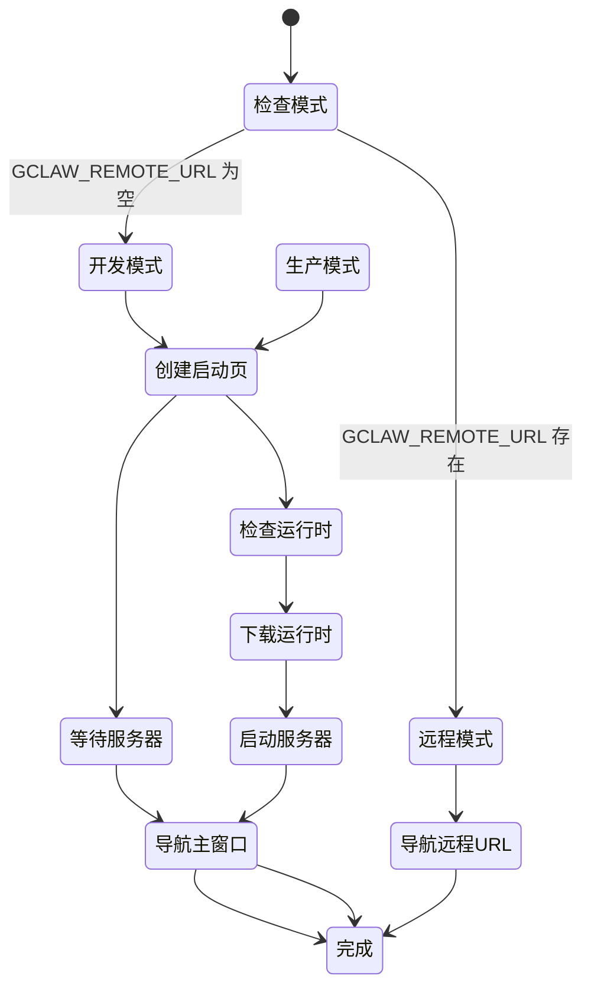
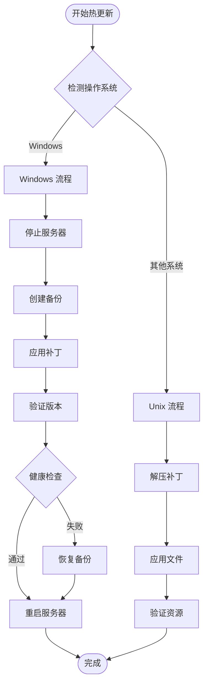
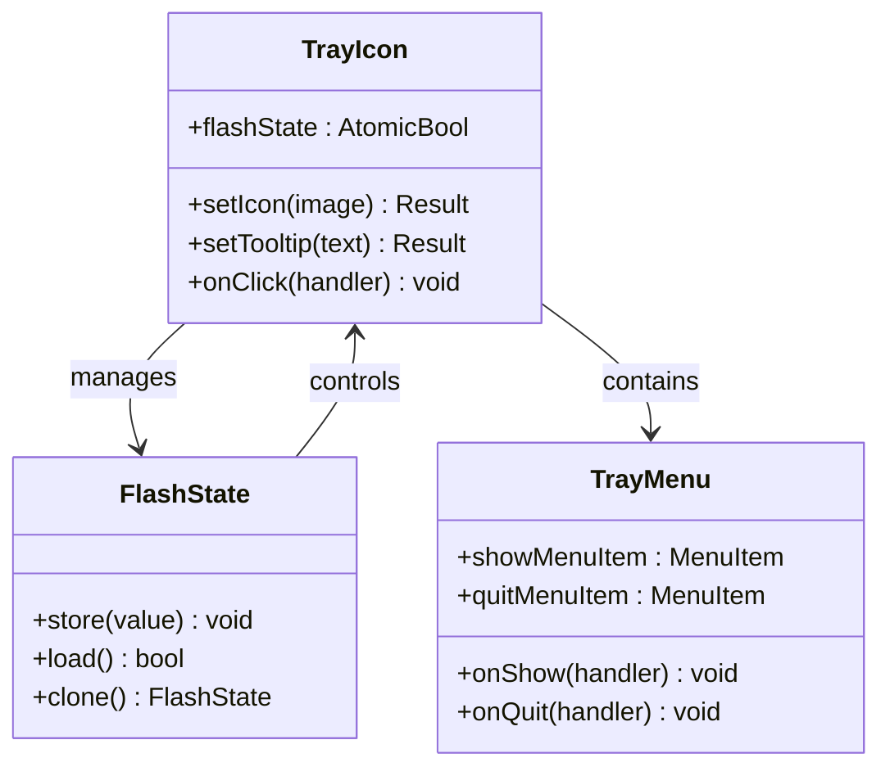
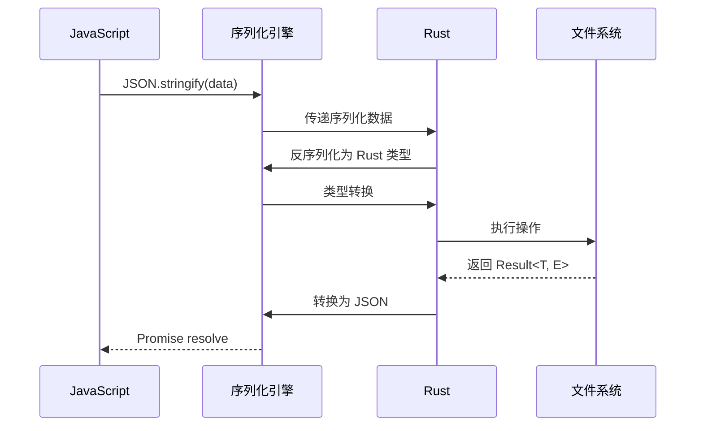
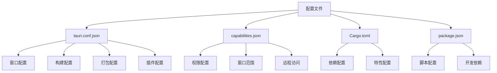

# Tauri框架集成

<cite>
**本文档引用的文件**
- [src-tauri/src/lib.rs](file://src-tauri/src/lib.rs)
- [src-tauri/src/main.rs](file://src-tauri/src/main.rs)
- [src-tauri/src/delta.rs](file://src-tauri/src/delta.rs)
- [src-tauri/tauri.conf.json](file://src-tauri/tauri.conf.json)
- [src-tauri/Cargo.toml](file://src-tauri/Cargo.toml)
- [src-tauri/capabilities/default.json](file://src-tauri/capabilities/default.json)
- [src-tauri/splash.html](file://src-tauri/splash.html)
- [lib/tauri.ts](file://lib/tauri.ts)
- [lib/updater.ts](file://lib/updater.ts)
- [package.json](file://package.json)
</cite>

## 目录
1. [项目概述](#项目概述)
2. [项目结构](#项目结构)
3. [核心组件](#核心组件)
4. [架构概览](#架构概览)
5. [详细组件分析](#详细组件分析)
6. [依赖关系分析](#依赖关系分析)
7. [性能考虑](#性能考虑)
8. [故障排除指南](#故障排除指南)
9. [结论](#结论)

## 项目概述

SSTS项目是一个基于Tauri v2框架开发的桌面应用程序，集成了Next.js前端框架和Rust后端。该项目实现了完整的桌面应用功能，包括原生窗口管理、系统集成功能、热更新机制和安全沙箱控制。

项目采用混合架构设计，前端使用React和Next.js构建现代化用户界面，后端使用Rust语言实现高性能的系统集成和原生功能。通过Tauri v2的IPC机制实现前后端通信，提供接近原生应用的用户体验。

## 项目结构

项目采用模块化组织方式，主要分为以下几个核心部分：



**图表来源**
- [src-tauri/src/lib.rs:1-1585](file://src-tauri/src/lib.rs#L1-L1585)
- [src-tauri/src/main.rs:1-7](file://src-tauri/src/main.rs#L1-L7)
- [src-tauri/src/delta.rs:1-793](file://src-tauri/src/delta.rs#L1-L793)

**章节来源**
- [src-tauri/src/lib.rs:1-1585](file://src-tauri/src/lib.rs#L1-L1585)
- [src-tauri/src/main.rs:1-7](file://src-tauri/src/main.rs#L1-L7)
- [src-tauri/Cargo.toml:1-28](file://src-tauri/Cargo.toml#L1-L28)

## 核心组件

### Tauri v2 核心架构

Tauri v2作为底层框架提供了以下核心功能：

- **原生窗口管理**：支持多窗口、自定义窗口属性和窗口事件处理
- **系统集成功能**：通过插件系统提供文件系统访问、对话框、通知等功能
- **安全沙箱机制**：基于能力系统的权限控制和访问隔离
- **进程间通信(IPC)**：双向通信机制，支持命令注册和参数传递

### 窗口管理系统

项目实现了双窗口架构，包括启动页窗口和主应用窗口：



**图表来源**
- [src-tauri/src/lib.rs:37-77](file://src-tauri/src/lib.rs#L37-L77)
- [src-tauri/src/lib.rs:10-14](file://src-tauri/src/lib.rs#L10-L14)

### IPC 通信机制

Tauri v2提供了强大的IPC通信能力，支持命令注册、参数传递和返回值处理：



**图表来源**
- [src-tauri/src/lib.rs:1111-1118](file://src-tauri/src/lib.rs#L1111-L1118)
- [lib/tauri.ts:9-20](file://lib/tauri.ts#L9-L20)

**章节来源**
- [src-tauri/src/lib.rs:1109-1161](file://src-tauri/src/lib.rs#L1109-L1161)
- [lib/tauri.ts:1-49](file://lib/tauri.ts#L1-L49)

## 架构概览

### 整体架构设计

项目采用分层架构设计，确保各层职责清晰分离：



**图表来源**
- [src-tauri/src/lib.rs:1314-1482](file://src-tauri/src/lib.rs#L1314-L1482)
- [src-tauri/Cargo.toml:14-28](file://src-tauri/Cargo.toml#L14-L28)

### 安全沙箱机制

Tauri v2的安全沙箱通过能力系统实现细粒度的权限控制：



**图表来源**
- [src-tauri/capabilities/default.json:1-29](file://src-tauri/capabilities/default.json#L1-L29)
- [src-tauri/src/lib.rs:1448-1453](file://src-tauri/src/lib.rs#L1448-L1453)

**章节来源**
- [src-tauri/capabilities/default.json:1-29](file://src-tauri/capabilities/default.json#L1-L29)
- [src-tauri/src/lib.rs:1354-1445](file://src-tauri/src/lib.rs#L1354-L1445)

## 详细组件分析

### 启动流程管理

项目实现了复杂的启动流程管理，包括启动页、运行时检查和服务器启动：



**图表来源**
- [src-tauri/src/lib.rs:1394-1441](file://src-tauri/src/lib.rs#L1394-L1441)
- [src-tauri/src/lib.rs:1164-1275](file://src-tauri/src/lib.rs#L1164-L1275)

### 热更新系统

项目实现了完整的热更新机制，支持增量更新和全量替换：



**图表来源**
- [src-tauri/src/delta.rs:182-228](file://src-tauri/src/delta.rs#L182-L228)
- [src-tauri/src/delta.rs:305-443](file://src-tauri/src/delta.rs#L305-L443)

**章节来源**
- [src-tauri/src/delta.rs:1-793](file://src-tauri/src/delta.rs#L1-L793)

### 系统托盘集成

项目实现了系统托盘功能，提供图标闪烁和菜单交互：



**图表来源**
- [src-tauri/src/lib.rs:1489-1584](file://src-tauri/src/lib.rs#L1489-L1584)

**章节来源**
- [src-tauri/src/lib.rs:1484-1584](file://src-tauri/src/lib.rs#L1484-L1584)

### 类型转换和错误处理

项目实现了完善的类型转换和错误处理机制：



**图表来源**
- [src-tauri/src/lib.rs:1111-1118](file://src-tauri/src/lib.rs#L1111-L1118)
- [src-tauri/src/delta.rs:72-79](file://src-tauri/src/delta.rs#L72-L79)

**章节来源**
- [src-tauri/src/lib.rs:1109-1161](file://src-tauri/src/lib.rs#L1109-L1161)
- [src-tauri/src/delta.rs:131-144](file://src-tauri/src/delta.rs#L131-L144)

## 依赖关系分析

### 核心依赖关系

项目的主要依赖关系如下：

```mermaid
graph TB
subgraph "核心框架"
Tauri[tauri v2]
TauriBuild[tauri-build]
end
subgraph "系统插件"
Dialog[tauri-plugin-dialog]
Opener[tauri-plugin-opener]
Updater[tauri-plugin-updater]
Process[tauri-plugin-process]
SingleInstance[tauri-plugin-single-instance]
Notification[tauri-plugin-notification]
OS[tauri-plugin-os]
end
subgraph "数据处理"
Serde[serde]
SerdeJSON[serde_json]
SHA2[sha2]
Tar[tar]
Flate2[flate2]
end
subgraph "前端集成"
TauriAPI[@tauri-apps/api]
TauriCLI[@tauri-apps/cli]
end
Tauri --> Dialog
Tauri --> Opener
Tauri --> Updater
Tauri --> Process
Tauri --> SingleInstance
Tauri --> Notification
Tauri --> OS
Tauri --> Serde
Tauri --> SerdeJSON
Tauri --> SHA2
Tauri --> Tar
Tauri --> Flate2
TauriAPI --> Tauri
TauriCLI --> TauriBuild
```

**图表来源**
- [src-tauri/Cargo.toml:14-28](file://src-tauri/Cargo.toml#L14-L28)
- [package.json:16-40](file://package.json#L16-L40)

### 配置文件解析

项目使用多种配置文件来管理不同层面的设置：



**图表来源**
- [src-tauri/tauri.conf.json:1-60](file://src-tauri/tauri.conf.json#L1-L60)
- [src-tauri/capabilities/default.json:1-29](file://src-tauri/capabilities/default.json#L1-L29)
- [src-tauri/Cargo.toml:1-28](file://src-tauri/Cargo.toml#L1-L28)
- [package.json:1-42](file://package.json#L1-L42)

**章节来源**
- [src-tauri/tauri.conf.json:1-60](file://src-tauri/tauri.conf.json#L1-L60)
- [src-tauri/capabilities/default.json:1-29](file://src-tauri/capabilities/default.json#L1-L29)
- [package.json:1-42](file://package.json#L1-L42)

## 性能考虑

### 启动性能优化

项目在启动性能方面采用了多项优化策略：

- **延迟加载**：启动页窗口延迟显示，避免黑屏闪烁
- **并行下载**：运行时组件下载采用并行策略
- **智能缓存**：检查已存在的运行时组件，避免重复下载
- **预热机制**：服务器启动前进行健康检查

### 内存管理

项目实现了高效的内存管理策略：

- **进程池管理**：服务器进程生命周期管理
- **资源清理**：补丁应用后的临时文件清理
- **状态管理**：使用原子操作管理托盘闪烁状态
- **文件句柄管理**：Windows平台特殊处理文件句柄释放

### 网络性能

网络通信方面采用了优化措施：

- **代理支持**：透传系统代理环境变量
- **超时控制**：下载操作设置合理的超时时间
- **进度反馈**：实时更新下载进度和速度
- **错误重试**：网络异常时的自动重试机制

## 故障排除指南

### 常见问题诊断

#### 启动失败问题

当应用启动失败时，可以按照以下步骤进行诊断：

1. **检查运行时环境**：确认Node.js、Python、Git是否正确安装
2. **查看启动日志**：检查`gclaw-startup.log`文件获取详细错误信息
3. **验证网络连接**：确认能够访问下载源和更新服务器
4. **检查磁盘空间**：确保有足够的磁盘空间进行运行时下载

#### IPC通信问题

如果遇到IPC通信问题：

1. **检查能力配置**：确认相关权限已在`capabilities.json`中声明
2. **验证命令注册**：确认命令已在`invoke_handler`中注册
3. **检查参数类型**：确保传递的参数类型与Rust函数签名匹配
4. **查看错误日志**：检查控制台输出的详细错误信息

#### 热更新失败

热更新失败时的处理流程：

1. **自动回滚**：失败时自动恢复到备份版本
2. **健康检查**：重启后进行服务器健康检查
3. **日志分析**：查看`gclaw-startup.log`中的详细错误信息
4. **手动修复**：必要时手动删除损坏的文件并重新启动

**章节来源**
- [src-tauri/src/lib.rs:1164-1275](file://src-tauri/src/lib.rs#L1164-L1275)
- [src-tauri/src/delta.rs:347-443](file://src-tauri/src/delta.rs#L347-L443)

### 调试技巧

#### 开发模式调试

在开发模式下可以使用以下调试技巧：

- **启用开发者工具**：自动打开WebView开发者工具
- **远程调试**：通过`GCLAW_REMOTE_URL`环境变量连接远程调试服务器
- **详细日志**：查看启动日志获取详细的执行信息
- **断点调试**：在Rust代码中设置断点进行调试

#### 生产模式监控

生产模式下的监控方法：

- **日志文件**：定期检查`gclaw-startup.log`文件
- **性能指标**：监控服务器响应时间和内存使用情况
- **错误报告**：收集用户报告的错误信息
- **自动更新**：利用内置更新器进行问题修复

## 结论

SSTS项目展示了Tauri v2框架的强大功能和灵活性。通过精心设计的架构，项目成功实现了：

1. **完整的桌面应用功能**：包括原生窗口管理、系统集成功能和热更新机制
2. **强大的安全控制**：基于能力系统的权限管理和访问隔离
3. **高效的IPC通信**：双向通信机制支持命令注册和参数传递
4. **优秀的性能表现**：通过多种优化策略确保应用的响应性和稳定性

项目的技术实现为类似桌面应用开发提供了宝贵的参考，特别是在Tauri框架集成、热更新系统设计和安全沙箱控制等方面。通过合理的设计和实现，SSTS项目成功地将Web技术与原生应用功能相结合，为用户提供了优质的桌面应用体验。