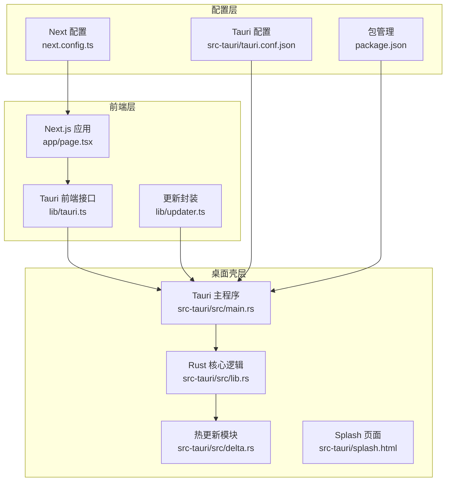
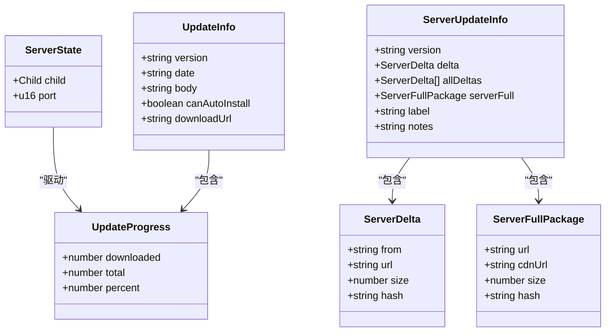
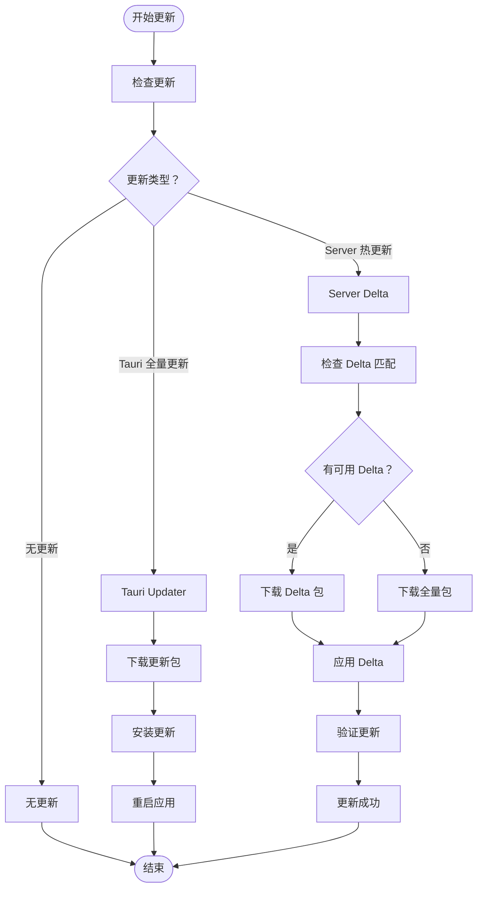
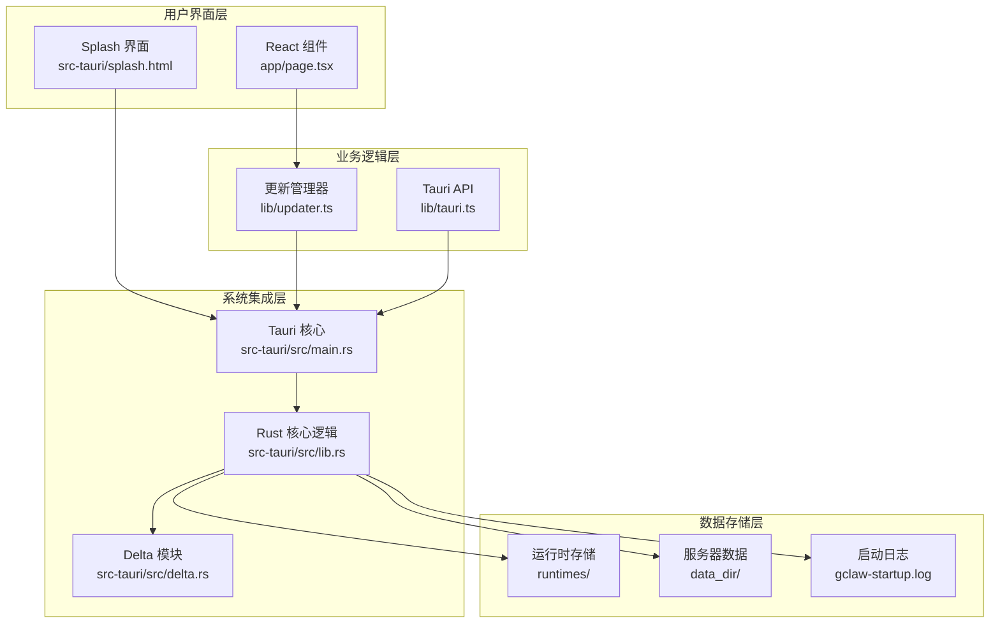
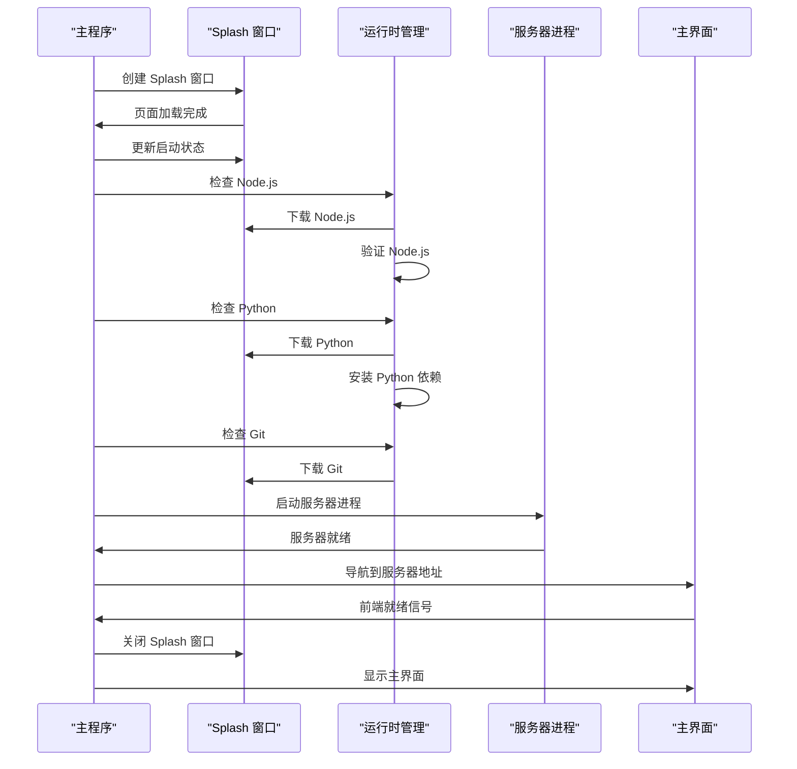
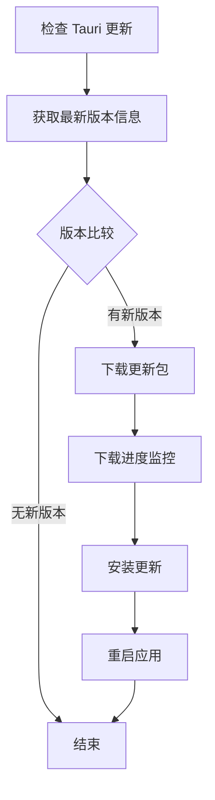
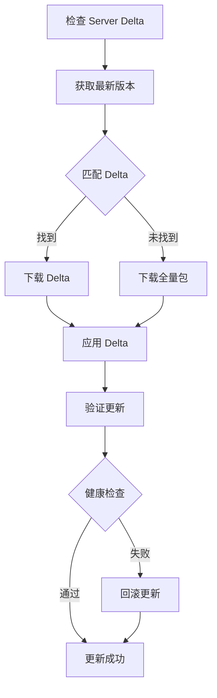
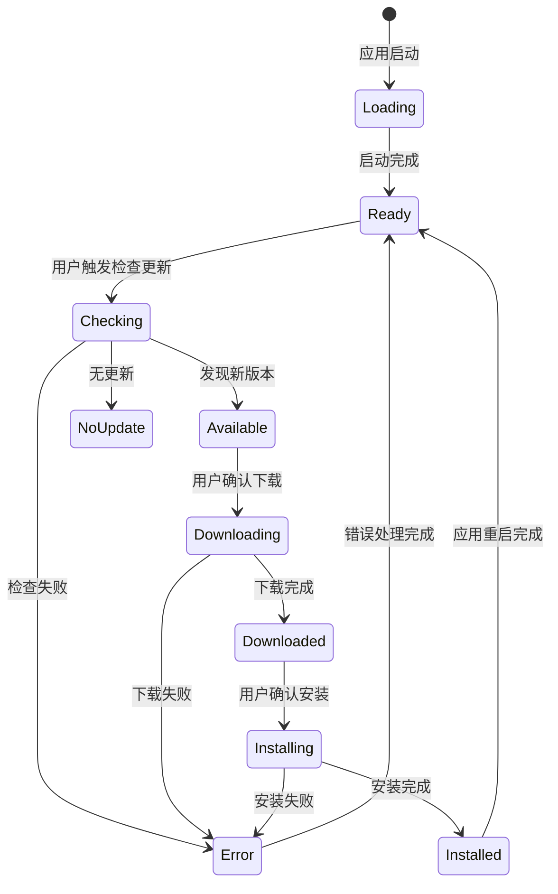
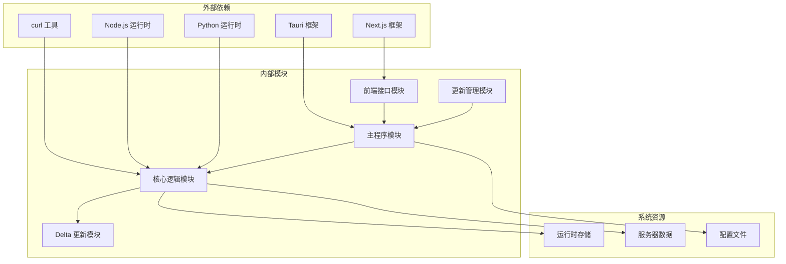

# 数据流设计

<cite>
**本文档引用的文件**
- [src-tauri/src/main.rs](file://src-tauri/src/main.rs)
- [src-tauri/src/lib.rs](file://src-tauri/src/lib.rs)
- [src-tauri/src/delta.rs](file://src-tauri/src/delta.rs)
- [lib/updater.ts](file://lib/updater.ts)
- [lib/tauri.ts](file://lib/tauri.ts)
- [app/page.tsx](file://app/page.tsx)
- [src-tauri/splash.html](file://src-tauri/splash.html)
- [src-tauri/tauri.conf.json](file://src-tauri/tauri.conf.json)
- [package.json](file://package.json)
- [next.config.ts](file://next.config.ts)
</cite>

## 目录
1. [简介](#简介)
2. [项目结构](#项目结构)
3. [核心组件](#核心组件)
4. [架构概览](#架构概览)
5. [详细组件分析](#详细组件分析)
6. [依赖关系分析](#依赖关系分析)
7. [性能考虑](#性能考虑)
8. [故障排除指南](#故障排除指南)
9. [结论](#结论)

## 简介

SSTS（侧滑测试系统）是一个基于 Tauri + Next.js 的桌面应用程序，采用混合架构设计。该项目的核心特点是实现了双通道更新机制：Tauri 全量更新和 Server 热更新。本文档详细分析了应用中的主要数据流向，包括启动流程、更新流程和用户交互流程，并深入解释了关键数据模型的流转机制。

## 项目结构

SSTS 项目采用前后端分离的混合架构，主要分为以下层次：

**图表来源**
- [src-tauri/src/main.rs:1-7](file://src-tauri/src/main.rs#L1-L7)
- [src-tauri/src/lib.rs:1300-1482](file://src-tauri/src/lib.rs#L1300-L1482)
- [lib/updater.ts:1-385](file://lib/updater.ts#L1-L385)

**章节来源**
- [src-tauri/src/main.rs:1-7](file://src-tauri/src/main.rs#L1-L7)
- [src-tauri/src/lib.rs:1300-1482](file://src-tauri/src/lib.rs#L1300-L1482)
- [package.json:1-42](file://package.json#L1-L42)

## 核心组件

### 数据模型架构

SSTS 项目中的关键数据模型形成了清晰的数据流架构：

**图表来源**
- [src-tauri/src/lib.rs:10-14](file://src-tauri/src/lib.rs#L10-L14)
- [lib/updater.ts:12-29](file://lib/updater.ts#L12-L29)
- [lib/updater.ts:41-68](file://lib/updater.ts#L41-L68)

### 更新流程数据流

项目实现了三种主要的更新流程，每种都有独特的数据流特征：

**图表来源**
- [lib/updater.ts:143-200](file://lib/updater.ts#L143-L200)
- [lib/updater.ts:259-315](file://lib/updater.ts#L259-L315)
- [src-tauri/src/delta.rs:182-228](file://src-tauri/src/delta.rs#L182-L228)

**章节来源**
- [lib/updater.ts:12-68](file://lib/updater.ts#L12-L68)
- [src-tauri/src/delta.rs:146-156](file://src-tauri/src/delta.rs#L146-L156)

## 架构概览

SSTS 采用了分层架构设计，确保了良好的数据隔离和处理效率：

**图表来源**
- [src-tauri/src/main.rs:4-6](file://src-tauri/src/main.rs#L4-L6)
- [src-tauri/src/lib.rs:247-254](file://src-tauri/src/lib.rs#L247-L254)
- [src-tauri/src/delta.rs:15-18](file://src-tauri/src/delta.rs#L15-L18)

## 详细组件分析

### 启动流程数据流

启动流程是 SSTS 的核心数据流，涉及多个组件间的协调工作：

**图表来源**
- [src-tauri/src/lib.rs:1164-1275](file://src-tauri/src/lib.rs#L1164-L1275)
- [src-tauri/src/lib.rs:1346-1353](file://src-tauri/src/lib.rs#L1346-L1353)
- [src-tauri/splash.html:305-335](file://src-tauri/splash.html#L305-L335)

启动流程的关键数据模型流转：

1. **ServerState 初始化**：应用启动时创建 ServerState 结构体，包含子进程句柄和端口号
2. **运行时检查**：系统检查 Node.js、Python、Git 的可用性，必要时下载并验证
3. **服务器启动**：启动 Node.js 服务器进程，设置环境变量和路径
4. **前端导航**：将主窗口导航到服务器地址，实现无缝过渡

**章节来源**
- [src-tauri/src/lib.rs:1164-1275](file://src-tauri/src/lib.rs#L1164-L1275)
- [src-tauri/src/lib.rs:1346-1353](file://src-tauri/src/lib.rs#L1346-L1353)

### 更新流程数据流

SSTS 实现了双通道更新机制，确保不同场景下的最优体验：

#### Tauri 全量更新流程

**图表来源**
- [lib/updater.ts:143-200](file://lib/updater.ts#L143-L200)
- [lib/updater.ts:206-245](file://lib/updater.ts#L206-L245)

#### Server 热更新流程

**图表来源**
- [lib/updater.ts:259-315](file://lib/updater.ts#L259-L315)
- [src-tauri/src/delta.rs:182-228](file://src-tauri/src/delta.rs#L182-L228)

**章节来源**
- [lib/updater.ts:143-385](file://lib/updater.ts#L143-L385)
- [src-tauri/src/delta.rs:182-443](file://src-tauri/src/delta.rs#L182-L443)

### 用户交互流程

用户交互流程体现了应用的响应式设计：

**图表来源**
- [lib/updater.ts:319-384](file://lib/updater.ts#L319-L384)
- [lib/updater.ts:206-245](file://lib/updater.ts#L206-L245)

## 依赖关系分析

SSTS 项目中的组件依赖关系体现了清晰的分层架构：

**图表来源**
- [package.json:16-27](file://package.json#L16-L27)
- [src-tauri/tauri.conf.json:50-58](file://src-tauri/tauri.conf.json#L50-L58)

**章节来源**
- [package.json:16-42](file://package.json#L16-L42)
- [src-tauri/tauri.conf.json:50-58](file://src-tauri/tauri.conf.json#L50-L58)

## 性能考虑

### 缓存策略

SSTS 实现了多层次的缓存机制以优化性能：

1. **运行时缓存**：Node.js、Python、Git 运行时下载后缓存在本地目录
2. **更新缓存**：最近检查的更新信息缓存，避免重复网络请求
3. **文件哈希缓存**：补丁文件的 SHA-256 哈希值缓存，加速验证过程

### 数据持久化

应用采用以下持久化策略：

- **启动日志**：详细的启动过程记录，便于调试和问题追踪
- **运行时状态**：ServerState 结构体保存服务器进程状态
- **用户偏好**：通过全局配置文件存储用户设置

### 性能优化

- **异步处理**：所有网络操作和文件处理都是异步的
- **超时控制**：网络请求设置了合理的超时时间
- **资源清理**：及时清理临时文件和不再使用的资源

## 故障排除指南

### 常见问题及解决方案

| 问题类型 | 症状 | 可能原因 | 解决方案 |
|---------|------|----------|----------|
| 启动失败 | 应用无法启动 | 缺少运行时依赖 | 检查 Node.js、Python、Git 是否正确安装 |
| 更新失败 | 更新过程中断 | 网络连接问题 | 检查网络连接，重试更新 |
| 服务器无响应 | 页面无法加载 | 服务器启动失败 | 查看启动日志，重新启动应用 |
| 热更新失败 | 服务器崩溃 | 补丁应用失败 | 系统自动回滚到上一个稳定版本 |

### 调试数据流

应用提供了丰富的调试信息：

1. **启动日志**：记录完整的启动过程，包括每个步骤的耗时
2. **更新日志**：详细记录更新过程中的每个步骤
3. **错误报告**：捕获并记录所有异常情况

**章节来源**
- [src-tauri/src/lib.rs:133-154](file://src-tauri/src/lib.rs#L133-L154)
- [src-tauri/src/delta.rs:15-29](file://src-tauri/src/delta.rs#L15-L29)

## 结论

SSTS 项目展现了优秀的数据流设计实践，通过清晰的分层架构和完善的错误处理机制，实现了可靠的桌面应用更新和运行时管理。项目的主要优势包括：

1. **双通道更新机制**：同时支持 Tauri 全量更新和 Server 热更新，满足不同场景需求
2. **健壮的错误处理**：完整的回滚机制确保系统稳定性
3. **透明的数据流**：清晰的组件间通信和数据传递
4. **可扩展的架构**：模块化的设计便于功能扩展和维护

通过深入分析这些数据流设计，开发者可以更好地理解和维护这个复杂的桌面应用程序，同时为未来的功能扩展奠定坚实基础。