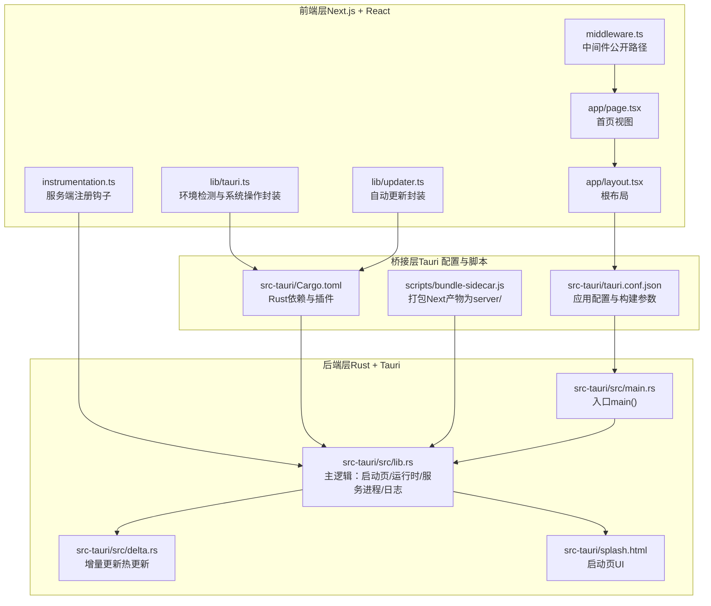
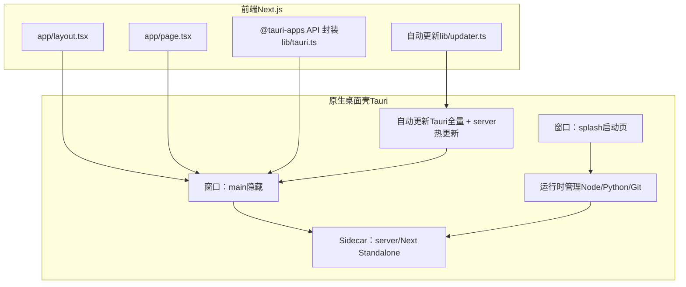
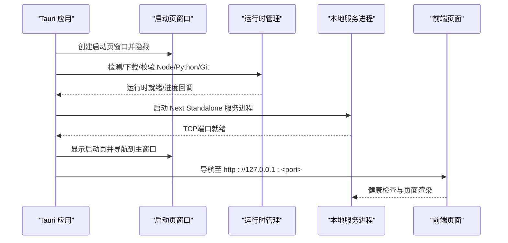
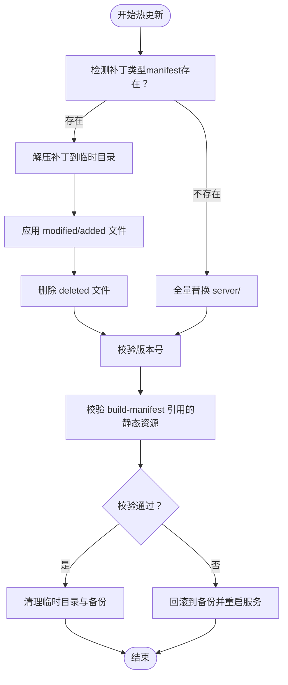
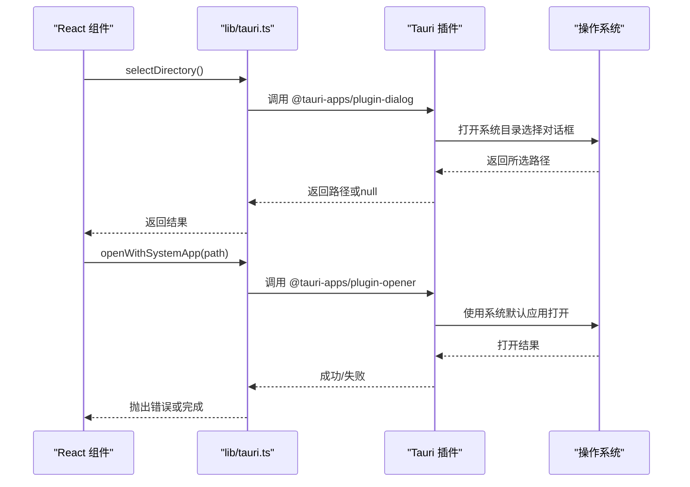
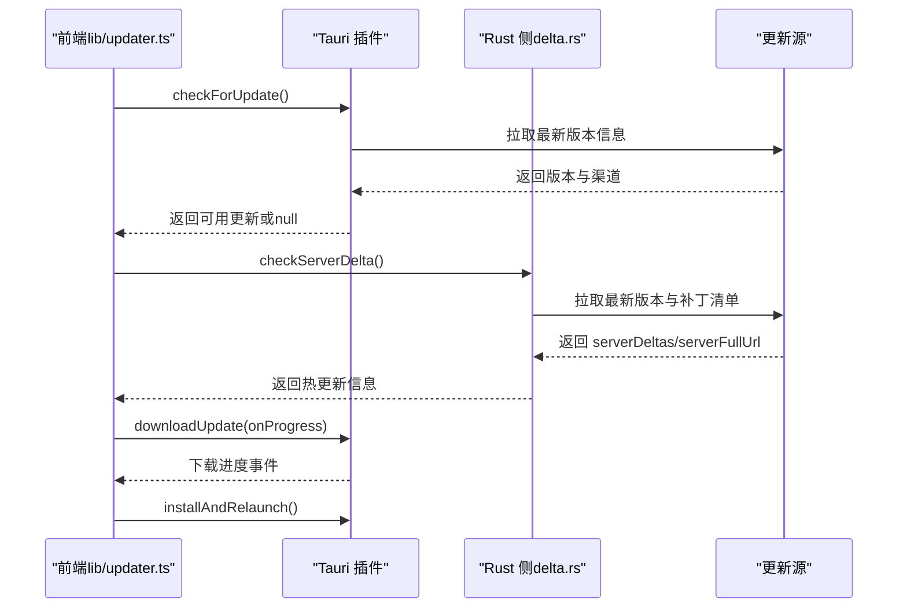
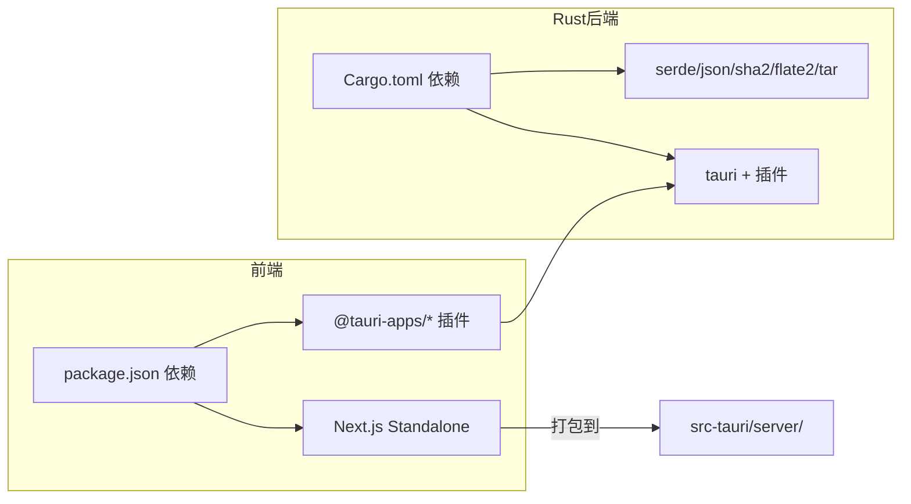

# 整体架构概览

<cite>
**本文引用的文件**   
- [package.json](file://package.json)
- [next.config.ts](file://next.config.ts)
- [app/layout.tsx](file://app/layout.tsx)
- [app/page.tsx](file://app/page.tsx)
- [lib/tauri.ts](file://lib/tauri.ts)
- [lib/updater.ts](file://lib/updater.ts)
- [src-tauri/Cargo.toml](file://src-tauri/Cargo.toml)
- [src-tauri/tauri.conf.json](file://src-tauri/tauri.conf.json)
- [src-tauri/src/main.rs](file://src-tauri/src/main.rs)
- [src-tauri/src/lib.rs](file://src-tauri/src/lib.rs)
- [src-tauri/src/delta.rs](file://src-tauri/src/delta.rs)
- [src-tauri/splash.html](file://src-tauri/splash.html)
- [scripts/bundle-sidecar.js](file://scripts/bundle-sidecar.js)
- [middleware.ts](file://middleware.ts)
- [instrumentation.ts](file://instrumentation.ts)
</cite>

## 目录
1. [引言](#引言)
2. [项目结构](#项目结构)
3. [核心组件](#核心组件)
4. [架构总览](#架构总览)
5. [详细组件分析](#详细组件分析)
6. [依赖分析](#依赖分析)
7. [性能考量](#性能考量)
8. [故障排查指南](#故障排查指南)
9. [结论](#结论)
10. [附录](#附录)

## 引言
本文件面向SSTS项目的整体架构概览，重点阐述“双层架构”（Rust后端 + React前端）的设计理念与实现方式，并深入解析Tauri如何作为桥梁连接原生桌面应用与Web技术。文档从系统边界、组件职责、数据流与控制流出发，结合架构图与组件关系图，完整呈现从启动到运行的端到端流程；同时给出技术选型原因与架构决策的权衡考虑，帮助读者快速理解并高效参与开发。

## 项目结构
SSTS采用前后端分离的双层架构：
- 前端层：基于Next.js的React应用，负责UI与交互。
- 后端层：基于Tauri的Rust应用，负责系统集成、运行时管理、自动更新与增量热更新等原生能力。
- 桥接层：Tauri配置与插件，将前端页面嵌入到原生窗口中，并暴露Rust能力给前端调用。

**图表来源**
- [package.json:1-42](file://package.json#L1-L42)
- [next.config.ts:1-8](file://next.config.ts#L1-L8)
- [app/layout.tsx:1-25](file://app/layout.tsx#L1-L25)
- [app/page.tsx:1-17](file://app/page.tsx#L1-L17)
- [lib/tauri.ts:1-49](file://lib/tauri.ts#L1-L49)
- [lib/updater.ts:1-385](file://lib/updater.ts#L1-L385)
- [src-tauri/Cargo.toml:1-28](file://src-tauri/Cargo.toml#L1-L28)
- [src-tauri/tauri.conf.json:1-64](file://src-tauri/tauri.conf.json#L1-L64)
- [src-tauri/src/main.rs:1-7](file://src-tauri/src/main.rs#L1-L7)
- [src-tauri/src/lib.rs:1-800](file://src-tauri/src/lib.rs#L1-L800)
- [src-tauri/src/delta.rs:1-793](file://src-tauri/src/delta.rs#L1-L793)
- [src-tauri/splash.html:1-338](file://src-tauri/splash.html#L1-L338)
- [scripts/bundle-sidecar.js:1-19](file://scripts/bundle-sidecar.js#L1-L19)
- [middleware.ts:1-37](file://middleware.ts#L1-L37)
- [instrumentation.ts:1-11](file://instrumentation.ts#L1-L11)

**章节来源**
- [package.json:1-42](file://package.json#L1-L42)
- [next.config.ts:1-8](file://next.config.ts#L1-L8)
- [src-tauri/tauri.conf.json:1-64](file://src-tauri/tauri.conf.json#L1-L64)
- [scripts/bundle-sidecar.js:1-19](file://scripts/bundle-sidecar.js#L1-L19)

## 核心组件
- 前端应用（Next.js + React）
  - 根布局与页面组织：app/layout.tsx、app/page.tsx
  - 环境检测与系统操作封装：lib/tauri.ts（目录选择、系统应用打开、Finder定位等）
  - 自动更新封装：lib/updater.ts（Tauri全量更新 + server热更新）
  - 中间件：middleware.ts（公开路径与静态资源放行）
  - 服务端注册：instrumentation.ts（Node运行时注册钩子）

- Tauri桥接层
  - 应用配置：src-tauri/tauri.conf.json（开发URL、打包资源、插件、安全策略）
  - Rust依赖：src-tauri/Cargo.toml（tauri及各类插件）
  - 构建脚本：scripts/bundle-sidecar.js（将Next Standalone产物打包为server/供Rust侧运行）

- Rust后端（Tauri主逻辑）
  - 入口：src-tauri/src/main.rs
  - 主逻辑：src-tauri/src/lib.rs（启动页、运行时管理、服务进程、日志、网络工具）
  - 增量更新：src-tauri/src/delta.rs（文件级补丁、全量替换、健康检查、回滚）
  - 启动页：src-tauri/splash.html（主题、进度、错误提示与重试）

**章节来源**
- [app/layout.tsx:1-25](file://app/layout.tsx#L1-L25)
- [app/page.tsx:1-17](file://app/page.tsx#L1-L17)
- [lib/tauri.ts:1-49](file://lib/tauri.ts#L1-L49)
- [lib/updater.ts:1-385](file://lib/updater.ts#L1-L385)
- [middleware.ts:1-37](file://middleware.ts#L1-L37)
- [instrumentation.ts:1-11](file://instrumentation.ts#L1-L11)
- [src-tauri/tauri.conf.json:1-64](file://src-tauri/tauri.conf.json#L1-L64)
- [src-tauri/Cargo.toml:1-28](file://src-tauri/Cargo.toml#L1-L28)
- [scripts/bundle-sidecar.js:1-19](file://scripts/bundle-sidecar.js#L1-L19)
- [src-tauri/src/main.rs:1-7](file://src-tauri/src/main.rs#L1-L7)
- [src-tauri/src/lib.rs:1-800](file://src-tauri/src/lib.rs#L1-L800)
- [src-tauri/src/delta.rs:1-793](file://src-tauri/src/delta.rs#L1-L793)
- [src-tauri/splash.html:1-338](file://src-tauri/splash.html#L1-L338)

## 架构总览
SSTS采用“双层架构 + Tauri桥接”的混合方案：
- 前端层使用Next.js构建，输出Standalone模式，便于以sidecar方式嵌入到原生应用中运行。
- 后端层使用Rust + Tauri，负责：
  - 管理运行时（Node/Python/Git）并提供下载与校验；
  - 启动/监控本地服务进程并与前端通信；
  - 提供自动更新能力（Tauri全量更新 + server热更新）；
  - 提供启动页与错误处理体验。
- Tauri通过配置将前端页面嵌入到原生窗口中，前端通过@tauri-apps API与Rust侧交互。

**图表来源**
- [src-tauri/tauri.conf.json:1-64](file://src-tauri/tauri.conf.json#L1-L64)
- [src-tauri/src/lib.rs:1-800](file://src-tauri/src/lib.rs#L1-L800)
- [src-tauri/src/delta.rs:1-793](file://src-tauri/src/delta.rs#L1-L793)
- [lib/tauri.ts:1-49](file://lib/tauri.ts#L1-L49)
- [lib/updater.ts:1-385](file://lib/updater.ts#L1-L385)
- [app/layout.tsx:1-25](file://app/layout.tsx#L1-L25)
- [app/page.tsx:1-17](file://app/page.tsx#L1-L17)

## 详细组件分析

### 组件A：启动与运行时管理（Rust主逻辑）
职责：
- 创建并控制启动页窗口，动态更新状态与进度；
- 管理运行时（Node/Python/Git）下载、校验与路径查找；
- 启动/监控本地服务进程（Next Standalone），等待就绪；
- 提供日志与错误上报，支持重试机制。

**图表来源**
- [src-tauri/src/lib.rs:1-800](file://src-tauri/src/lib.rs#L1-L800)
- [src-tauri/splash.html:1-338](file://src-tauri/splash.html#L1-L338)

**章节来源**
- [src-tauri/src/lib.rs:1-800](file://src-tauri/src/lib.rs#L1-L800)
- [src-tauri/splash.html:1-338](file://src-tauri/splash.html#L1-L338)

### 组件B：增量热更新（Delta）
职责：
- 通过文件级补丁或全量替换更新server/目录；
- 在Windows上执行严格的备份/回滚与健康检查；
- 向前端广播进度事件，支持重启服务或整应用重启。

**图表来源**
- [src-tauri/src/delta.rs:1-793](file://src-tauri/src/delta.rs#L1-L793)

**章节来源**
- [src-tauri/src/delta.rs:1-793](file://src-tauri/src/delta.rs#L1-L793)

### 组件C：前端与Tauri交互（环境检测与系统操作）
职责：
- 检测是否处于Tauri桌面模式；
- 封装系统对话框与文件系统操作（目录选择、打开文件、Finder定位）；
- 通过@tauri-apps API与Rust侧通信（如fetch_url、restart_server等）。

**图表来源**
- [lib/tauri.ts:1-49](file://lib/tauri.ts#L1-L49)
- [src-tauri/Cargo.toml:1-28](file://src-tauri/Cargo.toml#L1-L28)

**章节来源**
- [lib/tauri.ts:1-49](file://lib/tauri.ts#L1-L49)
- [src-tauri/Cargo.toml:1-28](file://src-tauri/Cargo.toml#L1-L28)

### 组件D：自动更新（Tauri全量 + Server热更新）
职责：
- 优先检查Tauri全量更新（通过tauri-plugin-updater）；
- 若无可用全量更新，则检查server热更新（delta）；
- 支持进度回调、错误处理与手动下载回退。

**图表来源**
- [lib/updater.ts:1-385](file://lib/updater.ts#L1-L385)
- [src-tauri/src/delta.rs:1-793](file://src-tauri/src/delta.rs#L1-L793)
- [src-tauri/tauri.conf.json:54-62](file://src-tauri/tauri.conf.json#L54-L62)

**章节来源**
- [lib/updater.ts:1-385](file://lib/updater.ts#L1-L385)
- [src-tauri/src/delta.rs:1-793](file://src-tauri/src/delta.rs#L1-L793)
- [src-tauri/tauri.conf.json:54-62](file://src-tauri/tauri.conf.json#L54-L62)

## 依赖分析
- 前端依赖
  - Next.js（Standalone输出）、React、TailwindCSS、Zustand（状态管理）等。
  - @tauri-apps相关插件（dialog、opener、os、process、updater）。
- Rust后端依赖
  - tauri及其插件（opener、dialog、updater、process、single-instance、notification、os）。
  - serde/serde_json、sha2、flate2、tar等工具库。
- 构建与打包
  - scripts/bundle-sidecar.js将Next Standalone产物打包到src-tauri/server/，供Tauri运行。

**图表来源**
- [package.json:16-40](file://package.json#L16-L40)
- [src-tauri/Cargo.toml:14-28](file://src-tauri/Cargo.toml#L14-L28)
- [scripts/bundle-sidecar.js:1-19](file://scripts/bundle-sidecar.js#L1-19)

**章节来源**
- [package.json:16-40](file://package.json#L16-L40)
- [src-tauri/Cargo.toml:14-28](file://src-tauri/Cargo.toml#L14-L28)
- [scripts/bundle-sidecar.js:1-19](file://scripts/bundle-sidecar.js#L1-19)

## 性能考量
- 启动性能
  - 启动页异步加载与进度反馈，避免黑屏闪烁。
  - 运行时下载采用分块进度与速度估算，减少用户等待焦虑。
  - 服务进程启动采用TCP探测与超时控制，避免阻塞。
- 更新性能
  - server热更新采用文件级补丁，显著降低传输与部署成本。
  - Windows平台通过备份/回滚与健康检查确保稳定性，避免白屏。
- 资源占用
  - Next Standalone模式减少运行时依赖，提升启动速度与一致性。
  - Tauri窗口最小化资源占用，仅在需要时显示主窗口。

## 故障排查指南
- 启动页错误
  - 检查启动页UI与Rust侧状态同步（__splashUpdate）。
  - 若出现错误，可通过重试按钮触发重跑启动流程。
- 运行时缺失
  - 确认Node/Python/Git下载与校验流程是否成功。
  - 检查代理与网络环境，必要时更换国内镜像源。
- 热更新失败
  - Windows平台若补丁失败，系统会自动回滚并重启服务。
  - 检查补丁包完整性与build-manifest引用的静态资源是否存在。
- 自动更新异常
  - Tauri全量更新失败时，查看canAutoInstall与downloadUrl回退路径。
  - server热更新失败时，检查latest.json与serverDeltas配置。

**章节来源**
- [src-tauri/splash.html:305-335](file://src-tauri/splash.html#L305-L335)
- [src-tauri/src/lib.rs:652-800](file://src-tauri/src/lib.rs#L652-L800)
- [src-tauri/src/delta.rs:304-443](file://src-tauri/src/delta.rs#L304-L443)
- [lib/updater.ts:143-200](file://lib/updater.ts#L143-L200)

## 结论
SSTS通过“双层架构 + Tauri桥接”的设计，在保持Web开发体验的同时，充分利用原生桌面应用的能力（系统集成、自动更新、运行时管理）。该架构在易用性、可维护性与性能之间取得良好平衡：前端专注UI与交互，后端专注系统能力与稳定性，二者通过Tauri紧密协作，形成一致、可靠的用户体验。

## 附录
- 技术选型与权衡
  - 前端：Next.js（Standalone）兼顾开发效率与运行时一致性。
  - 后端：Rust + Tauri兼顾性能与跨平台原生能力。
  - 更新：双通道（Tauri全量 + server热更新）满足不同场景需求。
- 关键流程参考
  - 启动流程：启动页 → 运行时检测 → 服务进程启动 → 导航到主窗口。
  - 更新流程：检查更新 → 下载/应用补丁 → 健康检查/回滚 → 重启服务。