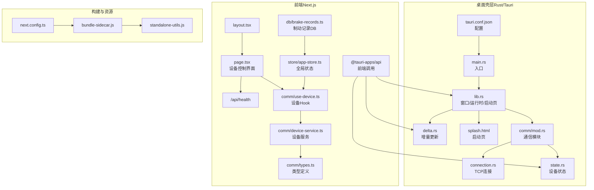
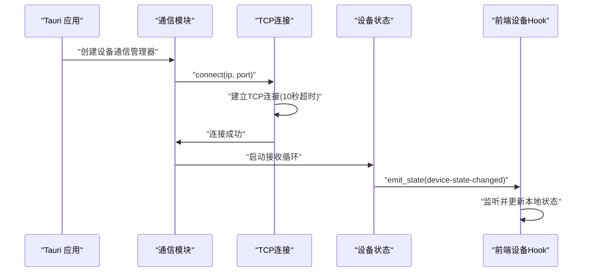
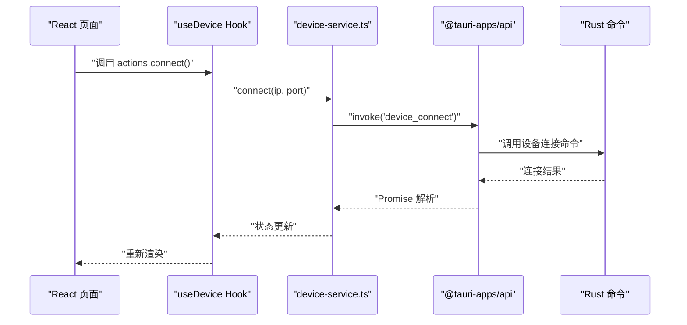
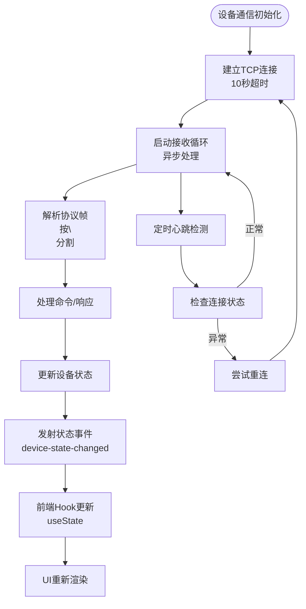
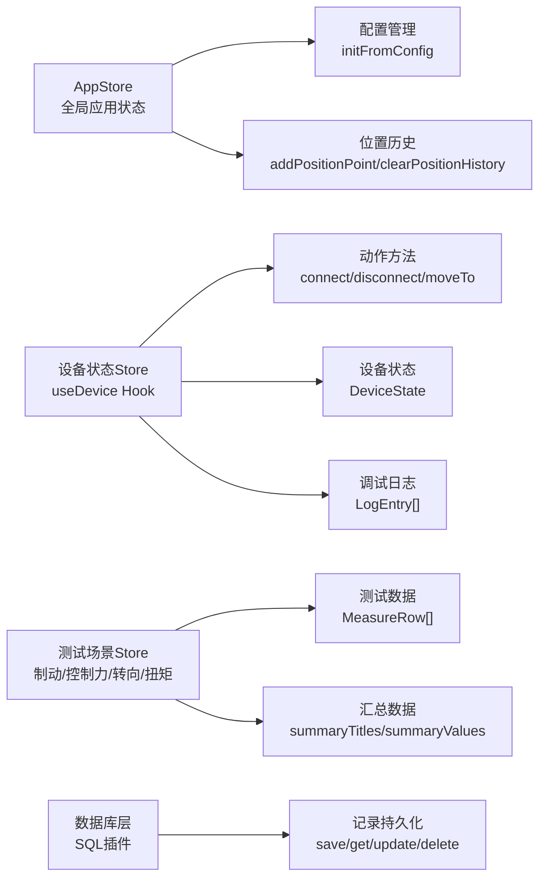
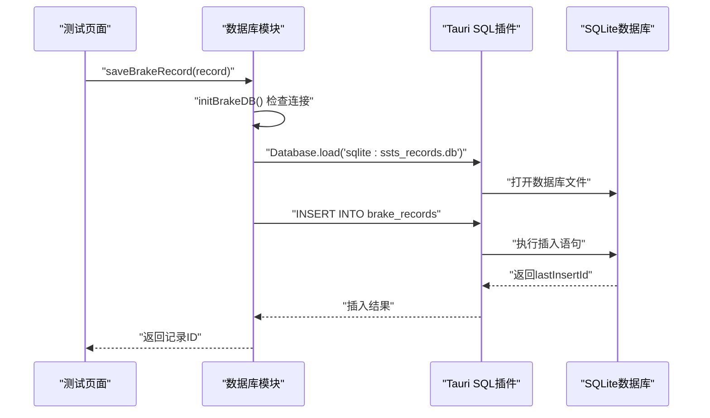
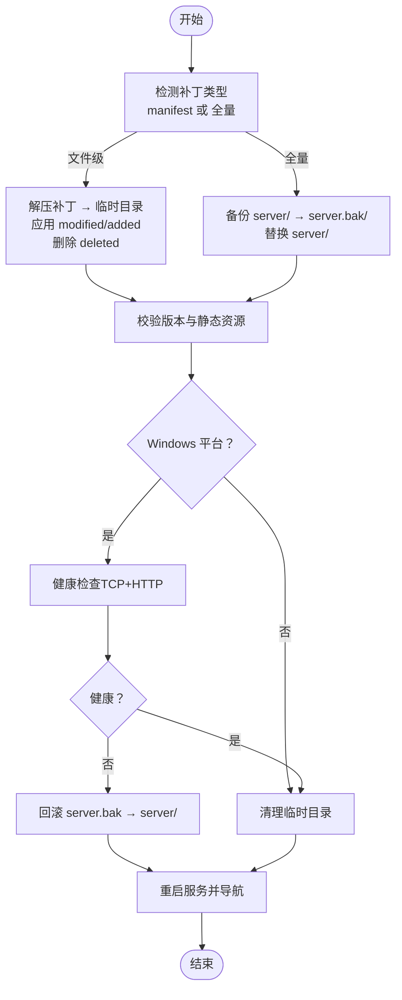
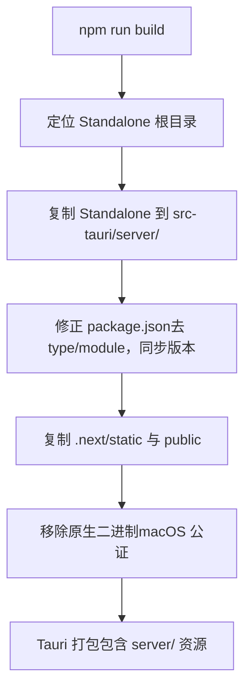
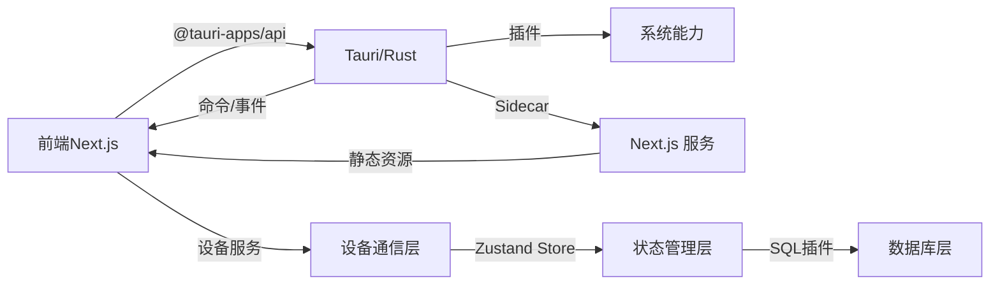

# 架构设计

<cite>
**本文引用的文件**
- [package.json](file://package.json)
- [next.config.ts](file://next.config.ts)
- [middleware.ts](file://middleware.ts)
- [app/layout.tsx](file://app/layout.tsx)
- [app/page.tsx](file://app/page.tsx)
- [app/api/health/route.ts](file://app/api/health/route.ts)
- [lib/tauri.ts](file://lib/tauri.ts)
- [lib/comm/types.ts](file://lib/comm/types.ts)
- [lib/comm/device-service.ts](file://lib/comm/device-service.ts)
- [lib/comm/use-device.ts](file://lib/comm/use-device.ts)
- [lib/store/app-store.ts](file://lib/store/app-store.ts)
- [lib/db/brake-records.ts](file://lib/db/brake-records.ts)
- [src-tauri/tauri.conf.json](file://src-tauri/tauri.conf.json)
- [src-tauri/Cargo.toml](file://src-tauri/Cargo.toml)
- [src-tauri/src/main.rs](file://src-tauri/src/main.rs)
- [src-tauri/src/lib.rs](file://src-tauri/src/lib.rs)
- [src-tauri/src/delta.rs](file://src-tauri/src/delta.rs)
- [src-tauri/src/comm/mod.rs](file://src-tauri/src/comm/mod.rs)
- [src-tauri/src/comm/connection.rs](file://src-tauri/src/comm/connection.rs)
- [src-tauri/src/comm/state.rs](file://src-tauri/src/comm/state.rs)
- [src-tauri/splash.html](file://src-tauri/splash.html)
- [scripts/bundle-sidecar.js](file://scripts/bundle-sidecar.js)
- [scripts/standalone-utils.js](file://scripts/standalone-utils.js)
</cite>

## 目录
1. [引言](#引言)
2. [项目结构](#项目结构)
3. [核心组件](#核心组件)
4. [架构总览](#架构总览)
5. [详细组件分析](#详细组件分析)
6. [依赖分析](#依赖分析)
7. [性能考量](#性能考量)
8. [故障排查指南](#故障排查指南)
9. [结论](#结论)
10. [附录](#附录)

## 引言
本架构设计文档面向 SSTS 项目，系统性阐述其"双层架构 + 插件化 + 事件驱动"的整体设计，以及 Rust 后端与 React 前端在 Tauri 框架下的职责分工与交互机制。重点覆盖以下方面：
- 架构模式与系统边界：双层（桌面壳层 + 内嵌 Web 服务）、插件化（Tauri 插件生态）、事件驱动（Rust 与前端通过 IPC 事件通信）。
- 技术栈与集成点：Next.js（前端）、Tauri（桌面壳层）、Rust（服务与工具链管理）、Node/Python/Git 运行时与增量更新（Delta）能力。
- IPC 与互操作：Rust 通过 Tauri 命令暴露接口，前端以 @tauri-apps/api 调用；同时通过自定义协议与 Webview 导航实现 UI 与服务的联动。
- 数据流与控制流：启动页（Splash）→ 运行时检测与下载 → 内嵌 Next.js 服务（Sidecar）→ 增量更新（Delta）→ 前端路由与 API。
- **新增** 设备通信层、状态管理、数据库集成等新架构组件的详细说明。

## 项目结构
SSTS 采用"前端工程 + 桌面壳层 + 构建脚本"三部分组织方式：
- 前端工程（app/）：基于 Next.js，提供页面与 API 路由。
- 桌面壳层（src-tauri/）：基于 Tauri，负责窗口管理、系统集成、运行时管理、增量更新等。
- 构建脚本（scripts/）：将 Next.js Standalone 产物打包为 Tauri Sidecar，并处理版本与资源复制。
- **新增** 通信库（lib/comm/）：提供设备通信抽象、状态管理 Hook 和服务封装。
- **新增** 状态管理（lib/store/）：基于 Zustand 的全局状态管理，支持多测试场景。
- **新增** 数据库（lib/db/）：基于 Tauri SQL 插件的本地数据库封装。

```mermaid
graph TB
subgraph "前端Next.js"
A["app/layout.tsx"]
B["app/page.tsx"]
C["app/api/health/route.ts"]
end
subgraph "通信库lib/comm"
D["types.ts<br/>设备状态类型"]
E["device-service.ts<br/>设备服务封装"]
F["use-device.ts<br/>设备状态Hook"]
G["scale-service.ts<br/>称重模块服务"]
H["use-scale.ts<br/>称重状态Hook"]
end
subgraph "状态管理lib/store"
I["app-store.ts<br/>应用全局状态"]
J["brake-store.ts<br/>制动测试状态"]
K["control-force-store.ts<br/>控制力测试状态"]
L["steering-store.ts<br/>转向测试状态"]
M["torque-store.ts<br/>扭矩测试状态"]
N["updater-store.ts<br/>更新状态"]
end
subgraph "数据库lib/db"
O["brake-records.ts<br/>制动记录DB"]
P["control-force-records.ts<br/>控制力记录DB"]
Q["steering-records.ts<br/>转向记录DB"]
R["torque-records.ts<br/>扭矩记录DB"]
end
subgraph "桌面壳层Tauri/Rust"
S["src-tauri/src/main.rs"]
T["src-tauri/src/lib.rs"]
U["src-tauri/src/delta.rs"]
V["src-tauri/tauri.conf.json"]
W["src-tauri/splash.html"]
X["src-tauri/src/comm/mod.rs<br/>通信模块"]
Y["src-tauri/src/comm/connection.rs<br/>TCP连接"]
Z["src-tauri/src/comm/state.rs<br/>设备状态"]
end
subgraph "构建与配置"
AA["package.json"]
BB["next.config.ts"]
CC["scripts/bundle-sidecar.js"]
DD["scripts/standalone-utils.js"]
end
A --> B
B --> C
AA --> BB
AA --> CC
CC --> DD
V --> S
S --> T
T --> U
T --> W
T --> X
X --> Y
X --> Z
D --> E --> F
I --> J --> K --> L --> M --> N
O --> P --> Q --> R
```

**图表来源**
- [app/layout.tsx:1-25](file://app/layout.tsx#L1-L25)
- [app/page.tsx:1-34](file://app/page.tsx#L1-L34)
- [app/api/health/route.ts:1-9](file://app/api/health/route.ts#L1-L9)
- [lib/comm/types.ts:1-142](file://lib/comm/types.ts#L1-L142)
- [lib/comm/device-service.ts:1-85](file://lib/comm/device-service.ts#L1-L85)
- [lib/comm/use-device.ts:1-117](file://lib/comm/use-device.ts#L1-L117)
- [lib/store/app-store.ts:1-59](file://lib/store/app-store.ts#L1-L59)
- [lib/db/brake-records.ts:1-87](file://lib/db/brake-records.ts#L1-L87)
- [src-tauri/src/comm/mod.rs:1-12](file://src-tauri/src/comm/mod.rs#L1-L12)
- [src-tauri/src/comm/connection.rs:1-155](file://src-tauri/src/comm/connection.rs#L1-L155)
- [src-tauri/src/comm/state.rs:427-460](file://src-tauri/src/comm/state.rs#L427-L460)

**章节来源**
- [package.json:1-42](file://package.json#L1-L42)
- [next.config.ts:1-8](file://next.config.ts#L1-L8)
- [scripts/bundle-sidecar.js:1-19](file://scripts/bundle-sidecar.js#L1-L19)
- [scripts/standalone-utils.js:1-212](file://scripts/standalone-utils.js#L1-L212)
- [src-tauri/tauri.conf.json:1-64](file://src-tauri/tauri.conf.json#L1-L64)
- [src-tauri/src/main.rs:1-7](file://src-tauri/src/main.rs#L1-L7)
- [src-tauri/src/lib.rs:1-800](file://src-tauri/src/lib.rs#L1-L800)
- [src-tauri/src/delta.rs:1-793](file://src-tauri/src/delta.rs#L1-L793)
- [src-tauri/splash.html:1-338](file://src-tauri/splash.html#L1-L338)

## 核心组件
- 桌面壳层（Tauri/Rust）
  - 启动与窗口管理：创建隐藏窗口、启动内嵌 Next.js 服务、健康检查与导航。
  - 运行时管理：Node/Python/Git 的检测、下载、校验与缓存。
  - 增量更新（Delta）：补丁应用、版本校验、备份与回滚、健康检查。
  - 启动页（Splash）：自定义协议加载内嵌 HTML，动态更新状态与进度。
  - **新增** 设备通信层：基于 TCP 的设备连接管理、协议解析、心跳维持、状态同步。
- 前端（Next.js）
  - 页面与布局：根布局、首页展示。
  - API 路由：健康检查接口。
  - Tauri 适配：环境检测与系统操作封装。
  - **新增** 设备通信：通过 useDevice Hook 管理设备连接、运动控制、IO 控制等。
  - **新增** 状态管理：使用 Zustand Store 管理全局状态和测试数据。
  - **新增** 数据持久化：通过 Tauri SQL 插件进行本地数据库操作。
- 构建与打包
  - Standalone 输出与 Sidecar 组装：将 Next.js 产物复制到 src-tauri/server/，同步版本与资源。
  - 配置与脚本：开发/构建/打包命令、资源打包策略。

**章节来源**
- [src-tauri/src/lib.rs:1-800](file://src-tauri/src/lib.rs#L1-L800)
- [src-tauri/src/delta.rs:1-793](file://src-tauri/src/delta.rs#L1-L793)
- [src-tauri/splash.html:1-338](file://src-tauri/splash.html#L1-L338)
- [app/layout.tsx:1-25](file://app/layout.tsx#L1-L25)
- [app/page.tsx:1-34](file://app/page.tsx#L1-L34)
- [app/api/health/route.ts:1-9](file://app/api/health/route.ts#L1-L9)
- [lib/tauri.ts:1-49](file://lib/tauri.ts#L1-L49)
- [lib/comm/types.ts:1-142](file://lib/comm/types.ts#L1-L142)
- [lib/comm/device-service.ts:1-85](file://lib/comm/device-service.ts#L1-L85)
- [lib/comm/use-device.ts:1-117](file://lib/comm/use-device.ts#L1-L117)
- [lib/store/app-store.ts:1-59](file://lib/store/app-store.ts#L1-L59)
- [lib/db/brake-records.ts:1-87](file://lib/db/brake-records.ts#L1-L87)
- [scripts/bundle-sidecar.js:1-19](file://scripts/bundle-sidecar.js#L1-L19)
- [scripts/standalone-utils.js:1-212](file://scripts/standalone-utils.js#L1-L212)

## 架构总览
SSTS 采用"桌面壳层 + 内嵌 Web 服务"的双层架构，新增设备通信层、状态管理和数据库集成三大核心组件：
- 桌面壳层（Rust/Tauri）：负责系统集成、运行时管理、增量更新、窗口与启动页、设备通信。
- 内嵌 Web 服务（Next.js Standalone）：作为 Sidecar 进程运行，提供页面与 API。
- **新增** 设备通信层：基于 TCP 的设备连接管理、协议解析、心跳维持、状态同步。
- **新增** 状态管理层：基于 Zustand 的全局状态管理，支持多测试场景的状态隔离。
- **新增** 数据库层：基于 Tauri SQL 插件的本地数据库封装，支持测试数据持久化。
- 插件化：通过 Tauri 插件（dialog、opener、os、process、updater、sql 等）扩展系统能力。
- 事件驱动：Rust 通过命令与事件向前端广播状态，前端通过 @tauri-apps/api 调用命令。

**图表来源**
- [src-tauri/src/main.rs:1-7](file://src-tauri/src/main.rs#L1-L7)
- [src-tauri/src/lib.rs:1-800](file://src-tauri/src/lib.rs#L1-L800)
- [src-tauri/src/delta.rs:1-793](file://src-tauri/src/delta.rs#L1-L793)
- [src-tauri/splash.html:1-338](file://src-tauri/splash.html#L1-L338)
- [src-tauri/tauri.conf.json:1-64](file://src-tauri/tauri.conf.json#L1-L64)
- [src-tauri/src/comm/mod.rs:1-12](file://src-tauri/src/comm/mod.rs#L1-L12)
- [src-tauri/src/comm/connection.rs:1-155](file://src-tauri/src/comm/connection.rs#L1-L155)
- [src-tauri/src/comm/state.rs:427-460](file://src-tauri/src/comm/state.rs#L427-L460)
- [app/layout.tsx:1-25](file://app/layout.tsx#L1-L25)
- [app/page.tsx:1-34](file://app/page.tsx#L1-L34)
- [app/api/health/route.ts:1-9](file://app/api/health/route.ts#L1-L9)
- [lib/tauri.ts:1-49](file://lib/tauri.ts#L1-L49)
- [lib/comm/types.ts:1-142](file://lib/comm/types.ts#L1-L142)
- [lib/comm/device-service.ts:1-85](file://lib/comm/device-service.ts#L1-L85)
- [lib/comm/use-device.ts:1-117](file://lib/comm/use-device.ts#L1-L117)
- [lib/store/app-store.ts:1-59](file://lib/store/app-store.ts#L1-L59)
- [lib/db/brake-records.ts:1-87](file://lib/db/brake-records.ts#L1-L87)
- [scripts/bundle-sidecar.js:1-19](file://scripts/bundle-sidecar.js#L1-L19)
- [scripts/standalone-utils.js:1-212](file://scripts/standalone-utils.js#L1-L212)
- [next.config.ts:1-8](file://next.config.ts#L1-L8)

## 详细组件分析

### 组件一：桌面壳层（Rust/Tauri）
- 角色与职责
  - 窗口与启动页：创建 splash 窗口，通过自定义协议加载内嵌 HTML，动态更新状态与进度。
  - 运行时管理：检测/下载/校验 Node/Python/Git，支持国内镜像与代理透传，跨平台路径与权限处理。
  - 内嵌服务：启动 Next.js Standalone 服务，监听端口，健康检查，必要时重启。
  - 增量更新：应用补丁（文件级/全量），备份与回滚，版本校验，Windows 平台健康检查。
  - **新增** 设备通信：管理 TCP 设备连接、协议解析、心跳维持、状态同步，通过事件向前端广播设备状态。
- 关键流程
  - 启动流程：创建 splash 窗口 → 检测运行时 → 下载/校验 → 启动服务 → 导航到主窗口。
  - 增量更新流程：停止服务 → 应用补丁 → 备份/回滚 → 重启服务 → 健康检查 → 导航更新。
  - **新增** 设备通信流程：建立 TCP 连接 → 启动接收循环 → 协议解析 → 状态更新 → 事件广播。

**图表来源**
- [src-tauri/src/lib.rs:1-800](file://src-tauri/src/lib.rs#L1-L800)
- [src-tauri/src/comm/connection.rs:26-47](file://src-tauri/src/comm/connection.rs#L26-L47)
- [src-tauri/src/comm/state.rs:427-460](file://src-tauri/src/comm/state.rs#L427-L460)

**章节来源**
- [src-tauri/src/lib.rs:1-800](file://src-tauri/src/lib.rs#L1-L800)
- [src-tauri/src/delta.rs:1-793](file://src-tauri/src/delta.rs#L1-L793)
- [src-tauri/splash.html:1-338](file://src-tauri/splash.html#L1-L338)
- [src-tauri/src/comm/connection.rs:1-155](file://src-tauri/src/comm/connection.rs#L1-L155)
- [src-tauri/src/comm/state.rs:427-460](file://src-tauri/src/comm/state.rs#L427-L460)

### 组件二：前端（Next.js）
- 角色与职责
  - 页面与布局：根布局与首页展示。
  - API 路由：健康检查接口，便于外部探测服务状态。
  - Tauri 适配：环境检测与系统操作封装（目录选择、打开文件、系统应用等）。
  - **新增** 设备通信：通过 useDevice Hook 管理设备连接、运动控制、IO 控制等。
  - **新增** 状态管理：使用 Zustand Store 管理全局状态和测试数据。
  - **新增** 数据持久化：通过 Tauri SQL 插件进行本地数据库操作。
- 交互机制
  - 通过 @tauri-apps/api 在桌面模式下调用 Rust 命令，实现系统集成能力。
  - 通过 Webview 导航访问内嵌服务（http://127.0.0.1:<port>）。
  - **新增** 通过事件监听获取设备状态变化，实时更新 UI。

**图表来源**
- [lib/comm/use-device.ts:93-116](file://lib/comm/use-device.ts#L93-L116)
- [lib/comm/device-service.ts:6-20](file://lib/comm/device-service.ts#L6-L20)
- [lib/comm/types.ts:82-105](file://lib/comm/types.ts#L82-L105)
- [package.json:16-40](file://package.json#L16-L40)

**章节来源**
- [app/layout.tsx:1-25](file://app/layout.tsx#L1-L25)
- [app/page.tsx:1-34](file://app/page.tsx#L1-L34)
- [app/api/health/route.ts:1-9](file://app/api/health/route.ts#L1-L9)
- [lib/tauri.ts:1-49](file://lib/tauri.ts#L1-L49)
- [lib/comm/types.ts:1-142](file://lib/comm/types.ts#L1-L142)
- [lib/comm/device-service.ts:1-85](file://lib/comm/device-service.ts#L1-L85)
- [lib/comm/use-device.ts:1-117](file://lib/comm/use-device.ts#L1-L117)
- [package.json:16-40](file://package.json#L16-L40)

### 组件三：设备通信层
- **新增** 角色与职责
  - 设备连接管理：基于 TCP 的设备连接建立、断开、超时处理。
  - 协议解析：命令封装、响应解析、帧格式处理。
  - 心跳维持：定时发送心跳包，监控连接状态。
  - 状态同步：设备状态聚合、事件广播、调试日志记录。
- **新增** 关键特性
  - 类型安全：前后端类型定义保持一致，确保数据交换准确性。
  - 错误处理：统一的错误处理机制，支持多种错误类型。
  - 实时通信：通过事件系统实现实时状态更新。
  - 调试支持：完整的调试日志记录和查询功能。

**图表来源**
- [src-tauri/src/comm/connection.rs:94-153](file://src-tauri/src/comm/connection.rs#L94-L153)
- [src-tauri/src/comm/state.rs:427-460](file://src-tauri/src/comm/state.rs#L427-L460)
- [lib/comm/types.ts:1-142](file://lib/comm/types.ts#L1-L142)

**章节来源**
- [src-tauri/src/comm/mod.rs:1-12](file://src-tauri/src/comm/mod.rs#L1-L12)
- [src-tauri/src/comm/connection.rs:1-155](file://src-tauri/src/comm/connection.rs#L1-L155)
- [src-tauri/src/comm/state.rs:427-460](file://src-tauri/src/comm/state.rs#L427-L460)
- [lib/comm/types.ts:1-142](file://lib/comm/types.ts#L1-L142)

### 组件四：状态管理层
- **新增** 角色与职责
  - 全局状态管理：基于 Zustand 的轻量级状态管理库。
  - 多场景支持：支持制动测试、控制力测试、转向测试、扭矩测试等不同场景。
  - 数据持久化：状态数据的本地存储和恢复。
  - 计算属性：派生状态的计算和缓存。
- **新增** 关键特性
  - 类型安全：完整的 TypeScript 支持，确保类型安全。
  - 简洁 API：基于函数式编程的简洁状态管理 API。
  - 中间件支持：支持日志、导出等功能的中间件。
  - 性能优化：自动状态选择和最小化重渲染。

**图表来源**
- [lib/store/app-store.ts:30-59](file://lib/store/app-store.ts#L30-L59)
- [lib/comm/use-device.ts:93-116](file://lib/comm/use-device.ts#L93-L116)
- [lib/db/brake-records.ts:8-22](file://lib/db/brake-records.ts#L8-L22)

**章节来源**
- [lib/store/app-store.ts:1-59](file://lib/store/app-store.ts#L1-L59)
- [lib/comm/use-device.ts:1-117](file://lib/comm/use-device.ts#L1-L117)
- [lib/db/brake-records.ts:1-87](file://lib/db/brake-records.ts#L1-L87)

### 组件五：数据库集成
- **新增** 角色与职责
  - 本地数据存储：基于 Tauri SQL 插件的 SQLite 数据库封装。
  - 测试数据管理：支持各种测试类型的测量数据和汇总信息持久化。
  - 数据迁移：支持数据库表结构的自动创建和升级。
  - 事务支持：提供完整的 CRUD 操作和事务管理。
- **新增** 关键特性
  - 插件化设计：基于 Tauri SQL 插件，支持跨平台数据库操作。
  - 类型安全：完整的 TypeScript 类型定义，确保数据操作安全。
  - 性能优化：支持批量操作和索引优化。
  - 错误处理：完善的错误处理和异常恢复机制。

**图表来源**
- [lib/db/brake-records.ts:8-43](file://lib/db/brake-records.ts#L8-L43)
- [lib/db/brake-records.ts:46-58](file://lib/db/brake-records.ts#L46-L58)

**章节来源**
- [lib/db/brake-records.ts:1-87](file://lib/db/brake-records.ts#L1-L87)
- [lib/db/control-force-records.ts](file://lib/db/control-force-records.ts)
- [lib/db/steering-records.ts](file://lib/db/steering-records.ts)
- [lib/db/torque-records.ts](file://lib/db/torque-records.ts)

### 组件六：增量更新（Delta）
- 功能特性
  - 补丁应用：支持文件级修改/新增/删除，Windows 平台带备份与回滚，非 Windows 直接替换。
  - 版本校验：读取 server/package.json 的 version，确保更新后版本一致。
  - 健康检查：Windows 平台通过 TCP+HTTP 请求验证服务可用性。
  - 事件通知：通过事件向前端广播进度，前端可订阅。
- 复杂度与性能
  - 时间复杂度：主要受文件数量与大小影响，解压与校验为 O(n)。
  - 空间复杂度：临时目录与备份目录占用磁盘空间，需清理。

**图表来源**
- [src-tauri/src/delta.rs:180-793](file://src-tauri/src/delta.rs#L180-L793)

**章节来源**
- [src-tauri/src/delta.rs:1-793](file://src-tauri/src/delta.rs#L1-L793)

### 组件七：构建与打包（Sidecar）
- 流程说明
  - Next.js 构建输出为 Standalone，包含 server.js 与运行所需依赖。
  - 脚本将 Standalone 产物复制到 src-tauri/server/，修正 package.json（移除 type: module，同步版本），复制 .next/static 与 public。
  - Tauri 配置声明资源目录包含 server/，打包时一并分发。
- 关键点
  - macOS 公证要求：移除原生二进制（如 sharp），避免签名问题。
  - 资源一致性：静态资源与构建清单需完整，否则页面无法加载。

**图表来源**
- [scripts/bundle-sidecar.js:1-19](file://scripts/bundle-sidecar.js#L1-L19)
- [scripts/standalone-utils.js:80-150](file://scripts/standalone-utils.js#L80-L150)
- [src-tauri/tauri.conf.json:33-40](file://src-tauri/tauri.conf.json#L33-L40)
- [next.config.ts:1-8](file://next.config.ts#L1-L8)

**章节来源**
- [scripts/bundle-sidecar.js:1-19](file://scripts/bundle-sidecar.js#L1-L19)
- [scripts/standalone-utils.js:1-212](file://scripts/standalone-utils.js#L1-L212)
- [src-tauri/tauri.conf.json:33-40](file://src-tauri/tauri.conf.json#L33-L40)
- [next.config.ts:1-8](file://next.config.ts#L1-L8)

## 依赖分析
- 组件耦合
  - Rust 与前端通过 Tauri 命令与事件耦合，低耦合高内聚。
  - 前端依赖 @tauri-apps/api，桌面壳层依赖 Tauri 插件生态。
  - **新增** 设备通信层通过事件系统与前端状态管理解耦。
  - **新增** 数据库层通过插件化设计与业务逻辑分离。
- 外部依赖
  - Node/Python/Git：运行时管理与增量更新依赖。
  - Next.js Standalone：作为 Sidecar 运行，依赖 .next/static 与 public 资源。
  - **新增** Tauri SQL 插件：提供本地数据库操作能力。
  - **新增** Zustand：提供轻量级状态管理解决方案。
- 潜在循环依赖
  - 未见直接循环依赖；构建脚本与运行时相互独立。

**图表来源**
- [package.json:16-40](file://package.json#L16-L40)
- [src-tauri/Cargo.toml:14-28](file://src-tauri/Cargo.toml#L14-L28)
- [src-tauri/tauri.conf.json:33-40](file://src-tauri/tauri.conf.json#L33-L40)

**章节来源**
- [package.json:16-40](file://package.json#L16-L40)
- [src-tauri/Cargo.toml:14-28](file://src-tauri/Cargo.toml#L14-L28)
- [src-tauri/tauri.conf.json:33-40](file://src-tauri/tauri.conf.json#L33-L40)

## 性能考量
- 启动性能
  - 启动页异步更新，避免阻塞主线程；Windows 平台下载进度与速度估算提升体验。
  - 运行时检测与下载采用国内镜像与代理透传，降低网络时延。
- 服务性能
  - Standalone 输出减少运行时体积与启动时间；静态资源与构建清单完整性直接影响首屏加载。
  - 增量更新优先文件级替换，减少全量传输与重启时间。
  - **新增** 设备通信采用异步 I/O 和事件驱动，避免阻塞主线程。
  - **新增** 状态管理使用原子状态更新，减少不必要的重渲染。
- 资源与内存
  - macOS 公证要求移除原生二进制，避免签名问题与包体膨胀。
  - 临时目录与备份目录需定期清理，避免磁盘占用。
  - **新增** 数据库连接池和查询优化，避免内存泄漏。

## 故障排查指南
- 启动失败
  - 检查运行时（Node/Python/Git）是否正确下载与校验；查看启动日志与启动页错误提示。
  - 确认端口占用与健康检查结果；必要时手动重启服务。
- 增量更新失败
  - Windows 平台自动回滚至备份；检查补丁完整性与版本一致性。
  - 静态资源缺失导致页面无法加载，需验证 build-manifest 引用的静态资源存在。
- 构建与打包
  - Standalone 未生成或 server.js 未找到：检查 next.config.ts 的 output 设置。
  - macOS 公证失败：确认已移除原生二进制与 .node 文件。
- **新增** 设备通信问题
  - 检查 TCP 连接是否建立成功，确认 IP 地址和端口号正确。
  - 查看设备状态事件是否正常广播，确认前端 Hook 是否正确监听。
  - 检查协议解析是否正常，确认命令格式和响应格式匹配。
- **新增** 状态管理问题
  - 检查 Zustand Store 是否正确初始化，确认状态更新函数是否正确绑定。
  - 查看状态序列化和反序列化是否正常，避免数据丢失。
- **新增** 数据库问题
  - 检查 Tauri SQL 插件是否正确加载，确认数据库文件路径正确。
  - 查看 SQL 语句是否正确，确认表结构和数据类型匹配。

**章节来源**
- [src-tauri/src/lib.rs:132-154](file://src-tauri/src/lib.rs#L132-L154)
- [src-tauri/src/delta.rs:180-793](file://src-tauri/src/delta.rs#L180-L793)
- [scripts/standalone-utils.js:80-150](file://scripts/standalone-utils.js#L80-L150)
- [src-tauri/src/comm/connection.rs:26-47](file://src-tauri/src/comm/connection.rs#L26-L47)
- [lib/comm/use-device.ts:23-64](file://lib/comm/use-device.ts#L23-L64)
- [lib/db/brake-records.ts:8-22](file://lib/db/brake-records.ts#L8-L22)

## 结论
SSTS 通过"桌面壳层 + 内嵌 Web 服务"的双层架构，结合 Tauri 的插件化与事件驱动机制，实现了跨平台桌面应用与现代 Web 技术的深度融合。Rust 负责系统集成与运行时管理，React 负责界面与交互，二者通过 IPC 紧密协作。**新增的设备通信层、状态管理层和数据库集成组件进一步增强了系统的功能性与可维护性。**

**主要改进包括：**
- 设备通信层提供了可靠的 TCP 通信能力和事件驱动的状态同步机制
- 状态管理层采用轻量级的 Zustand 库，支持多场景的状态管理需求
- 数据库集成基于 Tauri SQL 插件，提供完整的本地数据持久化能力

建议在后续迭代中完善认证与安全策略，持续优化启动与更新性能，并加强监控与日志体系。同时可以考虑引入更高级的状态管理模式（如 Redux）来支持更复杂的业务场景，以及扩展数据库 schema 来支持更多的测试类型和数据维度。

## 附录
- 基础设施要求
  - 操作系统：Windows/macOS/Linux。
  - 网络：支持代理与 HTTPS，国内镜像加速运行时下载。
  - 存储：足够的磁盘空间用于运行时与增量更新的临时与备份目录。
  - **新增** 数据库：SQLite 数据库文件的读写权限和磁盘空间。
- 可扩展性考虑
  - 插件化扩展：通过 Tauri 插件生态引入更多系统能力。
  - 更新策略：支持多渠道更新与灰度发布。
  - 部署拓扑：单机分发为主，未来可扩展为内网服务集群（通过独立服务进程）。
  - **新增** 状态管理扩展：支持更多测试场景和状态类型。
  - **新增** 数据库扩展：支持更多测试类型的数据模型和查询需求。
- 部署拓扑
  - 开发：前端 dev + Tauri dev，Rust 侧加载前端 devUrl。
  - 生产：构建 Standalone → 打包为 Tauri 应用 → 分发安装包。
  - **新增** 数据库部署：SQLite 数据库文件随应用一起分发，支持离线数据持久化。