# 组件交互机制

<cite>
**本文档引用的文件**
- [package.json](file://package.json)
- [Cargo.toml](file://src-tauri/Cargo.toml)
- [lib.rs](file://src-tauri/src/lib.rs)
- [delta.rs](file://src-tauri/src/delta.rs)
- [tauri.ts](file://lib/tauri.ts)
- [updater.ts](file://lib/updater.ts)
- [page.tsx](file://app/page.tsx)
- [layout.tsx](file://app/layout.tsx)
- [route.ts](file://app/api/health/route.ts)
- [default.json](file://src-tauri/capabilities/default.json)
- [tauri.conf.json](file://src-tauri/tauri.conf.json)
</cite>

## 目录
1. [简介](#简介)
2. [项目结构](#项目结构)
3. [核心组件](#核心组件)
4. [架构概览](#架构概览)
5. [详细组件分析](#详细组件分析)
6. [依赖关系分析](#依赖关系分析)
7. [性能考虑](#性能考虑)
8. [故障排除指南](#故障排除指南)
9. [结论](#结论)

## 简介

SSTS项目是一个基于Tauri框架构建的桌面应用程序，采用前后端分离的架构设计。该项目展示了现代桌面应用中前端React组件与后端Rust模块之间的高效交互模式。

该系统的核心特点包括：
- **双引擎架构**：前端使用Next.js/React，后端使用Rust + Tauri
- **无缝IPC通信**：通过Tauri的invoke机制实现前后端命令调用
- **智能状态管理**：结合前端Zustand状态管理和后端状态同步
- **增量更新机制**：支持服务器热更新和应用壳全量更新
- **事件驱动架构**：通过事件监听实现组件间松耦合通信

## 项目结构

SSTS项目采用清晰的分层架构，将前端和后端代码分离管理：

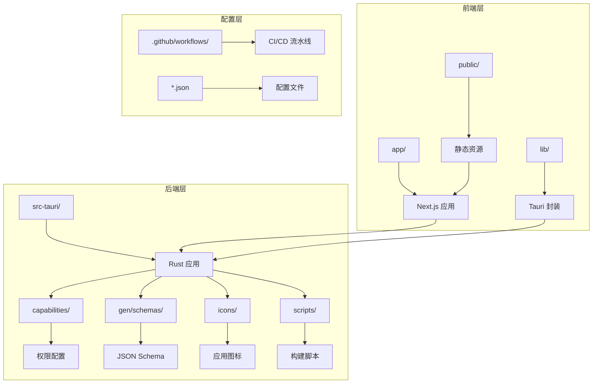

**图表来源**
- [package.json:1-42](file://package.json#L1-L42)
- [Cargo.toml:1-28](file://src-tauri/Cargo.toml#L1-L28)

**章节来源**
- [package.json:1-42](file://package.json#L1-L42)
- [Cargo.toml:1-28](file://src-tauri/Cargo.toml#L1-L28)

## 核心组件

### 前端React组件层

前端采用现代化的Next.js框架，主要组件包括：

- **页面组件**：`app/page.tsx` - 应用主界面
- **布局组件**：`app/layout.tsx` - 应用基础布局
- **API路由**：`app/api/health/route.ts` - 健康检查接口
- **工具库**：`lib/tauri.ts` - Tauri功能封装
- **更新管理**：`lib/updater.ts` - 自动更新机制

### 后端Rust模块层

后端采用高性能的Rust语言，核心模块包括：

- **主入口**：`src-tauri/src/lib.rs` - 应用主控制器
- **增量更新**：`src-tauri/src/delta.rs` - 服务器热更新模块
- **权限配置**：`src-tauri/capabilities/default.json` - 安全权限管理
- **应用配置**：`src-tauri/tauri.conf.json` - Tauri应用配置

**章节来源**
- [page.tsx:1-17](file://app/page.tsx#L1-L17)
- [layout.tsx:1-25](file://app/layout.tsx#L1-L25)
- [route.ts:1-9](file://app/api/health/route.ts#L1-L9)
- [tauri.ts:1-49](file://lib/tauri.ts#L1-L49)
- [updater.ts:1-385](file://lib/updater.ts#L1-L385)

## 架构概览

SSTS系统采用客户端-服务器架构，通过Tauri实现桌面应用的原生体验：

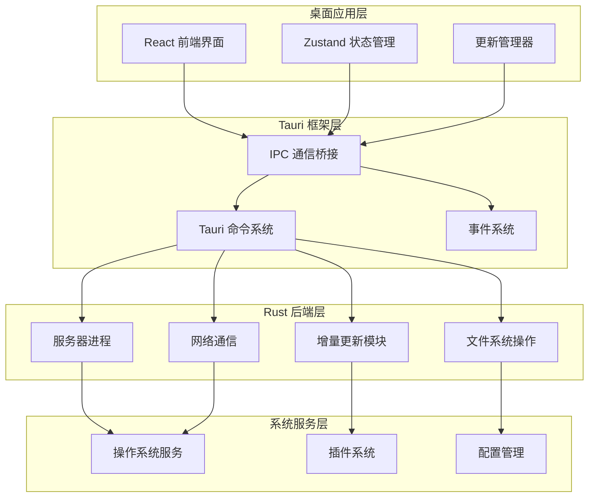

**图表来源**
- [lib.rs:1109-1482](file://src-tauri/src/lib.rs#L1109-L1482)
- [delta.rs:1-793](file://src-tauri/src/delta.rs#L1-L793)

## 详细组件分析

### IPC通信协议实现

#### 命令调用机制

Tauri通过invoke机制实现前后端命令调用，支持同步和异步操作：

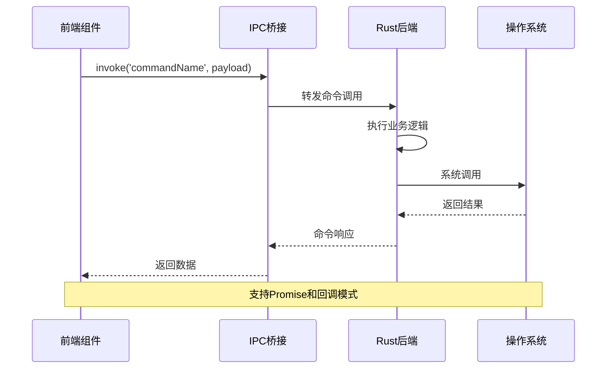

**图表来源**
- [lib.rs:1109-1161](file://src-tauri/src/lib.rs#L1109-L1161)
- [updater.ts:108-116](file://lib/updater.ts#L108-L116)

#### 事件监听机制

系统采用事件驱动架构，支持实时状态同步：

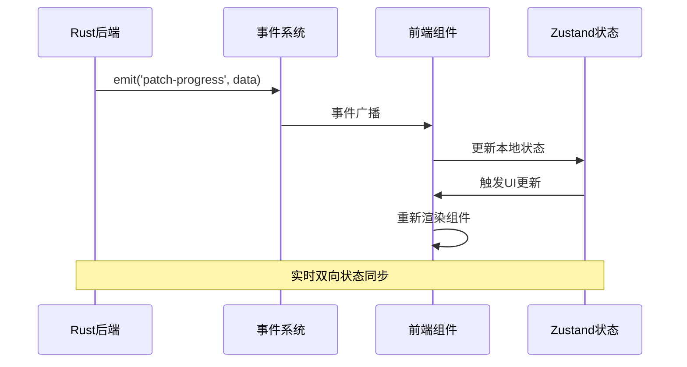

**图表来源**
- [delta.rs:20-29](file://src-tauri/src/delta.rs#L20-L29)
- [delta.rs:32-70](file://src-tauri/src/delta.rs#L32-L70)

#### 状态同步机制

系统实现了多层次的状态同步策略：

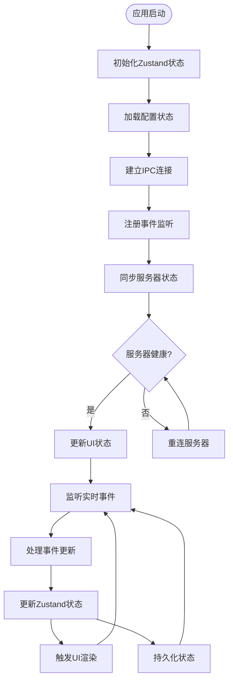

**图表来源**
- [lib.rs:1150-1161](file://src-tauri/src/lib.rs#L1150-L1161)
- [updater.ts:326-384](file://lib/updater.ts#L326-L384)

### 前端状态管理（Zustand）

#### 状态管理模式

系统采用Zustand实现轻量级状态管理，支持：

- **原子状态**：独立的状态片段
- **派生状态**：基于其他状态计算得出
- **异步状态**：处理异步数据获取
- **持久化**：状态持久化存储

#### 状态同步策略

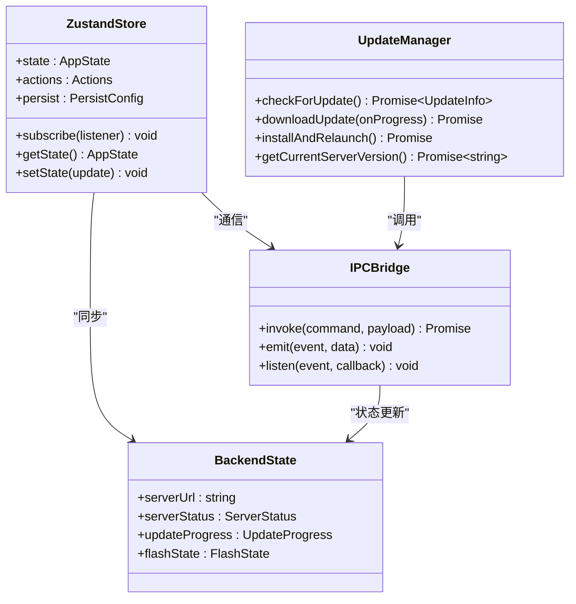

**图表来源**
- [updater.ts:319-324](file://lib/updater.ts#L319-L324)
- [lib.rs:1109-1161](file://src-tauri/src/lib.rs#L1109-L1161)

### 后端状态管理

#### 服务器状态管理

后端实现了完善的服务器状态管理：

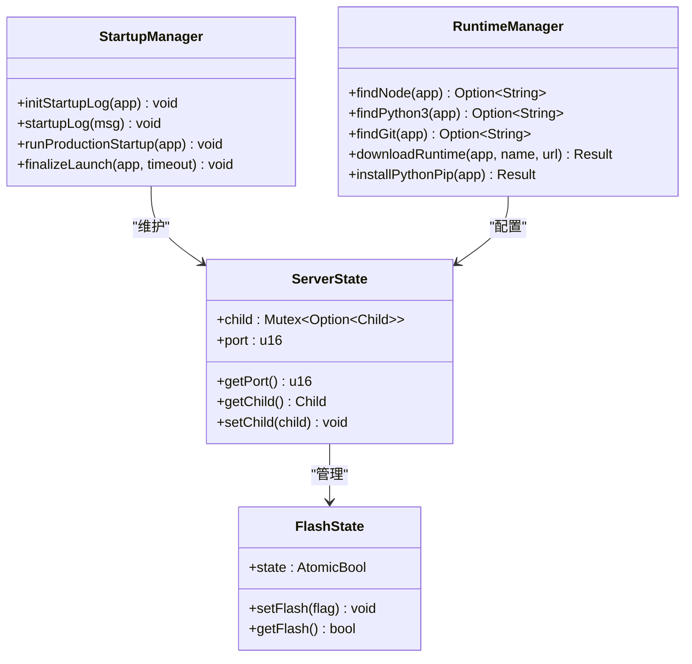

**图表来源**
- [lib.rs:10-14](file://src-tauri/src/lib.rs#L10-L14)
- [lib.rs:1488-1489](file://src-tauri/src/lib.rs#L1488-L1489)

### IPC通信协议规范

#### 消息格式标准

系统定义了标准化的消息格式：

| 字段 | 类型 | 必需 | 描述 |
|------|------|------|------|
| command | string | 是 | 命令名称 |
| payload | object | 否 | 命令参数 |
| id | string | 否 | 请求ID |
| timestamp | number | 否 | 时间戳 |

#### 错误传播机制

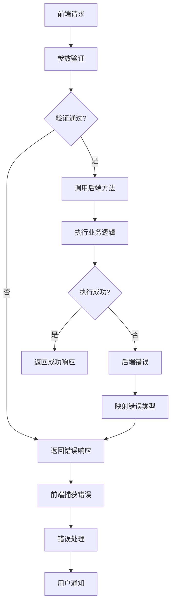

**图表来源**
- [lib.rs:1112-1118](file://src-tauri/src/lib.rs#L1112-L1118)
- [delta.rs:82-102](file://src-tauri/src/delta.rs#L82-L102)

#### 超时处理策略

系统实现了多层超时保护机制：

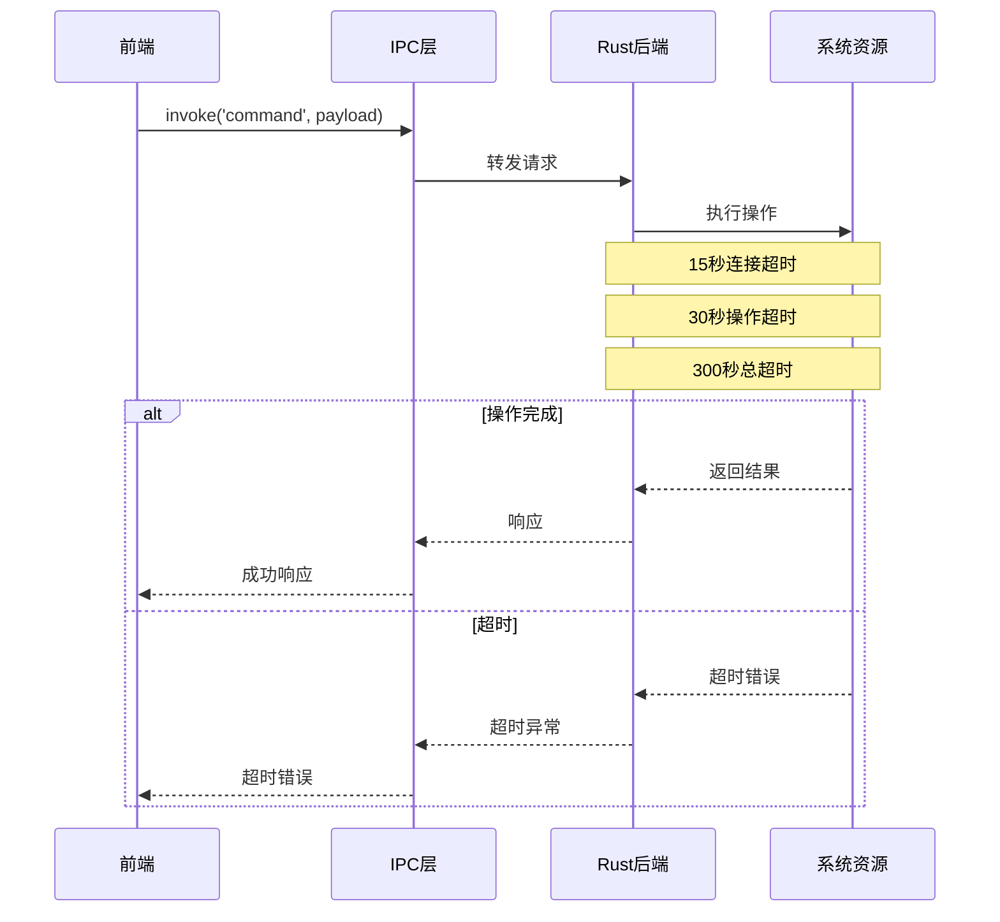

**图表来源**
- [delta.rs:82-102](file://src-tauri/src/delta.rs#L82-L102)
- [lib.rs:196-208](file://src-tauri/src/lib.rs#L196-L208)

### 组件协作模式

#### 最佳实践模式

系统实现了多种组件协作模式：

1. **命令-响应模式**：适用于同步操作
2. **事件-订阅模式**：适用于异步通知
3. **状态-同步模式**：适用于实时数据更新
4. **任务-回调模式**：适用于长时间运行的操作

#### 实际应用示例

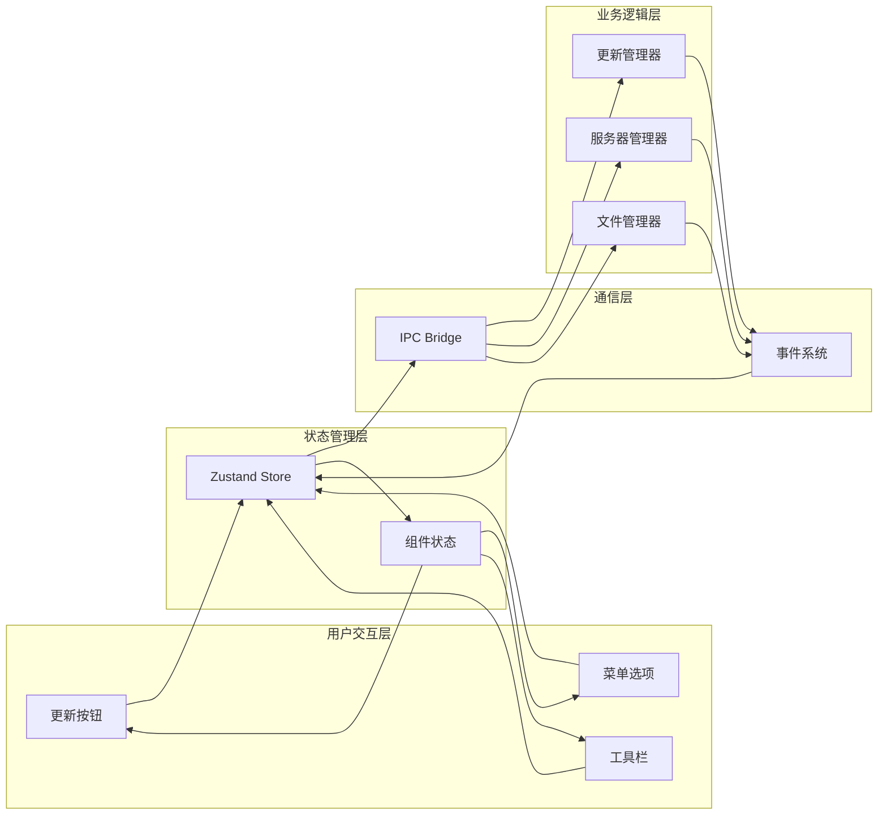

**图表来源**
- [updater.ts:326-384](file://lib/updater.ts#L326-L384)
- [lib.rs:1448-1453](file://src-tauri/src/lib.rs#L1448-L1453)

**章节来源**
- [lib.rs:1109-1482](file://src-tauri/src/lib.rs#L1109-L1482)
- [delta.rs:1-793](file://src-tauri/src/delta.rs#L1-L793)
- [updater.ts:1-385](file://lib/updater.ts#L1-L385)

## 依赖关系分析

### 外部依赖管理

系统采用模块化的依赖管理策略：

```mermaid
graph TB
subgraph "前端依赖"
N1[next@^15.1.0]
R1[react@^19.0.0]
Z1[zustand@^5.0.12]
L1[lucide-react@^0.460.0]
end
subgraph "Tauri插件"
T1[@tauri-apps/api@^2.10.1]
T2[@tauri-apps/plugin-dialog@^2.7.0]
T3[@tauri-apps/plugin-opener@^2.5.3]
T4[@tauri-apps/plugin-updater@^2.10.1]
end
subgraph "Rust依赖"
C1[tauri@2]
C2[serde@1]
C3[serde_json@1]
C4[sha2@0.10]
end
subgraph "开发工具"
D1[@types/node@^22.10.0]
D2[typescript@^5.7.2]
D3[tailwindcss@^3.4.17]
end
N1 --> T1
R1 --> T1
Z1 --> T1
L1 --> T1
T1 --> C1
T2 --> C1
T3 --> C1
T4 --> C1
C1 --> C2
C1 --> C3
C1 --> C4
```

**图表来源**
- [package.json:16-40](file://package.json#L16-L40)
- [Cargo.toml:14-27](file://src-tauri/Cargo.toml#L14-L27)

### 内部模块依赖

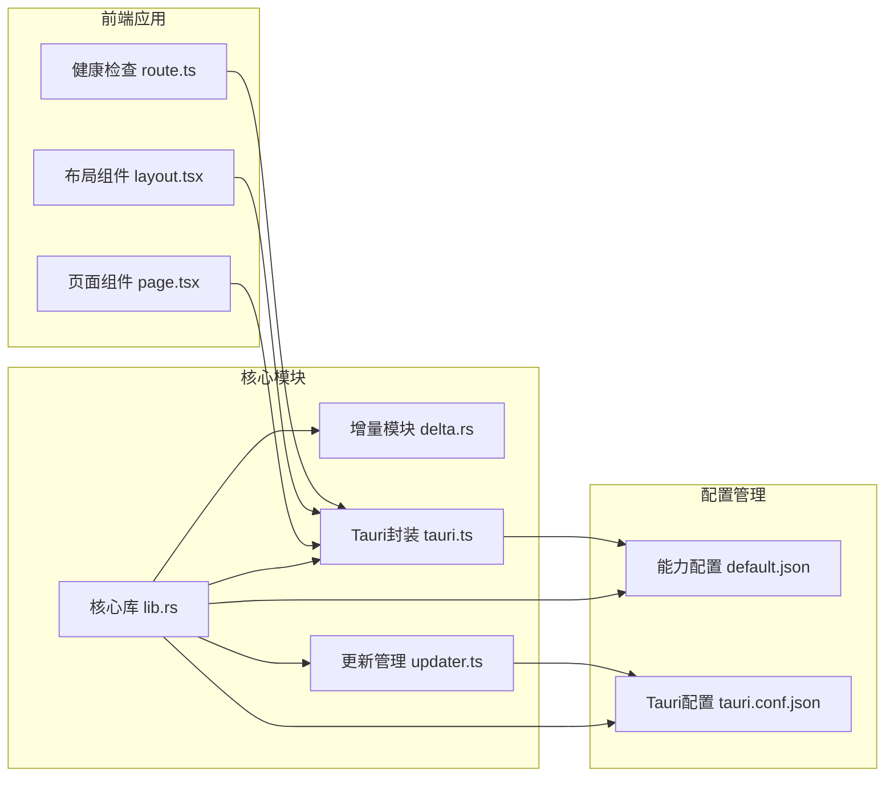

**图表来源**
- [lib.rs:1-8](file://src-tauri/src/lib.rs#L1-L8)
- [delta.rs:1-12](file://src-tauri/src/delta.rs#L1-L12)
- [default.json:1-29](file://src-tauri/capabilities/default.json#L1-L29)

**章节来源**
- [package.json:16-40](file://package.json#L16-L40)
- [Cargo.toml:14-27](file://src-tauri/Cargo.toml#L14-L27)
- [default.json:1-29](file://src-tauri/capabilities/default.json#L1-L29)

## 性能考虑

### 启动性能优化

系统采用了多项启动性能优化策略：

1. **延迟加载**：Splash窗口延迟显示，避免黑屏闪烁
2. **并行初始化**：多个初始化任务并行执行
3. **智能缓存**：运行时环境检测结果缓存
4. **渐进式加载**：UI组件按需加载

### 内存管理

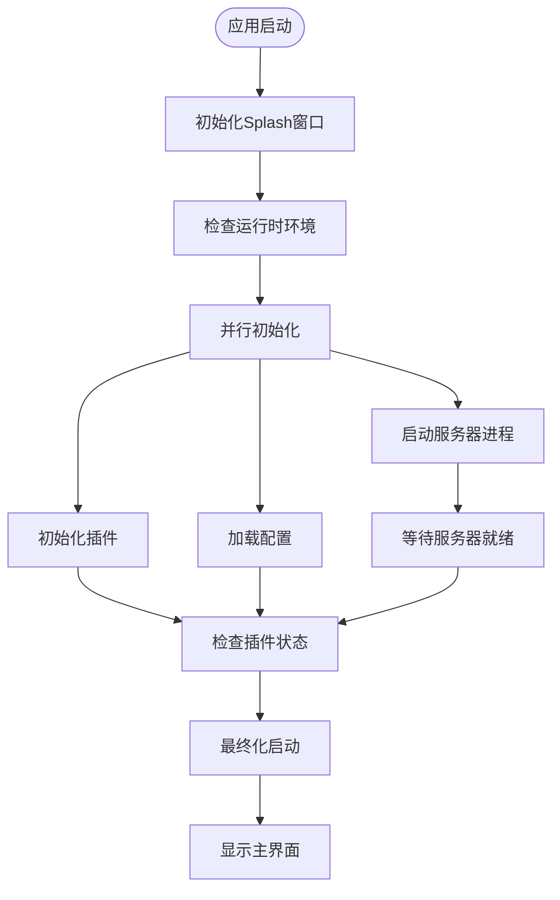

**图表来源**
- [lib.rs:1164-1296](file://src-tauri/src/lib.rs#L1164-L1296)

### 网络性能优化

系统实现了高效的网络通信策略：

- **连接池管理**：复用HTTP连接
- **超时控制**：多级超时保护
- **错误重试**：智能重试机制
- **进度监控**：实时下载进度反馈

## 故障排除指南

### 常见问题诊断

#### 启动失败排查

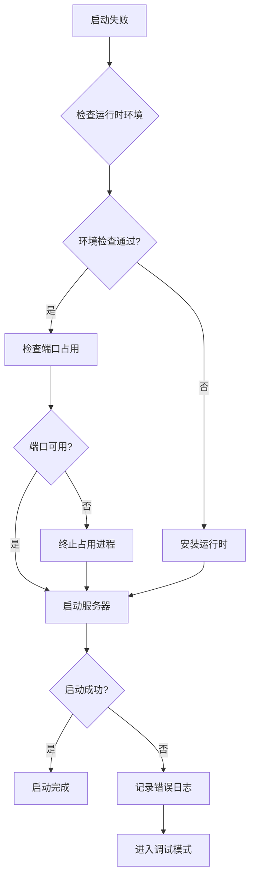

**图表来源**
- [lib.rs:1164-1296](file://src-tauri/src/lib.rs#L1164-L1296)

#### IPC通信故障

系统提供了完善的错误处理机制：

1. **连接异常**：自动重连和降级处理
2. **命令超时**：超时检测和错误上报
3. **数据序列化**：类型安全的数据传输
4. **权限验证**：严格的访问控制

#### 状态同步问题

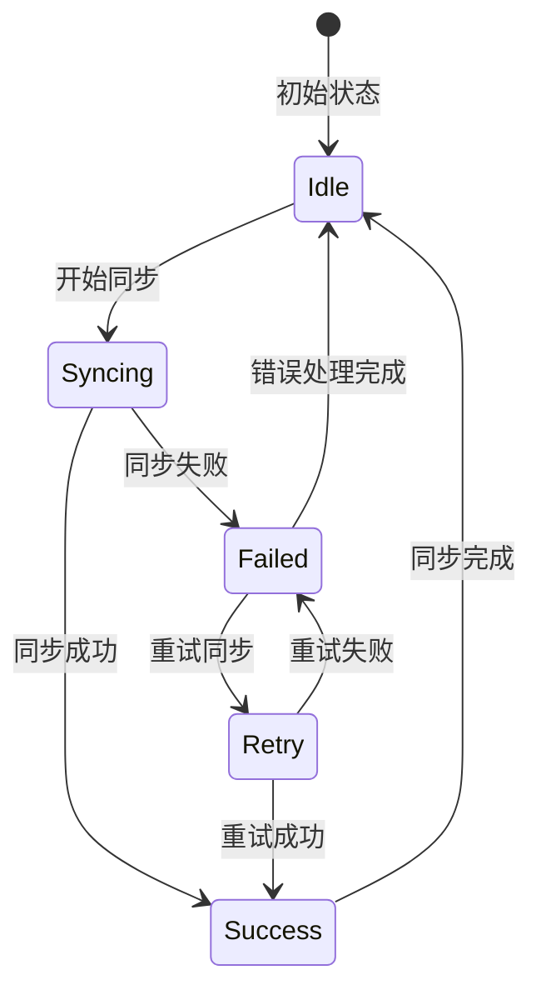

**图表来源**
- [lib.rs:1277-1296](file://src-tauri/src/lib.rs#L1277-L1296)

**章节来源**
- [lib.rs:1164-1296](file://src-tauri/src/lib.rs#L1164-L1296)
- [delta.rs:180-228](file://src-tauri/src/delta.rs#L180-L228)

## 结论

SSTS项目展示了现代桌面应用开发的最佳实践，通过Tauri框架实现了高性能的跨平台解决方案。系统的核心优势包括：

1. **架构清晰**：前后端分离，职责明确
2. **通信高效**：IPC机制实现低延迟通信
3. **状态一致**：多层状态同步确保数据一致性
4. **扩展性强**：模块化设计便于功能扩展
5. **用户体验**：流畅的启动流程和实时状态反馈

该系统为类似项目提供了宝贵的参考模板，特别是在桌面应用的前后端交互、状态管理和性能优化方面具有重要的借鉴意义。