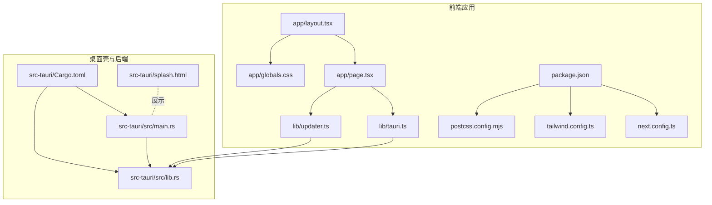
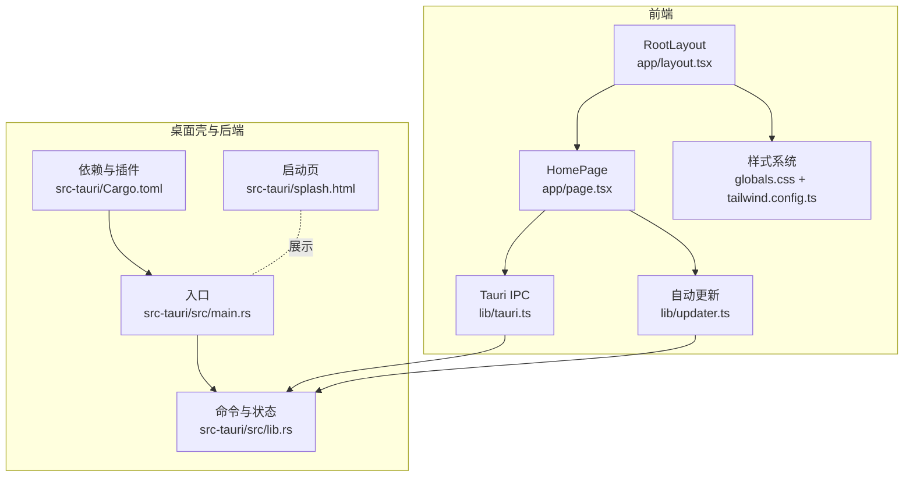
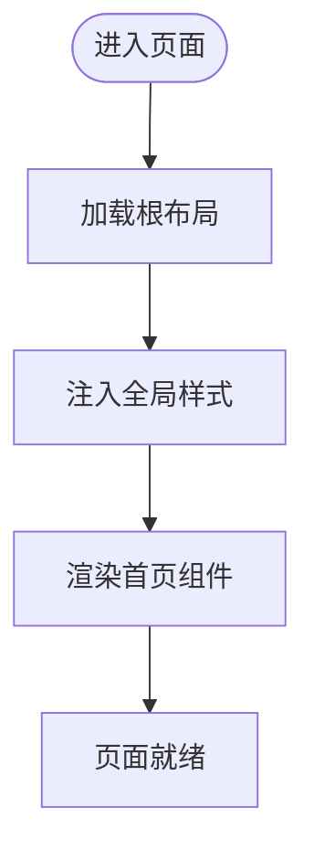
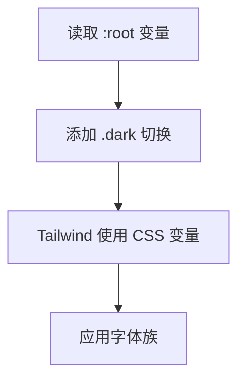
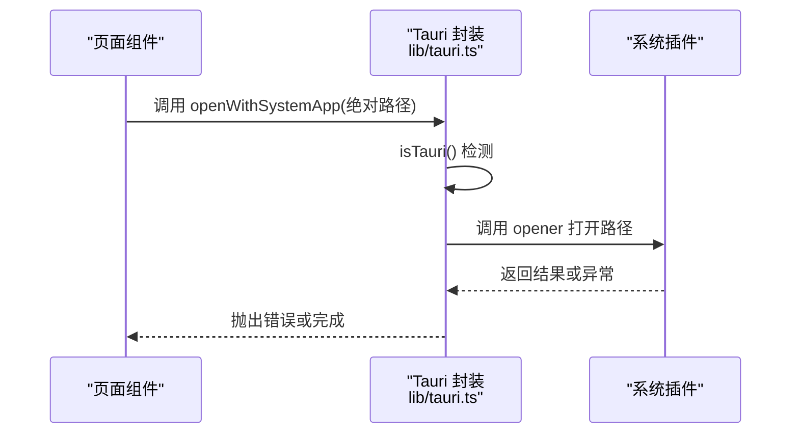
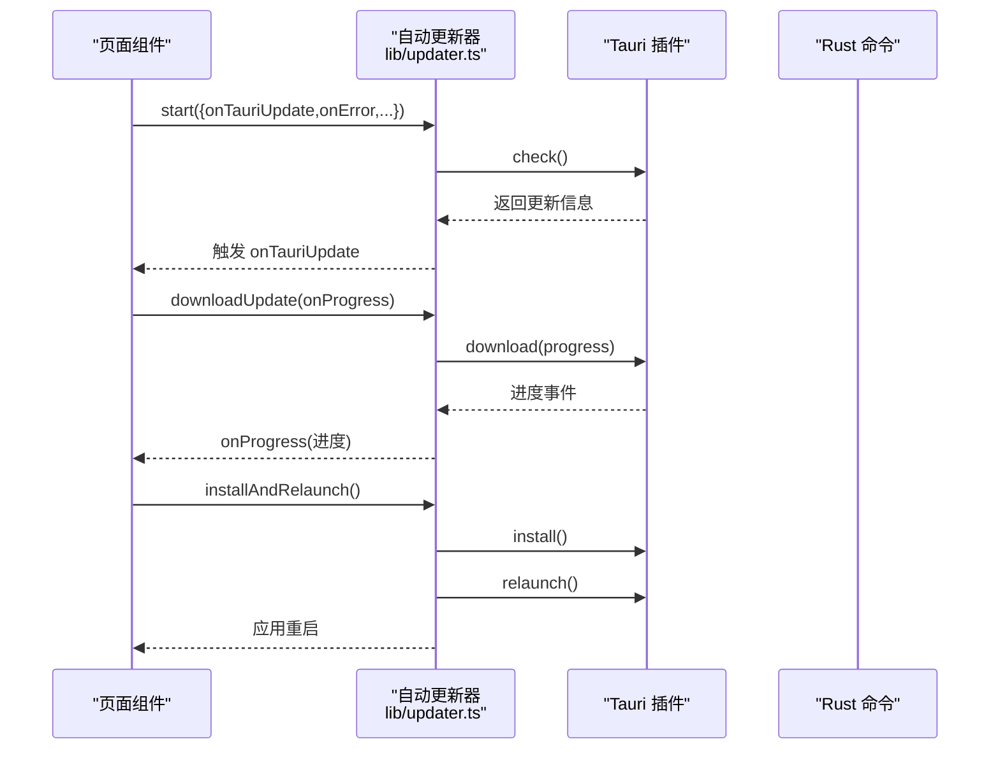
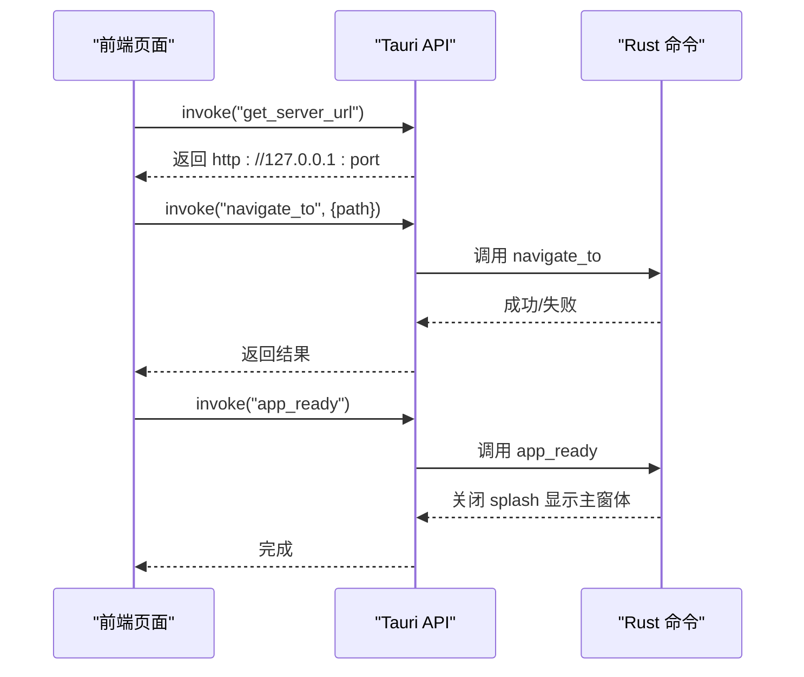
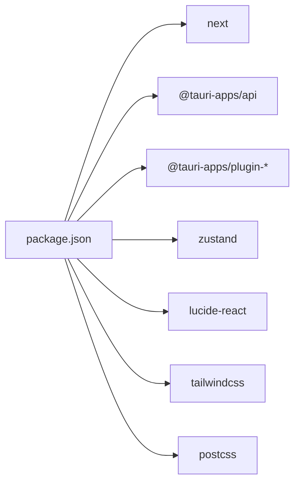

# 前端界面系统

<cite>
**本文引用的文件**
- [app/layout.tsx](file://app/layout.tsx)
- [app/page.tsx](file://app/page.tsx)
- [app/globals.css](file://app/globals.css)
- [lib/tauri.ts](file://lib/tauri.ts)
- [lib/updater.ts](file://lib/updater.ts)
- [package.json](file://package.json)
- [next.config.ts](file://next.config.ts)
- [tailwind.config.ts](file://tailwind.config.ts)
- [postcss.config.mjs](file://postcss.config.mjs)
- [src-tauri/src/main.rs](file://src-tauri/src/main.rs)
- [src-tauri/src/lib.rs](file://src-tauri/src/lib.rs)
- [src-tauri/Cargo.toml](file://src-tauri/Cargo.toml)
- [src-tauri/splash.html](file://src-tauri/splash.html)
- [instrumentation.ts](file://instrumentation.ts)
</cite>

## 目录
1. [简介](#简介)
2. [项目结构](#项目结构)
3. [核心组件](#核心组件)
4. [架构总览](#架构总览)
5. [详细组件分析](#详细组件分析)
6. [依赖关系分析](#依赖关系分析)
7. [性能考虑](#性能考虑)
8. [故障排查指南](#故障排查指南)
9. [结论](#结论)
10. [附录](#附录)

## 简介
本文件面向前端界面系统，围绕 Next.js 应用结构、React 组件设计与状态管理机制进行系统化说明。重点涵盖：
- 布局组件与页面组件的组织方式
- 全局样式的组织与主题定制
- 前端与后端 IPC 通信（Tauri）的集成与数据绑定
- 更新器模块的自动更新流程与事件处理
- UI 组件开发指南与最佳实践

本系统采用 Next.js 作为前端框架，Tailwind CSS 提供原子化样式，Zustand 作为轻量状态管理方案，并通过 Tauri 将 Web 内容嵌入桌面壳，实现跨平台部署。

## 项目结构
仓库采用按功能分层的组织方式：
- app：Next.js 应用入口与页面
- lib：前端侧 Tauri 封装与更新器逻辑
- src-tauri：Tauri 桌面壳与 Rust 后端
- 样式与构建：Tailwind、PostCSS、Next 配置

图表来源
- [app/layout.tsx:1-25](file://app/layout.tsx#L1-L25)
- [app/page.tsx:1-17](file://app/page.tsx#L1-L17)
- [app/globals.css:1-21](file://app/globals.css#L1-L21)
- [lib/tauri.ts:1-49](file://lib/tauri.ts#L1-L49)
- [lib/updater.ts:1-385](file://lib/updater.ts#L1-L385)
- [next.config.ts:1-8](file://next.config.ts#L1-L8)
- [tailwind.config.ts:1-52](file://tailwind.config.ts#L1-L52)
- [postcss.config.mjs:1-10](file://postcss.config.mjs#L1-L10)
- [src-tauri/src/main.rs:1-7](file://src-tauri/src/main.rs#L1-L7)
- [src-tauri/src/lib.rs:1120-1275](file://src-tauri/src/lib.rs#L1120-L1275)
- [src-tauri/Cargo.toml:1-28](file://src-tauri/Cargo.toml#L1-L28)
- [src-tauri/splash.html:1-99](file://src-tauri/splash.html#L1-L99)

章节来源
- [app/layout.tsx:1-25](file://app/layout.tsx#L1-L25)
- [app/page.tsx:1-17](file://app/page.tsx#L1-L17)
- [app/globals.css:1-21](file://app/globals.css#L1-L21)
- [next.config.ts:1-8](file://next.config.ts#L1-L8)
- [tailwind.config.ts:1-52](file://tailwind.config.ts#L1-L52)
- [postcss.config.mjs:1-10](file://postcss.config.mjs#L1-L10)
- [package.json:1-42](file://package.json#L1-L42)

## 核心组件
- 布局组件：根布局负责元数据、视口配置与全局样式注入，统一承载子页面内容。
- 页面组件：首页组件提供基础展示与状态指示，可扩展为多页面路由。
- 全局样式：通过 Tailwind 与 CSS 变量实现主题切换与字体规范。
- Tauri 封装：提供环境检测、系统对话框、文件打开等能力。
- 更新器：封装全量更新与服务器热更新流程，支持进度回调与错误处理。
- 构建配置：Next 独立输出、Tailwind 内容扫描、PostCSS 插件链路。

章节来源
- [app/layout.tsx:1-25](file://app/layout.tsx#L1-L25)
- [app/page.tsx:1-17](file://app/page.tsx#L1-L17)
- [app/globals.css:1-21](file://app/globals.css#L1-L21)
- [lib/tauri.ts:1-49](file://lib/tauri.ts#L1-L49)
- [lib/updater.ts:1-385](file://lib/updater.ts#L1-L385)
- [next.config.ts:1-8](file://next.config.ts#L1-L8)
- [tailwind.config.ts:1-52](file://tailwind.config.ts#L1-L52)
- [postcss.config.mjs:1-10](file://postcss.config.mjs#L1-L10)

## 架构总览
前端以 Next.js 为核心，页面组件通过根布局统一渲染；样式体系基于 Tailwind，使用 CSS 变量实现明暗主题切换；通过 Tauri 的 IPC 与 Rust 后端交互，实现系统级能力与本地资源访问；更新器模块负责应用与服务器的自动更新流程。

图表来源
- [app/layout.tsx:1-25](file://app/layout.tsx#L1-L25)
- [app/page.tsx:1-17](file://app/page.tsx#L1-L17)
- [app/globals.css:1-21](file://app/globals.css#L1-L21)
- [tailwind.config.ts:1-52](file://tailwind.config.ts#L1-L52)
- [lib/tauri.ts:1-49](file://lib/tauri.ts#L1-L49)
- [lib/updater.ts:1-385](file://lib/updater.ts#L1-L385)
- [src-tauri/src/main.rs:1-7](file://src-tauri/src/main.rs#L1-L7)
- [src-tauri/src/lib.rs:1120-1275](file://src-tauri/src/lib.rs#L1120-L1275)
- [src-tauri/Cargo.toml:1-28](file://src-tauri/Cargo.toml#L1-L28)
- [src-tauri/splash.html:1-99](file://src-tauri/splash.html#L1-L99)

## 详细组件分析

### 布局与页面组件
- 根布局负责设置站点元数据与视口，引入全局样式，包裹子组件。
- 首页组件提供居中布局、标题、版本号与系统状态指示，便于扩展为仪表盘或控制面板。

图表来源
- [app/layout.tsx:1-25](file://app/layout.tsx#L1-L25)
- [app/page.tsx:1-17](file://app/page.tsx#L1-L17)

章节来源
- [app/layout.tsx:1-25](file://app/layout.tsx#L1-L25)
- [app/page.tsx:1-17](file://app/page.tsx#L1-L17)

### 全局样式与主题系统
- 使用 Tailwind 原子类与自定义 CSS 变量实现主题切换，支持明暗两类根节点。
- Tailwind 配置启用类名驱动的深色模式，扩展动画与颜色映射，确保主题一致性。

图表来源
- [app/globals.css:1-21](file://app/globals.css#L1-L21)
- [tailwind.config.ts:1-52](file://tailwind.config.ts#L1-L52)

章节来源
- [app/globals.css:1-21](file://app/globals.css#L1-L21)
- [tailwind.config.ts:1-52](file://tailwind.config.ts#L1-L52)

### Tauri 环境检测与系统操作
- 环境检测：判断是否运行于 Tauri 桌面模式。
- 文件系统操作：打开系统应用、选择目录、在资源管理器中定位文件。
- 错误处理：对不可用场景抛出明确错误信息，便于上层捕获与提示。

图表来源
- [lib/tauri.ts:1-49](file://lib/tauri.ts#L1-L49)

章节来源
- [lib/tauri.ts:1-49](file://lib/tauri.ts#L1-L49)

### 自动更新流程与事件处理
- 全量更新（Tauri 壳）：检查版本、下载、安装并重启。
- 服务器热更新：根据平台匹配 delta 或回退至全量包。
- 回调接口：提供更新就绪、服务器更新、Tauri 更新、错误等回调。
- 定时调度：延迟首次检查，之后周期性轮询，避免频繁网络请求。

图表来源
- [lib/updater.ts:143-245](file://lib/updater.ts#L143-L245)
- [lib/updater.ts:326-384](file://lib/updater.ts#L326-L384)
- [src-tauri/src/lib.rs:1120-1161](file://src-tauri/src/lib.rs#L1120-L1161)

章节来源
- [lib/updater.ts:1-385](file://lib/updater.ts#L1-L385)
- [src-tauri/src/lib.rs:1120-1275](file://src-tauri/src/lib.rs#L1120-L1275)

### 前端与后端 IPC 通信
- 前端通过 Tauri invoke 调用 Rust 命令，实现跨语言通信。
- 示例命令包括：获取服务器地址、导航到指定路径、应用就绪关闭启动页、更新启动页进度等。
- 前端可结合更新器与系统操作，形成完整的桌面应用体验。

图表来源
- [src-tauri/src/lib.rs:1134-1161](file://src-tauri/src/lib.rs#L1134-L1161)
- [lib/updater.ts:108-116](file://lib/updater.ts#L108-L116)

章节来源
- [src-tauri/src/lib.rs:1120-1275](file://src-tauri/src/lib.rs#L1120-L1275)
- [lib/updater.ts:108-116](file://lib/updater.ts#L108-L116)

### 状态管理机制
- 依赖：Zustand 作为轻量状态管理方案，适合小型应用的状态共享与订阅。
- 建议：将用户会话、设备状态、更新状态等放入 Zustand Store，配合 React Hooks 在组件中消费。
- 最佳实践：拆分模块化 Store、避免过度订阅、保持状态不可变更新。

章节来源
- [package.json:26-26](file://package.json#L26-L26)

### UI 组件开发指南与最佳实践
- 布局与间距：使用 Flex/Gap 实现居中与垂直间距，保持响应式与可读性。
- 主题一致性：优先使用 Tailwind 主题色与动画类，减少自定义样式。
- 可访问性：为交互元素提供语义化标签与键盘导航支持。
- 性能优化：避免在渲染路径中进行重型计算，使用 memo 与懒加载。

章节来源
- [app/page.tsx:1-17](file://app/page.tsx#L1-L17)
- [tailwind.config.ts:1-52](file://tailwind.config.ts#L1-L52)

## 依赖关系分析
- 前端依赖：Next.js、React、Tailwind、Lucide React、Zustand。
- Tauri 插件：dialog、opener、os、process、updater 等。
- 构建工具：Next 独立输出、PostCSS、Autoprefixer、Tailwind。

图表来源
- [package.json:16-40](file://package.json#L16-L40)

章节来源
- [package.json:1-42](file://package.json#L1-L42)

## 性能考虑
- 构建输出：Next 独立输出模式便于容器化与部署，减少运行时依赖。
- 样式体积：Tailwind 内容扫描仅打包实际使用的类，建议定期清理未使用类。
- 更新策略：自动更新器采用指数退避与缓存策略，降低网络压力。
- 启动体验：启动页与前端就绪信号配合，缩短感知等待时间。

章节来源
- [next.config.ts:1-8](file://next.config.ts#L1-L8)
- [lib/updater.ts:122-139](file://lib/updater.ts#L122-L139)
- [src-tauri/splash.html:1-99](file://src-tauri/splash.html#L1-L99)

## 故障排查指南
- Tauri 功能不可用：确认 isTauri() 返回值，非桌面模式下相关功能应降级或提示。
- 更新失败：检查网络与 Rust invoke 调用，查看错误回调与日志输出。
- 样式异常：核对 Tailwind 配置与内容扫描路径，确保类名正确。
- 启动页不消失：确认 app_ready 命令被调用且主窗口已导航到本地服务端口。

章节来源
- [lib/tauri.ts:5-7](file://lib/tauri.ts#L5-L7)
- [lib/updater.ts:196-199](file://lib/updater.ts#L196-L199)
- [src-tauri/src/lib.rs:1150-1161](file://src-tauri/src/lib.rs#L1150-L1161)

## 结论
该前端界面系统以 Next.js 为基础，结合 Tailwind 与 Tauri，实现了从页面布局、样式主题到 IPC 通信与自动更新的完整闭环。通过模块化的组件与清晰的依赖关系，系统具备良好的可维护性与扩展性。建议后续完善组件库、接入更丰富的状态管理与测试用例，持续优化启动与更新体验。

## 附录
- 启动流程概览：Rust 主程序启动本地服务，前端通过 navigate_to 导航到本地端口，app_ready 关闭启动页并聚焦主窗体。
- 启动页 HTML：提供渐变背景、星空粒子与进度条，提升首屏体验。

章节来源
- [src-tauri/src/main.rs:1-7](file://src-tauri/src/main.rs#L1-L7)
- [src-tauri/src/lib.rs:1248-1275](file://src-tauri/src/lib.rs#L1248-L1275)
- [src-tauri/splash.html:1-99](file://src-tauri/splash.html#L1-L99)