# 前端组件库

<cite>
**本文档引用的文件**
- [package.json](file://package.json)
- [next.config.ts](file://next.config.ts)
- [tailwind.config.ts](file://tailwind.config.ts)
- [app/layout.tsx](file://app/layout.tsx)
- [components/ui/Button.tsx](file://components/ui/Button.tsx)
- [components/ui/AngleGauge.tsx](file://components/ui/AngleGauge.tsx)
- [components/ui/DataDisplay.tsx](file://components/ui/DataDisplay.tsx)
- [components/ui/IndustrialCard.tsx](file://components/ui/IndustrialCard.tsx)
- [components/ui/MeasurementTable.tsx](file://components/ui/MeasurementTable.tsx)
- [components/ui/NumericInput.tsx](file://components/ui/NumericInput.tsx)
- [components/ui/NumericKeypad.tsx](file://components/ui/NumericKeypad.tsx)
- [components/ui/SettingsModal.tsx](file://components/ui/SettingsModal.tsx)
- [components/ui/StatusIndicator.tsx](file://components/ui/StatusIndicator.tsx)
- [components/ui/TopAppBar.tsx](file://components/ui/TopAppBar.tsx)
- [components/ui/UpdateNotification.tsx](file://components/ui/UpdateNotification.tsx)
- [components/ui/WindowControls.tsx](file://components/ui/WindowControls.tsx)
- [lib/config.ts](file://lib/config.ts)
- [lib/tauri.ts](file://lib/tauri.ts)
</cite>

## 目录
1. [简介](#简介)
2. [项目结构](#项目结构)
3. [核心组件](#核心组件)
4. [架构概览](#架构概览)
5. [详细组件分析](#详细组件分析)
6. [依赖关系分析](#依赖关系分析)
7. [性能考虑](#性能考虑)
8. [故障排除指南](#故障排除指南)
9. [结论](#结论)

## 简介

这是一个基于 Next.js 和 Tauri 技术栈开发的工业测量设备前端组件库。该项目专为机动车角度综合校准装置设计，提供了完整的用户界面组件集合，包括数据展示、输入控件、状态指示器和设置管理等功能。

项目采用现代化的前端技术栈，结合了 React 组件化开发、TailwindCSS 样式系统、TypeScript 类型安全以及 Tauri 跨平台桌面应用能力。组件库设计注重工业环境的实用性，提供了专门针对角度测量、数据采集和设备控制的用户界面解决方案。

## 项目结构

项目采用模块化的组织方式，主要分为以下几个核心部分：

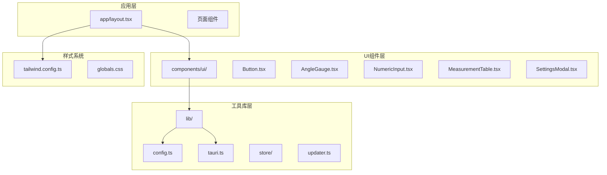

**图表来源**
- [app/layout.tsx:1-43](file://app/layout.tsx#L1-L43)
- [tailwind.config.ts:1-119](file://tailwind.config.ts#L1-L119)

**章节来源**
- [package.json:1-46](file://package.json#L1-L46)
- [next.config.ts:1-8](file://next.config.ts#L1-L8)

## 核心组件

### 组件库架构

前端组件库采用分层架构设计，每个组件都遵循统一的设计规范和交互模式：

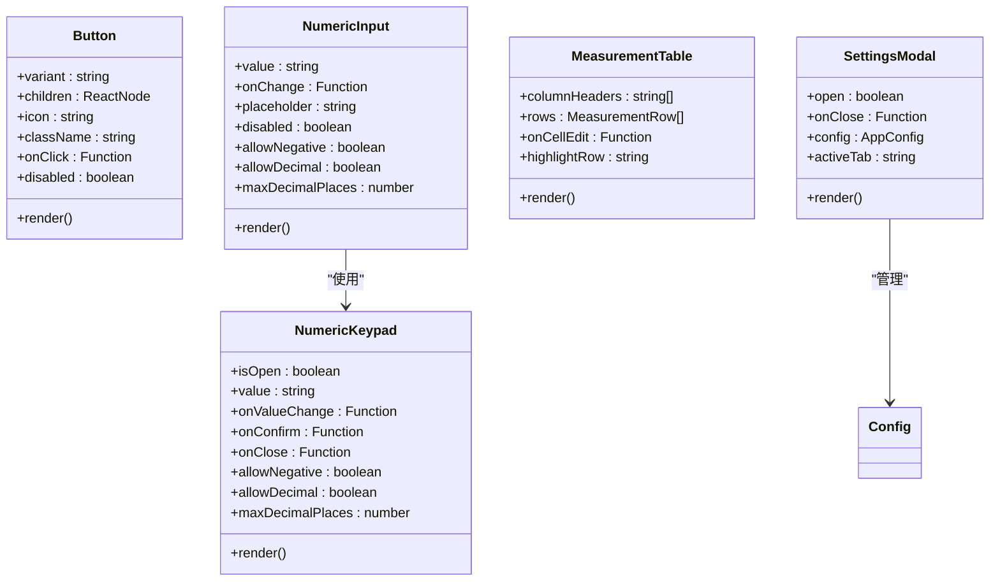

**图表来源**
- [components/ui/Button.tsx:1-44](file://components/ui/Button.tsx#L1-L44)
- [components/ui/NumericInput.tsx:1-78](file://components/ui/NumericInput.tsx#L1-L78)
- [components/ui/NumericKeypad.tsx:1-236](file://components/ui/NumericKeypad.tsx#L1-L236)
- [components/ui/MeasurementTable.tsx:1-205](file://components/ui/MeasurementTable.tsx#L1-L205)
- [components/ui/SettingsModal.tsx:1-407](file://components/ui/SettingsModal.tsx#L1-L407)

### 设计系统

组件库建立了完整的设计系统，包括：

- **色彩系统**: 基于 Material Design 的工业色调，包含主色、辅助色和状态色
- **字体系统**: 采用 Inter 字体，提供多种字重和字号规格
- **间距系统**: 标准化的间距单位，支持响应式布局
- **圆角系统**: 从 0.25rem 到 1.5rem 的圆角规格
- **动画系统**: 包含淡入、脉冲等基础动画效果

**章节来源**
- [tailwind.config.ts:25-112](file://tailwind.config.ts#L25-L112)

## 架构概览

### 整体架构设计

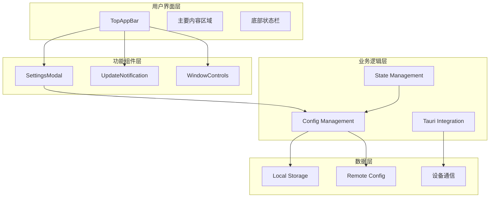

**图表来源**
- [components/ui/TopAppBar.tsx:22-140](file://components/ui/TopAppBar.tsx#L22-L140)
- [components/ui/SettingsModal.tsx:14-407](file://components/ui/SettingsModal.tsx#L14-L407)
- [lib/config.ts:66-99](file://lib/config.ts#L66-L99)

### 数据流架构

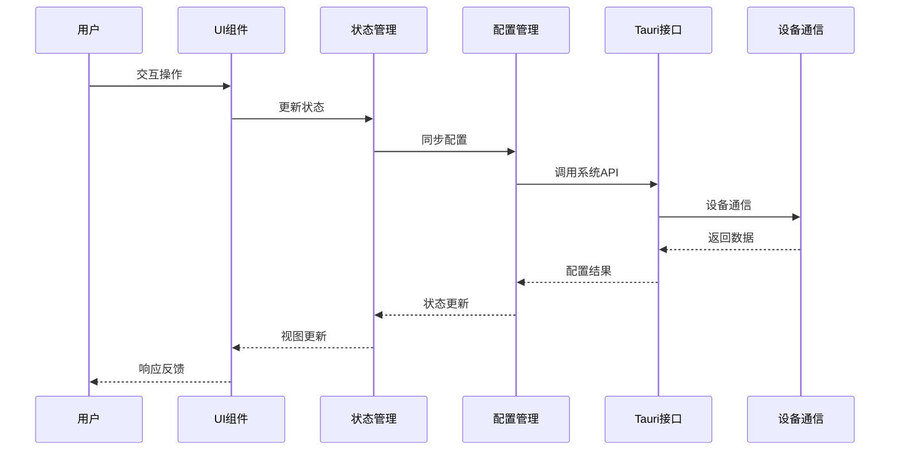

**图表来源**
- [lib/config.ts:66-99](file://lib/config.ts#L66-L99)
- [lib/tauri.ts:5-49](file://lib/tauri.ts#L5-L49)

## 详细组件分析

### 数字输入组件体系

数字输入组件是工业应用中的核心组件，提供了完整的数值输入解决方案：

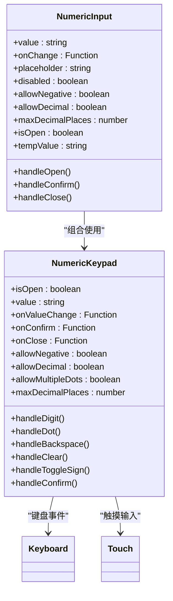

**图表来源**
- [components/ui/NumericInput.tsx:19-78](file://components/ui/NumericInput.tsx#L19-L78)
- [components/ui/NumericKeypad.tsx:19-236](file://components/ui/NumericKeypad.tsx#L19-L236)

#### 输入验证流程

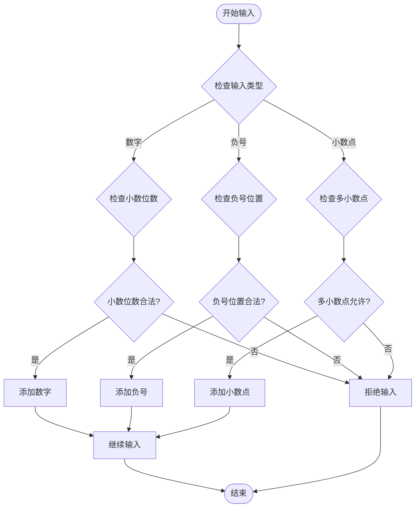

**图表来源**
- [components/ui/NumericKeypad.tsx:42-87](file://components/ui/NumericKeypad.tsx#L42-L87)

**章节来源**
- [components/ui/NumericInput.tsx:1-78](file://components/ui/NumericInput.tsx#L1-L78)
- [components/ui/NumericKeypad.tsx:1-236](file://components/ui/NumericKeypad.tsx#L1-L236)

### 仪表盘组件

角度仪表盘是工业测量的核心可视化组件，提供了精确的角度显示功能：

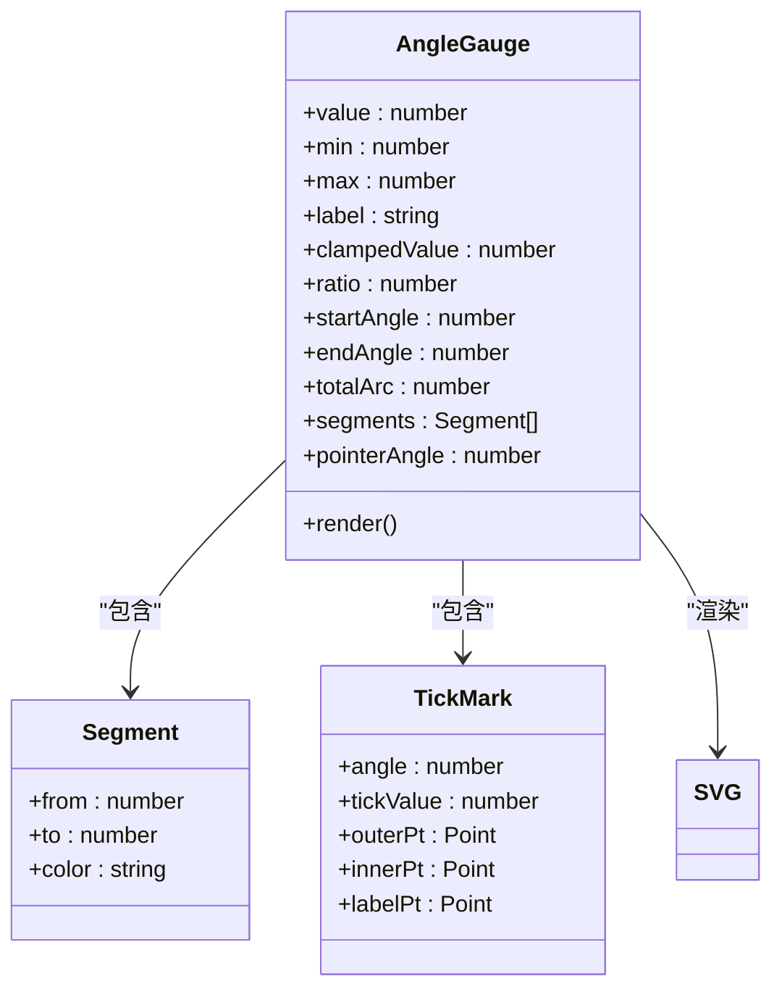

**图表来源**
- [components/ui/AngleGauge.tsx:3-186](file://components/ui/AngleGauge.tsx#L3-L186)

#### 仪表盘渲染算法

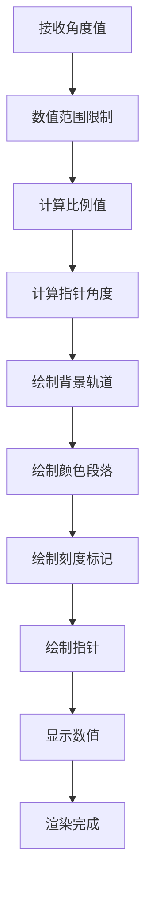

**图表来源**
- [components/ui/AngleGauge.tsx:16-51](file://components/ui/AngleGauge.tsx#L16-L51)

**章节来源**
- [components/ui/AngleGauge.tsx:1-186](file://components/ui/AngleGauge.tsx#L1-L186)

### 表格组件

测量表格组件支持复杂的工业测量数据展示和编辑功能：

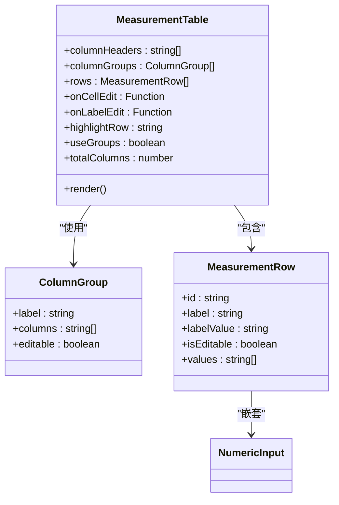

**图表来源**
- [components/ui/MeasurementTable.tsx:5-205](file://components/ui/MeasurementTable.tsx#L5-L205)

#### 表格交互流程

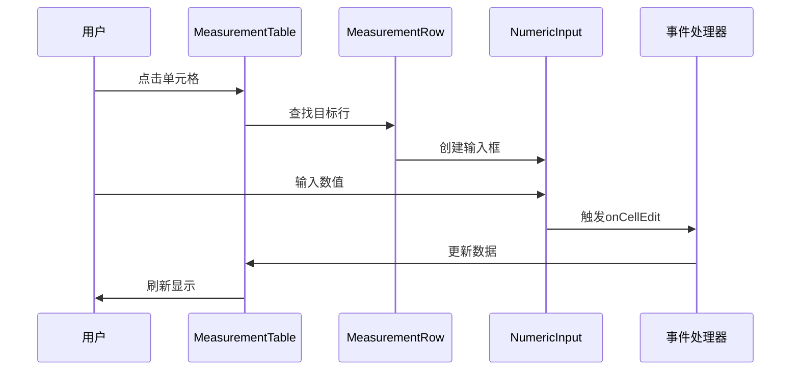

**图表来源**
- [components/ui/MeasurementTable.tsx:128-133](file://components/ui/MeasurementTable.tsx#L128-L133)

**章节来源**
- [components/ui/MeasurementTable.tsx:1-205](file://components/ui/MeasurementTable.tsx#L1-L205)

### 设置模态框

设置模态框提供了完整的应用配置管理功能：

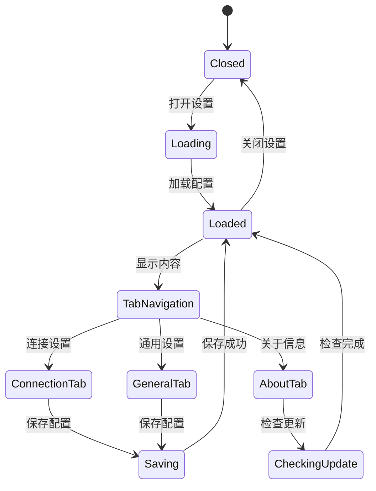

**图表来源**
- [components/ui/SettingsModal.tsx:14-407](file://components/ui/SettingsModal.tsx#L14-L407)

**章节来源**
- [components/ui/SettingsModal.tsx:1-407](file://components/ui/SettingsModal.tsx#L1-L407)

### 状态指示器

状态指示器组件提供了简洁的状态可视化：

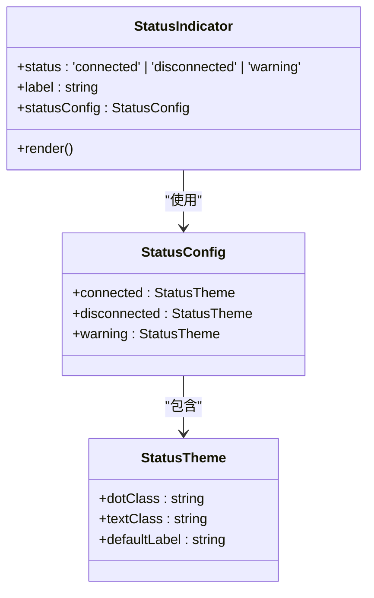

**图表来源**
- [components/ui/StatusIndicator.tsx:1-35](file://components/ui/StatusIndicator.tsx#L1-L35)

**章节来源**
- [components/ui/StatusIndicator.tsx:1-35](file://components/ui/StatusIndicator.tsx#L1-L35)

## 依赖关系分析

### 技术栈依赖

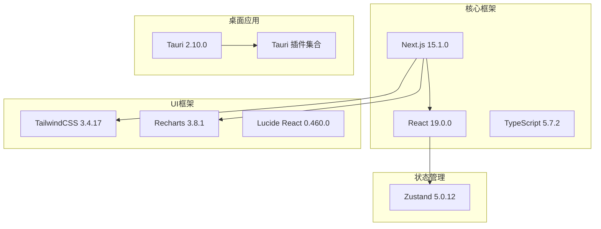

**图表来源**
- [package.json:18-44](file://package.json#L18-L44)

### 组件间依赖关系

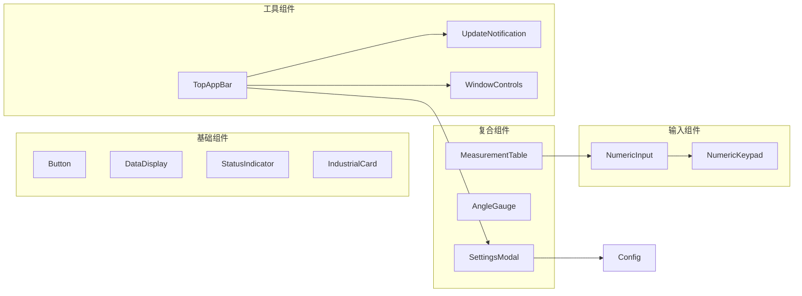

**图表来源**
- [components/ui/MeasurementTable.tsx:3-4](file://components/ui/MeasurementTable.tsx#L3-L4)
- [components/ui/NumericInput.tsx:3-4](file://components/ui/NumericInput.tsx#L3-L4)

**章节来源**
- [package.json:18-44](file://package.json#L18-L44)

## 性能考虑

### 渲染优化

组件库采用了多项性能优化策略：

1. **懒加载机制**: 设置模态框和更新通知采用条件渲染，避免不必要的DOM节点创建
2. **事件委托**: 数字键盘使用全局键盘事件监听，减少事件绑定数量
3. **虚拟滚动**: 测量表格支持大数据集的虚拟滚动，提升渲染性能
4. **防抖处理**: 配置变更采用防抖机制，避免频繁的存储操作

### 内存管理

- **组件卸载清理**: 所有订阅和定时器在组件卸载时自动清理
- **事件监听移除**: 窗口尺寸变化、键盘事件等监听器在适当时机移除
- **缓存策略**: 配置信息在内存中缓存，避免重复的磁盘读取

### 网络优化

- **增量更新**: 支持服务器端的增量更新，减少带宽消耗
- **版本检查**: 智能版本检查机制，避免频繁的网络请求
- **CDN加速**: 支持自定义CDN源，提升更新下载速度

## 故障排除指南

### 常见问题诊断

#### 配置加载失败

**症状**: 设置页面无法显示或显示默认配置

**可能原因**:
1. Tauri 环境检测失败
2. 本地存储损坏
3. 网络配置不可用

**解决方法**:
1. 检查浏览器控制台是否有错误信息
2. 清除浏览器缓存和本地存储
3. 验证网络连接和代理设置

#### 数字输入异常

**症状**: 数字键盘无法正常输入或输入格式错误

**可能原因**:
1. 键盘事件监听冲突
2. 小数位数限制配置错误
3. 触摸设备兼容性问题

**解决方法**:
1. 检查是否有其他组件占用键盘事件
2. 验证 `maxDecimalPlaces` 配置
3. 在不同设备上测试兼容性

#### 仪表盘渲染问题

**症状**: 角度仪表盘显示异常或指针不移动

**可能原因**:
1. SVG 渲染上下文问题
2. 数值范围超出限制
3. 动画性能问题

**解决方法**:
1. 检查 SVG 容器的 CSS 样式
2. 验证 `min` 和 `max` 值的有效性
3. 调整动画帧率设置

**章节来源**
- [lib/config.ts:66-99](file://lib/config.ts#L66-L99)
- [components/ui/NumericKeypad.tsx:42-87](file://components/ui/NumericKeypad.tsx#L42-L87)

## 结论

前端组件库为工业测量应用提供了完整而专业的用户界面解决方案。通过模块化的架构设计、完善的设计系统和丰富的交互组件，该组件库能够满足复杂工业环境下的各种需求。

### 主要优势

1. **专业性强**: 针对工业测量场景优化，提供专门的仪表盘和数据展示组件
2. **跨平台支持**: 基于 Tauri 技术，支持 Windows、macOS 和 Linux 平台
3. **组件丰富**: 提供从基础按钮到复杂表格的完整组件体系
4. **性能优秀**: 采用多项优化策略，确保在工业设备上的流畅运行
5. **易于扩展**: 清晰的架构设计便于功能扩展和定制

### 发展方向

未来可以考虑的功能增强：
- 添加更多的图表和可视化组件
- 支持更多的输入设备（手写板、触摸屏等）
- 增强离线功能和数据同步机制
- 扩展主题系统支持更多自定义选项

该组件库为工业测量应用的前端开发奠定了坚实的基础，通过持续的优化和完善，将成为一个成熟稳定的开发工具集。