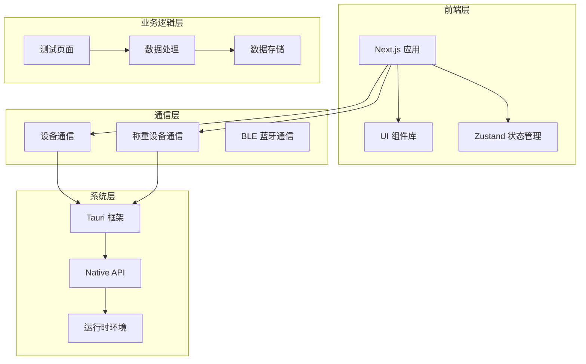
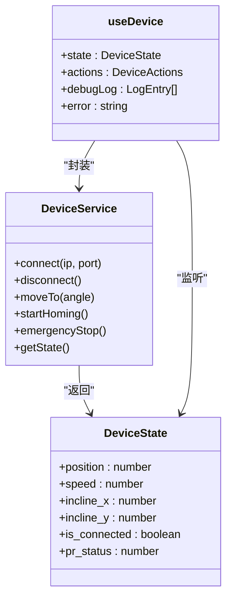
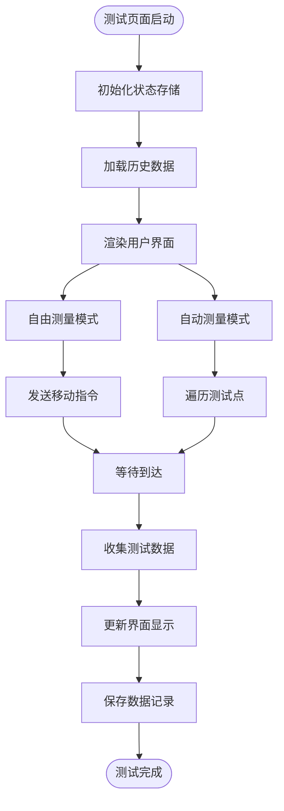
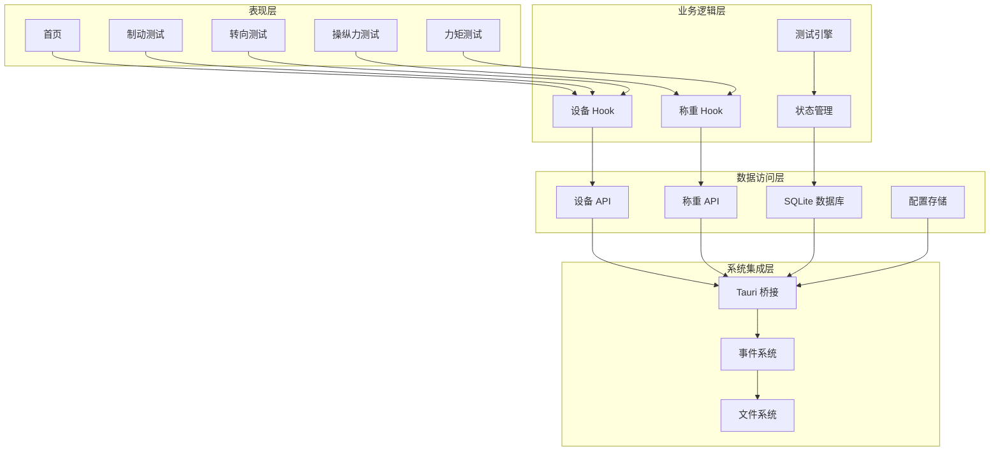
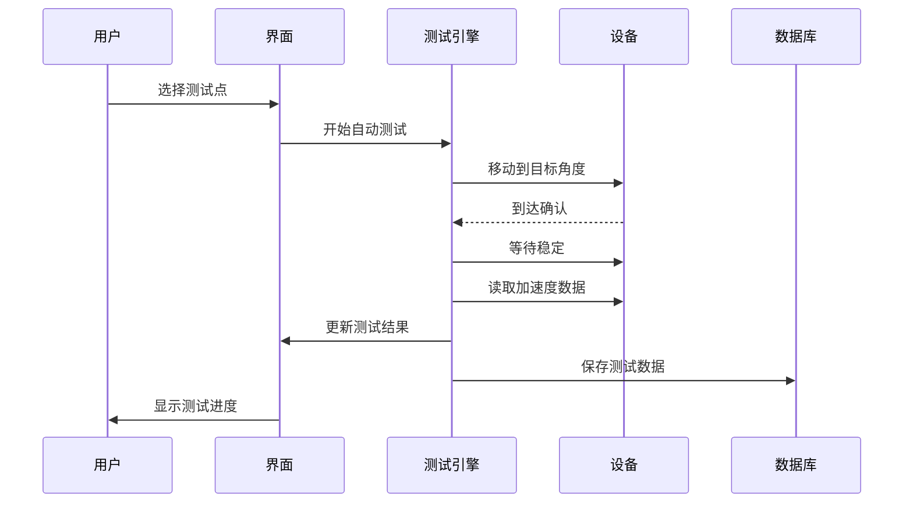
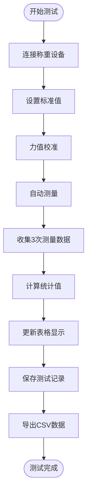
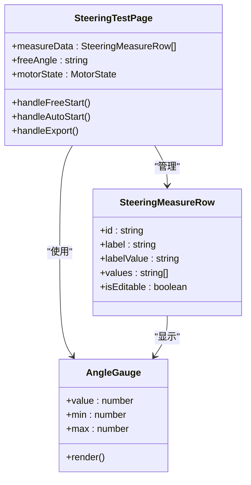
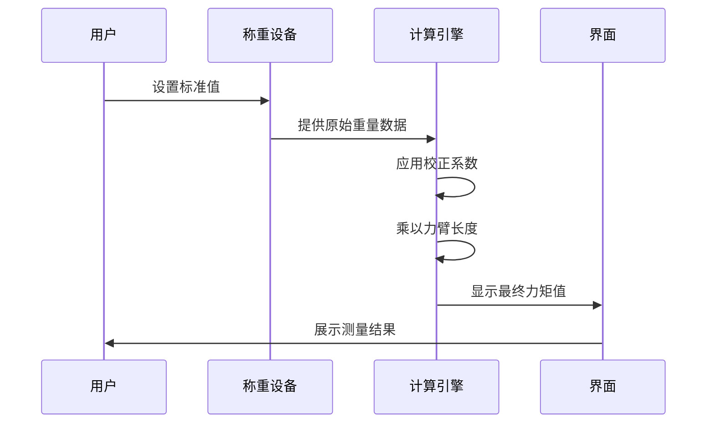

# 多测试能力支持

<cite>
**本文档引用的文件**
- [package.json](file://package.json)
- [Cargo.toml](file://src-tauri/Cargo.toml)
- [app/page.tsx](file://app/page.tsx)
- [lib/config.ts](file://lib/config.ts)
- [src-tauri/src/main.rs](file://src-tauri/src/main.rs)
- [app/brake-test/page.tsx](file://app/brake-test/page.tsx)
- [app/control-force-test/page.tsx](file://app/control-force-test/page.tsx)
- [app/steering-test/page.tsx](file://app/steering-test/page.tsx)
- [app/torque-test/page.tsx](file://app/torque-test/page.tsx)
- [lib/comm/use-device.ts](file://lib/comm/use-device.ts)
- [lib/store/index.ts](file://lib/store/index.ts)
- [src-tauri/src/lib.rs](file://src-tauri/src/lib.rs)
- [src-tauri/src/comm/mod.rs](file://src-tauri/src/comm/mod.rs)
- [components/AppReady.tsx](file://components/AppReady.tsx)
</cite>

## 目录
1. [项目概述](#项目概述)
2. [项目结构](#项目结构)
3. [核心组件](#核心组件)
4. [架构概览](#架构概览)
5. [详细组件分析](#详细组件分析)
6. [依赖关系分析](#依赖关系分析)
7. [性能考虑](#性能考虑)
8. [故障排除指南](#故障排除指南)
9. [结论](#结论)

## 项目概述

这是一个基于 React 和 Tauri 技术栈开发的多测试能力支持系统，专门用于机动车角度综合校准装置的多种测试场景。该系统提供了完整的测试解决方案，包括制动测试、操纵力测试、转向测试和力矩测试等功能模块。

### 主要特性
- **多测试场景支持**：涵盖制动、操纵力、转向、力矩等多种测试类型
- **跨平台部署**：支持 Windows、macOS、Linux 等多个操作系统
- **实时数据采集**：通过 TCP 连接和 BLE 蓝牙技术实现实时数据采集
- **数据持久化**：提供完整的测试数据记录和管理功能
- **用户友好界面**：采用现代化的 UI 设计，提供直观的操作体验

## 项目结构



**图表来源**
- [package.json:1-46](file://package.json#L1-L46)
- [src-tauri/Cargo.toml:1-42](file://src-tauri/Cargo.toml#L1-L42)

**章节来源**
- [package.json:1-46](file://package.json#L1-L46)
- [src-tauri/Cargo.toml:1-42](file://src-tauri/Cargo.toml#L1-L42)

## 核心组件

### 设备通信系统

系统的核心是基于 React Hooks 的设备通信抽象层，提供了统一的设备控制接口：



**图表来源**
- [lib/comm/use-device.ts:17-116](file://lib/comm/use-device.ts#L17-L116)

### 测试页面架构

每个测试页面都遵循相似的架构模式，包含自由测量、自动测量和数据记录功能：



**图表来源**
- [app/brake-test/page.tsx:105-347](file://app/brake-test/page.tsx#L105-L347)
- [app/steering-test/page.tsx:72-231](file://app/steering-test/page.tsx#L72-L231)

**章节来源**
- [lib/comm/use-device.ts:1-117](file://lib/comm/use-device.ts#L1-L117)
- [app/brake-test/page.tsx:1-901](file://app/brake-test/page.tsx#L1-L901)
- [app/steering-test/page.tsx:1-734](file://app/steering-test/page.tsx#L1-L734)

## 架构概览

系统采用分层架构设计，实现了前后端分离和模块化组织：



**图表来源**
- [app/page.tsx:16-441](file://app/page.tsx#L16-L441)
- [lib/store/index.ts:1-15](file://lib/store/index.ts#L1-L15)

**章节来源**
- [app/page.tsx:1-441](file://app/page.tsx#L1-L441)
- [lib/store/index.ts:1-15](file://lib/store/index.ts#L1-L15)

## 详细组件分析

### 制动测试系统

制动测试系统是最复杂的测试模块，提供了完整的测试流程自动化：



**图表来源**
- [app/brake-test/page.tsx:302-347](file://app/brake-test/page.tsx#L302-L347)

制动测试系统的关键特性包括：
- **自动测试流程**：支持连续的测试点遍历和数据采集
- **实时数据监控**：通过倾角仪提供实时角度和加速度数据
- **数据质量控制**：自动计算加速度值和仪器示值
- **完整记录管理**：支持测试数据的保存、查看和导出

**章节来源**
- [app/brake-test/page.tsx:1-901](file://app/brake-test/page.tsx#L1-L901)

### 操纵力测试系统

操纵力测试系统专注于测量不同类型的操纵力，支持踏板力和手刹力两种模式：



**图表来源**
- [app/control-force-test/page.tsx:398-422](file://app/control-force-test/page.tsx#L398-L422)

操纵力测试系统的特色功能：
- **双单位支持**：同时支持踏板力(N)和手刹力(N)测试
- **漂移测试**：提供长时间稳定性测试功能
- **力值校正**：支持基于标准值的自动校正
- **统计分析**：自动计算平均值、误差和重复性指标

**章节来源**
- [app/control-force-test/page.tsx:1-909](file://app/control-force-test/page.tsx#L1-L909)

### 转向测试系统

转向测试系统专门用于测量转向系统的性能参数：



**图表来源**
- [app/steering-test/page.tsx:21-734](file://app/steering-test/page.tsx#L21-L734)

转向测试系统的核心功能：
- **三轮测量**：支持对每个测试点进行三次独立测量
- **角度仪表显示**：提供直观的角度测量可视化
- **自由测量模式**：允许用户手动控制测试过程
- **自动测试流程**：支持预设测试点的自动化测试

**章节来源**
- [app/steering-test/page.tsx:1-734](file://app/steering-test/page.tsx#L1-L734)

### 力矩测试系统

力矩测试系统结合了称重测量和力臂长度计算功能：



**图表来源**
- [app/torque-test/page.tsx:168-175](file://app/torque-test/page.tsx#L168-L175)

力矩测试系统的独特优势：
- **力矩计算**：支持从重量数据计算力矩值
- **力臂调节**：允许用户设置和调整力臂长度
- **双向测试**：支持顺时针和逆时针两个方向的测试
- **漂移监控**：提供长时间稳定性监测功能

**章节来源**
- [app/torque-test/page.tsx:1-933](file://app/torque-test/page.tsx#L1-L933)

## 依赖关系分析

系统采用了模块化的依赖管理策略，确保各组件之间的松耦合：

```mermaid
graph LR
subgraph "核心依赖"
React[React 19.0.0]
NextJS[Next.js 15.1.0]
Tauri[Tauri 2.10.0]
Zustand[Zustand 5.0.12]
end
subgraph "UI 组件"
Recharts[Recharts 3.8.1]
Lucide[Lucide React]
Tailwind[Tailwind CSS]
end
subgraph "通信层"
Dialog[@tauri-apps/plugin-dialog]
Opener[@tauri-apps/plugin-opener]
SQL[@tauri-apps/plugin-sql]
OS[@tauri-apps/plugin-os]
end
subgraph "工具库"
Serde[Serde JSON]
Tokio[Tokio 1]
Chrono[Chrono 0.4]
BLE[btleplug 0.11.8]
end
React --> NextJS
NextJS --> Zustand
Tauri --> Dialog
Tauri --> SQL
Tauri --> OS
Tauri --> BLE
Zustand --> Serde
Tokio --> Chrono
```

**图表来源**
- [package.json:18-31](file://package.json#L18-L31)
- [src-tauri/Cargo.toml:14-32](file://src-tauri/Cargo.toml#L14-L32)

**章节来源**
- [package.json:1-46](file://package.json#L1-L46)
- [src-tauri/Cargo.toml:1-42](file://src-tauri/Cargo.toml#L1-L42)

## 性能考虑

系统在设计时充分考虑了性能优化和用户体验：

### 数据流优化
- **增量更新**：使用 React 的细粒度状态更新机制
- **事件驱动**：通过事件系统实现高效的设备状态同步
- **缓存策略**：合理使用本地存储减少重复计算

### 内存管理
- **资源清理**：及时清理定时器和事件监听器
- **状态压缩**：优化状态结构减少内存占用
- **垃圾回收**：避免创建不必要的临时对象

### 网络性能
- **连接池**：复用 TCP 连接减少建立成本
- **批量操作**：合并多个小操作提高效率
- **异步处理**：避免阻塞主线程

## 故障排除指南

### 常见问题及解决方案

#### 设备连接问题
1. **检查网络连接**：确认设备 IP 地址和端口配置正确
2. **验证防火墙设置**：确保端口未被防火墙阻止
3. **重启服务**：尝试重启设备和应用程序

#### 数据采集异常
1. **检查传感器校准**：定期进行传感器校准
2. **验证测量环境**：确保测试环境稳定
3. **更新固件**：保持设备固件为最新版本

#### 界面响应问题
1. **清除缓存**：清理浏览器缓存和应用缓存
2. **检查权限**：确认应用具有必要的系统权限
3. **重启应用**：完全关闭后重新启动应用

**章节来源**
- [lib/comm/use-device.ts:66-91](file://lib/comm/use-device.ts#L66-L91)

## 结论

多测试能力支持系统是一个功能完整、架构清晰的测试解决方案。通过模块化设计和标准化的数据处理流程，系统能够满足不同测试场景的需求。

### 主要优势
- **功能全面**：覆盖了机动车测试的主要需求
- **扩展性强**：模块化架构便于功能扩展
- **用户体验好**：直观的界面设计和流畅的操作体验
- **可靠性高**：完善的错误处理和数据备份机制

### 发展方向
- **AI 辅助分析**：集成机器学习算法进行数据分析
- **云端同步**：支持多设备间的数据同步和共享
- **移动端支持**：开发移动端应用扩大使用范围
- **自动化程度提升**：进一步减少人工干预提高效率

该系统为机动车测试领域提供了一个可靠的数字化解决方案，具有良好的应用前景和发展潜力。