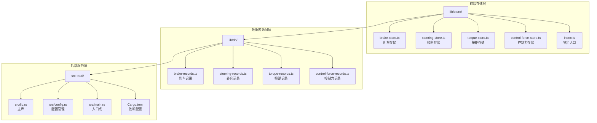
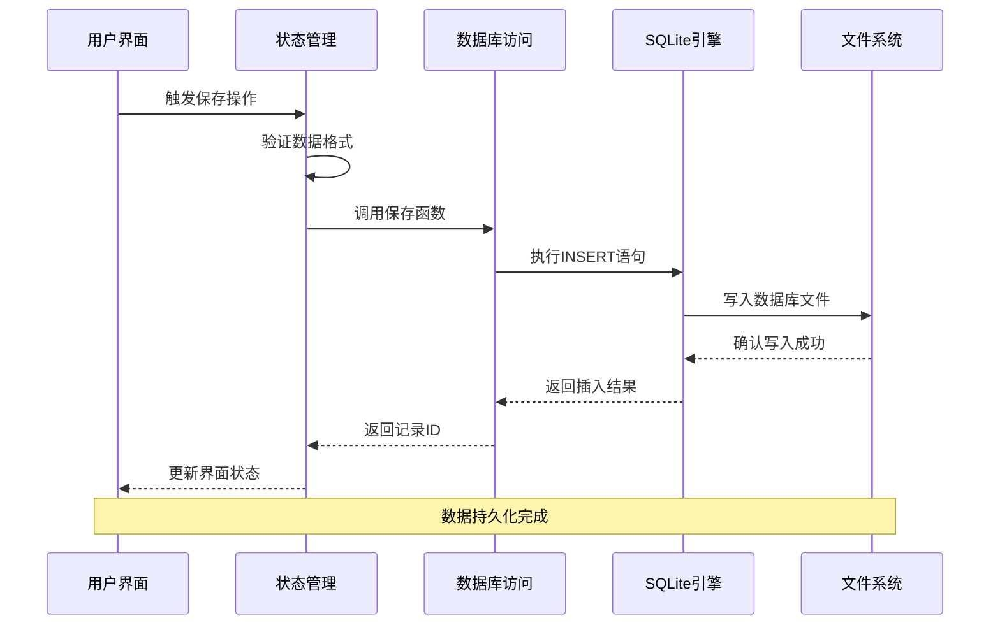
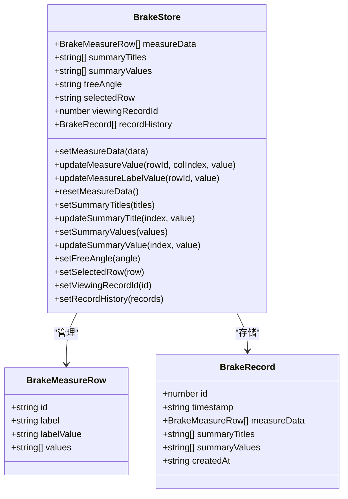
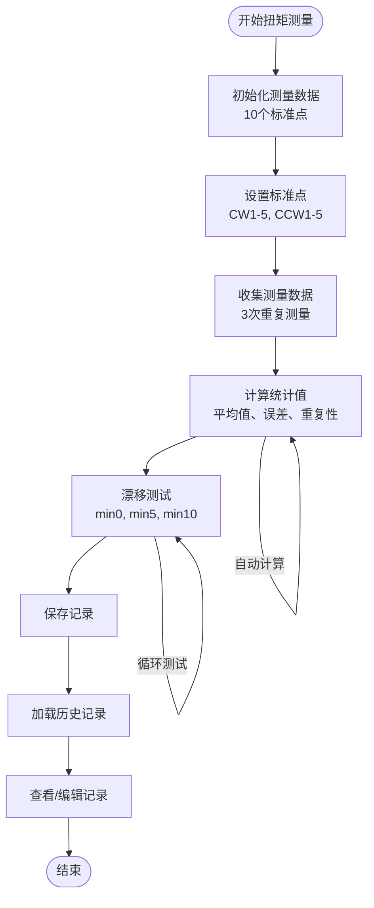
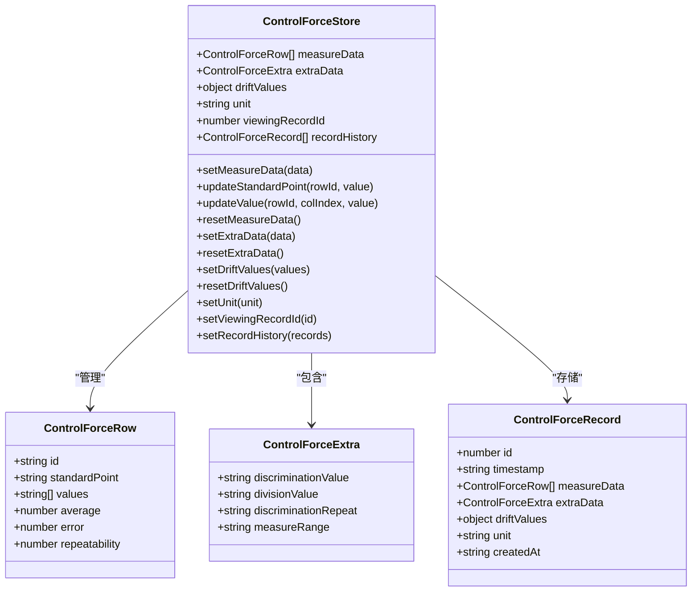
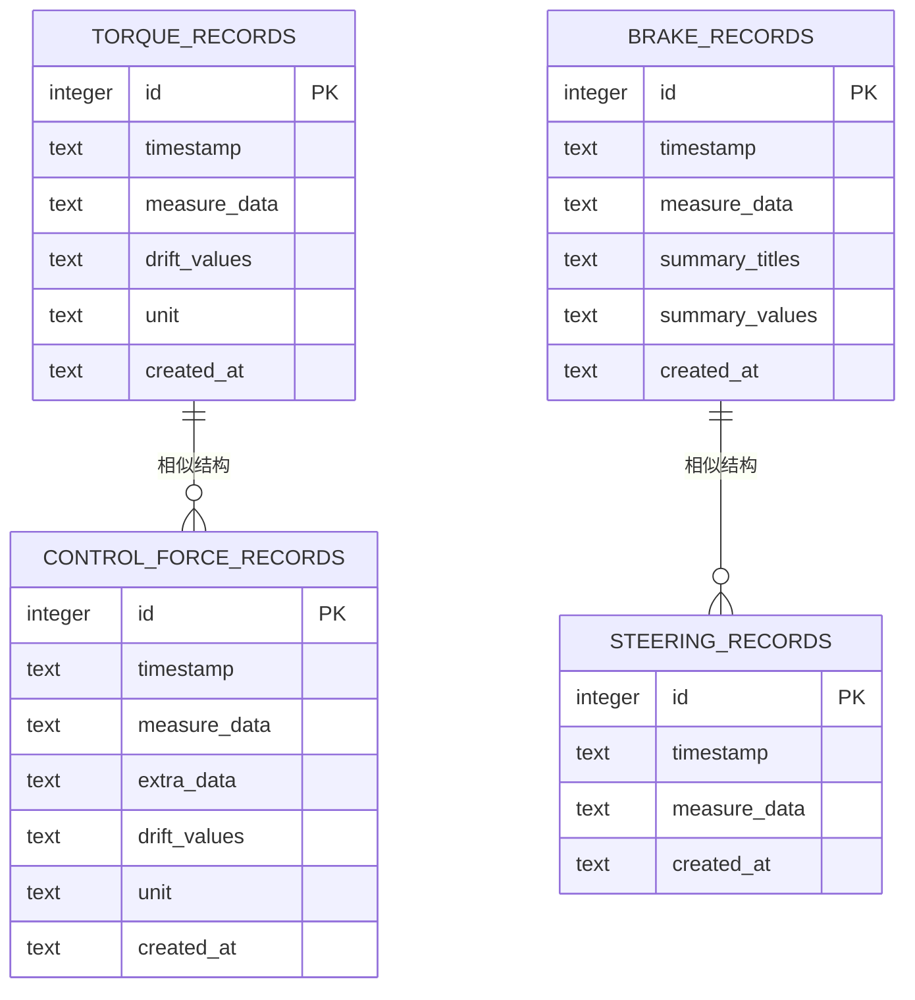

# 数据库存储系统

<cite>
**本文档引用的文件**
- [lib/store/index.ts](file://lib/store/index.ts)
- [lib/store/brake-store.ts](file://lib/store/brake-store.ts)
- [lib/store/steering-store.ts](file://lib/store/steering-store.ts)
- [lib/store/torque-store.ts](file://lib/store/torque-store.ts)
- [lib/store/control-force-store.ts](file://lib/store/control-force-store.ts)
- [lib/db/brake-records.ts](file://lib/db/brake-records.ts)
- [lib/db/steering-records.ts](file://lib/db/steering-records.ts)
- [lib/db/torque-records.ts](file://lib/db/torque-records.ts)
- [lib/db/control-force-records.ts](file://lib/db/control-force-records.ts)
- [lib/tauri.ts](file://lib/tauri.ts)
- [src-tauri/src/lib.rs](file://src-tauri/src/lib.rs)
- [src-tauri/src/main.rs](file://src-tauri/src/main.rs)
- [src-tauri/src/config.rs](file://src-tauri/src/config.rs)
- [src-tauri/Cargo.toml](file://src-tauri/Cargo.toml)
- [package.json](file://package.json)
</cite>

## 目录
1. [简介](#简介)
2. [项目结构](#项目结构)
3. [核心组件](#核心组件)
4. [架构概览](#架构概览)
5. [详细组件分析](#详细组件分析)
6. [依赖关系分析](#依赖关系分析)
7. [性能考虑](#性能考虑)
8. [故障排除指南](#故障排除指南)
9. [结论](#结论)

## 简介

数据库存储系统是机动车角度综合校准装置的核心数据管理模块，负责存储和管理各种类型的测量数据。该系统采用SQLite数据库，通过Tauri框架实现跨平台的数据持久化功能，支持刹车力、转向角、扭矩和控制力等多种测量类型的记录存储。

系统采用分层架构设计，包括前端状态管理层、数据库访问层和后端服务层，确保数据的一致性和可靠性。每个测量类型都有专门的数据模型和存储逻辑，支持完整的CRUD操作和数据查询功能。

## 项目结构

数据库存储系统主要分布在以下目录结构中：



**图表来源**
- [lib/store/index.ts:1-15](file://lib/store/index.ts#L1-L15)
- [lib/db/brake-records.ts:1-86](file://lib/db/brake-records.ts#L1-L86)
- [src-tauri/src/lib.rs:1-800](file://src-tauri/src/lib.rs#L1-L800)

**章节来源**
- [lib/store/index.ts:1-15](file://lib/store/index.ts#L1-L15)
- [lib/db/brake-records.ts:1-86](file://lib/db/brake-records.ts#L1-L86)
- [src-tauri/src/lib.rs:1-800](file://src-tauri/src/lib.rs#L1-L800)

## 核心组件

### 前端状态管理组件

系统使用Zustand状态管理库为每种测量类型提供专门的状态管理：

- **刹车存储** (`brake-store.ts`): 管理刹车力测量数据，支持多行多列的测量表格
- **转向存储** (`steering-store.ts`): 处理转向角测量数据，包含自由测量功能
- **扭矩存储** (`torque-store.ts`): 管理扭矩测量数据，支持漂移测试
- **控制力存储** (`control-force-store.ts`): 处理控制力测量，包含额外的仪器参数

### 数据库访问组件

每个测量类型都对应一个数据库访问模块，提供完整的数据持久化功能：

- **记录初始化**: 自动创建对应的SQLite表结构
- **数据插入**: 保存新的测量记录
- **数据查询**: 获取所有或特定记录
- **数据更新**: 修改现有记录
- **数据删除**: 移除不需要的记录

### 环境检测组件

`lib/tauri.ts` 提供了跨平台的环境检测功能，确保数据库操作只在桌面环境下执行。

**章节来源**
- [lib/store/brake-store.ts:1-138](file://lib/store/brake-store.ts#L1-L138)
- [lib/store/steering-store.ts:1-107](file://lib/store/steering-store.ts#L1-L107)
- [lib/store/torque-store.ts:1-118](file://lib/store/torque-store.ts#L1-L118)
- [lib/store/control-force-store.ts:1-140](file://lib/store/control-force-store.ts#L1-L140)
- [lib/db/brake-records.ts:1-86](file://lib/db/brake-records.ts#L1-L86)
- [lib/db/steering-records.ts:1-74](file://lib/db/steering-records.ts#L1-L74)
- [lib/db/torque-records.ts:1-86](file://lib/db/torque-records.ts#L1-L86)
- [lib/db/control-force-records.ts:1-92](file://lib/db/control-force-records.ts#L1-L92)
- [lib/tauri.ts:1-49](file://lib/tauri.ts#L1-L49)

## 架构概览

系统采用三层架构设计，确保数据流的清晰分离和职责明确划分：



**图表来源**
- [lib/db/brake-records.ts:24-43](file://lib/db/brake-records.ts#L24-L43)
- [lib/db/torque-records.ts:31-46](file://lib/db/torque-records.ts#L31-L46)
- [lib/db/control-force-records.ts:25-47](file://lib/db/control-force-records.ts#L25-L47)
- [lib/db/steering-records.ts:22-37](file://lib/db/steering-records.ts#L22-L37)

系统架构的关键特点：

1. **分层设计**: 前端状态管理 → 数据库访问 → SQLite引擎 → 文件系统
2. **类型安全**: TypeScript提供编译时类型检查
3. **异步处理**: 所有数据库操作都是异步的
4. **错误处理**: 完善的异常捕获和错误传播机制

**章节来源**
- [lib/db/brake-records.ts:1-86](file://lib/db/brake-records.ts#L1-L86)
- [lib/db/torque-records.ts:1-86](file://lib/db/torque-records.ts#L1-L86)
- [lib/db/control-force-records.ts:1-92](file://lib/db/control-force-records.ts#L1-L92)
- [lib/db/steering-records.ts:1-74](file://lib/db/steering-records.ts#L1-L74)

## 详细组件分析

### 刹车存储系统

刹车存储系统是最复杂的测量类型，支持多维度的数据管理：



**图表来源**
- [lib/store/brake-store.ts:5-19](file://lib/store/brake-store.ts#L5-L19)
- [lib/store/brake-store.ts:37-70](file://lib/store/brake-store.ts#L37-L70)

刹车存储系统的数据结构特点：

- **测量表格**: 支持5行基础数据和可扩展的测量值数组
- **汇总表格**: 独立的标题和值数组，支持动态调整
- **历史记录**: 完整的记录管理系统，支持查看和编辑
- **状态管理**: 丰富的交互状态，包括选中行和查看状态

**章节来源**
- [lib/store/brake-store.ts:1-138](file://lib/store/brake-store.ts#L1-L138)

### 扭矩存储系统

扭矩存储系统专注于扭矩测量的特殊需求：



**图表来源**
- [lib/store/torque-store.ts:26-37](file://lib/store/torque-store.ts#L26-L37)
- [lib/store/torque-store.ts:71-97](file://lib/store/torque-store.ts#L71-L97)

扭矩存储系统的特殊功能：

- **方向标识**: 区分顺时针(CW)和逆时针(CCW)测量
- **标准点管理**: 支持多个标准点的标记和关联
- **统计计算**: 自动计算平均值、误差和重复性
- **漂移监控**: 支持长时间漂移测试

**章节来源**
- [lib/store/torque-store.ts:1-118](file://lib/store/torque-store.ts#L1-L118)

### 控制力存储系统

控制力存储系统结合了测量数据和仪器参数：



**图表来源**
- [lib/store/control-force-store.ts:5-29](file://lib/store/control-force-store.ts#L5-L29)
- [lib/store/control-force-store.ts:53-82](file://lib/store/control-force-store.ts#L53-L82)

控制力存储系统的独特特性：

- **仪器参数**: 集成鉴别力、分度值等仪器相关信息
- **单位管理**: 支持踏板力和手刹力两种单位
- **扩展数据**: 独立的额外数据存储区域
- **漂移测试**: 与扭矩系统类似的长期测试功能

**章节来源**
- [lib/store/control-force-store.ts:1-140](file://lib/store/control-force-store.ts#L1-L140)

### 数据库访问层

数据库访问层提供了统一的接口来管理不同类型的数据：



**图表来源**
- [lib/db/brake-records.ts:12-22](file://lib/db/brake-records.ts#L12-L22)
- [lib/db/torque-records.ts:12-22](file://lib/db/torque-records.ts#L12-L22)
- [lib/db/control-force-records.ts:12-23](file://lib/db/control-force-records.ts#L12-L23)
- [lib/db/steering-records.ts:12-20](file://lib/db/steering-records.ts#L12-L20)

数据库访问层的设计原则：

- **单例模式**: 每个表类型只有一个数据库实例
- **自动建表**: 首次使用时自动创建表结构
- **JSON序列化**: 使用JSON存储复杂的数据结构
- **时间戳管理**: 自动记录创建和修改时间

**章节来源**
- [lib/db/brake-records.ts:1-86](file://lib/db/brake-records.ts#L1-L86)
- [lib/db/steering-records.ts:1-74](file://lib/db/steering-records.ts#L1-L74)
- [lib/db/torque-records.ts:1-86](file://lib/db/torque-records.ts#L1-L86)
- [lib/db/control-force-records.ts:1-92](file://lib/db/control-force-records.ts#L1-L92)

## 依赖关系分析

系统依赖关系呈现清晰的层次结构：

```mermaid
graph TB
subgraph "前端依赖"
A[React应用] --> B[Zustand状态管理]
B --> C[TypeScript类型定义]
A --> D[Next.js框架]
end
subgraph "数据库依赖"
E[Tauri框架] --> F[@tauri-apps/plugin-sql]
F --> G[SQLite引擎]
G --> H[本地文件系统]
end
subgraph "后端依赖"
I[Rust语言] --> J[Tokio异步运行时]
I --> K[Serde序列化库]
I --> L[Chrono时间库]
end
subgraph "工具链"
M[Node.js运行时] --> N[构建工具]
O[包管理器] --> P[pnpm]
end
A --> E
E --> I
F --> G
J --> G
```

**图表来源**
- [package.json:18-31](file://package.json#L18-L31)
- [src-tauri/Cargo.toml:14-42](file://src-tauri/Cargo.toml#L14-L42)

依赖关系的关键特点：

1. **前端技术栈**: React + Next.js + TypeScript + Zustand
2. **数据库技术栈**: Tauri + SQLite + JSON序列化
3. **后端技术栈**: Rust + 异步编程 + 类型安全
4. **构建工具链**: Node.js + pnpm + 自动化脚本

**章节来源**
- [package.json:1-46](file://package.json#L1-L46)
- [src-tauri/Cargo.toml:1-42](file://src-tauri/Cargo.toml#L1-L42)

## 性能考虑

数据库存储系统在性能方面采用了多项优化策略：

### 数据库性能优化

- **索引策略**: 主键自动索引，查询按ID降序排列
- **连接池**: 单例模式避免重复建立数据库连接
- **批量操作**: 支持批量查询和更新操作
- **内存管理**: 及时清理不再使用的数据库连接

### 前端性能优化

- **状态分片**: 每个测量类型独立的状态管理
- **渲染优化**: 只重新渲染受影响的组件
- **缓存策略**: 本地缓存最近的测量数据
- **异步加载**: 避免阻塞主线程

### 存储优化

- **数据压缩**: JSON序列化减少存储空间
- **增量更新**: 只更新变更的数据部分
- **事务处理**: 批量操作使用事务保证一致性
- **垃圾回收**: 定期清理无用的历史记录

## 故障排除指南

### 常见问题及解决方案

**数据库连接问题**
- 检查Tauri环境检测是否正常工作
- 验证数据库文件权限和路径
- 确认SQLite插件正确安装

**数据同步问题**
- 检查JSON序列化/反序列化过程
- 验证数据类型转换是否正确
- 确认时间戳格式一致性

**性能问题**
- 监控数据库查询响应时间
- 检查前端状态更新频率
- 优化大数据量的分页加载

### 调试工具

系统提供了多种调试和监控工具：

- **启动日志**: 详细的启动过程记录
- **环境检测**: 跨平台兼容性检查
- **错误报告**: 结构化的错误信息收集
- **性能监控**: 实时性能指标跟踪

**章节来源**
- [lib/tauri.ts:1-49](file://lib/tauri.ts#L1-L49)
- [src-tauri/src/lib.rs:190-212](file://src-tauri/src/lib.rs#L190-L212)

## 结论

数据库存储系统是一个设计精良、功能完整的数据管理解决方案。系统采用现代化的技术栈和架构模式，提供了可靠的数据持久化能力。

### 主要优势

1. **架构清晰**: 分层设计确保了良好的可维护性
2. **类型安全**: TypeScript提供强大的类型检查
3. **跨平台**: Tauri框架支持多平台部署
4. **性能优秀**: 优化的数据库访问和状态管理
5. **扩展性强**: 模块化设计便于功能扩展

### 技术特色

- 统一的数据库访问接口
- 类型安全的存储模型
- 完善的错误处理机制
- 跨平台的环境适配
- 高效的性能优化策略

该系统为机动车角度综合校准装置提供了坚实的数据基础，能够满足各种测量场景的需求，并为未来的功能扩展奠定了良好的技术基础。