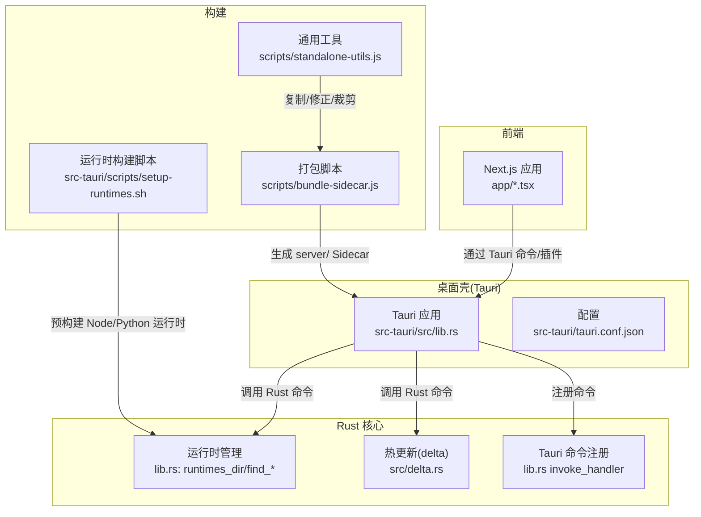
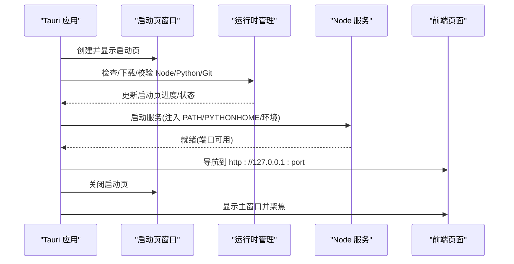
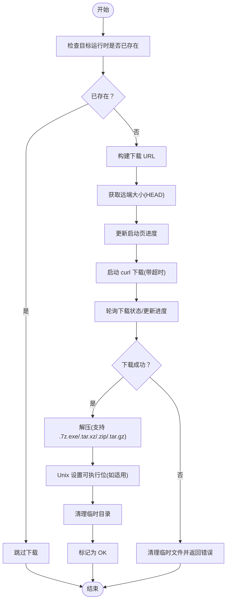
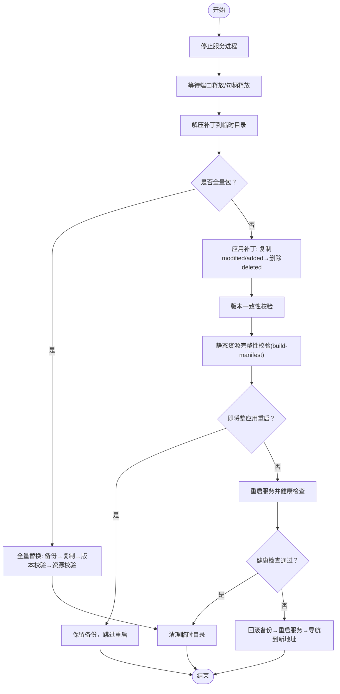
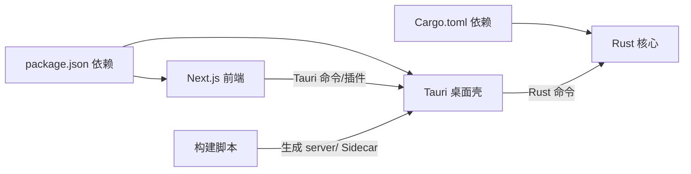

# 核心功能模块

<cite>
**本文引用的文件**
- [package.json](file://package.json)
- [next.config.ts](file://next.config.ts)
- [src-tauri/Cargo.toml](file://src-tauri/Cargo.toml)
- [src-tauri/src/main.rs](file://src-tauri/src/main.rs)
- [src-tauri/src/lib.rs](file://src-tauri/src/lib.rs)
- [src-tauri/src/delta.rs](file://src-tauri/src/delta.rs)
- [src-tauri/tauri.conf.json](file://src-tauri/tauri.conf.json)
- [lib/updater.ts](file://lib/updater.ts)
- [lib/tauri.ts](file://lib/tauri.ts)
- [app/layout.tsx](file://app/layout.tsx)
- [app/page.tsx](file://app/page.tsx)
- [scripts/bundle-sidecar.js](file://scripts/bundle-sidecar.js)
- [scripts/standalone-utils.js](file://scripts/standalone-utils.js)
- [src-tauri/scripts/setup-runtimes.sh](file://src-tauri/scripts/setup-runtimes.sh)
</cite>

## 目录
1. [引言](#引言)
2. [项目结构](#项目结构)
3. [核心组件](#核心组件)
4. [架构总览](#架构总览)
5. [详细组件分析](#详细组件分析)
6. [依赖分析](#依赖分析)
7. [性能考虑](#性能考虑)
8. [故障排查指南](#故障排查指南)
9. [结论](#结论)
10. [附录](#附录)

## 引言
本文件面向 SSTS 桌面应用的核心功能模块，系统化梳理运行时管理系统、热更新系统、系统集成功能与前端界面系统的实现与协作机制。文档以“可读性优先”的原则，结合图示与来源标注，帮助开发者快速理解模块职责、接口契约、配置项与最佳实践。

## 项目结构
SSTS 采用“前端 Next.js + 桌面壳 Tauri + Rust 后端逻辑”的分层架构：
- 前端层：Next.js 应用，负责 UI 与交互；通过 Tauri 暴露的命令与插件访问系统能力。
- 桌面壳层：Tauri 应用，负责窗口管理、托盘、URI 协议、系统集成与自动更新。
- Rust 层：提供运行时管理、热更新补丁应用、下载与校验、启动流程与日志等能力。
- 构建脚本：将 Next.js Standalone 产物打包为 Tauri Sidecar，确保运行时自包含。

**图表来源**
- [src-tauri/src/lib.rs:1300-1482](file://src-tauri/src/lib.rs#L1300-L1482)
- [src-tauri/src/delta.rs:1-793](file://src-tauri/src/delta.rs#L1-L793)
- [scripts/bundle-sidecar.js:1-19](file://scripts/bundle-sidecar.js#L1-L19)
- [scripts/standalone-utils.js:1-212](file://scripts/standalone-utils.js#L1-L212)
- [src-tauri/scripts/setup-runtimes.sh:1-38](file://src-tauri/scripts/setup-runtimes.sh#L1-L38)

**章节来源**
- [package.json:1-42](file://package.json#L1-L42)
- [src-tauri/Cargo.toml:1-28](file://src-tauri/Cargo.toml#L1-L28)
- [src-tauri/src/main.rs:1-7](file://src-tauri/src/main.rs#L1-L7)
- [src-tauri/tauri.conf.json:1-64](file://src-tauri/tauri.conf.json#L1-L64)
- [scripts/bundle-sidecar.js:1-19](file://scripts/bundle-sidecar.js#L1-L19)
- [scripts/standalone-utils.js:1-212](file://scripts/standalone-utils.js#L1-L212)
- [src-tauri/scripts/setup-runtimes.sh:1-38](file://src-tauri/scripts/setup-runtimes.sh#L1-L38)

## 核心组件
- 运行时管理系统：负责 Node.js、Python、Git 的发现、下载、校验与注入 PATH，以及启动日志与启动页状态反馈。
- 热更新系统：提供文件级补丁与全量替换两种更新策略，支持跨平台差异处理、备份与回滚、健康检查与重启。
- 系统集成功能：通过 Tauri 插件实现对话框、系统打开、通知、进程、操作系统信息、单实例、托盘等。
- 前端界面系统：Next.js 页面与布局，承载应用主界面与状态展示。

**章节来源**
- [src-tauri/src/lib.rs:245-850](file://src-tauri/src/lib.rs#L245-L850)
- [src-tauri/src/delta.rs:1-793](file://src-tauri/src/delta.rs#L1-L793)
- [lib/updater.ts:1-385](file://lib/updater.ts#L1-L385)
- [lib/tauri.ts:1-49](file://lib/tauri.ts#L1-L49)
- [app/layout.tsx:1-25](file://app/layout.tsx#L1-L25)
- [app/page.tsx:1-17](file://app/page.tsx#L1-L17)

## 架构总览
SSTS 的启动与运行流程如下：
- 开发模式：Tauri 直接导航到本地 devUrl，启动页仅做连接提示。
- 生产模式：Tauri 创建启动页窗口，下载/校验运行时，启动 Node 服务，导航至服务地址，最终关闭启动页并显示主窗口。
- 热更新：通过 Rust 命令触发补丁应用，Windows 平台具备强健的回滚与健康检查保障。

**图表来源**
- [src-tauri/src/lib.rs:1164-1296](file://src-tauri/src/lib.rs#L1164-L1296)
- [src-tauri/src/lib.rs:926-1103](file://src-tauri/src/lib.rs#L926-L1103)

**章节来源**
- [src-tauri/src/lib.rs:1354-1441](file://src-tauri/src/lib.rs#L1354-L1441)
- [src-tauri/src/lib.rs:1446-1482](file://src-tauri/src/lib.rs#L1446-L1482)

## 详细组件分析

### 运行时管理系统
职责与特性：
- 统一运行时存储目录管理与版本常量维护。
- 跨平台运行时发现：Node、Python、Git，优先使用内置运行时，否则回退系统 PATH。
- 下载与校验：基于镜像源与 curl 命令下载压缩包，解压后校验文件完整性与可执行性。
- 注入 PATH 与环境变量：增强 PATH，注入 PYTHONHOME、CLAUDE_CODE_GIT_BASH_PATH 等，保障 Windows 编码与 Claude Code 兼容。
- 启动页状态反馈：通过 JS 注入方式更新启动页进度与状态，提升用户体验。

关键流程（下载与解压）：

**图表来源**
- [src-tauri/src/lib.rs:652-850](file://src-tauri/src/lib.rs#L652-L850)

接口与参数要点（节选）：
- 下载运行时
  - 输入：app(AppHandle)、name(“node”|“python”|“git”)、label(显示名)、url(下载地址)
  - 返回：Result<(), String>
  - 关键行为：检查 curl、获取 Content-Length、进度回调、解压与权限修正
- 查找运行时
  - Node：优先 runtimes/node，其次系统 where/which 或 PATH 扫描
  - Python：优先 runtimes/python，排除 Windows Store 跳板，其次系统 where/which 或 PATH 扫描
  - Git：Windows 优先 PortableGit，其余平台系统路径
- 注入 PATH 与环境
  - Node 目录、运行时 Python 目录、Git 目录与相关 bin/usr/bin 被追加到 PATH
  - 注入 PYTHONHOME、CLAUDE_CODE_GIT_BASH_PATH、Windows UTF-8 相关环境变量

最佳实践：
- 在生产模式下，建议预先构建并内嵌运行时，减少首启下载时间。
- Windows 平台注意 Python3.exe 兼容与编码设置。
- Git Bash 路径对 Claude Code 功能至关重要，需确保 PortableGit 完整包含 bash.exe。

**章节来源**
- [src-tauri/src/lib.rs:18-30](file://src-tauri/src/lib.rs#L18-L30)
- [src-tauri/src/lib.rs:245-850](file://src-tauri/src/lib.rs#L245-L850)
- [src-tauri/scripts/setup-runtimes.sh:1-38](file://src-tauri/scripts/setup-runtimes.sh#L1-L38)

### 热更新系统（Server Delta）
职责与特性：
- 提供文件级补丁与全量替换两种更新策略，支持跨平台差异处理。
- Windows 平台：应用补丁前停止服务，失败后回滚备份并重启服务，最后进行健康检查。
- POSIX 平台：利用文件系统语义，无需停服即可应用补丁。
- 校验与安全：SHA-256 校验、build-manifest 资源完整性校验、版本一致性校验。
- 事件与进度：通过事件向前端推送补丁进度，便于 UI 响应。

关键流程（Windows 应用补丁）：

**图表来源**
- [src-tauri/src/delta.rs:305-443](file://src-tauri/src/delta.rs#L305-L443)
- [src-tauri/src/delta.rs:525-569](file://src-tauri/src/delta.rs#L525-L569)

接口与参数要点（节选）：
- apply_server_patch(app, patch_path, expected_version, will_relaunch?)
  - 输入：补丁路径、期望版本、是否即将整应用重启
  - 返回：Result<String, String>（成功时返回新版本或“版本|restarted:端口”）
  - 行为：解压、读取 manifest、备份、应用、校验、清理
- restart_server(app)
  - 输入：AppHandle
  - 返回：新服务 URL
  - 行为：停止旧进程→等待端口释放→启动新进程→等待就绪→导航
- verify_file_hash(path, expected_hash)
  - 输入：文件路径、期望哈希
  - 返回：Result<bool, String>
- get_current_server_version(app)
  - 返回：当前 server 版本字符串

最佳实践：
- 补丁包必须包含 __manifest.json（文件级补丁）或可识别为全量包。
- Windows 平台务必启用备份与回滚，确保失败后服务可恢复。
- 健康检查对 Windows 平台尤为关键，避免白屏。

**章节来源**
- [src-tauri/src/delta.rs:1-793](file://src-tauri/src/delta.rs#L1-L793)

### 系统集成功能
职责与特性：
- 插件集成：dialog、opener、updater、process、single-instance、notification、os 等。
- 自定义协议：splashpage:// 提供内嵌启动页 HTML 与图标。
- 托盘：显示/退出菜单，左键点击显示窗口，支持闪烁提示。
- 窗口事件：关闭时隐藏到托盘而非退出，Reopen 事件在 macOS 上恢复窗口。
- 远程模式：通过环境变量 GCLAW_REMOTE_URL 直接导航到外部 URL。

接口与参数要点（节选）：
- 系统操作封装（lib/tauri.ts）
  - openWithSystemApp(absolutePath)：系统打开文件
  - selectDirectory()：打开目录选择对话框
  - revealInFinder(absolutePath)：在资源管理器中定位
- 自动更新封装（lib/updater.ts）
  - checkForUpdate()：检查 Tauri 全量更新
  - downloadUpdate(onProgress?)：下载全量更新
  - installAndRelaunch()：安装并重启
  - checkServerDelta()：检查 server 热更新
  - AutoUpdater：周期性自动检查与调度

最佳实践：
- 在非 Tauri 环境下调用系统操作时，需捕获错误并降级处理。
- 自动更新建议延迟首次检查并定期轮询，避免频繁打扰用户。

**章节来源**
- [lib/tauri.ts:1-49](file://lib/tauri.ts#L1-L49)
- [lib/updater.ts:1-385](file://lib/updater.ts#L1-L385)
- [src-tauri/src/lib.rs:1314-1482](file://src-tauri/src/lib.rs#L1314-L1482)

### 前端界面系统
职责与特性：
- 布局与元数据：设置标题、视口、语言等基础信息。
- 主页：展示系统就绪状态与版本信息。
- 与桌面壳协作：通过 Tauri 命令与插件实现系统交互（打开、保存、通知等）。

最佳实践：
- 在页面加载完成后主动调用 app_ready，促使启动页过渡到主窗口。
- 使用 Tailwind CSS 保持一致的样式与主题适配。

**章节来源**
- [app/layout.tsx:1-25](file://app/layout.tsx#L1-L25)
- [app/page.tsx:1-17](file://app/page.tsx#L1-L17)

## 依赖分析
- 前端依赖：Next.js、React、TailwindCSS、Lucide React、Zustand 等。
- 桌面壳依赖：Tauri 2 及其插件集合（dialog、opener、os、process、updater、single-instance、notification、os）。
- Rust 依赖：tauri、serde、sha2、flate2、tar、curl 命令等。
- 构建依赖：Node.js、Next.js Standalone、打包脚本。

**图表来源**
- [package.json:16-40](file://package.json#L16-L40)
- [src-tauri/Cargo.toml:14-28](file://src-tauri/Cargo.toml#L14-L28)
- [scripts/bundle-sidecar.js:1-19](file://scripts/bundle-sidecar.js#L1-L19)

**章节来源**
- [package.json:1-42](file://package.json#L1-L42)
- [src-tauri/Cargo.toml:1-28](file://src-tauri/Cargo.toml#L1-L28)

## 性能考虑
- 启动性能
  - 首启下载运行时会消耗时间，建议预构建内嵌运行时并缓存。
  - 启动页进度与日志有助于定位瓶颈。
- 热更新性能
  - 文件级补丁显著降低更新体积与时间，Windows 平台通过备份与回滚保障稳定性。
  - 健康检查避免白屏，但会增加约 15-20 秒等待，可在整应用重启场景下跳过。
- 构建体积
  - Standalone 打包时移除不必要的原生二进制（如 sharp），减小公证与分发成本。
- 网络与代理
  - 下载与更新接口支持代理环境变量透传，建议在企业网络中统一配置。

[本节为通用指导，无需具体文件分析]

## 故障排查指南
常见问题与处理：
- 启动页卡住或长时间无响应
  - 检查启动日志（gclaw-startup.log）与启动页进度，确认 Node/Python/Git 是否成功下载与校验。
  - 确认网络代理配置正确，必要时更换镜像源。
- 热更新失败导致白屏
  - Windows 平台会自动回滚备份并重启服务；若健康检查失败，检查服务端口占用与静态资源完整性。
- 托盘闪烁无效
  - 确认托盘图标存在且主线程更新 UI；检查闪烁状态原子标志。
- 系统打开/目录选择失败
  - 非 Tauri 环境会抛出错误，需在前端做好降级处理。

**章节来源**
- [src-tauri/src/lib.rs:133-154](file://src-tauri/src/lib.rs#L133-L154)
- [src-tauri/src/delta.rs:377-442](file://src-tauri/src/delta.rs#L377-L442)
- [lib/tauri.ts:9-20](file://lib/tauri.ts#L9-L20)

## 结论
SSTS 的核心模块围绕“稳定启动 + 安全更新 + 无缝体验”展开：运行时管理系统确保环境一致性，热更新系统在保证安全的前提下提供高效更新，系统集成功能打通桌面与前端，前端界面简洁直观。通过合理的配置与最佳实践，可获得可靠的用户体验与开发效率。

[本节为总结，无需具体文件分析]

## 附录

### 配置选项与参数说明
- Tauri 配置（tauri.conf.json）
  - build.beforeBuildCommand：构建前执行的脚本（打包 Sidecar）
  - build.devUrl：开发模式前端地址
  - bundle.resources：打包时包含的资源（server、icons、splash.html 等）
  - plugins.updater.endpoints：更新检查端点列表
- 环境变量
  - GCLAW_REMOTE_URL：远程模式直连外部 URL
  - WEBVIEW2_ADDITIONAL_BROWSER_ARGUMENTS：Windows WebView2 参数（禁用 SmartScreen）
  - http_proxy/https_proxy/no_proxy/all_proxy：下载与更新代理透传
- 运行时常量
  - Node.js、Python、Git 版本与镜像源
  - Windows PortableGit 标签与路径

**章节来源**
- [src-tauri/tauri.conf.json:1-64](file://src-tauri/tauri.conf.json#L1-L64)
- [src-tauri/src/lib.rs:18-30](file://src-tauri/src/lib.rs#L18-L30)
- [src-tauri/src/lib.rs:603-622](file://src-tauri/src/lib.rs#L603-L622)

### 使用模式与最佳实践
- 开发模式
  - 使用本地 devUrl，自动打开 DevTools，启动页仅做连接提示。
- 生产模式
  - 首启下载运行时，注入 PATH 与环境变量，启动服务并导航。
- 热更新
  - 优先文件级补丁；Windows 平台启用备份与回滚；健康检查通过后再清理。
- 自动更新
  - 先检查 Tauri 全量更新，再检查 server 热更新；延迟首次检查并定期轮询。

**章节来源**
- [src-tauri/src/lib.rs:1376-1441](file://src-tauri/src/lib.rs#L1376-L1441)
- [lib/updater.ts:317-384](file://lib/updater.ts#L317-L384)