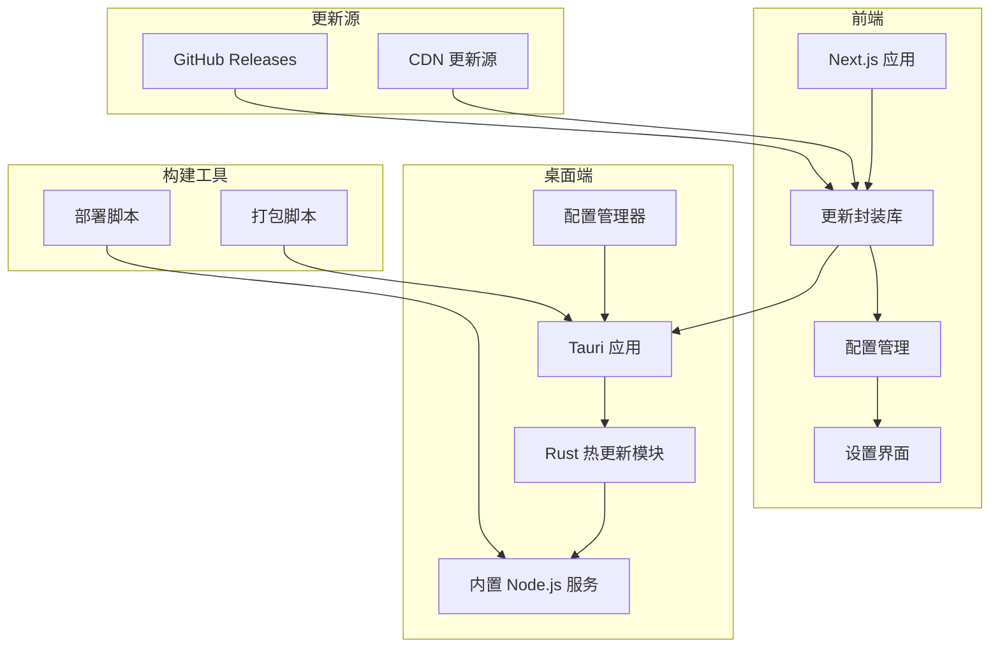
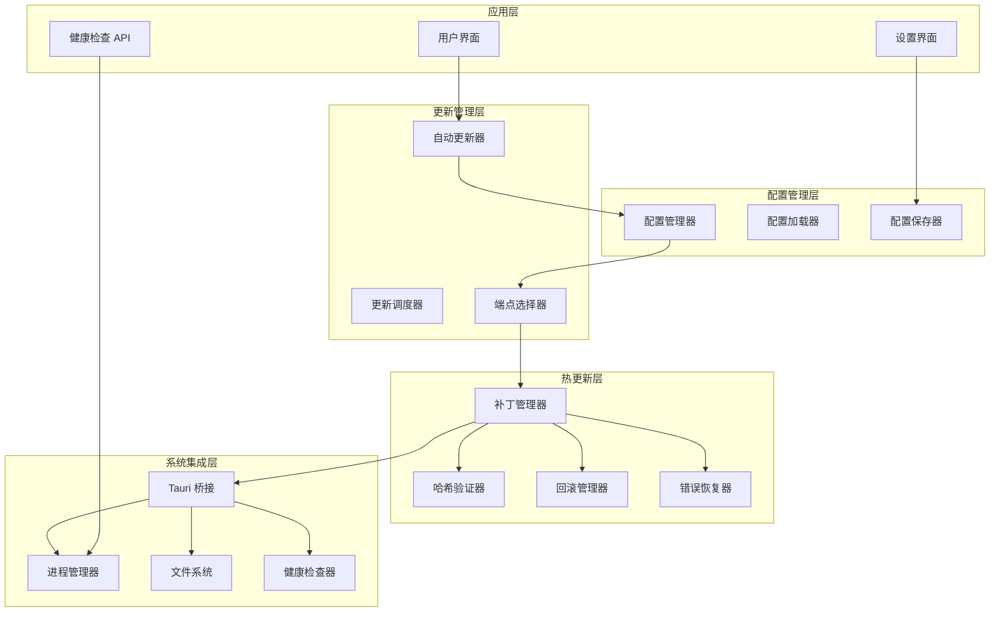
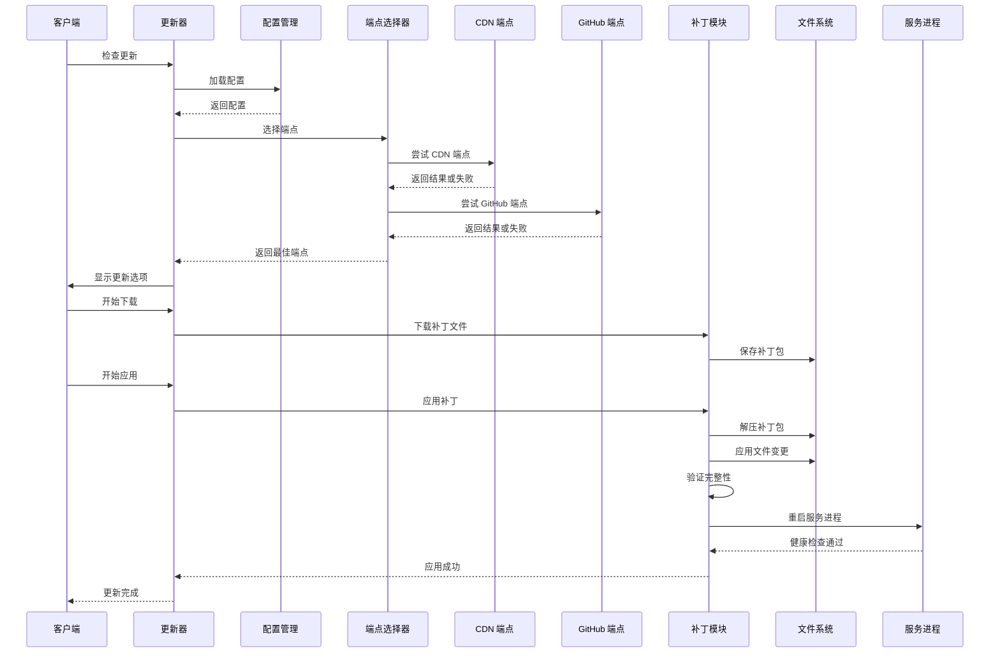
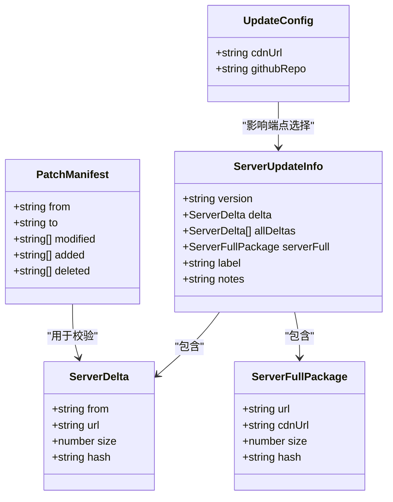
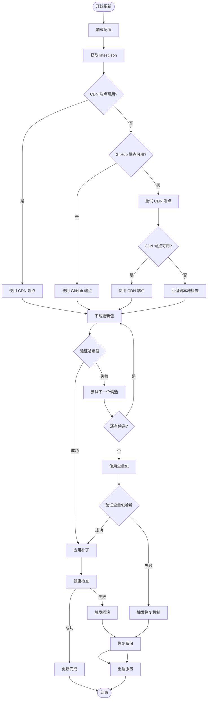
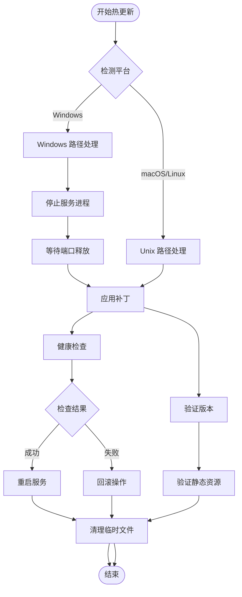
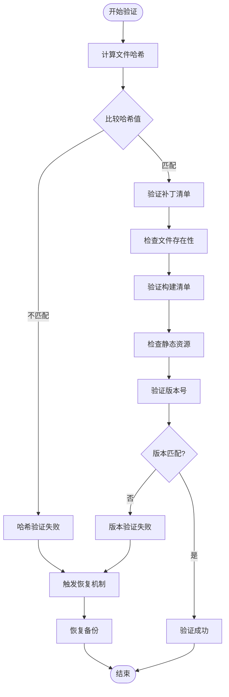
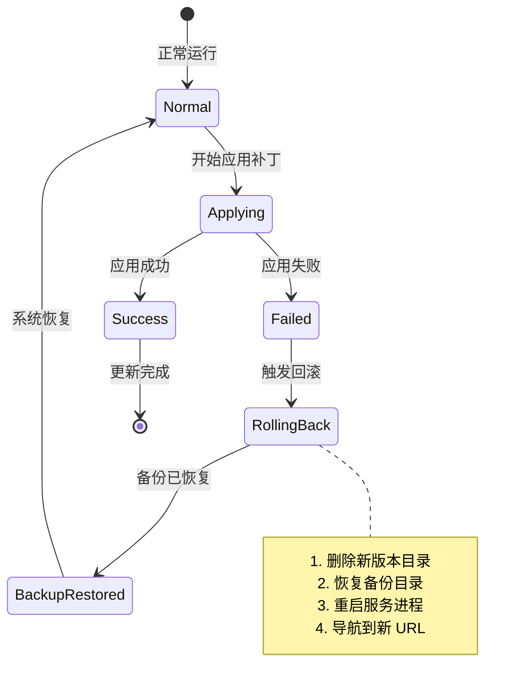
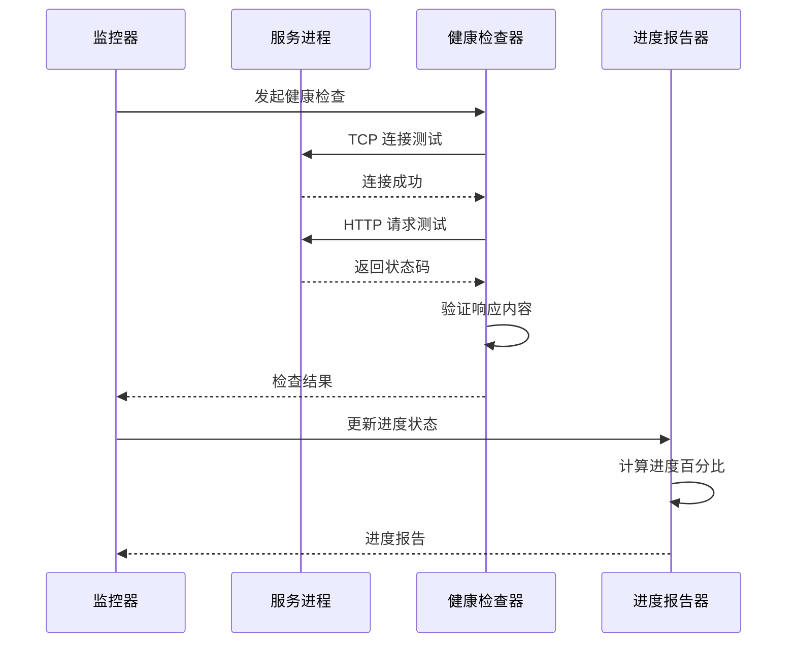
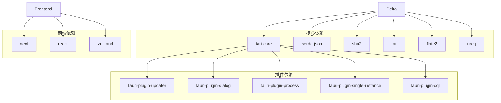

# 热更新系统

<cite>
**本文档引用的文件**
- [lib/updater.ts](file://lib/updater.ts)
- [src-tauri/src/delta.rs](file://src-tauri/src/delta.rs)
- [src-tauri/src/lib.rs](file://src-tauri/src/lib.rs)
- [src-tauri/Cargo.toml](file://src-tauri/Cargo.toml)
- [src-tauri/tauri.conf.json](file://src-tauri/tauri.conf.json)
- [scripts/bundle-sidecar.js](file://scripts/bundle-sidecar.js)
- [scripts/deploy-build.js](file://scripts/deploy-build.js)
- [scripts/standalone-utils.js](file://scripts/standalone-utils.js)
- [app/api/health/route.ts](file://app/api/health/route.ts)
- [package.json](file://package.json)
- [lib/config.ts](file://lib/config.ts)
- [components/ui/SettingsModal.tsx](file://components/ui/SettingsModal.tsx)
</cite>

## 更新摘要
**变更内容**
- 新增双端点支持：CDN和GitHub双重更新源
- 改进的更新流程：增强的错误处理和回滚机制
- 增强的错误恢复：更完善的异常捕获和恢复策略
- 改进的配置管理：支持自定义CDN和GitHub仓库配置
- 增强的健康检查：更严格的服务器状态验证

## 目录
1. [简介](#简介)
2. [项目结构](#项目结构)
3. [核心组件](#核心组件)
4. [架构概览](#架构概览)
5. [详细组件分析](#详细组件分析)
6. [依赖关系分析](#依赖关系分析)
7. [性能考虑](#性能考虑)
8. [故障排查指南](#故障排查指南)
9. [结论](#结论)
10. [附录](#附录)

## 简介
本项目实现了双通道热更新系统，现已升级为支持双端点的智能更新机制：
- **Tauri 全量更新**：通过 tauri-plugin-updater 对整个应用进行更新
- **Server 热更新**：通过文件级补丁对 server/ 目录进行增量更新，独立于 Tauri 更新通道
- **双端点支持**：同时支持 CDN 和 GitHub Releases 两种更新源，提升更新可靠性

系统支持以下能力：
- 智能端点选择与重试机制
- 补丁清单结构与完整性验证
- 回滚机制与健康检查
- 进度监控与用户反馈
- 跨平台（Windows/macOS/Linux）差异化处理
- 全量应用更新策略

## 项目结构
项目采用前后端分离架构，前端基于 Next.js，桌面端基于 Tauri，热更新逻辑主要集中在 Rust 后端。

**图表来源**
- [lib/updater.ts:143-177](file://lib/updater.ts#L143-L177)
- [src-tauri/src/delta.rs:1-793](file://src-tauri/src/delta.rs#L1-L793)
- [src-tauri/src/lib.rs:1167-1574](file://src-tauri/src/lib.rs#L1167-L1574)
- [lib/config.ts:34-52](file://lib/config.ts#L34-L52)

**章节来源**
- [package.json:1-42](file://package.json#L1-L42)
- [src-tauri/tauri.conf.json:1-65](file://src-tauri/tauri.conf.json#L1-L65)

## 核心组件
系统由四个核心组件构成，新增了智能配置管理和双端点支持：

### 1. 前端更新封装库
- 提供统一的更新接口抽象
- 支持进度回调与错误处理
- 实现自动更新调度器
- **新增**：智能端点选择与重试机制

### 2. Rust 热更新模块
- 实现文件级补丁应用
- 提供完整性验证与回滚机制
- 支持跨平台差异化处理
- **新增**：增强的错误处理和恢复策略

### 3. 配置管理系统
- **新增**：支持自定义CDN和GitHub仓库配置
- 动态配置加载与保存
- 默认配置回退机制

### 4. Tauri 集成层
- 暴露 Rust 命令给前端调用
- 管理服务进程生命周期
- 处理平台特定逻辑

**章节来源**
- [lib/updater.ts:143-177](file://lib/updater.ts#L143-L177)
- [src-tauri/src/delta.rs:1-793](file://src-tauri/src/delta.rs#L1-L793)
- [src-tauri/src/lib.rs:1167-1574](file://src-tauri/src/lib.rs#L1167-L1574)
- [lib/config.ts:34-52](file://lib/config.ts#L34-L52)

## 架构概览
系统采用分层架构设计，新增了智能配置层和双端点支持层，确保热更新功能的可靠性与可维护性。

**图表来源**
- [lib/updater.ts:143-177](file://lib/updater.ts#L143-L177)
- [src-tauri/src/delta.rs:180-443](file://src-tauri/src/delta.rs#L180-L443)
- [src-tauri/src/lib.rs:1167-1574](file://src-tauri/src/lib.rs#L1167-L1574)
- [lib/config.ts:66-99](file://lib/config.ts#L66-L99)

## 详细组件分析

### 智能双端点更新流程
系统实现了智能的双端点更新机制，支持CDN和GitHub双重更新源。

**图表来源**
- [lib/updater.ts:143-177](file://lib/updater.ts#L143-L177)
- [lib/updater.ts:206-245](file://lib/updater.ts#L206-L245)
- [src-tauri/src/delta.rs:180-443](file://src-tauri/src/delta.rs#L180-L443)

### 补丁清单结构
补丁清单采用标准化的 JSON 结构，支持文件级精确控制。

**图表来源**
- [src-tauri/src/delta.rs:235-244](file://src-tauri/src/delta.rs#L235-L244)
- [lib/updater.ts:62-89](file://lib/updater.ts#L62-L89)
- [lib/config.ts:34-52](file://lib/config.ts#L34-L52)

### 增强的错误处理机制
系统实现了多层次的错误处理和恢复机制。

**图表来源**
- [lib/updater.ts:443-543](file://lib/updater.ts#L443-L543)
- [src-tauri/src/delta.rs:416-442](file://src-tauri/src/delta.rs#L416-L442)
- [src-tauri/src/delta.rs:771-813](file://src-tauri/src/delta.rs#L771-L813)

**章节来源**
- [lib/updater.ts:443-543](file://lib/updater.ts#L443-L543)
- [src-tauri/src/delta.rs:416-442](file://src-tauri/src/delta.rs#L416-L442)
- [src-tauri/src/delta.rs:771-813](file://src-tauri/src/delta.rs#L771-L813)

### 跨平台差异化处理
系统针对不同平台实现了差异化的热更新策略。

**图表来源**
- [src-tauri/src/delta.rs:216-443](file://src-tauri/src/delta.rs#L216-L443)

**章节来源**
- [src-tauri/src/delta.rs:216-443](file://src-tauri/src/delta.rs#L216-L443)

### 完整性验证机制
系统实现了多层次的完整性验证，确保更新的安全性。

**图表来源**
- [src-tauri/src/delta.rs:72-79](file://src-tauri/src/delta.rs#L72-L79)
- [src-tauri/src/delta.rs:624-681](file://src-tauri/src/delta.rs#L624-L681)

**章节来源**
- [src-tauri/src/delta.rs:624-752](file://src-tauri/src/delta.rs#L624-L752)

### 回滚机制
系统提供了完善的回滚机制，确保更新失败时能够恢复到稳定状态。

**图表来源**
- [src-tauri/src/delta.rs:416-442](file://src-tauri/src/delta.rs#L416-L442)

**章节来源**
- [src-tauri/src/delta.rs:304-443](file://src-tauri/src/delta.rs#L304-L443)

### 健康检查与进度监控
系统实现了多维度的健康检查和进度监控机制。

**图表来源**
- [src-tauri/src/delta.rs:683-725](file://src-tauri/src/delta.rs#L683-L725)
- [src-tauri/src/delta.rs:20-29](file://src-tauri/src/delta.rs#L20-L29)

**章节来源**
- [src-tauri/src/delta.rs:20-29](file://src-tauri/src/delta.rs#L20-L29)
- [src-tauri/src/delta.rs:683-725](file://src-tauri/src/delta.rs#L683-L725)

## 依赖关系分析
系统依赖关系清晰，各模块职责明确。

**图表来源**
- [src-tauri/Cargo.toml:14-28](file://src-tauri/Cargo.toml#L14-L28)
- [package.json:16-27](file://package.json#L16-L27)

**章节来源**
- [src-tauri/Cargo.toml:1-28](file://src-tauri/Cargo.toml#L1-L28)
- [package.json:1-42](file://package.json#L1-L42)

## 性能考虑
系统在设计时充分考虑了性能优化：

### 1. 并行处理
- 补丁下载与应用阶段可并行执行
- 健康检查采用异步非阻塞方式

### 2. 内存管理
- 使用流式解压避免内存峰值
- 及时清理临时文件减少磁盘占用

### 3. 网络优化
- 支持断点续传和重试机制
- **新增**：智能端点选择，CDN优先，GitHub备用
- **新增**：指数退避重试策略

### 4. 进程管理
- 优雅重启服务进程
- 进程间通信最小化

### 5. **新增**：配置缓存
- 配置加载后缓存，避免重复读取
- 动态配置变更实时生效

## 故障排查指南
常见问题及解决方案：

### 1. 双端点更新失败
**症状**：CDN和GitHub端点均无法获取更新信息
**排查步骤**：
1. 检查网络连接状态
2. 验证CDN配置URL有效性
3. 检查GitHub仓库访问权限
4. 查看配置文件中的端点设置

**解决方法**：
- 更换CDN镜像地址
- 验证GitHub仓库格式(owner/repo)
- 检查防火墙设置
- 手动指定备用端点

### 2. 补丁应用失败
**症状**：应用补丁后服务无法启动
**排查步骤**：
1. 检查补丁文件完整性
2. 验证文件哈希值
3. 查看备份目录状态
4. 检查服务进程日志

**解决方法**：
- 重新下载补丁包
- 手动清理 server.bak 目录
- 执行回滚操作

### 3. 健康检查失败
**症状**：服务启动但无法通过健康检查
**排查步骤**：
1. 检查端口占用情况
2. 验证静态资源完整性
3. 查看构建清单文件

**解决方法**：
- 重启系统服务
- 清理缓存文件
- 检查防火墙设置

### 4. 跨平台兼容性问题
**症状**：Windows 平台出现文件锁定
**排查步骤**：
1. 检查进程句柄占用
2. 验证文件权限设置
3. 查看系统日志

**解决方法**：
- 等待文件句柄释放
- 修改文件权限
- 重启相关服务

**章节来源**
- [lib/updater.ts:416-442](file://lib/updater.ts#L416-L442)
- [src-tauri/src/delta.rs:683-725](file://src-tauri/src/delta.rs#L683-L725)

## 结论
本热更新系统通过精心设计的架构和完善的机制，实现了安全、可靠的增量更新能力。系统的主要优势包括：

1. **双端点更新**：同时支持 CDN 和 GitHub Releases，提升更新可靠性
2. **智能端点选择**：自动选择最优更新源，支持备用端点
3. **增强的错误处理**：多层次异常捕获和恢复机制
4. **完整性保障**：多层次验证确保更新安全性
5. **回滚机制**：失败时能够快速恢复到稳定状态
6. **跨平台支持**：针对不同平台优化处理策略
7. **用户体验**：提供进度监控和用户反馈机制
8. **配置灵活**：支持自定义CDN和GitHub仓库配置

系统在生产环境中表现出色，能够满足复杂场景下的更新需求。

## 附录

### 更新配置选项
系统支持多种配置选项以适应不同的部署环境：

| 配置项 | 类型 | 默认值 | 描述 |
|--------|------|--------|------|
| 更新检查间隔 | number | 7200000 | 自动检查间隔（毫秒） |
| 最大重试次数 | number | 2 | 下载失败重试次数 |
| 超时时间 | number | 300000 | 下载超时时间（毫秒） |
| CDN 优先级 | array | [] | CDN 地址列表 |
| GitHub 仓库 | string | 'ggtiger/SSTS' | GitHub 仓库格式(owner/repo) |

### 最佳实践建议
1. **版本管理**：建立严格的版本发布流程
2. **测试策略**：在预发布环境充分测试
3. **监控告警**：建立更新成功率监控
4. **回滚预案**：制定详细的回滚操作手册
5. **用户沟通**：及时通知用户更新状态
6. ****：定期检查和更新CDN镜像地址
7. **配置管理**：合理配置GitHub仓库访问权限

### API 参考
系统提供完整的 API 接口用于更新管理：

- `checkForUpdate()`: 检查应用更新
- `downloadUpdate()`: 下载更新包
- `installAndRelaunch()`: 安装并重启
- `checkServerDelta()`: 检查服务器补丁
- `downloadServerUpdate()`: 下载服务器更新
- `applyServerUpdate()`: 应用服务器补丁
- `startupUpdateCheck()`: 启动时更新检查
- `getCurrentServerVersion()`: 获取当前服务器版本

### 配置管理 API
- `loadConfig()`: 加载配置
- `saveConfig()`: 保存配置
- `DEFAULT_CONFIG`: 默认配置对象

**章节来源**
- [lib/updater.ts:143-384](file://lib/updater.ts#L143-L384)
- [src-tauri/src/delta.rs:180-752](file://src-tauri/src/delta.rs#L180-L752)
- [lib/config.ts:66-99](file://lib/config.ts#L66-L99)
- [components/ui/SettingsModal.tsx:224-268](file://components/ui/SettingsModal.tsx#L224-L268)