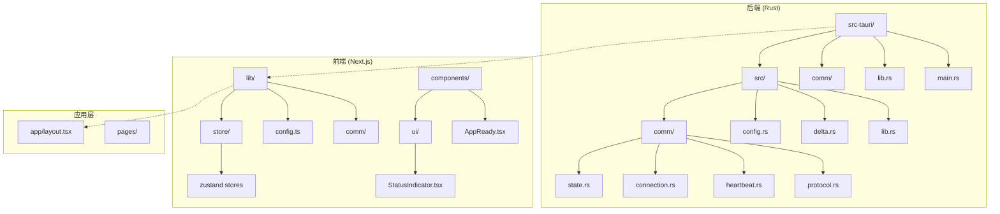
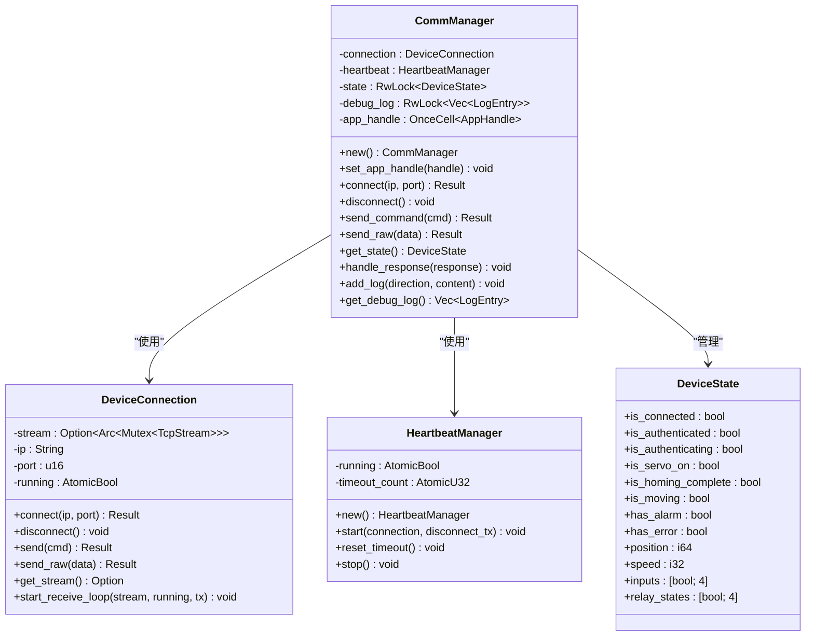
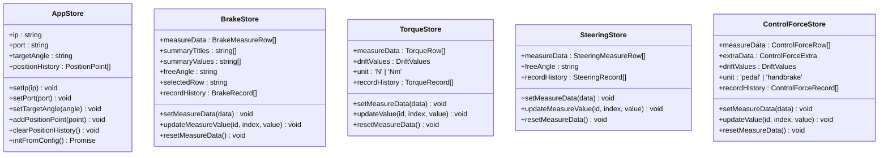
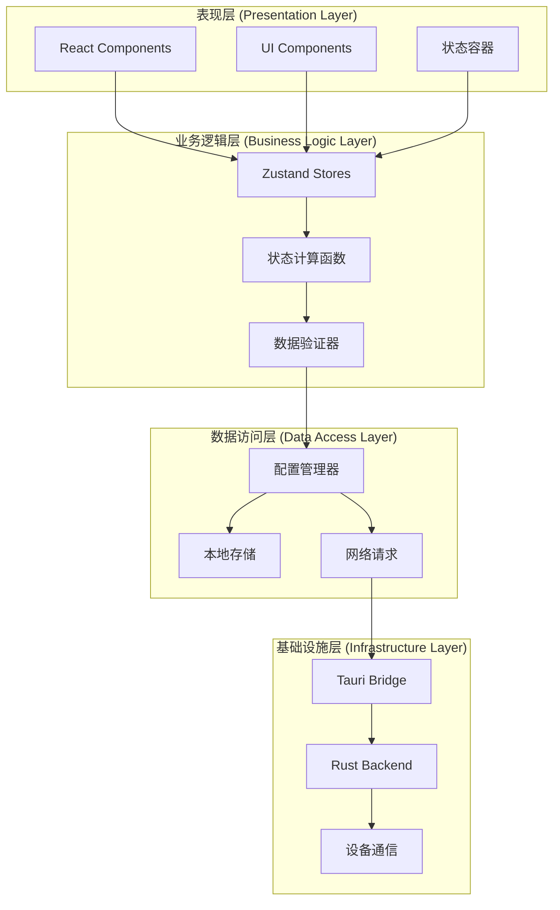
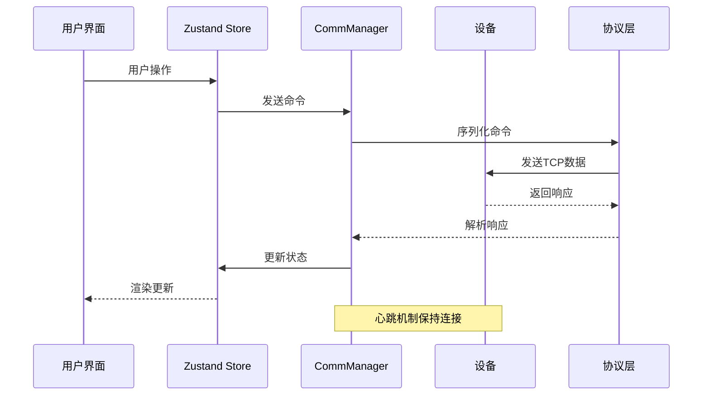
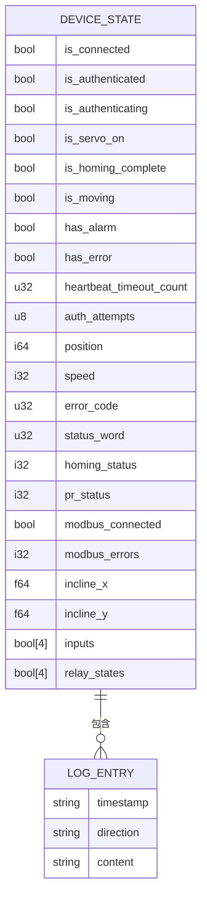
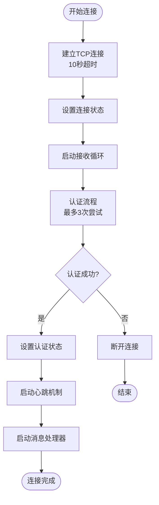
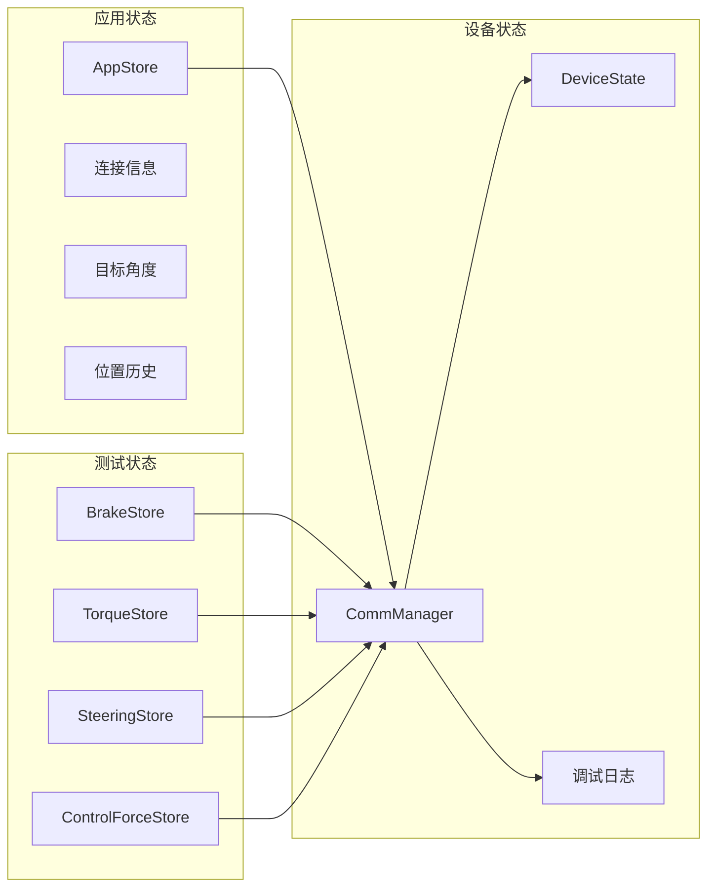

# 状态管理系统

<cite>
**本文档引用的文件**
- [src-tauri/src/lib.rs](file://src-tauri/src/lib.rs)
- [src-tauri/src/main.rs](file://src-tauri/src/main.rs)
- [src-tauri/src/comm/state.rs](file://src-tauri/src/comm/state.rs)
- [src-tauri/src/comm/connection.rs](file://src-tauri/src/comm/connection.rs)
- [src-tauri/src/comm/heartbeat.rs](file://src-tauri/src/comm/heartbeat.rs)
- [src-tauri/src/comm/protocol.rs](file://src-tauri/src/comm/protocol.rs)
- [src-tauri/src/comm/mod.rs](file://src-tauri/src/comm/mod.rs)
- [lib/store/app-store.ts](file://lib/store/app-store.ts)
- [lib/store/index.ts](file://lib/store/index.ts)
- [lib/config.ts](file://lib/config.ts)
- [components/ui/StatusIndicator.tsx](file://components/ui/StatusIndicator.tsx)
- [components/AppReady.tsx](file://components/AppReady.tsx)
- [app/layout.tsx](file://app/layout.tsx)
</cite>

## 目录
1. [简介](#简介)
2. [项目结构](#项目结构)
3. [核心组件](#核心组件)
4. [架构概览](#架构概览)
5. [详细组件分析](#详细组件分析)
6. [依赖关系分析](#依赖关系分析)
7. [性能考虑](#性能考虑)
8. [故障排除指南](#故障排除指南)
9. [结论](#结论)

## 简介

这是一个基于 Rust 和 Next.js 构建的状态管理系统，主要用于工业设备的远程监控和控制。系统采用前后端分离架构，后端使用 Tauri 框架提供桌面应用能力，前端使用 React 和 Zustand 进行状态管理。

该系统的核心功能包括：
- 设备连接状态管理
- 实时数据传输和同步
- 用户界面状态控制
- 配置管理和持久化
- 调试日志记录

## 项目结构

项目采用模块化的组织方式，主要分为以下几个部分：



**图表来源**
- [src-tauri/src/lib.rs:1-800](file://src-tauri/src/lib.rs#L1-L800)
- [lib/store/index.ts:1-15](file://lib/store/index.ts#L1-L15)

**章节来源**
- [src-tauri/src/lib.rs:1-800](file://src-tauri/src/lib.rs#L1-L800)
- [lib/store/index.ts:1-15](file://lib/store/index.ts#L1-L15)

## 核心组件

### 设备通信管理器 (CommManager)

CommManager 是整个系统的核心组件，负责设备连接、状态管理和数据传输。



**图表来源**
- [src-tauri/src/comm/state.rs:54-461](file://src-tauri/src/comm/state.rs#L54-L461)
- [src-tauri/src/comm/connection.rs:9-155](file://src-tauri/src/comm/connection.rs#L9-L155)
- [src-tauri/src/comm/heartbeat.rs:7-78](file://src-tauri/src/comm/heartbeat.rs#L7-L78)

### 前端状态管理

系统使用 Zustand 进行前端状态管理，提供多个专门的状态存储：



**图表来源**
- [lib/store/app-store.ts:10-58](file://lib/store/app-store.ts#L10-L58)
- [lib/store/brake-store.ts:37-137](file://lib/store/brake-store.ts#L37-L137)
- [lib/store/torque-store.ts:43-117](file://lib/store/torque-store.ts#L43-L117)
- [lib/store/steering-store.ts:37-106](file://lib/store/steering-store.ts#L37-L106)
- [lib/store/control-force-store.ts:53-139](file://lib/store/control-force-store.ts#L53-L139)

**章节来源**
- [src-tauri/src/comm/state.rs:54-461](file://src-tauri/src/comm/state.rs#L54-L461)
- [lib/store/app-store.ts:10-58](file://lib/store/app-store.ts#L10-L58)

## 架构概览

系统采用分层架构设计，实现了清晰的职责分离：



**图表来源**
- [src-tauri/src/lib.rs:1-800](file://src-tauri/src/lib.rs#L1-L800)
- [lib/config.ts:66-98](file://lib/config.ts#L66-L98)

系统的核心交互流程如下：



**图表来源**
- [src-tauri/src/comm/state.rs:77-129](file://src-tauri/src/comm/state.rs#L77-L129)
- [src-tauri/src/comm/connection.rs:94-153](file://src-tauri/src/comm/connection.rs#L94-L153)

## 详细组件分析

### 设备状态模型

设备状态模型定义了完整的设备运行状态信息：



**图表来源**
- [src-tauri/src/comm/state.rs:12-46](file://src-tauri/src/comm/state.rs#L12-L46)

### 连接管理流程

连接管理实现了完整的设备连接生命周期：



**图表来源**
- [src-tauri/src/comm/state.rs:77-129](file://src-tauri/src/comm/state.rs#L77-L129)
- [src-tauri/src/comm/state.rs:131-187](file://src-tauri/src/comm/state.rs#L131-L187)

### 前端状态同步机制

前端使用多种状态管理模式：



**图表来源**
- [lib/store/app-store.ts:30-58](file://lib/store/app-store.ts#L30-L58)
- [lib/store/index.ts:1-15](file://lib/store/index.ts#L1-L15)

**章节来源**
- [src-tauri/src/comm/state.rs:12-46](file://src-tauri/src/comm/state.rs#L12-L46)
- [src-tauri/src/comm/state.rs:77-187](file://src-tauri/src/comm/state.rs#L77-L187)
- [lib/store/app-store.ts:30-58](file://lib/store/app-store.ts#L30-L58)

## 依赖关系分析

系统各组件之间的依赖关系如下：

```mermaid
graph TB
subgraph "后端依赖"
A[src-tauri/src/lib.rs] --> B[tokio]
A --> C[tauri]
A --> D[serde]
A --> E[chrono]
end
subgraph "通信依赖"
F[src-tauri/src/comm/state.rs] --> G[src-tauri/src/comm/connection.rs]
F --> H[src-tauri/src/comm/heartbeat.rs]
F --> I[src-tauri/src/comm/protocol.rs]
end
subgraph "前端依赖"
J[lib/store/app-store.ts] --> K[zustand]
J --> L[local storage]
M[lib/config.ts] --> N[@tauri-apps/api]
end
subgraph "UI依赖"
O[components/ui/StatusIndicator.tsx] --> P[React]
Q[components/AppReady.tsx] --> R[Next.js]
end
A --> F
F --> J
J --> O
```

**图表来源**
- [src-tauri/src/lib.rs:1-800](file://src-tauri/src/lib.rs#L1-L800)
- [src-tauri/src/comm/mod.rs:1-12](file://src-tauri/src/comm/mod.rs#L1-L12)

**章节来源**
- [src-tauri/src/lib.rs:1-800](file://src-tauri/src/lib.rs#L1-L800)
- [src-tauri/src/comm/mod.rs:1-12](file://src-tauri/src/comm/mod.rs#L1-L12)

## 性能考虑

系统在设计时充分考虑了性能优化：

### 异步处理
- 使用 Tokio 异步运行时处理网络通信
- 采用无阻塞 I/O 操作
- 心跳机制使用定时器而非轮询

### 内存管理
- 使用原子操作保证线程安全
- 限制调试日志数量（最多1000条）
- 及时清理连接资源

### 网络优化
- TCP NoDelay 选项减少延迟
- 连接超时控制（10秒）
- 心跳超时检测（4次失败断开）

## 故障排除指南

### 常见问题及解决方案

#### 连接问题
1. **连接超时**：检查网络配置和设备IP地址
2. **认证失败**：验证设备密钥和网络稳定性
3. **心跳超时**：检查网络延迟和设备响应

#### 状态不同步
1. **UI状态滞后**：检查事件监听器是否正常工作
2. **数据丢失**：验证调试日志中的数据流

#### 性能问题
1. **内存泄漏**：定期检查调试日志中的内存使用
2. **CPU占用高**：优化状态更新频率

**章节来源**
- [src-tauri/src/comm/state.rs:301-323](file://src-tauri/src/comm/state.rs#L301-L323)
- [src-tauri/src/comm/connection.rs:26-47](file://src-tauri/src/comm/connection.rs#L26-L47)

## 结论

该状态管理系统采用了现代化的技术栈和架构模式，实现了高效的设备状态管理和实时数据同步。系统的主要优势包括：

1. **模块化设计**：清晰的职责分离和依赖管理
2. **异步处理**：高效的并发处理能力和响应性能
3. **状态管理**：完善的前端状态管理和持久化机制
4. **错误处理**：健壮的异常处理和恢复机制
5. **扩展性**：良好的架构设计便于功能扩展

通过合理的架构设计和实现，该系统能够满足工业设备监控和控制的高性能要求，为用户提供稳定可靠的服务。