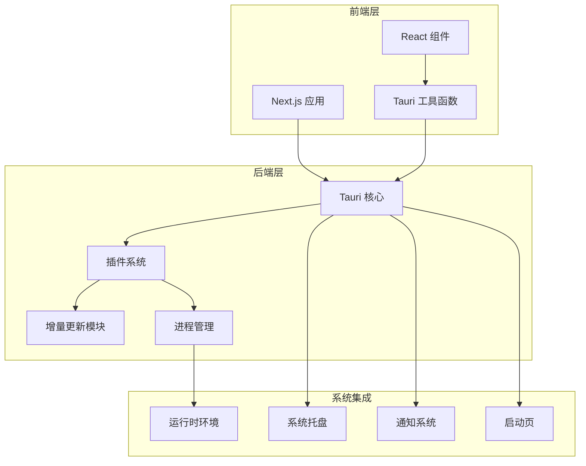
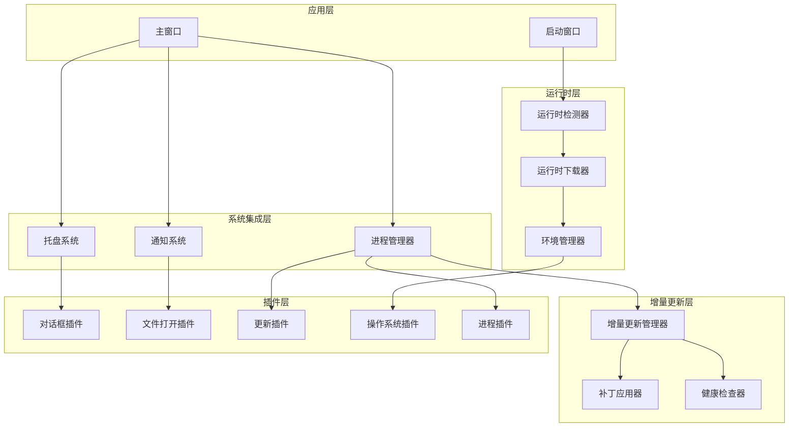
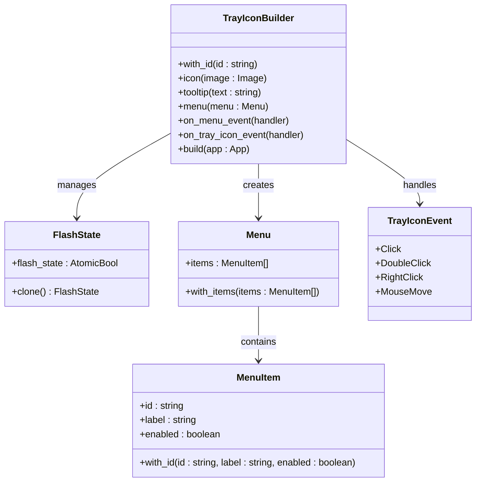
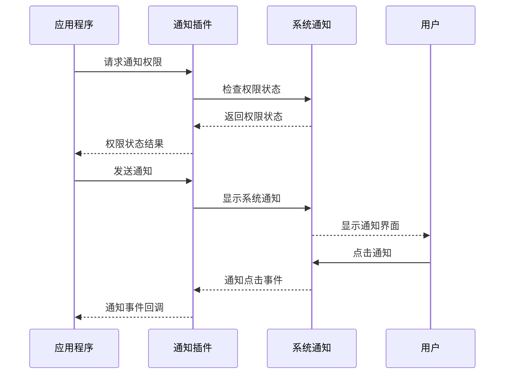
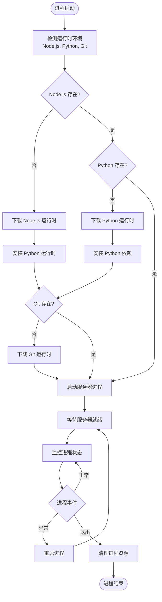
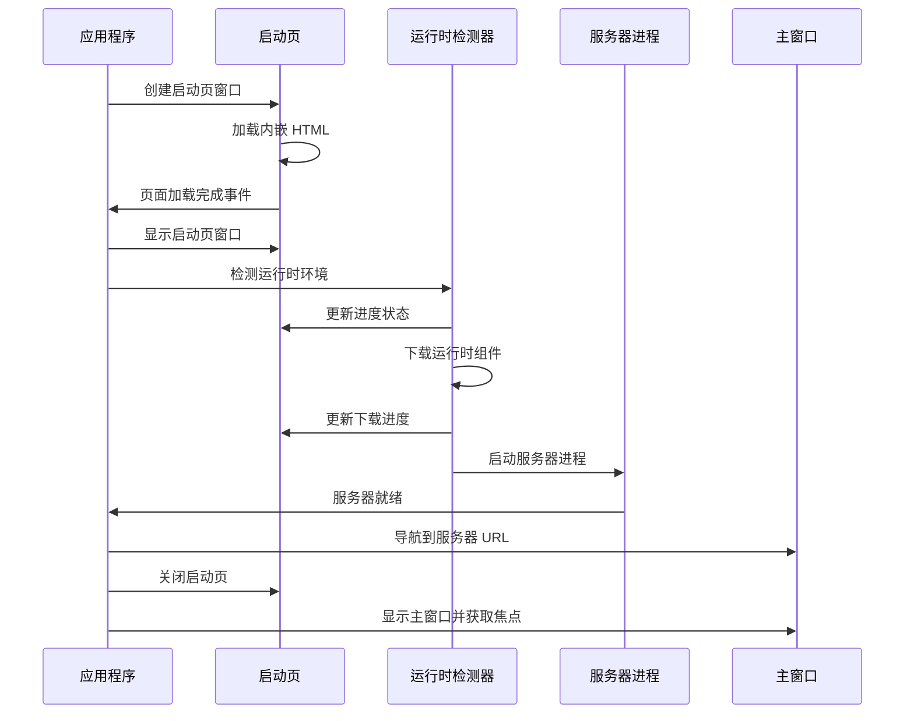
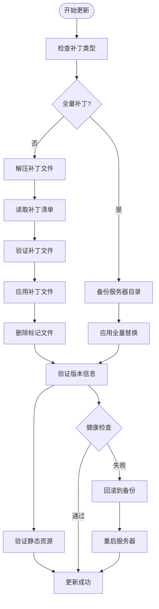
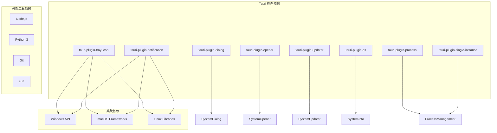
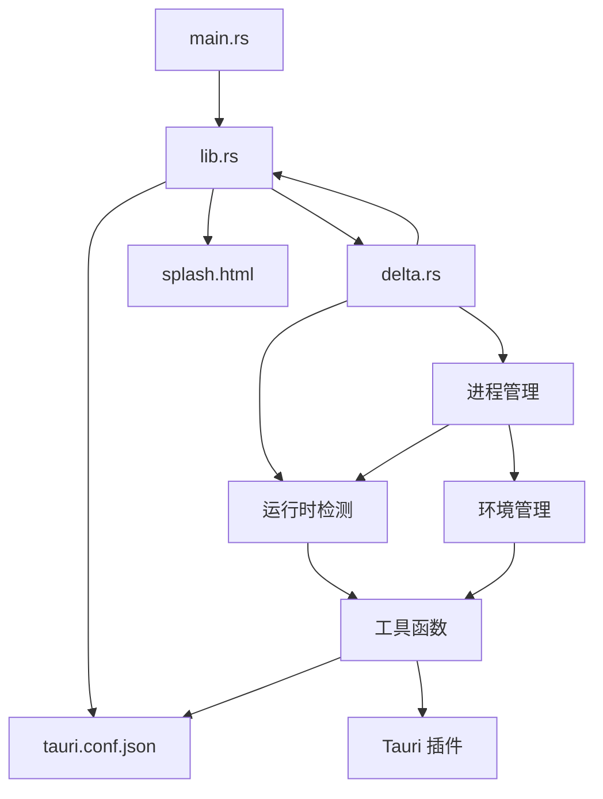

# 系统集成功能

<cite>
**本文档引用的文件**
- [src-tauri/src/main.rs](file://src-tauri/src/main.rs)
- [src-tauri/src/lib.rs](file://src-tauri/src/lib.rs)
- [src-tauri/src/delta.rs](file://src-tauri/src/delta.rs)
- [src-tauri/tauri.conf.json](file://src-tauri/tauri.conf.json)
- [src-tauri/Cargo.toml](file://src-tauri/Cargo.toml)
- [lib/tauri.ts](file://lib/tauri.ts)
- [package.json](file://package.json)
- [src-tauri/splash.html](file://src-tauri/splash.html)
</cite>

## 目录
1. [简介](#简介)
2. [项目结构](#项目结构)
3. [核心组件](#核心组件)
4. [架构概览](#架构概览)
5. [详细组件分析](#详细组件分析)
6. [依赖关系分析](#依赖关系分析)
7. [性能考虑](#性能考虑)
8. [故障排查指南](#故障排查指南)
9. [结论](#结论)
10. [附录](#附录)

## 简介
本项目是一个基于 Tauri 的桌面应用程序，实现了完整的系统集成功能，包括系统托盘、通知系统和进程管理机制。该系统提供了跨平台的桌面体验，支持 Windows、macOS 和 Linux 平台，并具备智能的后台进程控制、运行时环境管理和增量更新能力。

系统集成功能的核心特性：
- **系统托盘集成**：提供可交互的托盘图标，支持菜单操作和闪烁提示
- **通知系统**：集成系统原生通知功能，支持跨平台通知显示
- **进程管理**：智能管理 Node.js 服务器进程，支持热更新和优雅重启
- **运行时环境**：自动检测和下载必要的运行时组件（Node.js、Python、Git）
- **启动流程**：完整的启动页流程，支持错误恢复和重试机制

## 项目结构
该项目采用典型的 Tauri 应用程序结构，主要分为前端和后端两部分：

**图表来源**
- [src-tauri/src/lib.rs:1300-1482](file://src-tauri/src/lib.rs#L1300-L1482)
- [src-tauri/Cargo.toml:14-28](file://src-tauri/Cargo.toml#L14-L28)

**章节来源**
- [src-tauri/src/main.rs:1-7](file://src-tauri/src/main.rs#L1-L7)
- [src-tauri/tauri.conf.json:1-60](file://src-tauri/tauri.conf.json#L1-L60)

## 核心组件
系统集成功能由以下核心组件构成：

### 1. 系统托盘组件
- **托盘图标管理**：提供可交互的托盘图标，支持显示/隐藏窗口操作
- **菜单系统**：包含显示窗口和退出应用两个主要菜单项
- **闪烁机制**：支持托盘图标的闪烁效果，用于重要通知提示
- **事件处理**：处理托盘点击和菜单选择事件

### 2. 通知系统
- **原生通知**：集成系统原生通知功能，支持跨平台通知显示
- **权限管理**：自动处理通知权限请求和状态检查
- **消息传递**：支持向用户发送系统级通知消息

### 3. 进程管理系统
- **服务器进程**：管理 Node.js 服务器进程的启动、停止和重启
- **进程监控**：监控服务器进程状态，确保服务可用性
- **优雅关闭**：在应用退出时优雅地终止服务器进程
- **热更新支持**：支持增量更新过程中的进程重启

### 4. 运行时环境管理
- **自动检测**：自动检测系统中已安装的运行时组件
- **下载管理**：支持从镜像源下载必要的运行时组件
- **版本控制**：管理不同平台的运行时版本和兼容性
- **环境变量**：正确设置运行时环境变量和 PATH

**章节来源**
- [src-tauri/src/lib.rs:1484-1584](file://src-tauri/src/lib.rs#L1484-L1584)
- [src-tauri/src/delta.rs:1-793](file://src-tauri/src/delta.rs#L1-L793)

## 架构概览
系统采用分层架构设计，确保各组件之间的松耦合和高内聚：

**图表来源**
- [src-tauri/src/lib.rs:1314-1482](file://src-tauri/src/lib.rs#L1314-L1482)
- [src-tauri/src/delta.rs:180-443](file://src-tauri/src/delta.rs#L180-L443)

## 详细组件分析

### 系统托盘实现
系统托盘功能通过 Tauri 的 tray-icon 插件实现，提供了完整的托盘集成解决方案：

**图表来源**
- [src-tauri/src/lib.rs:1491-1540](file://src-tauri/src/lib.rs#L1491-L1540)

托盘功能的关键实现特点：
- **双事件处理**：同时支持菜单事件和图标点击事件
- **状态管理**：使用原子布尔值管理闪烁状态
- **图标切换**：支持正常图标和透明图标之间的切换
- **线程安全**：使用主线程回调确保 UI 更新的安全性

**章节来源**
- [src-tauri/src/lib.rs:1484-1584](file://src-tauri/src/lib.rs#L1484-L1584)

### 通知系统集成
通知系统通过 tauri-plugin-notification 插件实现，提供了跨平台的通知功能：

**图表来源**
- [src-tauri/src/lib.rs:1446](file://src-tauri/src/lib.rs#L1446)

通知系统的实现特点：
- **权限管理**：自动处理通知权限的请求和状态检查
- **跨平台兼容**：支持 Windows、macOS 和 Linux 的原生通知
- **事件处理**：支持通知点击事件的回调处理
- **配置灵活**：可通过配置文件调整通知行为

**章节来源**
- [src-tauri/src/lib.rs:1446](file://src-tauri/src/lib.rs#L1446)

### 进程管理机制
进程管理是系统集成功能的核心，负责管理 Node.js 服务器进程的完整生命周期：

**图表来源**
- [src-tauri/src/lib.rs:1164-1275](file://src-tauri/src/lib.rs#L1164-L1275)

进程管理的关键特性：
- **智能检测**：自动检测系统中已安装的运行时组件
- **运行时下载**：支持从镜像源下载必要的运行时组件
- **环境隔离**：为每个进程设置独立的环境变量和工作目录
- **健康监控**：持续监控服务器进程状态，确保服务可用性
- **优雅重启**：支持增量更新过程中的平滑重启

**章节来源**
- [src-tauri/src/lib.rs:926-1103](file://src-tauri/src/lib.rs#L926-L1103)
- [src-tauri/src/delta.rs:31-70](file://src-tauri/src/delta.rs#L31-L70)

### 启动流程管理
启动流程通过启动页（Splash Window）实现，提供了完整的应用启动体验：

**图表来源**
- [src-tauri/src/lib.rs:1394-1441](file://src-tauri/src/lib.rs#L1394-L1441)

启动流程的实现特点：
- **内嵌资源**：启动页 HTML 和图标通过编译时嵌入
- **进度跟踪**：实时跟踪运行时下载和服务器启动进度
- **错误恢复**：支持启动失败后的重试机制
- **主题适配**：支持系统主题和用户自定义主题

**章节来源**
- [src-tauri/src/lib.rs:30-117](file://src-tauri/src/lib.rs#L30-L117)
- [src-tauri/splash.html:1-338](file://src-tauri/splash.html#L1-L338)

### 增量更新系统
增量更新系统提供了高效的服务器更新机制，支持文件级补丁和全量替换：

**图表来源**
- [src-tauri/src/delta.rs:180-523](file://src-tauri/src/delta.rs#L180-L523)

增量更新的实现特点：
- **跨平台兼容**：针对 Windows 和 POSIX 系统提供不同的处理策略
- **错误恢复**：任何步骤失败都会自动回滚到备份状态
- **健康检查**：更新后进行完整的健康检查确保服务可用
- **版本验证**：验证更新后的服务器版本符合预期
- **资源完整性**：检查构建清单中的静态资源完整性

**章节来源**
- [src-tauri/src/delta.rs:180-793](file://src-tauri/src/delta.rs#L180-L793)

## 依赖关系分析

### 外部依赖关系
系统集成功能依赖于多个 Tauri 插件和外部工具：

**图表来源**
- [src-tauri/Cargo.toml:14-28](file://src-tauri/Cargo.toml#L14-L28)
- [package.json:16-42](file://package.json#L16-L42)

### 内部模块依赖
系统内部模块之间存在清晰的依赖关系：

**图表来源**
- [src-tauri/src/main.rs:1-7](file://src-tauri/src/main.rs#L1-L7)
- [src-tauri/src/lib.rs:1-10](file://src-tauri/src/lib.rs#L1-L10)

**章节来源**
- [src-tauri/Cargo.toml:14-28](file://src-tauri/Cargo.toml#L14-L28)
- [package.json:16-42](file://package.json#L16-L42)

## 性能考虑
系统集成功能在设计时充分考虑了性能优化：

### 启动性能优化
- **异步启动**：启动流程采用异步方式，避免阻塞主线程
- **并行下载**：运行时组件下载支持并行处理
- **进度预估**：通过合理的进度分配提升用户体验
- **缓存机制**：运行时组件下载后进行缓存，避免重复下载

### 进程管理优化
- **进程池管理**：合理管理服务器进程的生命周期
- **内存优化**：及时清理不再使用的进程资源
- **CPU 使用率**：监控进程 CPU 使用率，避免过度消耗
- **优雅关闭**：确保进程能够优雅地处理关闭信号

### 系统集成优化
- **事件驱动**：使用事件驱动的方式处理系统集成
- **最小化权限**：只请求必要的系统权限
- **资源回收**：及时释放不再使用的系统资源
- **错误隔离**：确保单个组件的错误不影响其他组件

## 故障排查指南

### 常见问题及解决方案

#### 托盘图标不显示
**症状**：托盘图标无法显示或显示异常
**可能原因**：
- 图标文件损坏或格式不支持
- 系统托盘服务异常
- 权限不足

**解决方法**：
1. 检查图标文件格式是否为 PNG
2. 重启系统托盘服务
3. 以管理员权限运行应用程序
4. 检查系统托盘设置

#### 通知无法接收
**症状**：应用程序无法发送系统通知
**可能原因**：
- 通知权限未授权
- 系统通知服务异常
- 应用程序权限不足

**解决方法**：
1. 在系统设置中授权应用程序通知权限
2. 检查系统通知服务状态
3. 重启应用程序
4. 检查防火墙设置

#### 进程管理异常
**症状**：服务器进程无法启动或频繁崩溃
**可能原因**：
- 运行时环境缺失
- 端口冲突
- 内存不足
- 权限问题

**解决方法**：
1. 检查运行时组件是否正确安装
2. 更换服务器端口
3. 增加系统内存
4. 以管理员权限运行
5. 检查防病毒软件设置

#### 启动流程失败
**症状**：应用程序无法正常启动
**可能原因**：
- 启动页资源加载失败
- 运行时下载超时
- 服务器启动失败

**解决方法**：
1. 检查网络连接和代理设置
2. 清理运行时缓存目录
3. 重试启动流程
4. 查看启动日志获取详细错误信息

### 调试技巧
1. **启用详细日志**：通过启动日志查看详细的错误信息
2. **使用开发者工具**：利用浏览器开发者工具调试前端代码
3. **监控系统资源**：使用系统监控工具查看资源使用情况
4. **测试不同环境**：在不同操作系统上测试功能完整性

**章节来源**
- [src-tauri/src/lib.rs:133-154](file://src-tauri/src/lib.rs#L133-L154)

## 结论
本系统集成功能通过精心设计的架构和实现，为用户提供了完整的桌面应用程序体验。系统集成功能涵盖了现代桌面应用所需的核心功能，包括系统托盘、通知系统、进程管理和运行时环境管理。

主要优势：
- **跨平台兼容**：支持 Windows、macOS 和 Linux 平台
- **功能完整**：提供了桌面应用所需的所有核心功能
- **用户体验优秀**：通过启动页、托盘图标和通知提升了用户体验
- **可靠性强**：具备完善的错误处理和恢复机制
- **性能优化**：在启动速度、内存使用和 CPU 利用率方面都有良好表现

未来改进方向：
- 增加更多的系统集成功能，如系统菜单集成
- 优化启动性能，进一步缩短启动时间
- 增强错误诊断能力，提供更详细的错误信息
- 支持更多的运行时组件和版本

## 附录

### 配置选项
系统集成功能的主要配置选项包括：

#### 托盘配置
- 托盘图标：支持自定义图标和透明图标切换
- 菜单项：显示窗口、退出应用
- 提示文本：支持工具提示文本
- 事件处理：支持点击和菜单事件

#### 通知配置
- 权限管理：自动处理通知权限请求
- 消息格式：支持文本和富文本通知
- 事件回调：支持通知点击事件处理
- 平台适配：自动适配不同平台的通知样式

#### 进程管理配置
- 进程监控：监控服务器进程状态
- 自动重启：进程异常时自动重启
- 资源限制：设置进程资源使用上限
- 日志记录：记录进程运行日志

### API 参考
系统集成功能提供的主要 API 包括：

#### 托盘相关 API
- `flash_tray_icon()`：启动托盘图标闪烁
- `setup_tray()`：初始化托盘系统
- 托盘事件监听：处理托盘点击和菜单事件

#### 通知相关 API
- `request_permission()`：请求通知权限
- `permission_state()`：检查权限状态
- `notify()`：发送系统通知
- 通知事件处理：处理通知点击事件

#### 进程管理 API
- `start_server_process()`：启动服务器进程
- `restart_server()`：重启服务器进程
- `kill_server_process()`：终止服务器进程
- 进程状态查询：查询进程运行状态

### 最佳实践
1. **错误处理**：始终处理可能出现的错误情况
2. **资源管理**：及时释放不再使用的系统资源
3. **权限检查**：在使用敏感功能前检查用户权限
4. **性能监控**：定期监控系统资源使用情况
5. **日志记录**：详细记录系统运行日志便于调试