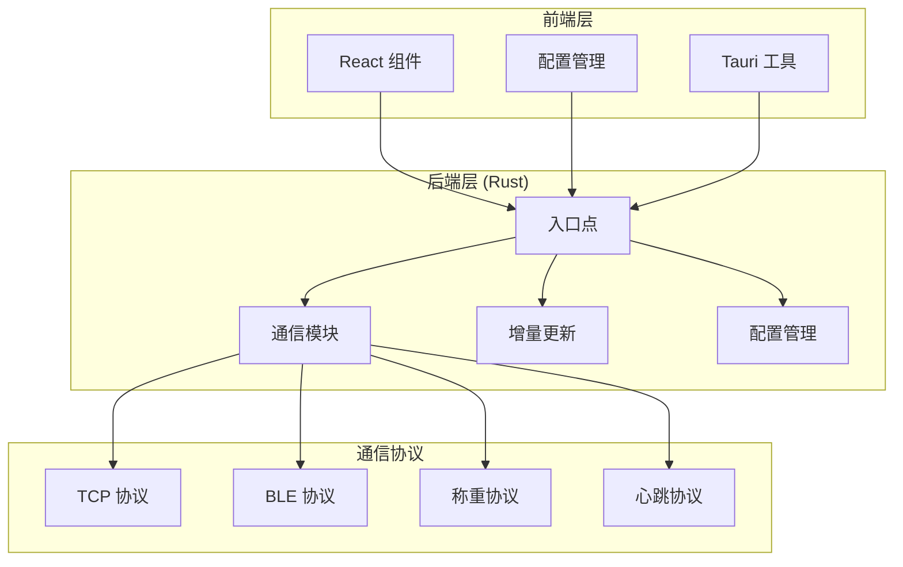
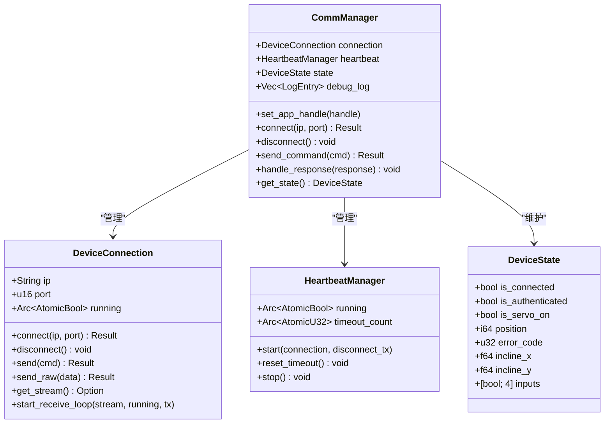
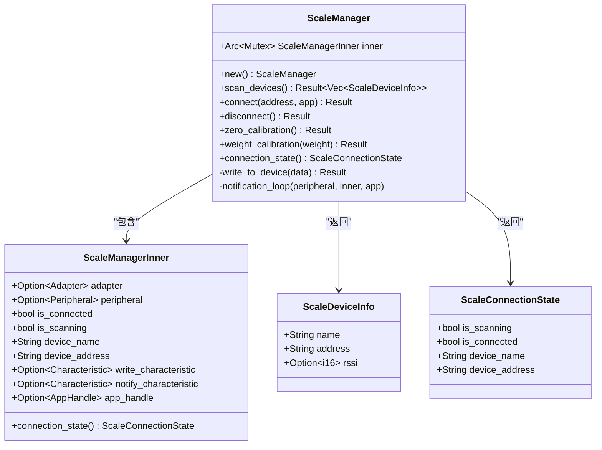
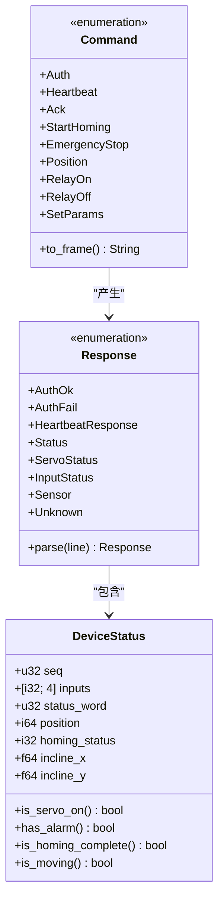
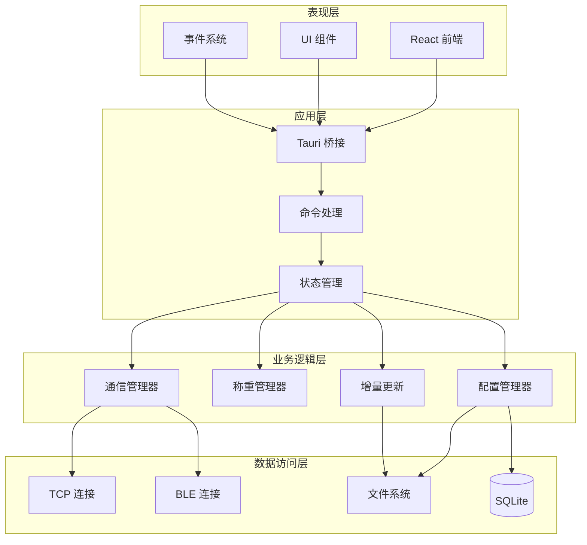
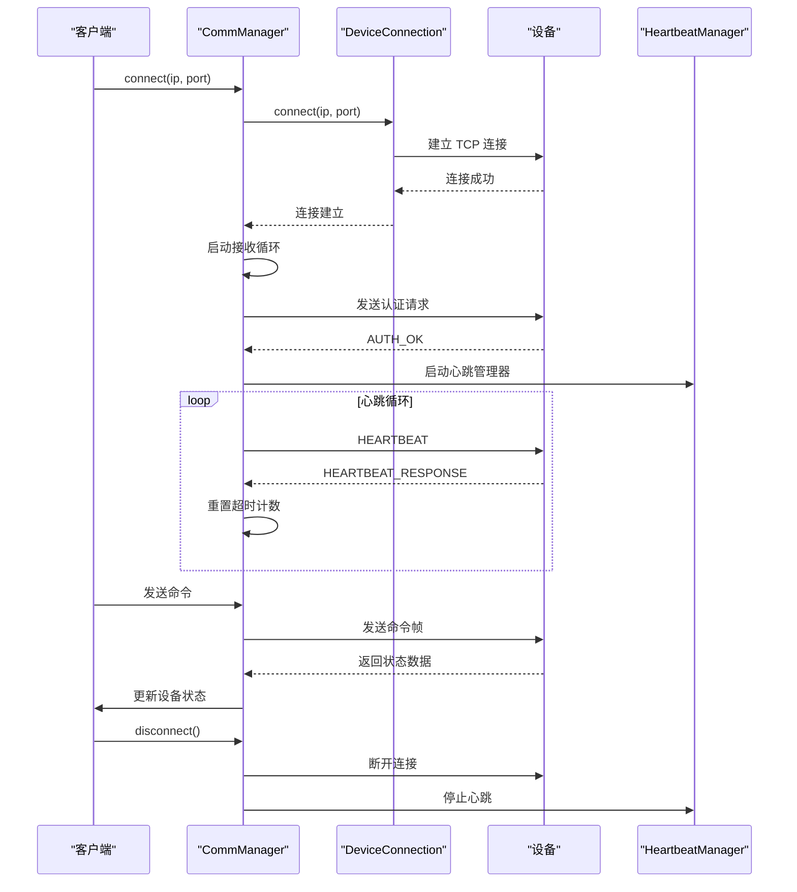
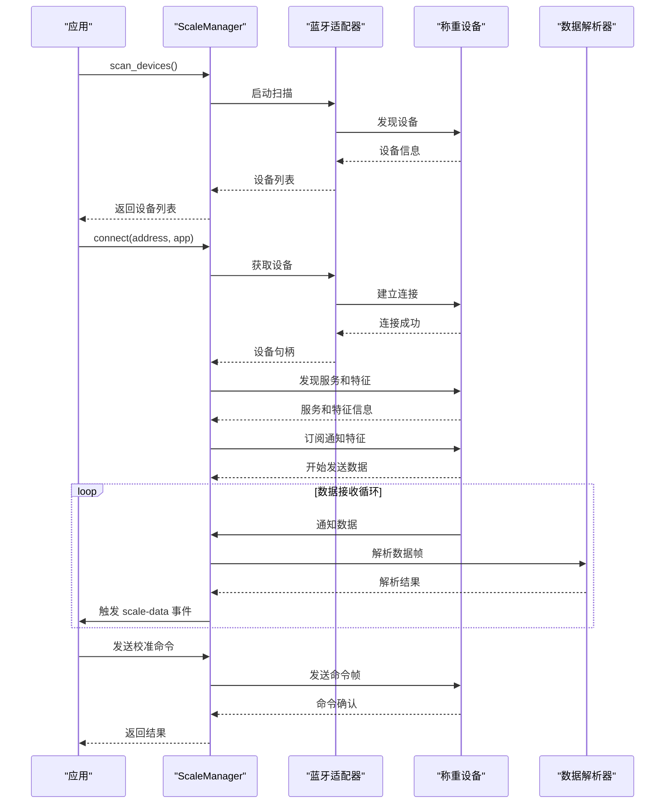
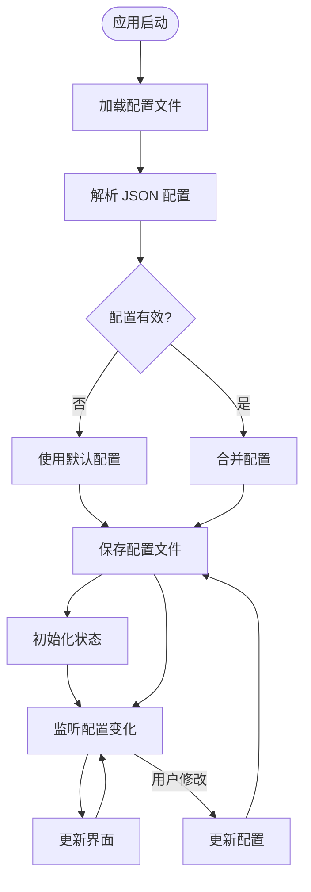
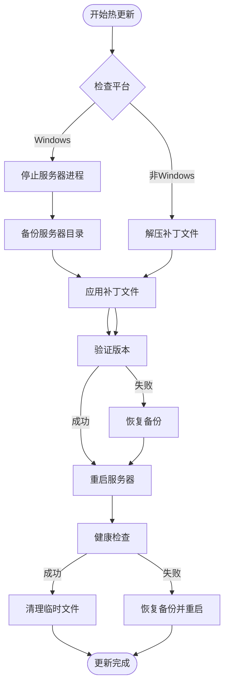

# 设备通信系统

<cite>
**本文档引用的文件**
- [src-tauri/src/main.rs](file://src-tauri/src/main.rs)
- [src-tauri/src/lib.rs](file://src-tauri/src/lib.rs)
- [src-tauri/src/comm/mod.rs](file://src-tauri/src/comm/mod.rs)
- [src-tauri/src/comm/bluetooth.rs](file://src-tauri/src/comm/bluetooth.rs)
- [src-tauri/src/comm/connection.rs](file://src-tauri/src/comm/connection.rs)
- [src-tauri/src/comm/protocol.rs](file://src-tauri/src/comm/protocol.rs)
- [src-tauri/src/comm/state.rs](file://src-tauri/src/comm/state.rs)
- [src-tauri/src/comm/heartbeat.rs](file://src-tauri/src/comm/heartbeat.rs)
- [src-tauri/src/comm/scale_protocol.rs](file://src-tauri/src/comm/scale_protocol.rs)
- [src-tauri/src/comm/scale_commands.rs](file://src-tauri/src/comm/scale_commands.rs)
- [src-tauri/src/config.rs](file://src-tauri/src/config.rs)
- [src-tauri/src/delta.rs](file://src-tauri/src/delta.rs)
- [lib/tauri.ts](file://lib/tauri.ts)
- [lib/config.ts](file://lib/config.ts)
- [src-tauri/Cargo.toml](file://src-tauri/Cargo.toml)
</cite>

## 目录
1. [简介](#简介)
2. [项目结构](#项目结构)
3. [核心组件](#核心组件)
4. [架构概览](#架构概览)
5. [详细组件分析](#详细组件分析)
6. [依赖关系分析](#依赖关系分析)
7. [性能考虑](#性能考虑)
8. [故障排除指南](#故障排除指南)
9. [结论](#结论)

## 简介

设备通信系统是一个基于 Tauri 框架开发的跨平台应用程序，专门用于机动车角度综合校准装置的设备通信和数据采集。该系统实现了多种通信协议，包括 TCP/IP 通信、BLE 蓝牙通信和称重模块通信，为用户提供了一个完整的设备控制和监控解决方案。

系统采用 Rust 作为后端语言，TypeScript/React 作为前端界面，通过 Tauri 框架实现桌面应用的原生功能。主要功能包括：

- **TCP 设备通信**：与主控设备建立稳定的 TCP 连接，支持认证、心跳保持和状态监控
- **BLE 蓝牙通信**：支持称重设备的蓝牙连接、数据接收和命令发送
- **配置管理**：提供应用配置的持久化存储和动态更新
- **增量更新**：支持服务器端的热更新功能，无需重启整个应用
- **多平台支持**：支持 Windows、macOS 和 Linux 操作系统

## 项目结构

项目采用模块化的组织方式，主要分为以下几个部分：



**图表来源**
- [src-tauri/src/main.rs:1-7](file://src-tauri/src/main.rs#L1-L7)
- [src-tauri/src/lib.rs:1-800](file://src-tauri/src/lib.rs#L1-L800)

**章节来源**
- [src-tauri/src/main.rs:1-7](file://src-tauri/src/main.rs#L1-L7)
- [src-tauri/src/lib.rs:1-800](file://src-tauri/src/lib.rs#L1-L800)

## 核心组件

### 通信管理器 (CommManager)

通信管理器是系统的核心组件，负责协调各种通信协议的交互。它维护设备的连接状态、处理认证流程、管理心跳机制，并提供统一的 API 接口。



**图表来源**
- [src-tauri/src/comm/state.rs:54-461](file://src-tauri/src/comm/state.rs#L54-L461)
- [src-tauri/src/comm/connection.rs:9-155](file://src-tauri/src/comm/connection.rs#L9-L155)
- [src-tauri/src/comm/heartbeat.rs:7-78](file://src-tauri/src/comm/heartbeat.rs#L7-L78)

### 蓝牙设备管理器 (ScaleManager)

ScaleManager 专门负责称重设备的蓝牙通信，支持设备扫描、连接建立、数据接收和命令发送功能。



**图表来源**
- [src-tauri/src/comm/bluetooth.rs:40-606](file://src-tauri/src/comm/bluetooth.rs#L40-L606)

### 协议处理模块

系统实现了多种通信协议的数据解析和序列化功能：



**图表来源**
- [src-tauri/src/comm/protocol.rs:5-272](file://src-tauri/src/comm/protocol.rs#L5-L272)

**章节来源**
- [src-tauri/src/comm/state.rs:54-461](file://src-tauri/src/comm/state.rs#L54-L461)
- [src-tauri/src/comm/bluetooth.rs:40-606](file://src-tauri/src/comm/bluetooth.rs#L40-L606)
- [src-tauri/src/comm/protocol.rs:5-272](file://src-tauri/src/comm/protocol.rs#L5-L272)

## 架构概览

系统采用分层架构设计，各层之间职责明确，耦合度低：



**图表来源**
- [src-tauri/src/lib.rs:1-800](file://src-tauri/src/lib.rs#L1-L800)
- [src-tauri/src/comm/mod.rs:1-12](file://src-tauri/src/comm/mod.rs#L1-L12)

系统的关键特性包括：

1. **异步并发处理**：使用 Tokio 异步运行时处理网络通信和设备交互
2. **状态管理**：通过 RwLock 和 Mutex 确保线程安全的状态访问
3. **事件驱动**：通过 Tauri 的事件系统实现前后端通信
4. **错误处理**：完善的错误传播和恢复机制
5. **资源管理**：自动化的资源清理和生命周期管理

## 详细组件分析

### TCP 通信流程

TCP 通信是系统与主控设备的主要通信方式，实现了完整的连接管理、认证和数据传输流程。



**图表来源**
- [src-tauri/src/comm/state.rs:77-129](file://src-tauri/src/comm/state.rs#L77-L129)
- [src-tauri/src/comm/connection.rs:26-47](file://src-tauri/src/comm/connection.rs#L26-L47)
- [src-tauri/src/comm/heartbeat.rs:21-66](file://src-tauri/src/comm/heartbeat.rs#L21-L66)

### BLE 蓝牙通信流程

BLE 通信专门用于称重设备的连接和数据传输，支持设备扫描、连接建立和数据接收。



**图表来源**
- [src-tauri/src/comm/bluetooth.rs:113-177](file://src-tauri/src/comm/bluetooth.rs#L113-L177)
- [src-tauri/src/comm/bluetooth.rs:179-388](file://src-tauri/src/comm/bluetooth.rs#L179-L388)
- [src-tauri/src/comm/scale_protocol.rs:90-154](file://src-tauri/src/comm/scale_protocol.rs#L90-L154)

### 配置管理系统

配置管理系统提供了应用配置的持久化存储和动态更新功能，支持跨平台的配置管理。



**图表来源**
- [src-tauri/src/config.rs:129-179](file://src-tauri/src/config.rs#L129-L179)
- [lib/config.ts:66-98](file://lib/config.ts#L66-L98)

### 增量更新机制

增量更新机制允许在不重启整个应用的情况下更新服务器端代码，提高了系统的灵活性和用户体验。



**图表来源**
- [src-tauri/src/delta.rs:268-316](file://src-tauri/src/delta.rs#L268-L316)
- [src-tauri/src/delta.rs:392-531](file://src-tauri/src/delta.rs#L392-L531)

**章节来源**
- [src-tauri/src/comm/state.rs:77-129](file://src-tauri/src/comm/state.rs#L77-L129)
- [src-tauri/src/comm/bluetooth.rs:113-388](file://src-tauri/src/comm/bluetooth.rs#L113-L388)
- [src-tauri/src/config.rs:129-179](file://src-tauri/src/config.rs#L129-L179)
- [src-tauri/src/delta.rs:268-531](file://src-tauri/src/delta.rs#L268-L531)

## 依赖关系分析

系统使用 Cargo 作为包管理器，依赖关系清晰且经过精心设计：

```mermaid
graph TB
subgraph "核心依赖"
Tauri[tauri ~2.10.0]
Serde[serde ~1]
Tokio[tokio ~1]
Btleplug[btleplug ~0.11.8]
end
subgraph "工具依赖"
TauriBuild[tauri-build ~2.6.0]
Sha2[sha2 ~0.10]
Flate2[flate2 ~1]
Tar[tar ~0.4]
Chrono[chrono ~0.4]
end
subgraph "平台特定依赖"
JNI[jni ~0.19]
Ureq[ureq ~2]
SingleInstance[tauri-plugin-single-instance ~2.4.0]
Updater[tauri-plugin-updater ~2.10.0]
end
subgraph "前端依赖"
TauriApps[@tauri-apps/*]
Dialog[tauri-plugin-dialog ~2.7.0]
Opener[tauri-plugin-opener ~2.5.0]
Process[tauri-plugin-process ~2.3.0]
Notification[tauri-plugin-notification ~2.3.0]
OS[tauri-plugin-os ~2.3.0]
SQL[tauri-plugin-sql ~2]
end
Tauri --> TauriApps
Btleplug --> JNI
Btleplug --> Ureq
Tauri --> SingleInstance
Tauri --> Updater
```

**图表来源**
- [src-tauri/Cargo.toml:14-42](file://src-tauri/Cargo.toml#L14-L42)

主要依赖说明：

1. **Tauri 生态系统**：提供跨平台桌面应用框架和插件系统
2. **Tokio 异步运行时**：支持高性能的异步 I/O 操作
3. **btleplug**：跨平台蓝牙 LE 通信库
4. **Serde**：高效的序列化/反序列化框架
5. **增量更新插件**：支持应用的热更新功能

**章节来源**
- [src-tauri/Cargo.toml:14-42](file://src-tauri/Cargo.toml#L14-L42)

## 性能考虑

系统在设计时充分考虑了性能优化，采用了多种技术手段来提升响应速度和资源利用率：

### 异步并发优化

- **Tokio 异步运行时**：使用多线程异步运行时处理大量并发连接
- **无阻塞 I/O**：所有网络操作都是异步非阻塞的
- **连接池管理**：合理管理 TCP 连接，避免频繁创建销毁

### 内存管理优化

- **零拷贝操作**：尽量使用引用而不是复制数据
- **缓冲区复用**：重用内存缓冲区减少分配开销
- **智能指针**：使用 Arc 和 Mutex 实现高效的数据共享

### 网络通信优化

- **心跳机制**：定期发送心跳包维持连接活跃
- **超时控制**：为所有网络操作设置合理的超时时间
- **错误重试**：实现智能的错误重试机制

### 蓝牙通信优化

- **特征缓存**：缓存发现的服务和特征信息
- **写入策略**：根据平台特性选择最优的写入方式
- **数据节流**：限制数据接收频率避免 UI 卡顿

## 故障排除指南

### 常见问题及解决方案

#### TCP 连接问题

**问题症状**：设备无法连接或连接不稳定
**可能原因**：
- 网络配置错误
- 防火墙阻止连接
- 设备端口占用

**解决步骤**：
1. 验证 IP 地址和端口号配置
2. 检查防火墙设置
3. 使用 `telnet` 测试端口连通性
4. 重启设备服务

#### 蓝牙连接问题

**问题症状**：BLE 设备无法被发现或连接失败
**可能原因**：
- 蓝牙适配器驱动问题
- 设备距离过远
- 设备处于配对模式

**解决步骤**：
1. 重新启动蓝牙服务
2. 确保设备在有效范围内
3. 尝试重新配对设备
4. 检查设备电池电量

#### 认证失败问题

**问题症状**：设备连接后立即断开
**可能原因**：
- 认证密钥错误
- 认证超时
- 设备端认证失败

**解决步骤**：
1. 检查认证密钥配置
2. 增加认证超时时间
3. 重启设备重新认证
4. 查看日志文件获取详细错误信息

#### 增量更新失败

**问题症状**：热更新后应用崩溃或白屏
**可能原因**：
- 补丁文件损坏
- 版本不匹配
- 文件权限问题

**解决步骤**：
1. 重新下载补丁文件
2. 检查版本兼容性
3. 以管理员权限运行
4. 手动恢复备份文件

### 日志分析

系统提供了详细的日志记录功能，可以通过以下方式查看：

1. **启动日志**：查看 `vacdevice-startup.log` 文件
2. **调试日志**：通过 `device-debug-log` 事件获取
3. **错误日志**：检查系统事件查看器
4. **网络日志**：分析 TCP 和 BLE 通信日志

**章节来源**
- [src-tauri/src/lib.rs:190-212](file://src-tauri/src/lib.rs#L190-L212)
- [src-tauri/src/comm/state.rs:434-460](file://src-tauri/src/comm/state.rs#L434-L460)

## 结论

设备通信系统是一个设计精良、功能完整的跨平台应用程序。系统采用现代化的技术栈和架构模式，实现了稳定可靠的设备通信功能。

### 主要优势

1. **模块化设计**：清晰的模块划分和职责分离
2. **异步架构**：高性能的异步并发处理能力
3. **跨平台支持**：统一的代码库支持多个操作系统
4. **热更新机制**：无需重启的应用程序更新能力
5. **完善的错误处理**：健壮的错误恢复和诊断机制

### 技术亮点

- **混合通信协议**：同时支持 TCP 和 BLE 两种通信方式
- **智能状态管理**：实时监控设备状态并及时响应变化
- **事件驱动架构**：通过事件系统实现松耦合的组件通信
- **配置管理系统**：灵活的配置管理和持久化存储

### 未来改进方向

1. **性能优化**：进一步优化大数据量传输的性能
2. **安全性增强**：增加更多的安全防护措施
3. **监控扩展**：添加更详细的性能监控和分析功能
4. **文档完善**：补充更多的 API 文档和使用示例

该系统为机动车角度综合校准装置提供了强大的技术支持，通过其稳定可靠的通信能力和丰富的功能特性，为用户提供了优质的使用体验。