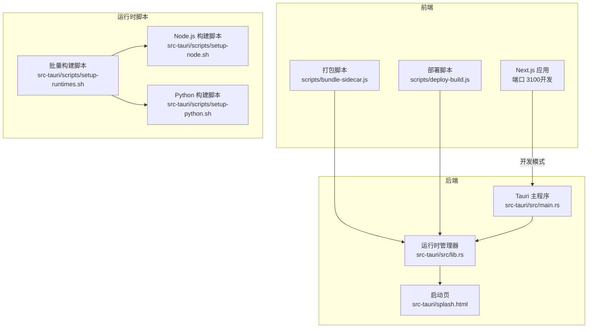
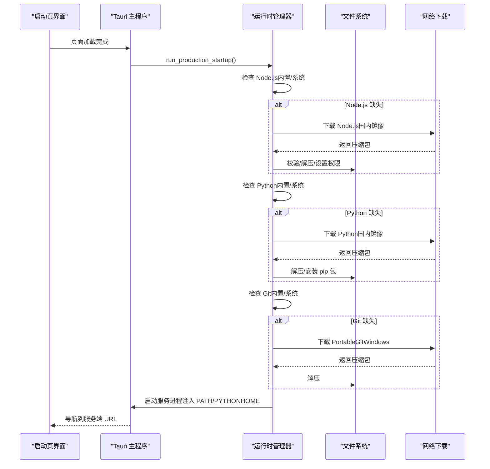
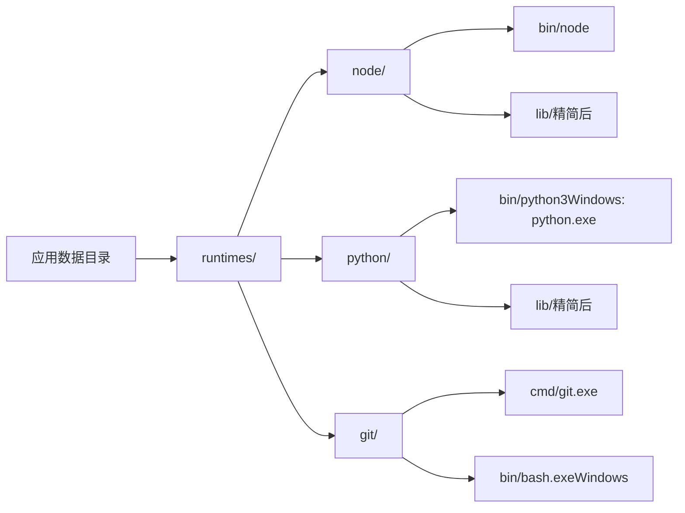
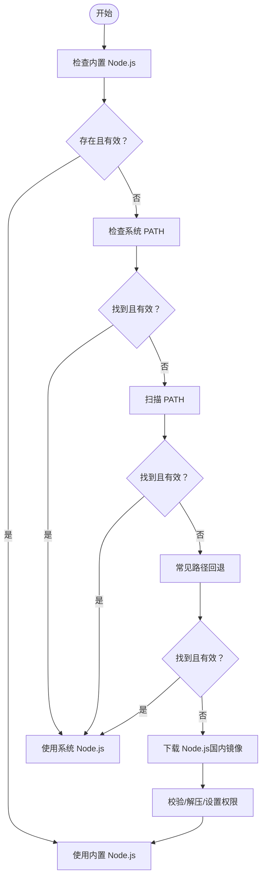
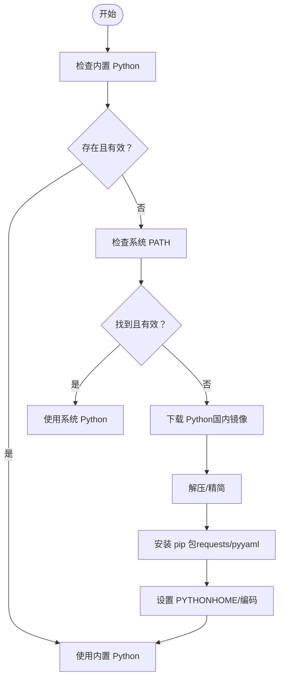
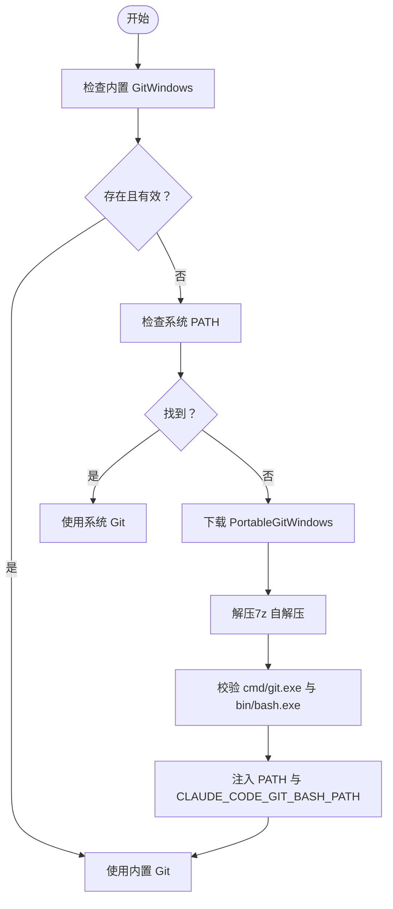
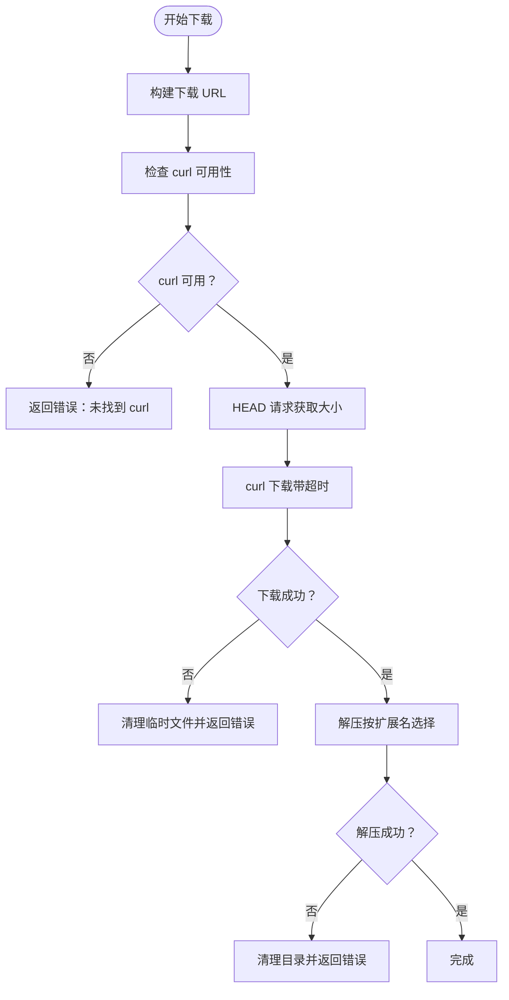
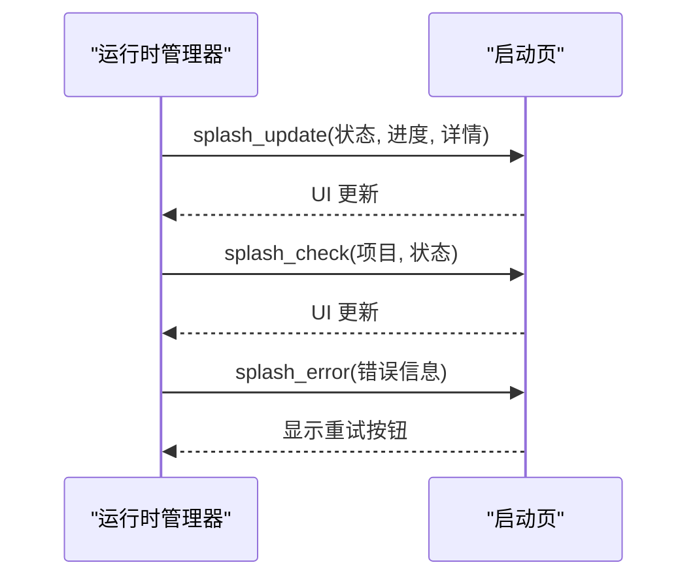
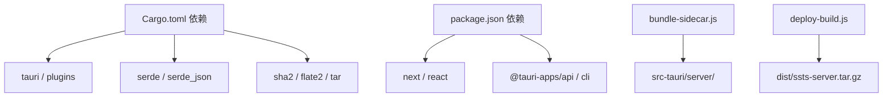

# 运行时管理系统

<cite>
**本文档引用的文件**
- [src-tauri/src/lib.rs](file://src-tauri/src/lib.rs)
- [src-tauri/src/main.rs](file://src-tauri/src/main.rs)
- [src-tauri/scripts/setup-runtimes.sh](file://src-tauri/scripts/setup-runtimes.sh)
- [src-tauri/scripts/setup-node.sh](file://src-tauri/scripts/setup-node.sh)
- [src-tauri/scripts/setup-python.sh](file://src-tauri/scripts/setup-python.sh)
- [src-tauri/splash.html](file://src-tauri/splash.html)
- [scripts/bundle-sidecar.js](file://scripts/bundle-sidecar.js)
- [scripts/deploy-build.js](file://scripts/deploy-build.js)
- [src-tauri/Cargo.toml](file://src-tauri/Cargo.toml)
- [package.json](file://package.json)
- [src-tauri/capabilities/default.json](file://src-tauri/capabilities/default.json)
</cite>

## 目录
1. [简介](#简介)
2. [项目结构](#项目结构)
3. [核心组件](#核心组件)
4. [架构概览](#架构概览)
5. [详细组件分析](#详细组件分析)
6. [依赖关系分析](#依赖关系分析)
7. [性能考虑](#性能考虑)
8. [故障排除指南](#故障排除指南)
9. [结论](#结论)
10. [附录](#附录)

## 简介
本项目是一个基于 Tauri 的桌面应用程序，集成了 Node.js、Python 和 Git 运行时的自动检测、下载与验证机制。系统通过统一的运行时管理模块，在启动时自动检查本地是否存在可用的运行时；若缺失，则从国内镜像源下载对应版本，并进行完整性校验与解压。同时，系统还提供了跨平台的差异处理（如 Windows 的 curl 证书验证、PATH 注入、Python 编码设置等），确保在不同操作系统上的稳定运行。

## 项目结构
该仓库采用前后端分离的结构：前端使用 Next.js，后端使用 Rust（Tauri）。运行时管理主要位于 Rust 后端，负责运行时的发现、下载、验证与启动集成。

**图表来源**
- [src-tauri/src/main.rs:1-7](file://src-tauri/src/main.rs#L1-L7)
- [src-tauri/src/lib.rs:1300-1482](file://src-tauri/src/lib.rs#L1300-L1482)
- [src-tauri/scripts/setup-runtimes.sh:1-38](file://src-tauri/scripts/setup-runtimes.sh#L1-L38)
- [src-tauri/scripts/setup-node.sh:1-173](file://src-tauri/scripts/setup-node.sh#L1-L173)
- [src-tauri/scripts/setup-python.sh:1-181](file://src-tauri/scripts/setup-python.sh#L1-L181)
- [scripts/bundle-sidecar.js:1-19](file://scripts/bundle-sidecar.js#L1-L19)
- [scripts/deploy-build.js:1-80](file://scripts/deploy-build.js#L1-L80)

**章节来源**
- [src-tauri/src/main.rs:1-7](file://src-tauri/src/main.rs#L1-L7)
- [src-tauri/src/lib.rs:1300-1482](file://src-tauri/src/lib.rs#L1300-L1482)
- [src-tauri/scripts/setup-runtimes.sh:1-38](file://src-tauri/scripts/setup-runtimes.sh#L1-L38)
- [src-tauri/scripts/setup-node.sh:1-173](file://src-tauri/scripts/setup-node.sh#L1-L173)
- [src-tauri/scripts/setup-python.sh:1-181](file://src-tauri/scripts/setup-python.sh#L1-L181)
- [scripts/bundle-sidecar.js:1-19](file://scripts/bundle-sidecar.js#L1-L19)
- [scripts/deploy-build.js:1-80](file://scripts/deploy-build.js#L1-L80)

## 核心组件
- 运行时存储目录：应用数据目录下的 runtimes 子目录，分别存放 node、python、git 三个运行时。
- 自动检测：优先检查内置运行时，若损坏则移除并回退到系统 PATH；Windows 下对 Microsoft Store 跳板进行过滤。
- 下载与验证：使用国内镜像源，构建平台特定下载 URL；下载后通过校验或解压失败处理，确保完整性。
- 启动集成：将运行时注入 PATH，设置必要的环境变量（如 PYTHONHOME、CLAUDE_CODE_GIT_BASH_PATH），并在 Windows 上进行编码设置。
- 启动页反馈：通过自定义协议提供内嵌 HTML，实时更新下载进度与状态。

**章节来源**
- [src-tauri/src/lib.rs:247-254](file://src-tauri/src/lib.rs#L247-L254)
- [src-tauri/src/lib.rs:256-330](file://src-tauri/src/lib.rs#L256-L330)
- [src-tauri/src/lib.rs:652-850](file://src-tauri/src/lib.rs#L652-L850)
- [src-tauri/src/lib.rs:926-1103](file://src-tauri/src/lib.rs#L926-L1103)
- [src-tauri/splash.html:1-338](file://src-tauri/splash.html#L1-L338)

## 架构概览
运行时管理系统的核心流程包括：启动页初始化 → 环境检查 → 运行时下载与验证 → 启动服务进程 → 导航主窗口。系统在生产模式下严格遵循“先内置、后系统”的策略，并在下载失败时提供降级方案。

**图表来源**
- [src-tauri/src/lib.rs:1164-1275](file://src-tauri/src/lib.rs#L1164-L1275)
- [src-tauri/src/lib.rs:652-850](file://src-tauri/src/lib.rs#L652-L850)
- [src-tauri/src/lib.rs:926-1103](file://src-tauri/src/lib.rs#L926-L1103)

**章节来源**
- [src-tauri/src/lib.rs:1164-1275](file://src-tauri/src/lib.rs#L1164-L1275)
- [src-tauri/src/lib.rs:652-850](file://src-tauri/src/lib.rs#L652-L850)
- [src-tauri/src/lib.rs:926-1103](file://src-tauri/src/lib.rs#L926-L1103)

## 详细组件分析

### 运行时存储与版本管理
- 存储位置：应用数据目录下的 runtimes 子目录，按平台区分 node、python、git。
- 版本常量：在源码中硬编码了各运行时的版本号，确保一致性。
- 目录结构：
  - node：bin/node、lib（精简后）
  - python：根目录包含 bin、lib、share 等（精简后）
  - git：Windows 下为 PortableGit，包含 cmd/、bin/、mingw64/ 等

**图表来源**
- [src-tauri/src/lib.rs:247-254](file://src-tauri/src/lib.rs#L247-L254)
- [src-tauri/src/lib.rs:18-22](file://src-tauri/src/lib.rs#L18-L22)

**章节来源**
- [src-tauri/src/lib.rs:247-254](file://src-tauri/src/lib.rs#L247-L254)
- [src-tauri/src/lib.rs:18-22](file://src-tauri/src/lib.rs#L18-L22)

### Node.js 自动检测、下载与验证
- 检测顺序：内置运行时 → 系统 PATH（Windows 过滤 Microsoft Store 跳板）→ 手动扫描 PATH → 常见路径回退。
- 下载 URL：根据平台与架构选择国内镜像，Windows 使用 zip，macOS 使用 tar.gz，Linux 使用 tar.xz。
- 校验与解压：下载后通过校验，然后按扩展名选择解压方式；Unix 下设置可执行权限。
- 启动集成：将 node 目录注入 PATH，确保后续服务启动能找到可执行文件。

**图表来源**
- [src-tauri/src/lib.rs:256-330](file://src-tauri/src/lib.rs#L256-L330)
- [src-tauri/src/lib.rs:563-573](file://src-tauri/src/lib.rs#L563-L573)
- [src-tauri/src/lib.rs:652-850](file://src-tauri/src/lib.rs#L652-L850)

**章节来源**
- [src-tauri/src/lib.rs:256-330](file://src-tauri/src/lib.rs#L256-L330)
- [src-tauri/src/lib.rs:563-573](file://src-tauri/src/lib.rs#L563-L573)
- [src-tauri/src/lib.rs:652-850](file://src-tauri/src/lib.rs#L652-L850)

### Python 自动检测、下载与验证
- 检测顺序：内置运行时 → 系统 PATH（Windows 过滤 Microsoft Store 跳板）→ 手动扫描 PATH → 常见路径回退。
- 下载 URL：使用 python-build-standalone 的 release 标签与平台后缀，Windows、macOS、Linux 分别适配。
- 校验与解压：下载后解压到目标目录，进行精简（移除 test、idlelib、tkinter 等），安装 requests 与 pyyaml。
- 启动集成：设置 PYTHONHOME，Windows 强制 UTF-8 编码，确保中文显示正常。

**图表来源**
- [src-tauri/src/lib.rs:277-295](file://src-tauri/src/lib.rs#L277-L295)
- [src-tauri/src/lib.rs:575-588](file://src-tauri/src/lib.rs#L575-L588)
- [src-tauri/src/lib.rs:652-850](file://src-tauri/src/lib.rs#L652-L850)
- [src-tauri/src/lib.rs:852-889](file://src-tauri/src/lib.rs#L852-L889)

**章节来源**
- [src-tauri/src/lib.rs:277-295](file://src-tauri/src/lib.rs#L277-L295)
- [src-tauri/src/lib.rs:575-588](file://src-tauri/src/lib.rs#L575-L588)
- [src-tauri/src/lib.rs:652-850](file://src-tauri/src/lib.rs#L652-L850)
- [src-tauri/src/lib.rs:852-889](file://src-tauri/src/lib.rs#L852-L889)

### Git 自动检测、下载与验证
- 检测顺序：内置 PortableGit（Windows）→ 系统 PATH → 常见路径回退。
- 下载 URL：Windows 使用 PortableGit 便携版（含 bash.exe），macOS/Linux 通常使用系统安装。
- 校验与解压：PortableGit 为 7z 自解压格式，直接运行即可解压；解压后确保 cmd/git.exe 与 bin/bash.exe 同时存在。
- 启动集成：将 Git 的 cmd 与 bin 目录注入 PATH，并设置 CLAUDE_CODE_GIT_BASH_PATH（Windows）。

**图表来源**
- [src-tauri/src/lib.rs:297-310](file://src-tauri/src/lib.rs#L297-L310)
- [src-tauri/src/lib.rs:590-601](file://src-tauri/src/lib.rs#L590-L601)
- [src-tauri/src/lib.rs:652-850](file://src-tauri/src/lib.rs#L652-L850)

**章节来源**
- [src-tauri/src/lib.rs:297-310](file://src-tauri/src/lib.rs#L297-L310)
- [src-tauri/src/lib.rs:590-601](file://src-tauri/src/lib.rs#L590-L601)
- [src-tauri/src/lib.rs:652-850](file://src-tauri/src/lib.rs#L652-L850)

### 下载 URL 构建、代理支持与错误处理
- URL 构建：根据目标平台与架构选择对应的国内镜像 URL（Node.js、Python、Git）。
- 代理支持：通过环境变量 http_proxy/https_proxy/no_proxy 透传给 curl；HEAD 请求获取远程文件大小。
- 错误处理：curl 启动失败、下载超时（5 分钟）、解压失败、校验失败均进行清理与错误返回；Windows 使用 ssl-no-revoke 跳过证书吊销检查以避免 SSL 错误退出码 35。

**图表来源**
- [src-tauri/src/lib.rs:563-601](file://src-tauri/src/lib.rs#L563-L601)
- [src-tauri/src/lib.rs:624-650](file://src-tauri/src/lib.rs#L624-L650)
- [src-tauri/src/lib.rs:652-850](file://src-tauri/src/lib.rs#L652-L850)

**章节来源**
- [src-tauri/src/lib.rs:563-601](file://src-tauri/src/lib.rs#L563-L601)
- [src-tauri/src/lib.rs:624-650](file://src-tauri/src/lib.rs#L624-L650)
- [src-tauri/src/lib.rs:652-850](file://src-tauri/src/lib.rs#L652-L850)

### 启动页与错误反馈
- 启动页：通过自定义协议 splashpage:// 提供内嵌 HTML，支持主题切换与进度条。
- 进度反馈：download_runtime 与 run_production_startup 中通过 splash_update/splash_check 更新 UI。
- 错误反馈：遇到致命错误时通过 splash_error 显示错误信息并提供重试按钮。

**图表来源**
- [src-tauri/src/lib.rs:210-243](file://src-tauri/src/lib.rs#L210-L243)
- [src-tauri/splash.html:305-334](file://src-tauri/splash.html#L305-L334)

**章节来源**
- [src-tauri/src/lib.rs:210-243](file://src-tauri/src/lib.rs#L210-L243)
- [src-tauri/splash.html:305-334](file://src-tauri/splash.html#L305-L334)

## 依赖关系分析
- Rust 依赖：tauri、tauri-plugin-*、serde、sha2、flate2、tar 等。
- 前端依赖：Next.js、@tauri-apps/* 等插件。
- 构建脚本：bundle-sidecar.js 将 Next.js standalone 产物打包到 src-tauri/server/，供 Tauri 生产模式使用；deploy-build.js 生成可独立部署的服务端包。

**图表来源**
- [src-tauri/Cargo.toml:14-28](file://src-tauri/Cargo.toml#L14-L28)
- [package.json:16-41](file://package.json#L16-L41)
- [scripts/bundle-sidecar.js:1-19](file://scripts/bundle-sidecar.js#L1-L19)
- [scripts/deploy-build.js:1-80](file://scripts/deploy-build.js#L1-L80)

**章节来源**
- [src-tauri/Cargo.toml:14-28](file://src-tauri/Cargo.toml#L14-L28)
- [package.json:16-41](file://package.json#L16-L41)
- [scripts/bundle-sidecar.js:1-19](file://scripts/bundle-sidecar.js#L1-L19)
- [scripts/deploy-build.js:1-80](file://scripts/deploy-build.js#L1-L80)

## 性能考虑
- 下载超时与断点续传：通过 curl 的超时参数与进度回调实现，避免长时间阻塞。
- 文件大小估算：使用 HEAD 请求获取 Content-Length，提升用户体验。
- 解压策略：根据扩展名选择最优解压方式，减少不必要的 strip 操作。
- 启动优化：Windows 下隐藏控制台窗口，减少资源占用；PATH 注入最小化，避免污染系统环境。

## 故障排除指南
- Node.js 下载失败
  - 检查网络与代理设置，确认 http_proxy/https_proxy 环境变量正确。
  - 若 curl 不可用，安装系统 curl 后重试。
  - Windows 可能因证书吊销检查导致 SSL 错误，系统已自动使用 ssl-no-revoke 参数。
  - 参考路径：[src-tauri/src/lib.rs:652-850](file://src-tauri/src/lib.rs#L652-L850)

- Python 下载失败或 pip 安装失败
  - 确认 Python 已正确解压并设置 PYTHONHOME。
  - pip 安装使用国内镜像源（https://pypi.tuna.tsinghua.edu.cn/simple/）。
  - Windows 强制 UTF-8 编码，避免中文乱码问题。
  - 参考路径：[src-tauri/src/lib.rs:852-889](file://src-tauri/src/lib.rs#L852-L889)

- Git 下载失败或 bash.exe 缺失
  - Windows 需要 PortableGit（含 bash.exe），若只有 git.exe（MinGit）会被识别为无效并重新下载。
  - 确保下载完成后 cmd/git.exe 与 bin/bash.exe 同时存在。
  - 参考路径：[src-tauri/src/lib.rs:297-310](file://src-tauri/src/lib.rs#L297-L310)

- 启动页无法显示或重试无效
  - 确认自定义协议 splashpage:// 已注册，HTML 内容已内嵌。
  - 重试按钮通过 Tauri command retry_startup 触发重新启动流程。
  - 参考路径：[src-tauri/src/lib.rs:1327-1344](file://src-tauri/src/lib.rs#L1327-L1344), [src-tauri/splash.html:319-334](file://src-tauri/splash.html#L319-L334)

- 运行时路径与兼容性问题
  - Windows：Node.js 与 Python 的可执行文件命名差异，系统会自动创建 python3.exe 副本以兼容调用。
  - PATH 注入：确保 node、python、git 的 bin 目录被正确加入 PATH。
  - 参考路径：[src-tauri/src/lib.rs:978-1044](file://src-tauri/src/lib.rs#L978-L1044)

**章节来源**
- [src-tauri/src/lib.rs:652-850](file://src-tauri/src/lib.rs#L652-L850)
- [src-tauri/src/lib.rs:852-889](file://src-tauri/src/lib.rs#L852-L889)
- [src-tauri/src/lib.rs:297-310](file://src-tauri/src/lib.rs#L297-L310)
- [src-tauri/src/lib.rs:1327-1344](file://src-tauri/src/lib.rs#L1327-L1344)
- [src-tauri/splash.html:319-334](file://src-tauri/splash.html#L319-L334)
- [src-tauri/src/lib.rs:978-1044](file://src-tauri/src/lib.rs#L978-L1044)

## 结论
本运行时管理系统通过统一的发现、下载、验证与集成机制，实现了 Node.js、Python 与 Git 在多平台环境下的自动化管理。系统在保证安全性（校验与解压）的同时，兼顾了性能与用户体验（进度反馈、超时保护、编码设置）。结合内嵌的启动页与错误处理策略，能够在复杂网络环境下提供稳健的运行时保障。

## 附录

### 配置选项说明
- 运行时版本常量（硬编码于源码）：Node.js、Python、Git 版本与 Python release 标签。
- 国内镜像源：Node.js、Python、Git for Windows 的国内镜像地址。
- 启动页主题：通过 data-theme 属性支持 light/dark/system。
- 环境变量：
  - GCLAW_DATA_DIR：数据目录
  - GCLAW_SKILLS_DIR：技能目录
  - PATH：注入运行时 bin 目录
  - PYTHONHOME：内置 Python 的根目录
  - PYTHONUTF8/PYTHONIOENCODING：Windows 强制 UTF-8 编码
  - CLAUDE_CODE_GIT_BASH_PATH：Windows Claude Code 必需
  - http_proxy/https_proxy/no_proxy：代理支持
  - WEBVIEW2_ADDITIONAL_BROWSER_ARGUMENTS：Windows WebView2 SmartScreen 配置

**章节来源**
- [src-tauri/src/lib.rs:18-28](file://src-tauri/src/lib.rs#L18-L28)
- [src-tauri/src/lib.rs:1051-1078](file://src-tauri/src/lib.rs#L1051-L1078)
- [src-tauri/splash.html:42-56](file://src-tauri/splash.html#L42-L56)
- [src-tauri/src/lib.rs:1300-1309](file://src-tauri/src/lib.rs#L1300-L1309)