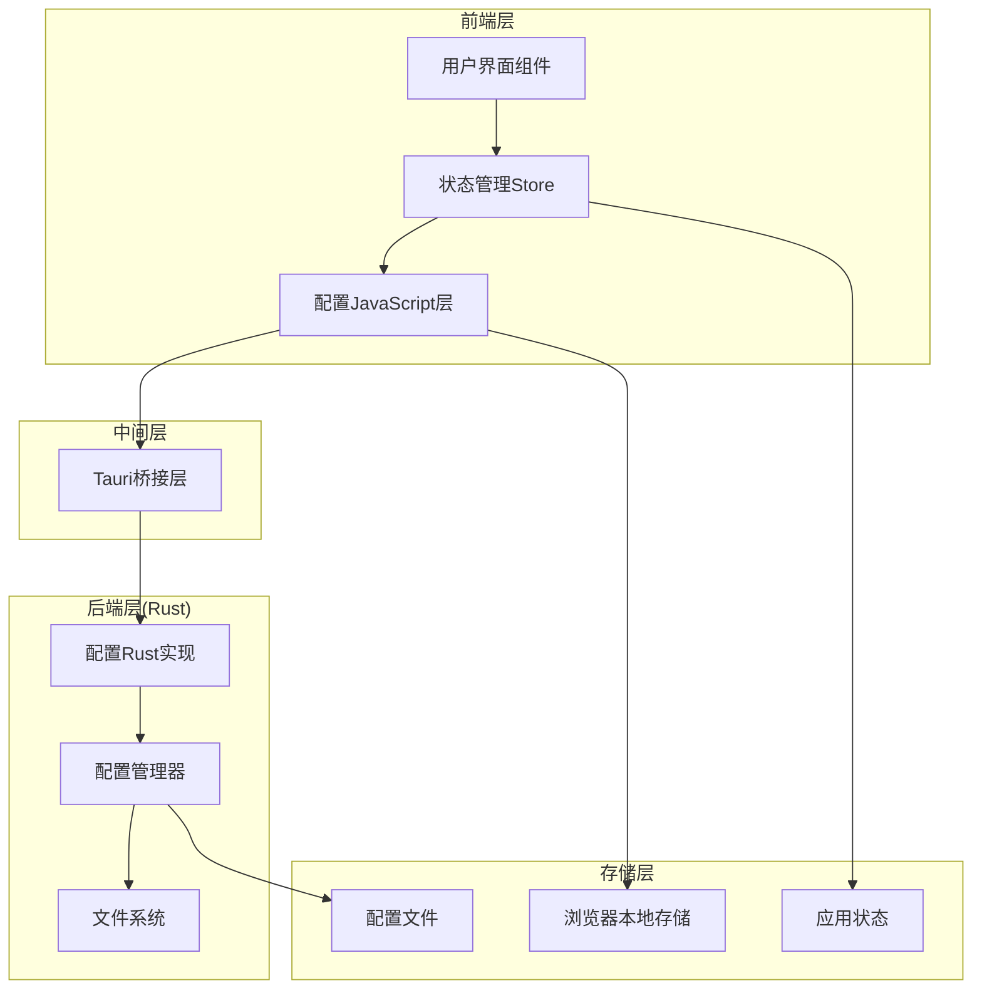
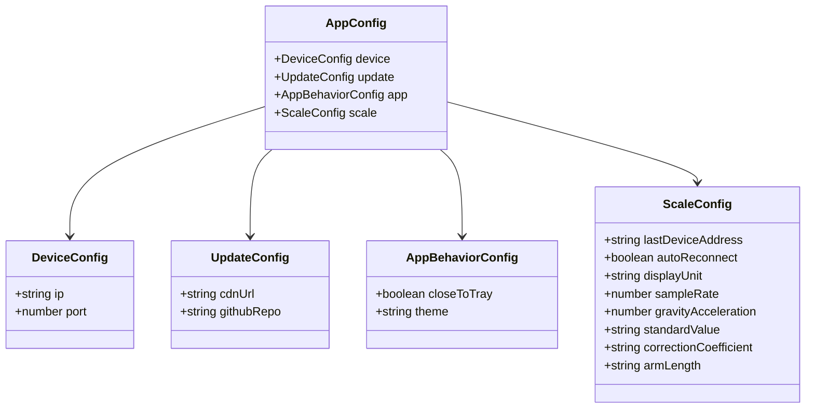
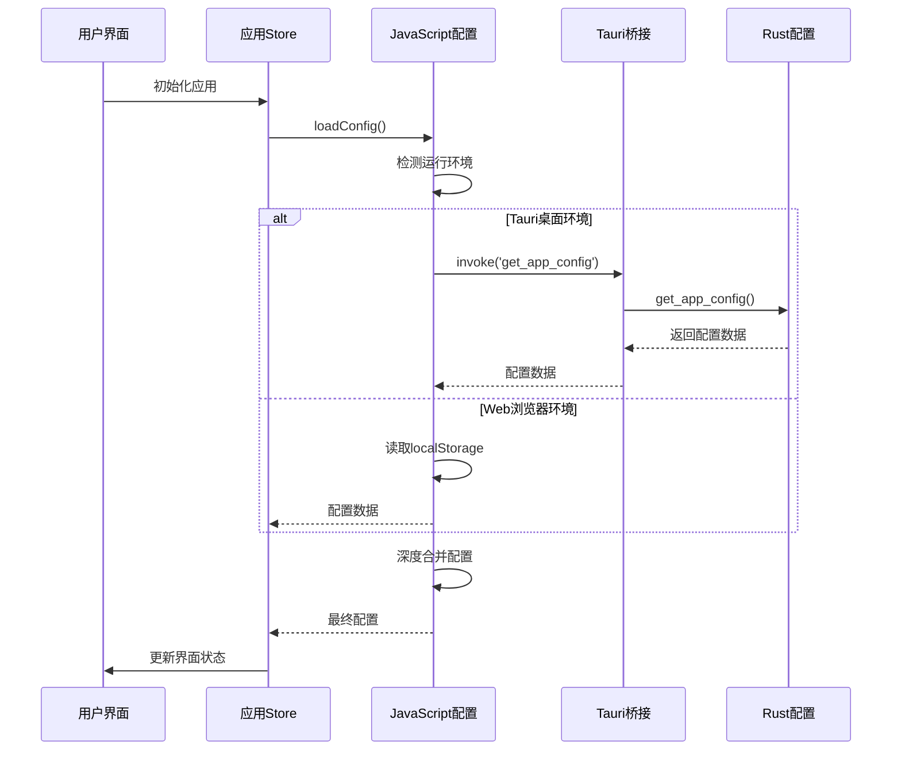
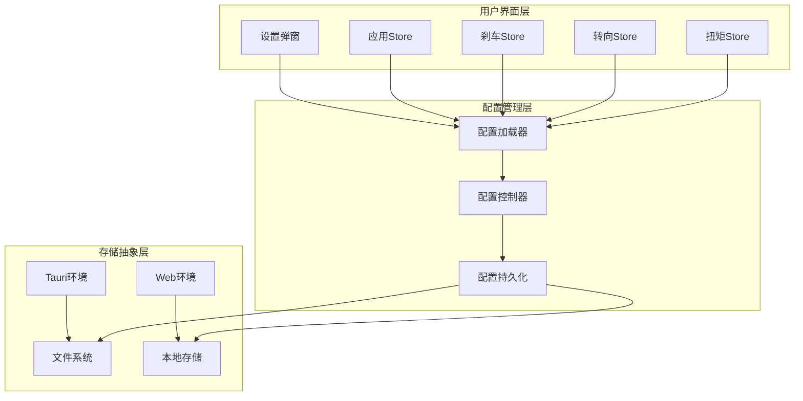
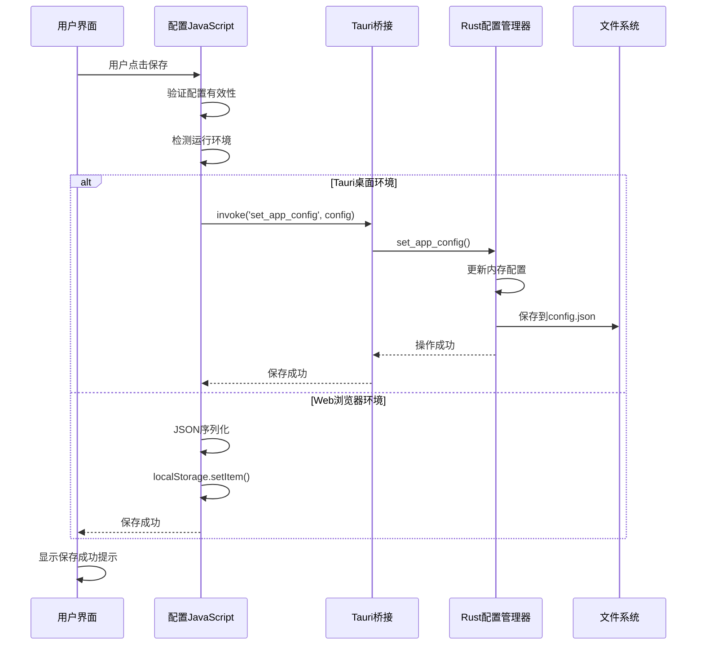
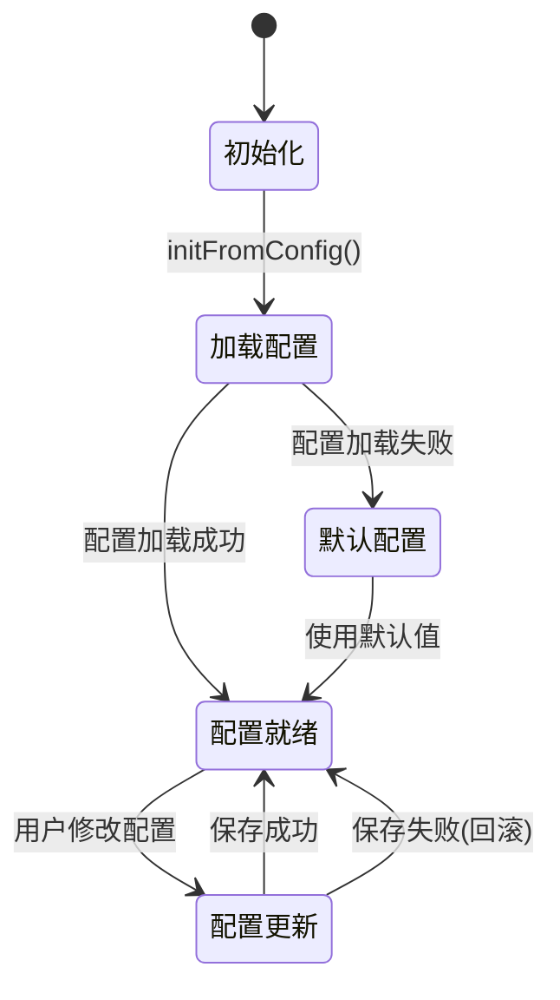
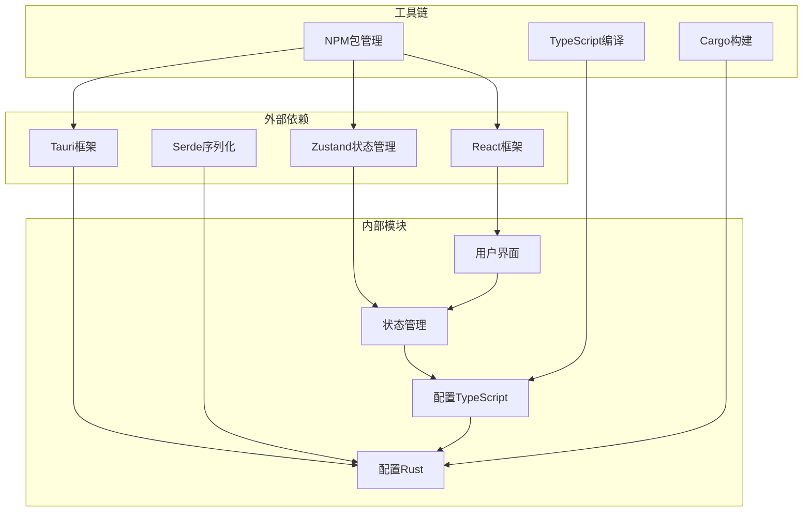

# 配置管理系统

<cite>
**本文档引用的文件**
- [lib/config.ts](file://lib/config.ts)
- [src-tauri/src/config.rs](file://src-tauri/src/config.rs)
- [src-tauri/tauri.conf.json](file://src-tauri/tauri.conf.json)
- [lib/store/app-store.ts](file://lib/store/app-store.ts)
- [components/ui/SettingsModal.tsx](file://components/ui/SettingsModal.tsx)
- [lib/tauri.ts](file://lib/tauri.ts)
- [src-tauri/src/main.rs](file://src-tauri/src/main.rs)
- [src-tauri/Cargo.toml](file://src-tauri/Cargo.toml)
- [package.json](file://package.json)
</cite>

## 目录
1. [简介](#简介)
2. [项目结构](#项目结构)
3. [核心组件](#核心组件)
4. [架构概览](#架构概览)
5. [详细组件分析](#详细组件分析)
6. [依赖关系分析](#依赖关系分析)
7. [性能考虑](#性能考虑)
8. [故障排除指南](#故障排除指南)
9. [结论](#结论)

## 简介

配置管理系统是VACDevice机动车角度综合校准装置的核心基础设施，负责管理应用程序的各种配置参数。该系统采用跨平台架构设计，支持桌面端和Web端的配置管理，提供了完整的配置持久化、同步和版本控制功能。

系统主要功能包括：
- 统一的配置数据模型定义
- 跨平台配置存储机制
- 实时配置同步和热更新
- 用户友好的配置界面
- 配置备份和恢复功能

## 项目结构

配置管理系统采用分层架构设计，主要分为以下层次：



**图表来源**
- [lib/config.ts:1-99](file://lib/config.ts#L1-L99)
- [src-tauri/src/config.rs:1-195](file://src-tauri/src/config.rs#L1-L195)

**章节来源**
- [lib/config.ts:1-99](file://lib/config.ts#L1-L99)
- [src-tauri/src/config.rs:1-195](file://src-tauri/src/config.rs#L1-L195)

## 核心组件

### 配置数据模型

系统定义了统一的配置数据结构，确保前后端配置的一致性：



**图表来源**
- [lib/config.ts:4-27](file://lib/config.ts#L4-L27)
- [src-tauri/src/config.rs:7-60](file://src-tauri/src/config.rs#L7-L60)

### 配置加载流程



**图表来源**
- [lib/config.ts:66-85](file://lib/config.ts#L66-L85)
- [src-tauri/src/config.rs:183-187](file://src-tauri/src/config.rs#L183-L187)

**章节来源**
- [lib/config.ts:1-99](file://lib/config.ts#L1-L99)
- [src-tauri/src/config.rs:1-195](file://src-tauri/src/config.rs#L1-L195)

## 架构概览

配置管理系统采用双层架构设计，实现了前后端配置的无缝集成：



**图表来源**
- [components/ui/SettingsModal.tsx:1-407](file://components/ui/SettingsModal.tsx#L1-L407)
- [lib/store/app-store.ts:1-59](file://lib/store/app-store.ts#L1-L59)
- [lib/config.ts:66-99](file://lib/config.ts#L66-L99)

## 详细组件分析

### 配置加载器组件

配置加载器负责处理不同环境下的配置加载逻辑，确保配置的正确性和完整性。

#### 核心功能特性

1. **环境检测**：自动识别当前运行环境（Tauri桌面或Web浏览器）
2. **配置合并**：实现深度合并策略，确保缺失字段使用默认值
3. **错误处理**：优雅处理配置加载失败的情况
4. **缓存机制**：避免重复的配置读取操作

#### 配置加载算法

```mermaid
flowchart TD
Start([开始加载配置]) --> CheckEnv{检查运行环境}
CheckEnv --> |Tauri桌面| LoadTauri[调用Tauri命令]
CheckEnv --> |Web浏览器| LoadWeb[读取localStorage]
LoadTauri --> InvokeCmd[invoke('get_app_config')]
InvokeCmd --> CmdSuccess{命令执行成功?}
CmdSuccess --> |是| ParseJSON[解析JSON配置]
CmdSuccess --> |否| UseDefault[使用默认配置]
LoadWeb --> ReadLS[读取localStorage]
ReadLS --> HasData{存在配置数据?}
HasData --> |是| ParseJSON
HasData --> |否| UseDefault
ParseJSON --> MergeConfig[深度合并配置]
UseDefault --> MergeConfig
MergeConfig --> ReturnConfig[返回最终配置]
ReturnConfig --> End([配置加载完成])
```

**图表来源**
- [lib/config.ts:66-85](file://lib/config.ts#L66-L85)

**章节来源**
- [lib/config.ts:56-85](file://lib/config.ts#L56-L85)

### 配置持久化组件

配置持久化组件负责将用户修改的配置保存到适当的存储介质中。

#### 存储策略

系统采用多层存储策略，根据运行环境选择最优的存储方案：

1. **Tauri桌面环境**：使用文件系统存储，确保配置的可靠性和持久性
2. **Web浏览器环境**：使用localStorage存储，提供快速的访问性能

#### 保存流程



**图表来源**
- [lib/config.ts:87-99](file://lib/config.ts#L87-L99)
- [src-tauri/src/config.rs:189-195](file://src-tauri/src/config.rs#L189-L195)

**章节来源**
- [lib/config.ts:87-99](file://lib/config.ts#L87-L99)
- [src-tauri/src/config.rs:158-175](file://src-tauri/src/config.rs#L158-L175)

### 设置界面组件

设置界面提供了用户友好的配置管理界面，支持多种配置分类的管理和编辑。

#### 界面设计特点

1. **标签页导航**：支持连接设置、通用设置、关于信息三个主要分类
2. **实时预览**：配置修改后立即反映到界面状态
3. **验证反馈**：提供输入验证和错误提示
4. **响应式设计**：适配不同屏幕尺寸的设备

#### 配置分类说明

| 分类 | 功能描述 | 关键配置项 |
|------|----------|------------|
| 连接设置 | 设备连接参数配置 | IP地址、端口号、重力加速度 |
| 通用设置 | 应用行为配置 | 关闭到托盘、主题设置 |
| 关于信息 | 应用版本和更新检查 | 版本信息、更新源配置 |

**章节来源**
- [components/ui/SettingsModal.tsx:1-407](file://components/ui/SettingsModal.tsx#L1-L407)

### 应用状态管理

应用状态管理组件负责维护全局的应用配置状态，确保各个组件能够共享和同步配置信息。

#### 状态管理模式

系统采用Zustand状态管理库，实现了轻量级的状态管理解决方案：



**图表来源**
- [lib/store/app-store.ts:34-41](file://lib/store/app-store.ts#L34-L41)

**章节来源**
- [lib/store/app-store.ts:1-59](file://lib/store/app-store.ts#L1-L59)

## 依赖关系分析

配置管理系统涉及多个层面的依赖关系，形成了清晰的模块化架构。



**图表来源**
- [package.json:18-31](file://package.json#L18-L31)
- [src-tauri/Cargo.toml:14-32](file://src-tauri/Cargo.toml#L14-L32)

### 核心依赖关系

| 依赖类型 | 依赖对象 | 作用描述 |
|----------|----------|----------|
| 运行时依赖 | @tauri-apps/api | 提供Tauri桥接功能 |
| 状态管理 | zustand | 实现轻量级状态管理 |
| 序列化 | serde | 支持Rust和JavaScript的配置序列化 |
| 构建工具 | @tauri/cli | Tauri应用构建和打包 |
| 前端框架 | next.js | Web应用开发框架 |

**章节来源**
- [package.json:18-44](file://package.json#L18-L44)
- [src-tauri/Cargo.toml:14-42](file://src-tauri/Cargo.toml#L14-L42)

## 性能考虑

配置管理系统在设计时充分考虑了性能优化，采用了多种策略来提升用户体验：

### 性能优化策略

1. **懒加载机制**：配置只在需要时才进行加载，避免不必要的性能消耗
2. **缓存策略**：内存中缓存最近使用的配置，减少重复读取
3. **异步操作**：所有配置操作都是异步执行，避免阻塞主线程
4. **增量更新**：只更新发生变化的配置项，减少不必要的重新渲染

### 内存管理

系统采用智能的内存管理策略：
- 配置数据在内存中缓存，避免频繁的磁盘IO操作
- 使用弱引用避免内存泄漏
- 定期清理无效的配置缓存

### 网络优化

对于远程配置加载：
- 实现请求去重，避免重复的网络请求
- 使用超时机制，防止长时间的网络等待
- 实现重试机制，提高配置加载的成功率

## 故障排除指南

### 常见问题及解决方案

#### 配置加载失败

**问题描述**：应用启动时配置加载失败，使用默认配置

**可能原因**：
1. 配置文件损坏或格式错误
2. 文件权限不足
3. 磁盘空间不足
4. 网络连接问题（远程配置）

**解决步骤**：
1. 检查配置文件是否存在且可读
2. 验证配置文件的JSON格式
3. 检查应用的文件系统权限
4. 清理损坏的配置文件并重启应用

#### 配置保存失败

**问题描述**：用户修改配置后无法保存

**可能原因**：
1. 磁盘空间不足
2. 文件写入权限问题
3. 磁盘IO错误
4. 应用进程异常

**解决步骤**：
1. 检查磁盘空间和权限
2. 重启应用尝试重新保存
3. 检查系统日志中的错误信息
4. 手动备份并重置配置文件

#### 跨平台兼容性问题

**问题描述**：在不同操作系统上配置行为不一致

**可能原因**：
1. 文件路径分隔符差异
2. 权限模型差异
3. 字符编码问题
4. 系统API差异

**解决步骤**：
1. 使用跨平台的路径处理库
2. 统一字符编码格式
3. 测试不同操作系统的兼容性
4. 提供平台特定的配置回退机制

**章节来源**
- [lib/config.ts:72-75](file://lib/config.ts#L72-L75)
- [src-tauri/src/config.rs:147-156](file://src-tauri/src/config.rs#L147-L156)

## 结论

配置管理系统通过精心设计的架构和实现，为VACDevice应用提供了强大而灵活的配置管理能力。系统的主要优势包括：

1. **跨平台一致性**：统一的配置模型确保了在不同平台上的行为一致性
2. **用户友好性**：直观的设置界面和实时反馈提升了用户体验
3. **可靠性**：完善的错误处理和恢复机制保证了系统的稳定性
4. **可扩展性**：模块化的架构设计便于未来的功能扩展

该系统为机动车角度综合校准装置提供了坚实的基础，支持各种复杂的配置需求，同时保持了良好的性能和用户体验。通过持续的优化和改进，配置管理系统将继续为用户提供更好的服务。