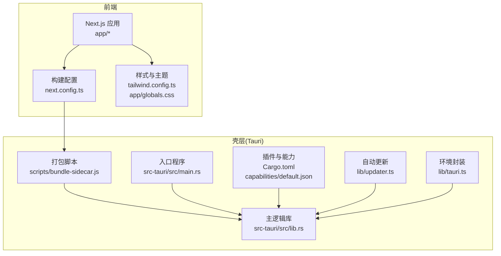
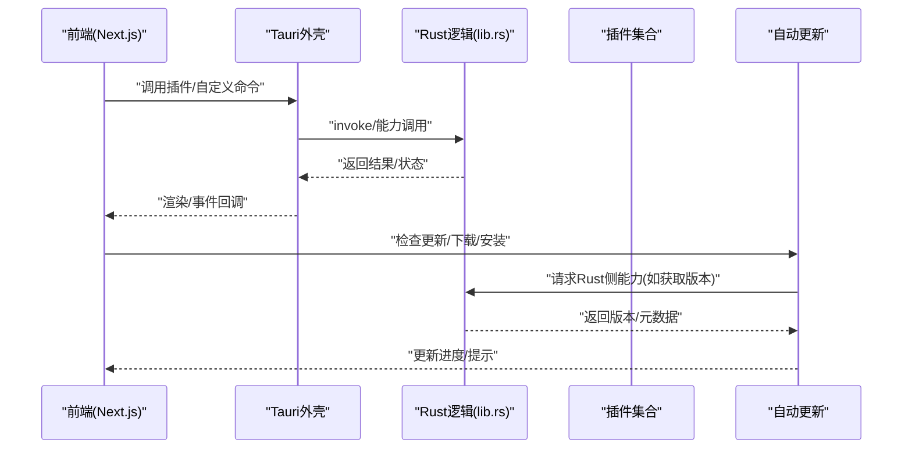
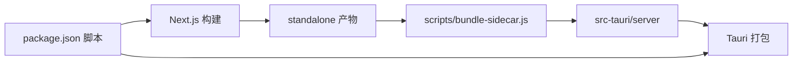

# 配置与定制

<cite>
**本文引用的文件**
- [package.json](file://package.json)
- [tauri.conf.json](file://src-tauri/tauri.conf.json)
- [Cargo.toml](file://src-tauri/Cargo.toml)
- [lib/tauri.ts](file://lib/tauri.ts)
- [lib/updater.ts](file://lib/updater.ts)
- [capabilities/default.json](file://src-tauri/capabilities/default.json)
- [next.config.ts](file://next.config.ts)
- [tailwind.config.ts](file://tailwind.config.ts)
- [app/layout.tsx](file://app/layout.tsx)
- [app/page.tsx](file://app/page.tsx)
- [app/globals.css](file://app/globals.css)
- [scripts/bundle-sidecar.js](file://scripts/bundle-sidecar.js)
- [src-tauri/src/main.rs](file://src-tauri/src/main.rs)
- [src-tauri/src/lib.rs](file://src-tauri/src/lib.rs)
</cite>

## 目录
1. [简介](#简介)
2. [项目结构](#项目结构)
3. [核心组件](#核心组件)
4. [架构总览](#架构总览)
5. [详细组件分析](#详细组件分析)
6. [依赖关系分析](#依赖关系分析)
7. [性能考虑](#性能考虑)
8. [故障排查指南](#故障排查指南)
9. [结论](#结论)
10. [附录](#附录)

## 简介
本文件面向SSTS项目的配置与定制需求，覆盖以下方面：
- 应用配置选项与构建打包流程
- 主题与外观定制方法（CSS变量、Tailwind扩展、暗色模式）
- Tauri配置文件的各项设置、能力配置与权限管理
- 插件系统使用指南与扩展开发方法
- 自定义命令（invoke）的实现与调用方式
- UI组件定制与功能扩展的最佳实践
- 面向不同使用场景的配置示例与定制方案

## 项目结构
SSTS采用“Next.js前端 + Tauri壳层”的双层架构：
- 前端：Next.js应用位于根目录，输出为standalone模式，通过脚本打包到Tauri侧车目录
- 壳层：Tauri负责窗口管理、原生能力调用、自动更新、运行时环境准备等

图表来源
- [src-tauri/src/main.rs:1-7](file://src-tauri/src/main.rs#L1-L7)
- [src-tauri/src/lib.rs:1-120](file://src-tauri/src/lib.rs#L1-L120)
- [next.config.ts:1-8](file://next.config.ts#L1-L8)
- [tailwind.config.ts:1-52](file://tailwind.config.ts#L1-L52)
- [app/globals.css:1-21](file://app/globals.css#L1-L21)
- [scripts/bundle-sidecar.js:1-19](file://scripts/bundle-sidecar.js#L1-L19)
- [lib/updater.ts:1-30](file://lib/updater.ts#L1-L30)
- [lib/tauri.ts:1-20](file://lib/tauri.ts#L1-L20)
- [src-tauri/Cargo.toml:1-28](file://src-tauri/Cargo.toml#L1-L28)
- [src-tauri/capabilities/default.json:1-29](file://src-tauri/capabilities/default.json#L1-L29)

章节来源
- [package.json:1-42](file://package.json#L1-L42)
- [next.config.ts:1-8](file://next.config.ts#L1-L8)
- [scripts/bundle-sidecar.js:1-19](file://scripts/bundle-sidecar.js#L1-L19)

## 核心组件
- 构建与打包
  - Next.js以standalone模式构建，脚本将产物复制到src-tauri/server，供Tauri运行
  - 开发与生产模式分别由Tauri配置的devUrl与打包资源决定
- 主题与外观
  - CSS变量驱动主题色与背景色；Tailwind通过CSS变量扩展实现主题色系
  - 暗色模式基于类名切换，配合系统偏好
- Tauri壳层
  - 窗口配置、安全策略、打包资源、插件启用
  - Rust侧实现运行时环境准备、启动页、原生能力调用、自动更新桥接
- 插件系统
  - 通过Cargo.toml启用tauri插件，通过capabilities/default.json授予权限
- 自定义命令
  - 通过@tauri-apps/api/core的invoke机制在前端调用Rust侧命令

章节来源
- [tauri.conf.json:1-64](file://src-tauri/tauri.conf.json#L1-L64)
- [src-tauri/Cargo.toml:1-28](file://src-tauri/Cargo.toml#L1-L28)
- [src-tauri/capabilities/default.json:1-29](file://src-tauri/capabilities/default.json#L1-L29)
- [lib/tauri.ts:1-49](file://lib/tauri.ts#L1-L49)
- [lib/updater.ts:1-385](file://lib/updater.ts#L1-L385)
- [tailwind.config.ts:1-52](file://tailwind.config.ts#L1-L52)
- [app/globals.css:1-21](file://app/globals.css#L1-L21)

## 架构总览
SSTS的运行时由“前端Next.js + Tauri壳层”组成，前端通过Tauri插件与自定义命令访问原生能力，同时通过自动更新模块实现应用与服务端的升级。

图表来源
- [lib/updater.ts:140-245](file://lib/updater.ts#L140-L245)
- [lib/tauri.ts:9-48](file://lib/tauri.ts#L9-L48)
- [src-tauri/src/lib.rs:100-120](file://src-tauri/src/lib.rs#L100-L120)

## 详细组件分析

### 应用配置与构建打包
- Next.js配置
  - 输出模式为standalone，便于打包到Tauri侧车目录
- 打包脚本
  - 将standalone产物复制到src-tauri/server，并打印打包体积
- Tauri构建配置
  - beforeDevCommand与beforeBuildCommand分别指向开发与构建前的脚本
  - devUrl指向前端开发服务器地址
  - frontendDist指定静态资源位置
  - bundle.resources包含侧车server目录与图标等资源
- 运行时资源
  - 通过bundle.resources将server目录与.next、node_modules等资源一并打包

章节来源
- [next.config.ts:1-8](file://next.config.ts#L1-L8)
- [scripts/bundle-sidecar.js:1-19](file://scripts/bundle-sidecar.js#L1-L19)
- [tauri.conf.json:6-11](file://src-tauri/tauri.conf.json#L6-L11)
- [tauri.conf.json:29-53](file://src-tauri/tauri.conf.json#L29-L53)

### 主题与外观定制
- CSS变量
  - 在:root与.dark类中定义主题色、前景/背景色
- Tailwind扩展
  - 通过theme.extend.colors与animation/keyframes扩展主题色系与动画
  - 使用CSS变量使Tailwind类随主题变化
- 暗色模式
  - 通过类名切换实现，配合系统偏好
- 页面布局
  - app/layout.tsx设置元数据与视口，app/page.tsx为首页内容

章节来源
- [app/globals.css:1-21](file://app/globals.css#L1-L21)
- [tailwind.config.ts:1-52](file://tailwind.config.ts#L1-L52)
- [app/layout.tsx:1-25](file://app/layout.tsx#L1-L25)
- [app/page.tsx:1-17](file://app/page.tsx#L1-L17)

### Tauri配置详解
- 基本信息
  - productName、version、identifier
- 窗口配置
  - main窗口尺寸、最小宽高、标题栏样式、初始可见性等
- 安全策略
  - app.security.csp设为null，允许前端自由加载
- 打包配置
  - targets为all，生成多平台安装包
  - resources包含侧车server目录、图标、启动页HTML
  - Windows NSIS安装器图标
- 插件配置
  - updater插件启用，配置公钥与更新端点

章节来源
- [tauri.conf.json:1-64](file://src-tauri/tauri.conf.json#L1-L64)

### 能力配置与权限管理
- 能力文件
  - identifier与描述
  - windows声明允许访问的窗口标签
  - remote.urls限定允许访问的后端地址范围
- 权限列表
  - core:window相关权限（拖拽、关闭、最小化、最大化等）
  - opener:default与opener:allow-open-path（允许打开任意路径）
  - dialog:default与dialog:allow-save（保存对话框）
  - updater:default
  - notification:default
  - os:default
  - process:default

章节来源
- [src-tauri/capabilities/default.json:1-29](file://src-tauri/capabilities/default.json#L1-L29)

### 插件系统使用指南
- 插件启用
  - 在Cargo.toml中添加tauri插件依赖
- 权限授予
  - 在capabilities/default.json中为对应插件授予权限
- 前端调用
  - 通过@tauri-apps/api或@tauri-apps/plugin-xxx在前端导入并调用
- 示例能力
  - opener：打开系统应用、定位文件
  - dialog：目录选择、保存对话框
  - updater：自动更新
  - os/process/notification：系统信息、进程与通知

章节来源
- [src-tauri/Cargo.toml:14-28](file://src-tauri/Cargo.toml#L14-L28)
- [src-tauri/capabilities/default.json:8-27](file://src-tauri/capabilities/default.json#L8-L27)
- [lib/tauri.ts:9-48](file://lib/tauri.ts#L9-L48)

### 自定义命令实现与调用
- 命令注册
  - 在Rust侧通过tauri::command宏注册命令，暴露给前端invoke
- 前端调用
  - 使用@tauri-apps/api/core.invoke调用命令，传递参数并接收返回值
- 典型用途
  - 获取当前server版本、网络请求、系统信息、文件操作等
- 安全与权限
  - 需在capabilities中为相应命令授予权限

章节来源
- [lib/updater.ts:108-116](file://lib/updater.ts#L108-L116)
- [lib/updater.ts:250-254](file://lib/updater.ts#L250-L254)

### UI组件定制与功能扩展最佳实践
- 组件样式
  - 使用Tailwind类与CSS变量，确保深浅色一致
  - 动画通过keyframes与animation扩展统一风格
- 交互行为
  - 通过@tauri-apps/plugin-dialog实现文件/目录选择
  - 通过@tauri-apps/plugin-opener实现系统应用打开与目录定位
- 状态管理
  - 可结合zustand进行全局状态管理，避免重复请求与状态漂移
- 可访问性
  - 保持语义化标签与键盘导航，确保暗色模式下对比度充足

章节来源
- [tailwind.config.ts:9-48](file://tailwind.config.ts#L9-L48)
- [app/globals.css:5-14](file://app/globals.css#L5-L14)
- [lib/tauri.ts:9-48](file://lib/tauri.ts#L9-L48)
- [package.json:26-26](file://package.json#L26-L26)

### 不同使用场景的配置示例与定制方案
- 开发调试
  - 设置devUrl为本地开发服务器，beforeDevCommand执行前端dev
  - 保持app.security.csp为null以便调试
- 生产发布
  - beforeBuildCommand执行打包脚本，确保server目录包含最新产物
  - 打包targets为all，配置Windows NSIS安装器图标
- 主题定制
  - 修改:root中的--theme-primary与暗色模式变量，Tailwind自动适配
  - 通过CSS变量扩展colors与animation，保持全局一致性
- 权限收紧
  - 仅授予必要窗口与权限，限制remote.urls范围，避免过度放权
- 自动更新
  - 配置updater插件端点与公钥，结合Rust侧命令实现版本校验与下载

章节来源
- [tauri.conf.json:6-11](file://src-tauri/tauri.conf.json#L6-L11)
- [tauri.conf.json:29-53](file://src-tauri/tauri.conf.json#L29-L53)
- [app/globals.css:5-14](file://app/globals.css#L5-L14)
- [tailwind.config.ts:20-45](file://tailwind.config.ts#L20-L45)
- [src-tauri/capabilities/default.json:5-7](file://src-tauri/capabilities/default.json#L5-L7)
- [lib/updater.ts:143-200](file://lib/updater.ts#L143-L200)

## 依赖关系分析
- 前端依赖
  - Next.js、React、Tailwind、lucide-react、zustand等
- 壳层依赖
  - tauri、tauri插件（opener、dialog、updater、process、os、notification等）
- 构建链路
  - package.json脚本驱动Next.js构建与Tauri打包
  - scripts/bundle-sidecar.js将standalone产物组装到src-tauri/server

图表来源
- [package.json:5-14](file://package.json#L5-L14)
- [scripts/bundle-sidecar.js:1-19](file://scripts/bundle-sidecar.js#L1-L19)
- [tauri.conf.json:6-11](file://src-tauri/tauri.conf.json#L6-L11)

章节来源
- [package.json:1-42](file://package.json#L1-L42)
- [src-tauri/Cargo.toml:14-28](file://src-tauri/Cargo.toml#L14-L28)

## 性能考虑
- 启动性能
  - 启动页通过自定义协议加载内嵌HTML，减少首屏白屏
  - 运行时环境准备采用按需下载与缓存策略
- 网络与更新
  - 自动更新支持增量补丁与全量包，结合重试与进度回调
- 打包体积
  - 通过standalone与资源裁剪降低包体
- UI渲染
  - Tailwind按需扫描内容，避免无用样式

## 故障排查指南
- 插件调用失败
  - 检查capabilities中是否授予对应权限
  - 确认前端导入的插件版本与@tauri-apps/api版本兼容
- 自动更新异常
  - 核对updater插件端点与公钥配置
  - 检查Rust侧命令是否正确实现并暴露
- 启动页不显示
  - 确认splash.html与自定义协议URL在各平台的兼容性
  - 检查启动页JS调用时机与窗口可见性
- 文件打开/定位失败
  - 确认opener:allow-open-path权限已授予
  - 检查绝对路径与平台分隔符

章节来源
- [src-tauri/capabilities/default.json:8-27](file://src-tauri/capabilities/default.json#L8-L27)
- [lib/updater.ts:143-200](file://lib/updater.ts#L143-L200)
- [src-tauri/src/lib.rs:37-77](file://src-tauri/src/lib.rs#L37-L77)
- [lib/tauri.ts:9-48](file://lib/tauri.ts#L9-L48)

## 结论
SSTS通过清晰的前后端分离与Tauri能力体系，提供了灵活的配置与定制空间。建议在开发阶段保持宽松的权限与CSP策略，在生产阶段收紧权限与资源范围，并结合主题变量与Tailwind扩展实现一致的视觉体验。通过自定义命令与插件系统，可进一步扩展文件系统、系统信息与更新能力，满足多样化的桌面应用场景。

## 附录
- 关键配置文件清单
  - 前端：next.config.ts、tailwind.config.ts、app/globals.css
  - 壳层：tauri.conf.json、Cargo.toml、capabilities/default.json
  - 构建：package.json、scripts/bundle-sidecar.js
  - 能力封装：lib/tauri.ts、lib/updater.ts
- 最佳实践摘要
  - 权限最小化：仅授予必需窗口与权限
  - 主题一致性：统一使用CSS变量与Tailwind扩展
  - 更新可控：区分应用全量更新与服务端热更新
  - 安全优先：严格限制remote.urls与文件路径访问