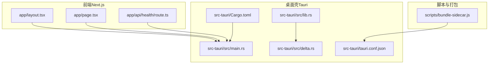
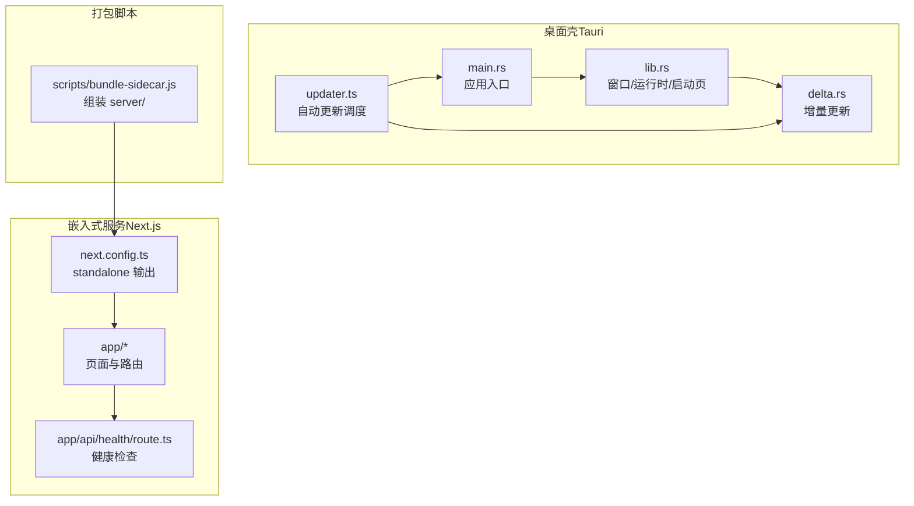
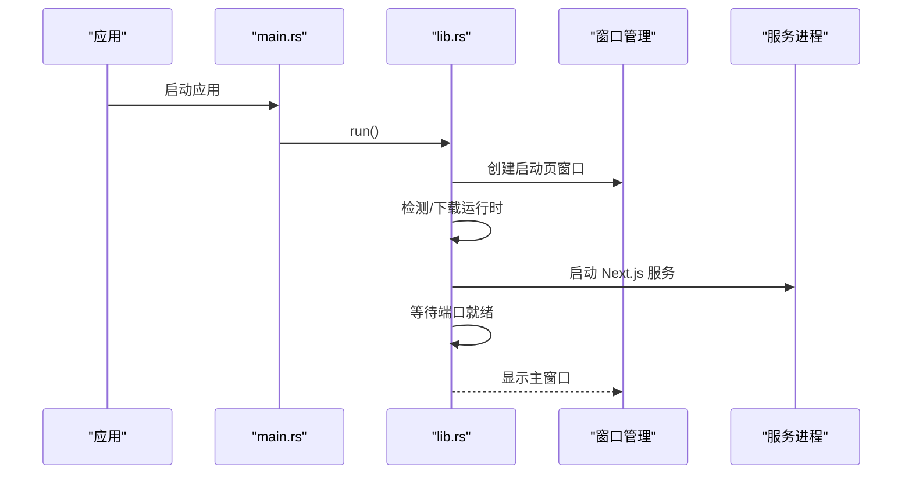
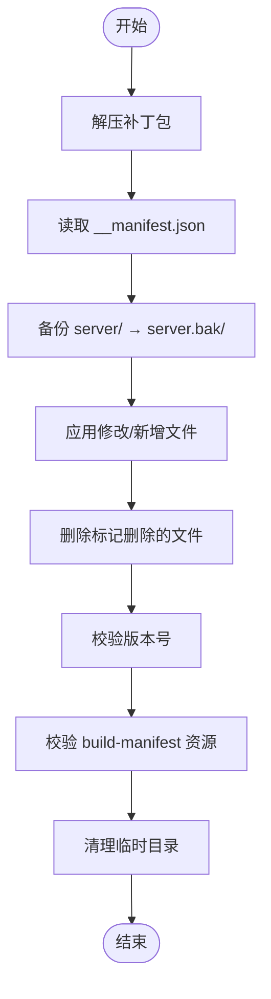
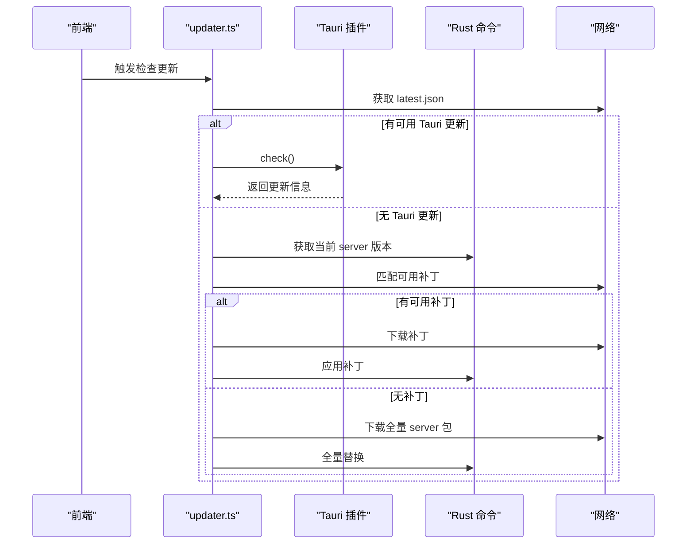
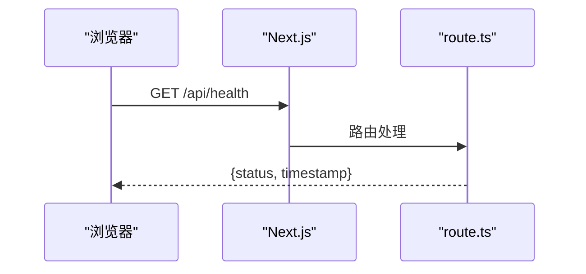
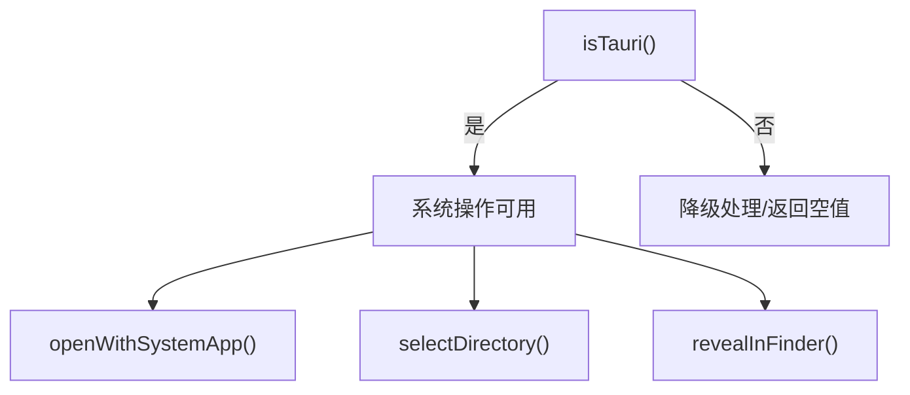
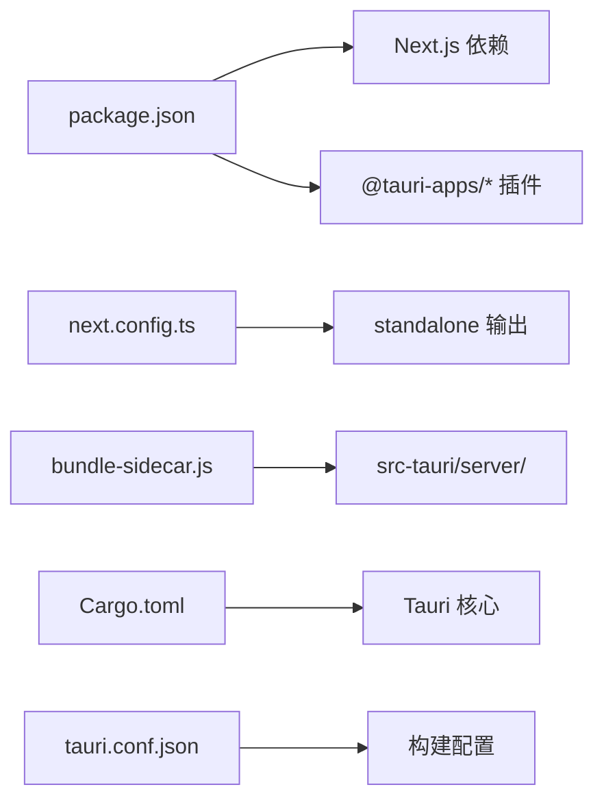

# 项目概述

<cite>
**本文引用的文件**
- [package.json](file://package.json)
- [next.config.ts](file://next.config.ts)
- [app/layout.tsx](file://app/layout.tsx)
- [app/page.tsx](file://app/page.tsx)
- [app/api/health/route.ts](file://app/api/health/route.ts)
- [lib/tauri.ts](file://lib/tauri.ts)
- [lib/updater.ts](file://lib/updater.ts)
- [scripts/bundle-sidecar.js](file://scripts/bundle-sidecar.js)
- [src-tauri/Cargo.toml](file://src-tauri/Cargo.toml)
- [src-tauri/tauri.conf.json](file://src-tauri/tauri.conf.json)
- [src-tauri/src/main.rs](file://src-tauri/src/main.rs)
- [src-tauri/src/lib.rs](file://src-tauri/src/lib.rs)
- [src-tauri/src/delta.rs](file://src-tauri/src/delta.rs)
</cite>

## 目录
1. [引言](#引言)
2. [项目结构](#项目结构)
3. [核心组件](#核心组件)
4. [架构总览](#架构总览)
5. [详细组件分析](#详细组件分析)
6. [依赖关系分析](#依赖关系分析)
7. [性能考量](#性能考量)
8. [故障排查指南](#故障排查指南)
9. [结论](#结论)
10. [附录](#附录)

## 引言
SSTS 侧滑测试系统是一个基于 Tauri + Next.js 的跨平台桌面应用程序，专用于侧滑测试场景。它采用双层架构设计：Rust 后端负责系统集成、运行时管理、增量更新与进程控制；React 前端使用 Next.js 提供现代化的用户界面与路由能力。该架构兼顾易用性与高性能，既能在桌面环境中提供原生体验，又能通过增量更新机制实现快速迭代与部署。

本项目旨在为用户提供稳定、可扩展且易于维护的侧滑测试工具，适用于需要在本地或离线环境下进行高效测试与验证的团队与个人开发者。

## 项目结构
项目采用“前端 + 嵌入式服务 + 桌面壳”的三层组织方式：
- 前端（Next.js）：位于 app/ 目录，提供页面与 UI 组件，构建为独立可运行的服务。
- 桌面壳（Tauri）：位于 src-tauri/ 目录，负责窗口管理、系统权限、自动更新、运行时下载与增量更新。
- 脚本与打包：位于 scripts/ 目录，负责将 Next.js 产物打包为 Tauri 的 sidecar 服务。

**图表来源**
- [app/layout.tsx:1-25](file://app/layout.tsx#L1-L25)
- [app/page.tsx:1-17](file://app/page.tsx#L1-L17)
- [app/api/health/route.ts:1-9](file://app/api/health/route.ts#L1-L9)
- [src-tauri/src/main.rs:1-7](file://src-tauri/src/main.rs#L1-L7)
- [src-tauri/src/lib.rs:1-120](file://src-tauri/src/lib.rs#L1-L120)
- [src-tauri/src/delta.rs:1-60](file://src-tauri/src/delta.rs#L1-L60)
- [src-tauri/tauri.conf.json:1-64](file://src-tauri/tauri.conf.json#L1-L64)
- [src-tauri/Cargo.toml:1-28](file://src-tauri/Cargo.toml#L1-L28)
- [scripts/bundle-sidecar.js:1-19](file://scripts/bundle-sidecar.js#L1-L19)

**章节来源**
- [package.json:1-42](file://package.json#L1-L42)
- [next.config.ts:1-8](file://next.config.ts#L1-L8)
- [app/layout.tsx:1-25](file://app/layout.tsx#L1-L25)
- [app/page.tsx:1-17](file://app/page.tsx#L1-L17)
- [app/api/health/route.ts:1-9](file://app/api/health/route.ts#L1-L9)
- [src-tauri/tauri.conf.json:1-64](file://src-tauri/tauri.conf.json#L1-L64)
- [src-tauri/Cargo.toml:1-28](file://src-tauri/Cargo.toml#L1-L28)
- [scripts/bundle-sidecar.js:1-19](file://scripts/bundle-sidecar.js#L1-L19)

## 核心组件
- 桌面壳入口与窗口管理
  - Rust 入口负责启动 Tauri 应用并创建主窗口与启动页窗口，管理应用生命周期与系统托盘等。
- 运行时与依赖管理
  - 自动检测/下载 Node.js、Python、Git 等运行时，确保跨平台一致性与离线可用性。
- 增量更新（热更新）
  - 通过文件级补丁对 server/ 目录进行增量更新，支持 Windows 与非 Windows 的差异化策略，保障稳定性与回滚能力。
- 自动更新调度
  - 结合 Tauri 全量更新与 server 热更新，提供统一的更新检查与安装流程。
- 前端集成
  - Next.js 作为前端框架，提供页面路由与健康检查接口；通过脚本将构建产物打包为 sidecar 服务。

**章节来源**
- [src-tauri/src/main.rs:1-7](file://src-tauri/src/main.rs#L1-L7)
- [src-tauri/src/lib.rs:1-120](file://src-tauri/src/lib.rs#L1-L120)
- [src-tauri/src/delta.rs:1-60](file://src-tauri/src/delta.rs#L1-L60)
- [lib/updater.ts:1-60](file://lib/updater.ts#L1-L60)
- [app/api/health/route.ts:1-9](file://app/api/health/route.ts#L1-L9)

## 架构总览
整体架构由“桌面壳 + 嵌入式服务 + 前端”构成，桌面壳负责系统集成与更新，嵌入式服务承载 Next.js 前端，前后端通过 Tauri 暴露的命令与事件通信。

**图表来源**
- [src-tauri/src/main.rs:1-7](file://src-tauri/src/main.rs#L1-L7)
- [src-tauri/src/lib.rs:1-120](file://src-tauri/src/lib.rs#L1-L120)
- [src-tauri/src/delta.rs:1-60](file://src-tauri/src/delta.rs#L1-L60)
- [lib/updater.ts:1-60](file://lib/updater.ts#L1-L60)
- [next.config.ts:1-8](file://next.config.ts#L1-L8)
- [app/page.tsx:1-17](file://app/page.tsx#L1-L17)
- [app/api/health/route.ts:1-9](file://app/api/health/route.ts#L1-L9)
- [scripts/bundle-sidecar.js:1-19](file://scripts/bundle-sidecar.js#L1-L19)

## 详细组件分析

### 组件A：桌面壳（Tauri）与窗口管理
- 启动页窗口与主题应用：通过自定义协议加载内嵌 HTML，支持根据全局配置应用浅色/深色主题。
- 主窗口配置：尺寸、最小尺寸、标题栏样式、初始可见性等。
- 运行时管理：自动查找/下载 Node.js、Python、Git，并进行版本校验与缓存。
- 进程与健康检查：启动/重启嵌入式服务，等待端口就绪并通过 TCP/HTTP 健康检查确认可用。

**图表来源**
- [src-tauri/src/main.rs:1-7](file://src-tauri/src/main.rs#L1-L7)
- [src-tauri/src/lib.rs:30-120](file://src-tauri/src/lib.rs#L30-L120)

**章节来源**
- [src-tauri/src/lib.rs:30-120](file://src-tauri/src/lib.rs#L30-L120)
- [src-tauri/tauri.conf.json:10-30](file://src-tauri/tauri.conf.json#L10-L30)

### 组件B：增量更新（热更新）模块
- 补丁应用流程：解压 → 读取清单 → 备份 → 应用修改/新增 → 删除标记文件 → 版本与资源校验 → 清理临时目录。
- 平台差异：Windows 在应用补丁前先停止服务进程，失败时回滚并重启；非 Windows 则利用 POSIX 语义直接替换。
- 健康检查：通过 TCP 连接与 HTTP 响应判断服务可用性，确保热更新后页面可访问。

**图表来源**
- [src-tauri/src/delta.rs:180-302](file://src-tauri/src/delta.rs#L180-L302)

**章节来源**
- [src-tauri/src/delta.rs:1-120](file://src-tauri/src/delta.rs#L1-L120)
- [src-tauri/src/delta.rs:180-302](file://src-tauri/src/delta.rs#L180-L302)
- [src-tauri/src/delta.rs:304-443](file://src-tauri/src/delta.rs#L304-L443)

### 组件C：自动更新调度（Tauri + Server）
- 更新通道：
  - Tauri 全量更新：通过插件检查远端最新版本并下载安装。
  - Server 热更新：通过增量补丁更新嵌入式服务，减少体积与等待时间。
- 平台键值：根据操作系统与架构生成平台键，匹配对应补丁集合。
- 回退策略：当自动安装不可用时，提供手动下载链接。

**图表来源**
- [lib/updater.ts:141-200](file://lib/updater.ts#L141-L200)
- [lib/updater.ts:256-315](file://lib/updater.ts#L256-L315)
- [src-tauri/src/delta.rs:32-70](file://src-tauri/src/delta.rs#L32-L70)

**章节来源**
- [lib/updater.ts:1-60](file://lib/updater.ts#L1-L60)
- [lib/updater.ts:141-200](file://lib/updater.ts#L141-L200)
- [lib/updater.ts:256-315](file://lib/updater.ts#L256-L315)

### 组件D：前端集成与健康检查
- 页面布局与元数据：根布局设置标题、视口与语言。
- 首页展示：基础欢迎页与系统就绪状态。
- 健康检查：提供 /api/health 接口返回状态与时间戳，便于外部监控与自动化。

**图表来源**
- [app/api/health/route.ts:1-9](file://app/api/health/route.ts#L1-L9)
- [app/layout.tsx:1-25](file://app/layout.tsx#L1-L25)
- [app/page.tsx:1-17](file://app/page.tsx#L1-L17)

**章节来源**
- [app/layout.tsx:1-25](file://app/layout.tsx#L1-L25)
- [app/page.tsx:1-17](file://app/page.tsx#L1-L17)
- [app/api/health/route.ts:1-9](file://app/api/health/route.ts#L1-L9)

### 组件E：系统操作与环境检测（前端侧）
- 环境检测：判断是否运行在 Tauri 桌面环境中。
- 系统交互：打开系统应用、选择目录、在文件管理器中定位文件等。

**图表来源**
- [lib/tauri.ts:1-49](file://lib/tauri.ts#L1-L49)

**章节来源**
- [lib/tauri.ts:1-49](file://lib/tauri.ts#L1-L49)

## 依赖关系分析
- 前端依赖：Next.js、React、TailwindCSS、TypeScript 等。
- 桌面壳依赖：Tauri 核心与多个插件（对话框、系统打开、进程、更新、通知、OS 等）。
- 构建与打包：通过脚本将 Next.js standalone 产物组装为 server/，供 Tauri 运行。

**图表来源**
- [package.json:16-40](file://package.json#L16-L40)
- [next.config.ts:1-8](file://next.config.ts#L1-L8)
- [scripts/bundle-sidecar.js:1-19](file://scripts/bundle-sidecar.js#L1-L19)
- [src-tauri/Cargo.toml:14-28](file://src-tauri/Cargo.toml#L14-L28)
- [src-tauri/tauri.conf.json:6-11](file://src-tauri/tauri.conf.json#L6-L11)

**章节来源**
- [package.json:16-40](file://package.json#L16-L40)
- [src-tauri/Cargo.toml:14-28](file://src-tauri/Cargo.toml#L14-L28)
- [src-tauri/tauri.conf.json:6-11](file://src-tauri/tauri.conf.json#L6-L11)
- [scripts/bundle-sidecar.js:1-19](file://scripts/bundle-sidecar.js#L1-L19)

## 性能考量
- 启动性能：启动页窗口与延迟显示避免黑屏；运行时下载采用分块进度与超时保护；服务启动后进行端口与健康检查。
- 更新性能：优先增量补丁更新 server，显著降低更新体积与时间；Windows 平台在应用补丁前停止服务，避免文件锁定导致的长时间等待。
- 资源完整性：补丁应用后校验 build-manifest 引用的静态资源，确保页面可正确加载。
- 跨平台差异：针对 Windows 的文件句柄与进程管理进行特殊处理，保证稳定性与回滚能力。

[本节为通用性能讨论，不直接分析具体文件]

## 故障排查指南
- 启动页无显示或白屏
  - 检查启动页窗口创建与主题应用逻辑，确认内嵌 HTML 与自定义协议配置正确。
- 运行时下载失败
  - 核对镜像地址与代理环境变量；检查 curl 可用性与网络连通性；查看下载进度与错误日志。
- 热更新失败
  - Windows 平台会自动回滚并重启服务；检查补丁包完整性、清单文件与资源校验；确认健康检查返回 200/302/304。
- 自动更新不可用
  - 若 Tauri 插件 check() 失败，尝试手动下载安装；核对 latest.json 的平台键与 URL。

**章节来源**
- [src-tauri/src/lib.rs:210-243](file://src-tauri/src/lib.rs#L210-L243)
- [src-tauri/src/delta.rs:304-443](file://src-tauri/src/delta.rs#L304-L443)
- [lib/updater.ts:141-200](file://lib/updater.ts#L141-L200)

## 结论
SSTS 侧滑测试系统通过 Tauri + Next.js 的双层架构，实现了跨平台桌面应用的高可用与高扩展性。Rust 后端负责系统集成与更新，前端以现代 Web 技术提供直观的用户体验。增量更新与全量更新双通道设计，兼顾了效率与可靠性。该架构适合需要在本地或离线环境下进行高效测试与验证的团队，具备良好的可维护性与演进空间。

[本节为总结性内容，不直接分析具体文件]

## 附录
- 技术栈概览
  - 前端：Next.js、React、TailwindCSS、TypeScript
  - 桌面壳：Tauri、Rust
  - 插件：对话框、系统打开、进程、更新、通知、OS
- 适用场景
  - 侧滑测试、本地化部署、离线环境运行、快速迭代与热更新
- 价值主张
  - 跨平台原生体验、低门槛部署、增量更新、稳定回滚、统一更新调度

[本节为概念性内容，不直接分析具体文件]